## 2021.11.16_뉴스와AI

## 학습내용

- 01.인공지능과 뉴스

## 학습목표

-  인공지능이 뉴스 등의 미디어에 활용되는 사례를 이해할 수 있음

## 01.인공지능과 뉴스

---

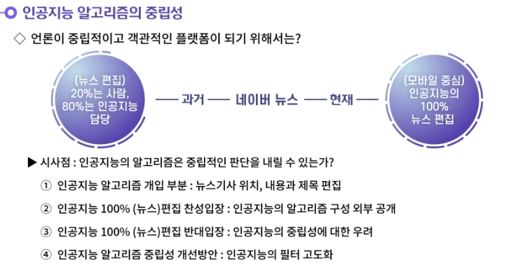

---

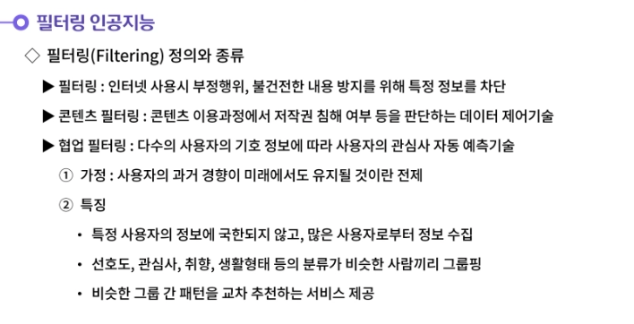

---

---

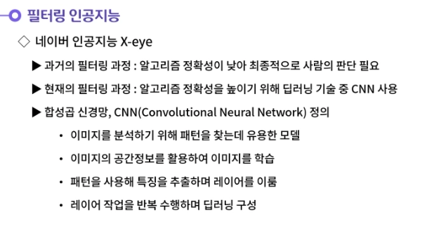

---

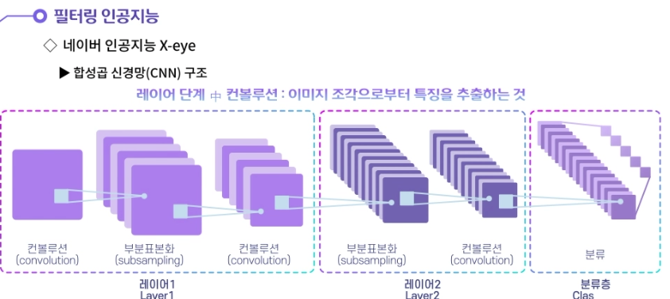

---

---

---

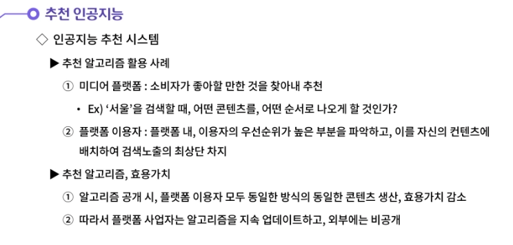

---

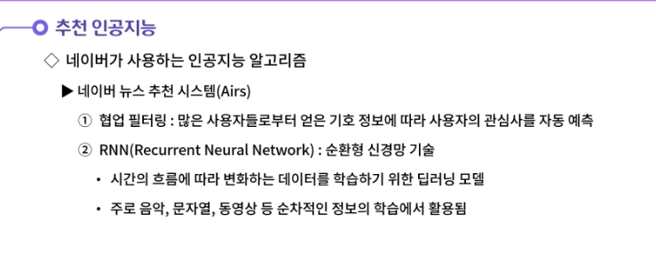

---

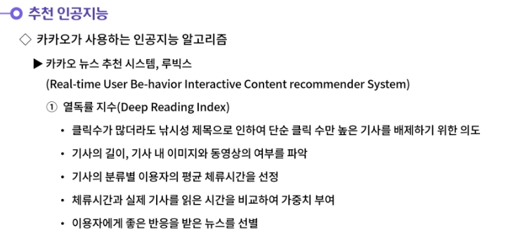

---

---

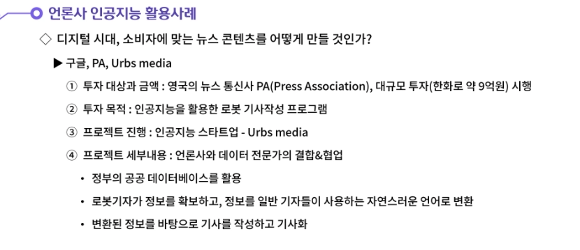

---

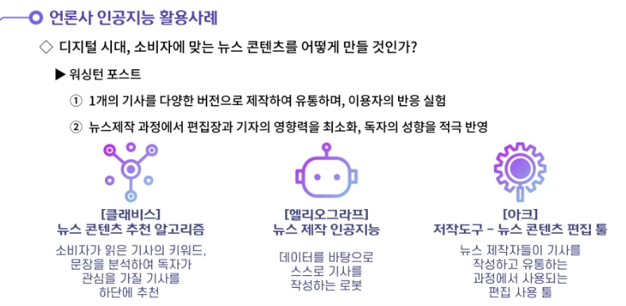

---

## 

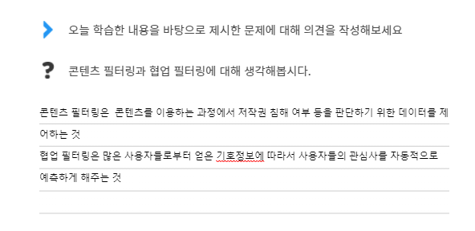

- **콘텐츠 필터링이란 콘텐츠를 이용하는 과정에서 저작권 침해 여부 등을 판단하기 위한 데이터를 제어하는 기술이다. 콘텐츠 필터링의 유형에는 키워드 필터링, 해시 필터링, 특징점 필터링 등이 존재한다.**
  **협업 필터링이란 많은 사용자들로부터 얻은 기호정보에 따라서 사용자들의 관심사를 자동적으로 예측하게 해주는 기술이다. 사용자가 보여준 과거의 경향이 미래에도 그대로 유지될 것이란 가정에서 시작된다. 특정 사용자가 아닌 최대한 다수의 사용자로부터 정보를 수집하여 선호도, 관심사, 취향, 생활형태 등의 분류가 비슷한 사람을 그룹핑하고, 그룹 간 패턴을 교차 추천하는 서비스로 활용된다.**

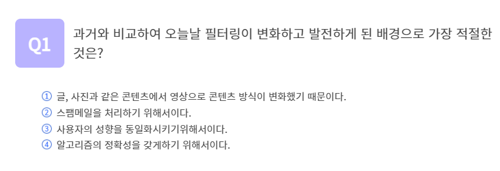

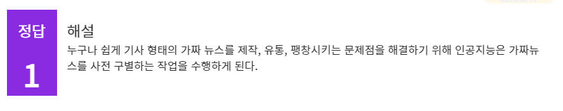

## 정리하기

#### 1. 콘텐츠 필터링과 협업 필터링에 대해 생각해봅시다.

1. 콘텐츠 필터링이란 콘텐츠를 이용하는 과정에서 저작권 침해 여부 등을 판단하기 위한 데이터를 제어하는 기술이다. 콘텐츠 필터링의 유형에는 키워드 필터링, 해시 필터링, 특징점 필터링 등이 존재한다.
   협업 필터링이란 많은 사용자들로부터 얻은 기호정보에 따라서 사용자들의 관심사를 자동적으로 예측하게 해주는 기술이다. 사용자가 보여준 과거의 경향이 미래에도 그대로 유지될 것이란 가정에서 시작된다. 특정 사용자가 아닌 최대한 다수의 사용자로부터 정보를 수집하여 선호도, 관심사, 취향, 생활형태 등의 분류가 비슷한 사람을 그룹핑하고, 그룹 간 패턴을 교차 추천하는 서비스로 활용된다.

