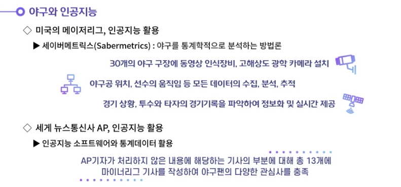
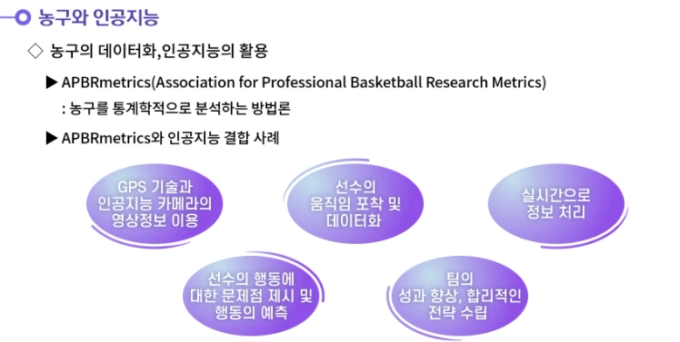
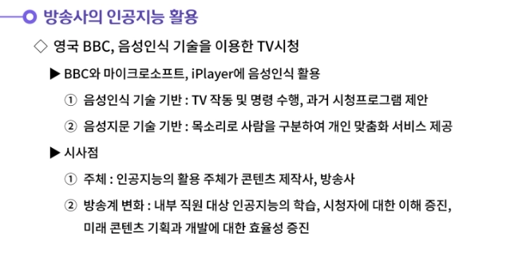
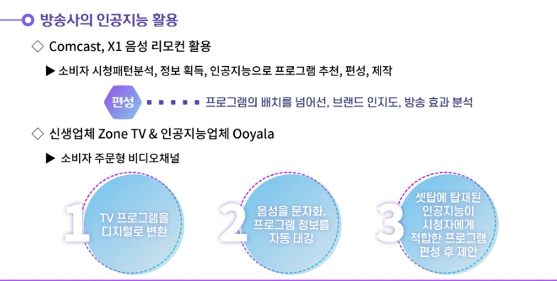
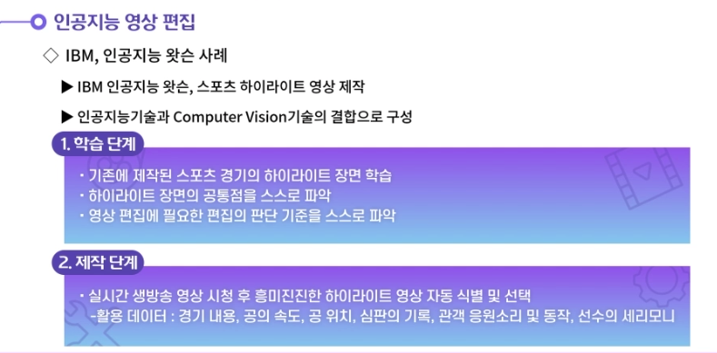
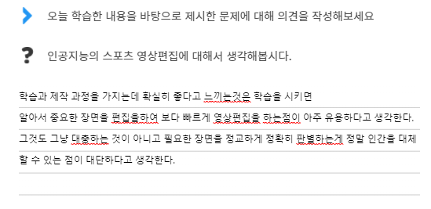
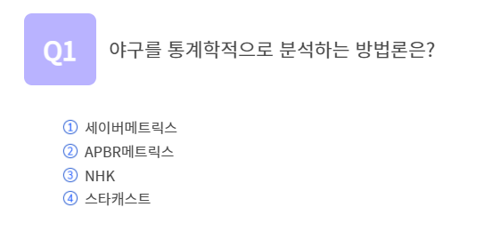
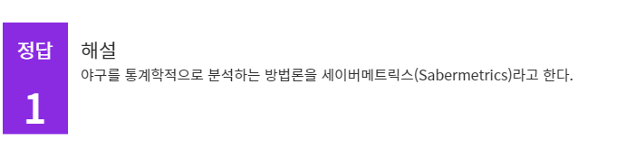

## 2021.11.16_TV와AI

## 학습내용

- 01.인공지능과 TV

## 학습목표

- 인공지능이 TV프로그램에 활용되는 사례 등을 이해할 수 있음

## 01.인공지능과 TV

---

---

---

---

---

---

---

---

---

---

---

---

---

---

---

## 정리하기

#### 1. 인공지능의 스포츠 영상편집에 대해서 생각해봅시다.

1. 스포츠 분야는 대부분의 소비자가 티비를 통해 스포츠를 시청한다. 전체 경기 내용과 하이라이트 내용으로 구분되는데, 영상편집에 상당한 시간과 인력이 투입될 만큼 난이도가 있는 작업이다. 인공지능 왓슨이 메이저 테니스 대회(US Open대회)의 하이라이트 영상을 만드는 과정은 다음과 같다.
   첫 번째 단계는 학습이다. IBM은 기존에 제작된 스포츠 경기의 하이라이트 장면들을 인공지능에게 모두 학습시킨다. 그리고 인공지능 왓슨이 스스로 영상들의 주요 공통점을 이해하도록 하였다. 이를 통해 영상 편집에 필요한 편집의 판단 기준을 스스로 깨닫게 하는 것이다.
   두 번째 단계는 제작이다. 학습과정을 거친 인공지능 왓슨은 생방송 영상을 시청한다. 왓슨은 생방송 영상을 보며 나름의 판단 기준에 따라서 테니스 경기 중 흥미진진한 장면을 자동으로 식별해낸다. 이때 왓슨은 경기의 내용, 서브 공의 속도, 공의 위치정보, 심판의 기록, 관객의 응원소리, 관객의 동작, 선수의 세레모니 동작 등의 모든 내용을 파악할 수 있을 만큼 정교하다.인공지능이 경기 종료 후 약 4분가량의 하이라이트 영상을 만드는데 약 3분의 시간이 걸린다. 사람이 일일이 수작업으로 진행하던 편집을 인공지능이 대체할 수 있게 된 것이다.

