## 2021.11.16_인공지능서비스내/외부환경분석하기

## 학습내용

- 01.기업내외부 환경분석
- 02.시장 적용 가능 여부 파악
- 03.확장 가능한 인공지능 서비스 확인

## 학습 목표

- 인공지능 서비스 기획에 필요한 인공지 서비스 관련 기업의 내외부 환경을 조사할 수 있음
- 조사된 내 외부 환경에 따라 인공 지능 서비스의 시장 적용 여부를 검토할 수있믕
- 검토된 인공지능 서비스의 시장 적용 여부에 따라 새로운 인공지능 서비스를 분석할 수 있음

## 01.기업내외부 환경 분석

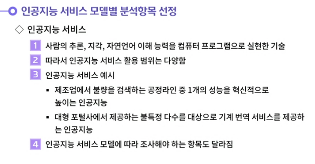

---

---

---

---

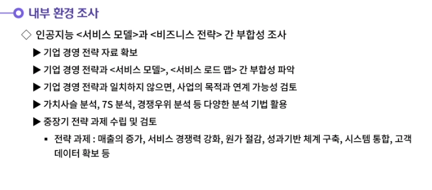

---

---

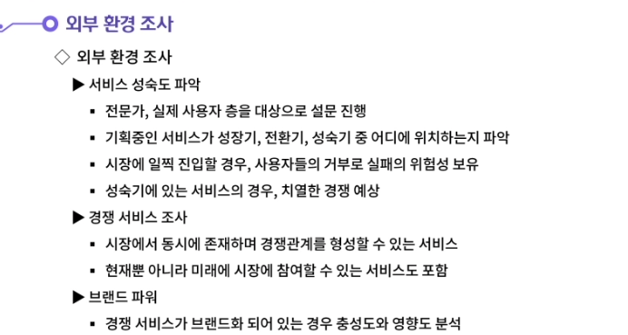

---

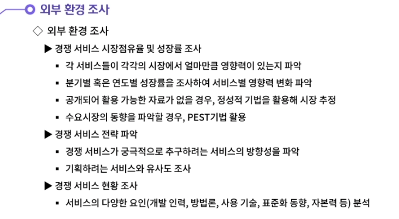

---

## 02.시장 적용 가능 여부 파악

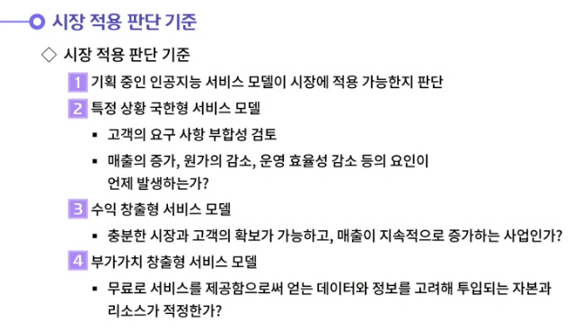

---

---

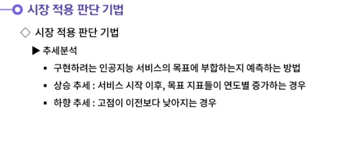

---

---

---

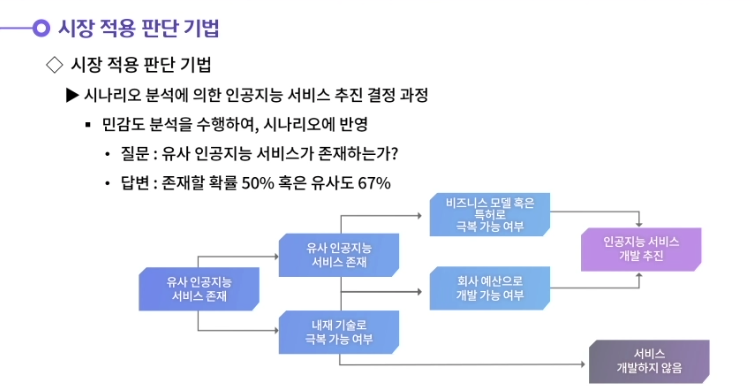

---

---

---

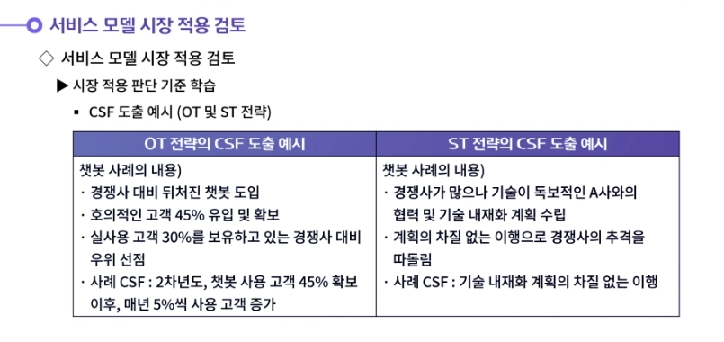

---

---

## 03. 확장 가능한 인공지능 서비스 확인

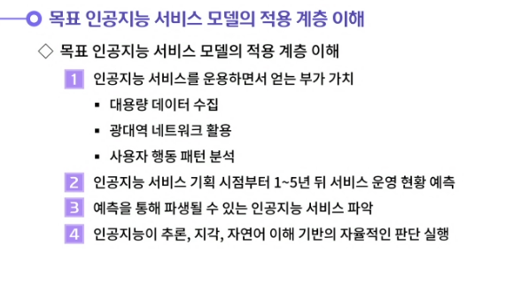

---

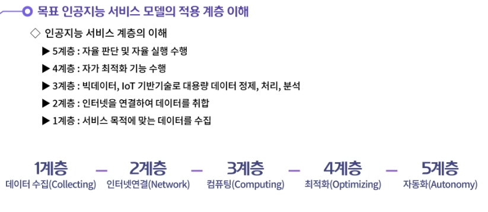

---

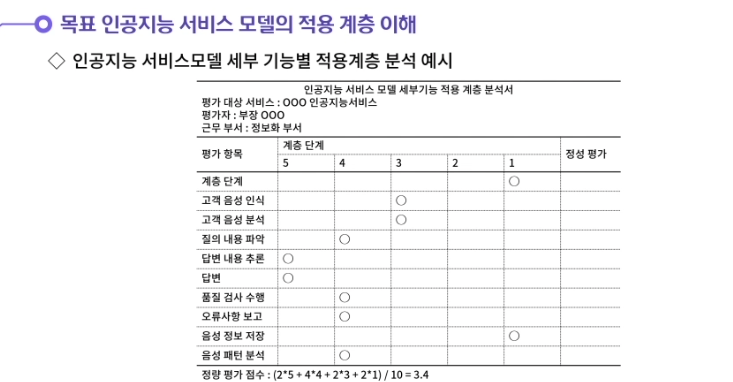

---

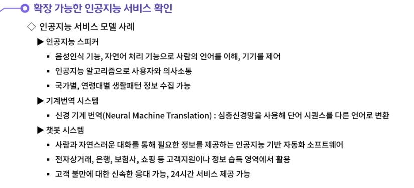

---

---

---

---

- **내부 환경조사의 첫번째 단계는 인공지능 서비스 모델과 비즈니스 전략과의 부합성 조사이다. 기업 경영 전략 자료를 확보하여 인공지능 서비스 모델과 부합성을 검토한다. 인공지능 서비스는 유연성을 가지고 변화하는 경우가 많기에 경영전략과 완전히 일치하지 않을 수 있다. 그래서 사업의 목적과의 지속적 연계 가능성을 위주로 검토한다. 그 다음 중장기 전략 과제를 수립하고 검토한다. 중장기 전략과제에는 매출의 증가, 서비스 경쟁력 강화, 원가 절감, 성과기반 체계 구축, 고객 데이터 확보 등의 과제가 해당 될 수 있다.**
  **내부 환경조사의 두번째 단계는 인공지능 서비스 모델의 다양한 요구 사항 파악이다. 시스템의 신뢰성, 사용성 조사와 서비스 제공 시점의 조사를 수행한다. 그 다음 기능적 요구 사항과 비기능적 요구 사항을 확인한다. 이러한 2가지 조사 단계를 통해 내부환경에 대한 이해도를 높일 수 있다.**

- 

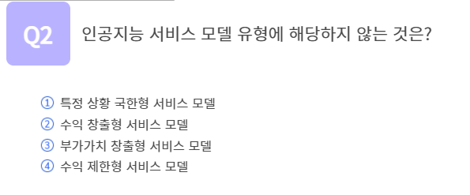

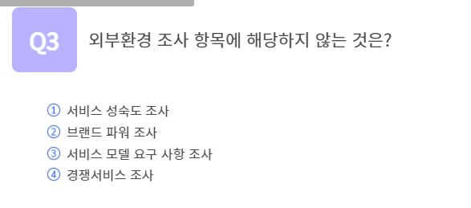

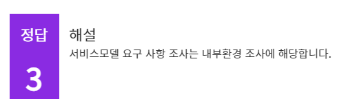

## 정리하기

#### 1. 인공지능 서비스의 시장 적용을 위한 내부 환경조사에 대해 생각해봅시다.

1. 내부 환경조사의 첫번째 단계는 인공지능 서비스 모델과 비즈니스 전략과의 부합성 조사이다. 기업 경영 전략 자료를 확보하여 인공지능 서비스 모델과 부합성을 검토한다. 인공지능 서비스는 유연성을 가지고 변화하는 경우가 많기에 경영전략과 완전히 일치하지 않을 수 있다. 그래서 사업의 목적과의 지속적 연계 가능성을 위주로 검토한다. 그 다음 중장기 전략 과제를 수립하고 검토한다. 중장기 전략과제에는 매출의 증가, 서비스 경쟁력 강화, 원가 절감, 성과기반 체계 구축, 고객 데이터 확보 등의 과제가 해당 될 수 있다.
   내부 환경조사의 두번째 단계는 인공지능 서비스 모델의 다양한 요구 사항 파악이다. 시스템의 신뢰성, 사용성 조사와 서비스 제공 시점의 조사를 수행한다. 그 다음 기능적 요구 사항과 비기능적 요구 사항을 확인한다. 이러한 2가지 조사 단계를 통해 내부환경에 대한 이해도를 높일 수 있다.