## 2021.11.16_인공지능서비스필요자원분석하기

## 학습내용

- 01.데이터 및 인프라 현황 분석
- 02.인력 및 프로세스 수준 분석
- 03.필요 자원 분석서 작성

## 학습 목표

- 인공지능 서비스에 필요한 내,외부 데이터를 수집하여 분석할 수 있음
- 인공지능 서비스에 필요한 하드웨어 인프라를 파악하여 분석할 수 있음
- 인공지능 서비스에 필요한 인력 역량 수준을 파악하여 분석할 수 있음
- 분석된 데이터와 인프라를 운영할 수 있는 프로세스 확보 현황을 파악하여 분석할 수 있음
- 분석결과에 따라 인공지능 서비스 필요 자원 분석서를 작성할 수 있음

## 01. 데이터 및 인프라 현황 분석

---

---

---

---

---

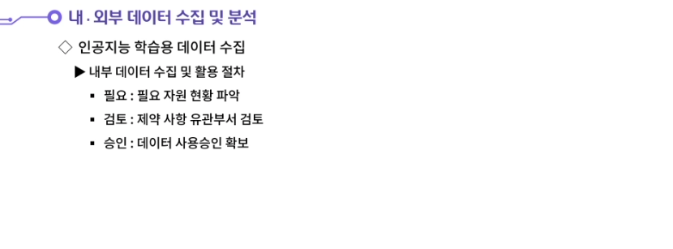

---

---

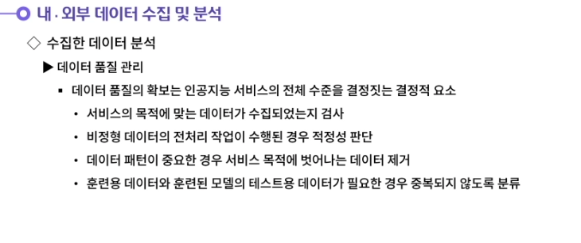

---

---

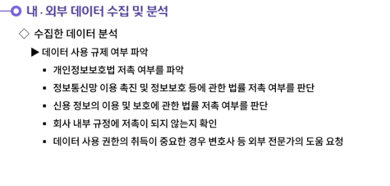

---

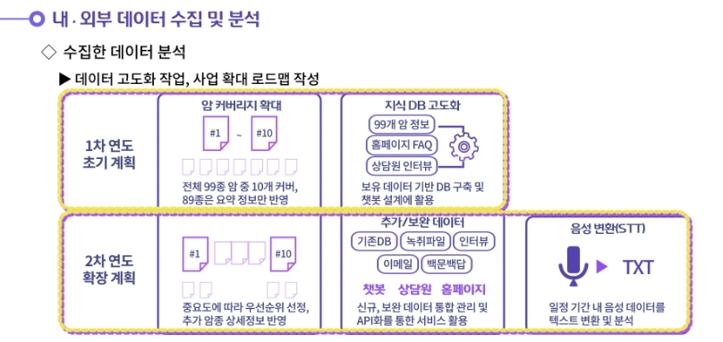

---

---

---

## 02.인력 및 프로세스 수준 분석

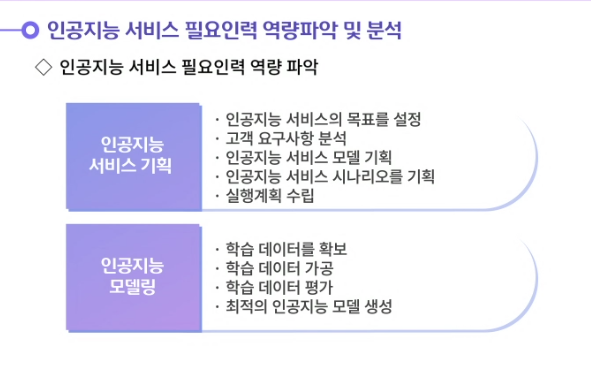

---

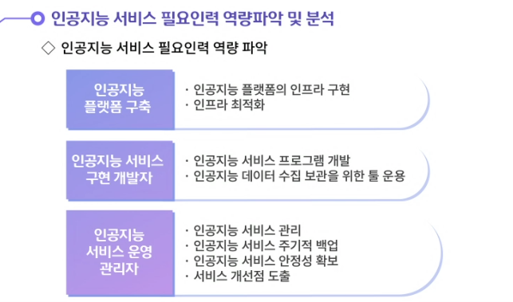

---

---

---

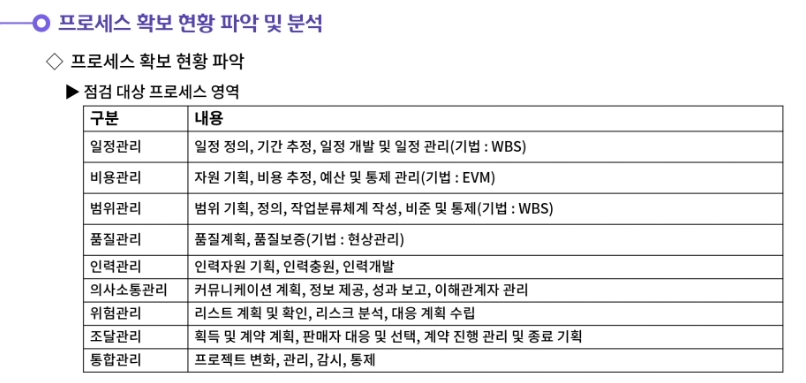

---

---

---

## 03. 필요 자원 분석서 작성

---

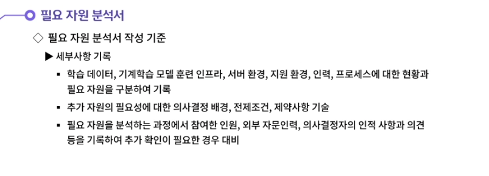

---

---

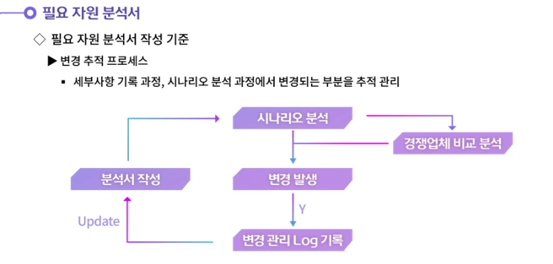

---

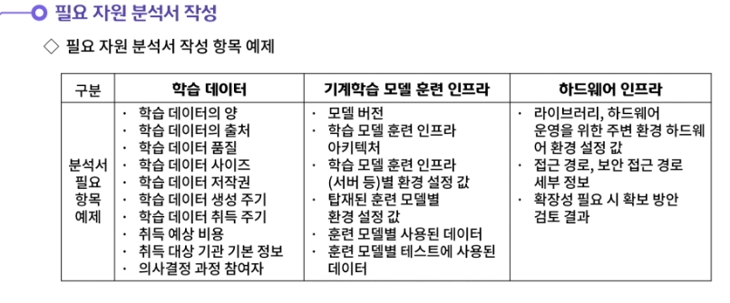

---

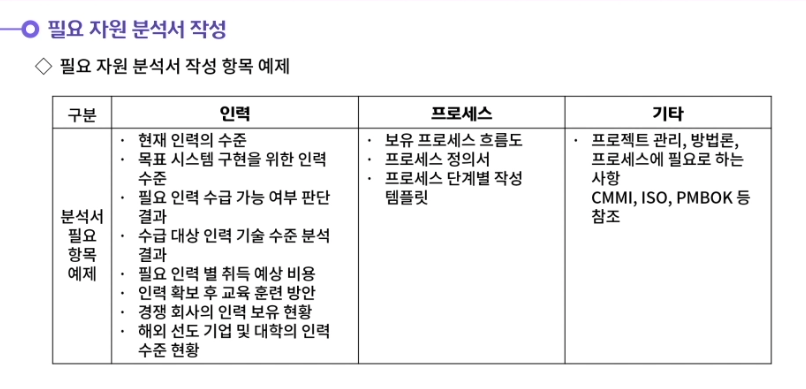

---

---

- **학습용 데이터를 취득하는 경로는 내부 및 외부로 구분할 수 있다.**
  **내부 데이터의 경우 기업이 운영되는 동안 축적되어 자산화되어 있는 데이터이다. 기업 내부 데이터를 다시 분류하면 다음과 같다. 첫번째는 개인 정보가 수록되어 활용이 불가능한 데이터이다. 두번째는 개인 정보 삭제 및 가공을 통해 활용이 가능하도록 변형한 데이터이다. 세번째는 기업에서 활용하는데 어떠한 무리도 없는 데이터이다.**
  **외부 데이터는 공개되어 누구나 사용할 수 있거나 다른 기업으로부터 구매하여 특정 목적으로만 사용이 허용된 데이터이다.**

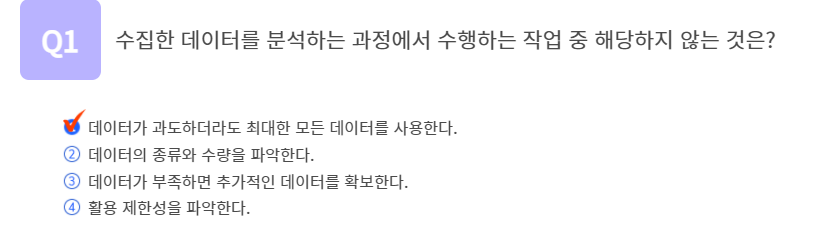

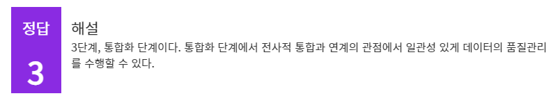

## 정리하기

#### 1. 데이터의 취득경로에 따라 구분되는 내부데이터와 외부데이터에 대해 생각해봅시다.

1. 학습용 데이터를 취득하는 경로는 내부 및 외부로 구분할 수 있다.
   내부 데이터의 경우 기업이 운영되는 동안 축적되어 자산화되어 있는 데이터이다. 기업 내부 데이터를 다시 분류하면 다음과 같다. 첫번째는 개인 정보가 수록되어 활용이 불가능한 데이터이다. 두번째는 개인 정보 삭제 및 가공을 통해 활용이 가능하도록 변형한 데이터이다. 세번째는 기업에서 활용하는데 어떠한 무리도 없는 데이터이다.
   외부 데이터는 공개되어 누구나 사용할 수 있거나 다른 기업으로부터 구매하여 특정 목적으로만 사용이 허용된 데이터이다.

