## 2021.11.16_인공지능서비스기술환경분석하기

## 학습내용

- 01.최신기술 동향 파악
- 02.기술 내재화를 위한 환경분석
- 03.기술 내재화 제약사항 파악
- 04.기술 환경 분석서 작성

## 학습 목표

- 인공지능 서비스의 구현을 위한 최신 기술 동향을 파악할 수 있음
- 파악된 인공지능 서비스 기술을 내재화하기 위한 환경을 분석할 수 있음
- 기술 내재화 시 발생할 수 있는 제약사항을 분석할 수 있음

## 01. 최신 기술 동향 파악

---

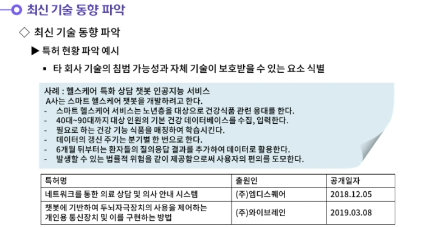

---

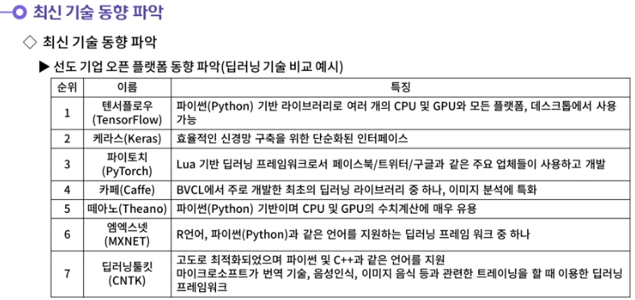

---

---

## 02. 기술 내재화를 위한 환경분석

---

---

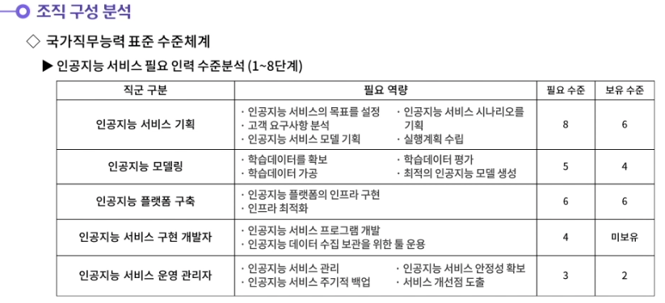

---

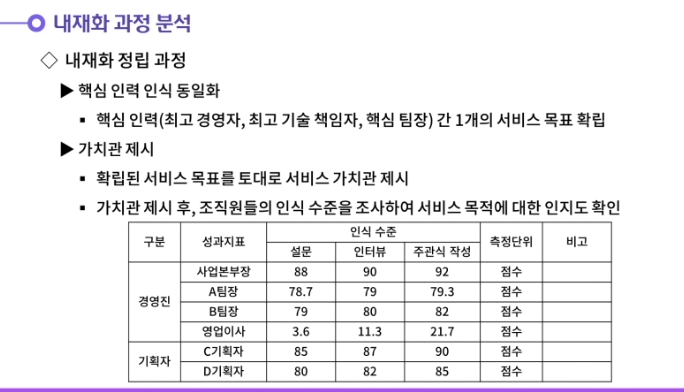

---

---

---

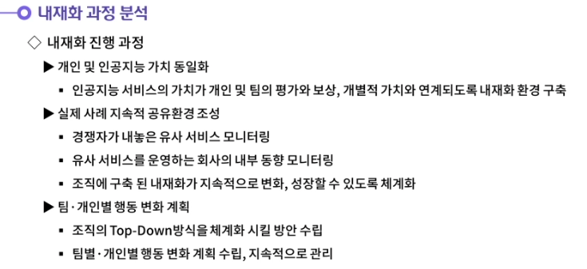

---

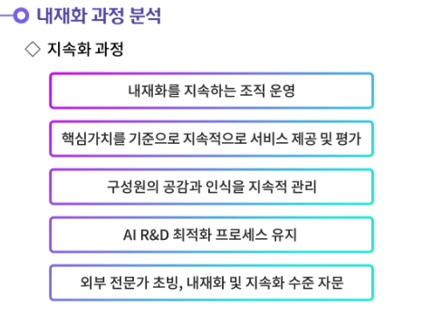
---

## 03.기술 내재화 제약사항 파악

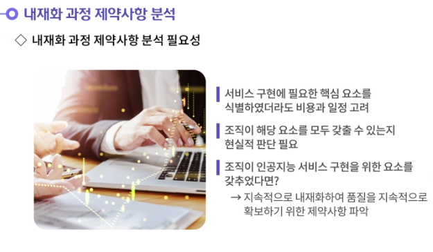

---

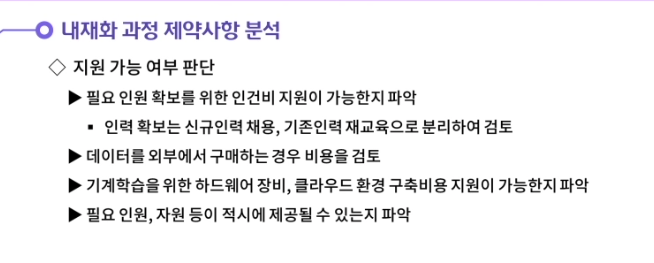

---

---

---

---

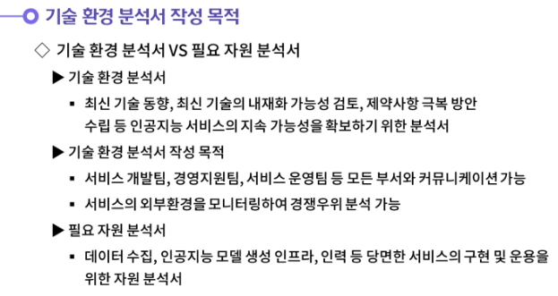

---

---

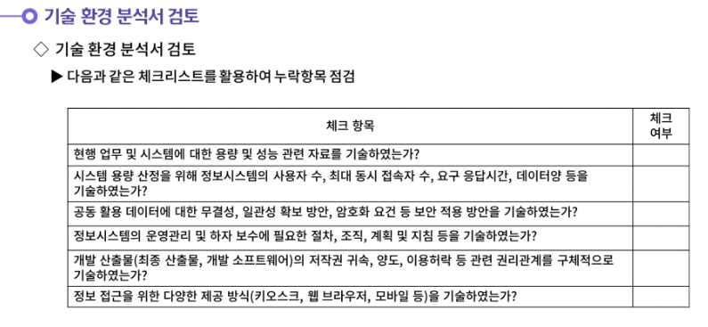

---

---

- **역할 우선 조직은 조직에서 필요로 하는 역할을 정립한 뒤 필요로 하는 인력을 배치한다. 단일 AI 서비스를 제공하는 조직에 적합하며, 팀 간의 역할 분담 및 협업 활동이 중요하다. 만약 한 팀의 역량에 문제가 발생할 경우, 조직과 AI 서비스의 전반적 운영에 차질이 발생할 수 있기 때문이다. 역할 우선 조직이 보유하고 있는 단점은 팀장과 임원 중심의 의사결정으로 운영될 경우, 독단적인 결정에 편중될 수 있다는 점이다.**
  **서비스 중심 조직은 복수의 AI 서비스를 제공하는 조직에 적합하다. AI 서비스를 지정한 뒤 최적의 인원을 선발하여 팀에 배치하게 된다. 따라서 팀 단위의 목표 설정과 평가가 중요시되며, 역량이 부족한 팀은 언제든 폐쇄가 가능한 유연한 조직이다.**

---

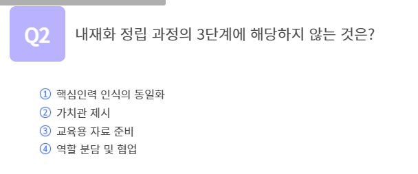

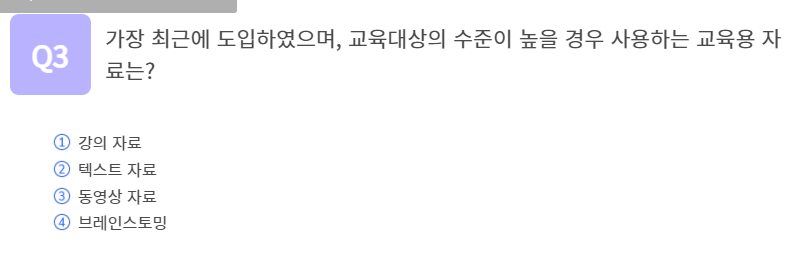

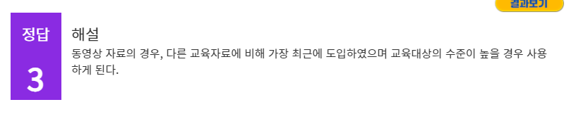

## 정리하기

#### 1. 역할 우선 조직과 서비스 중심 조직에 대해 생각해봅시다.

1. 역할 우선 조직은 조직에서 필요로 하는 역할을 정립한 뒤 필요로 하는 인력을 배치한다. 단일 AI 서비스를 제공하는 조직에 적합하며, 팀 간의 역할 분담 및 협업 활동이 중요하다. 만약 한 팀의 역량에 문제가 발생할 경우, 조직과 AI 서비스의 전반적 운영에 차질이 발생할 수 있기 때문이다. 역할 우선 조직이 보유하고 있는 단점은 팀장과 임원 중심의 의사결정으로 운영될 경우, 독단적인 결정에 편중될 수 있다는 점이다.
   서비스 중심 조직은 복수의 AI 서비스를 제공하는 조직에 적합하다. AI 서비스를 지정한 뒤 최적의 인원을 선발하여 팀에 배치하게 된다. 따라서 팀 단위의 목표 설정과 평가가 중요시되며, 역량이 부족한 팀은 언제든 폐쇄가 가능한 유연한 조직이다.