# 2021.11.17_10.인공지능방향설정하기

## 학습내용

- 01.인공지능 서비스 기회 요소 도출
- 02.인공지능 서비스 우선순위 결정
- 03.인공지능 서비스 방향 설정
- 04.인공지는 서비스 목표 설정

## 학습목표

- 환경 분석 결과에 따라 인공지능 서비스의 기회요소를 도출할 수 있음
- 도출된 기회 요소의 인공지능 서비스 영향도를 분석하여 우선순위를 결정할 수 있음
- 인공지능 서비스 범위와 범위에 따른 인공지능 서비스 방향을 설정할 수 있음

## 01.인공지능 서비스 기회 요소 도출

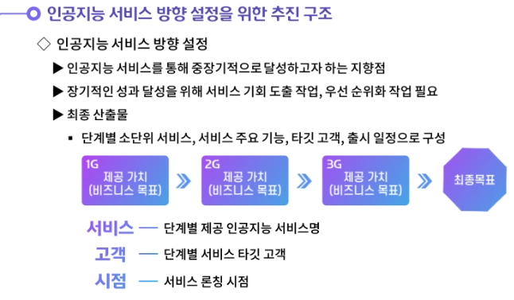

---

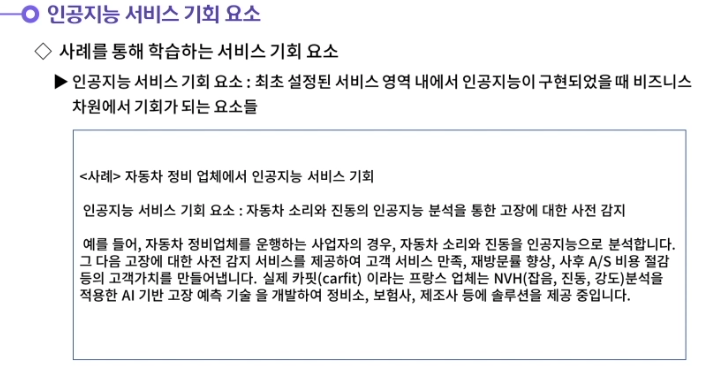

---

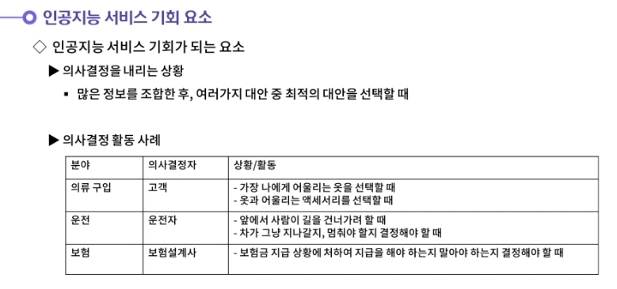

---

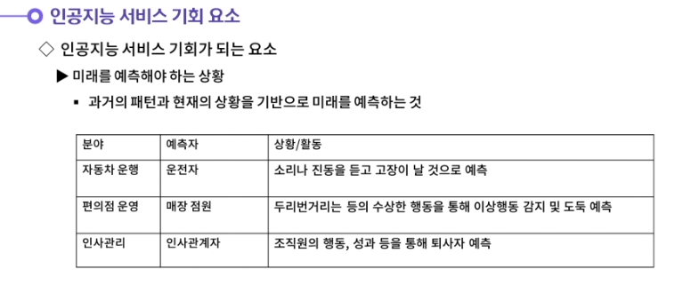

---

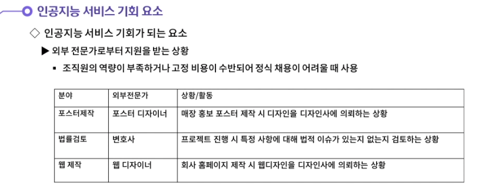

---

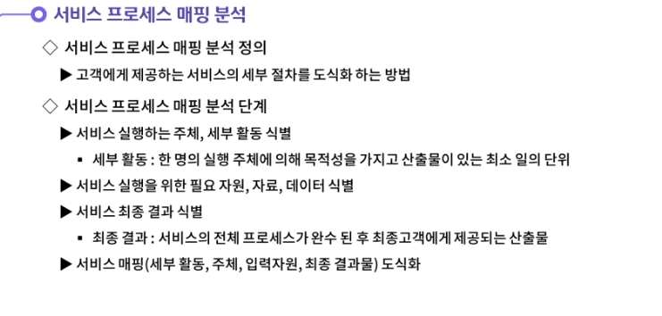

---

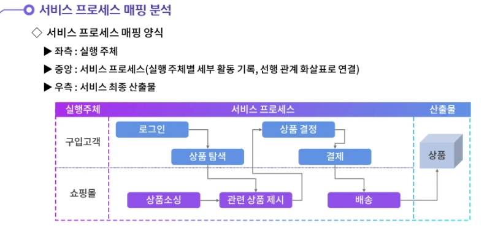

---

## 02.인공지능 서비스 우선순위 결정

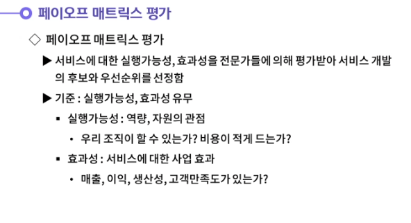

---

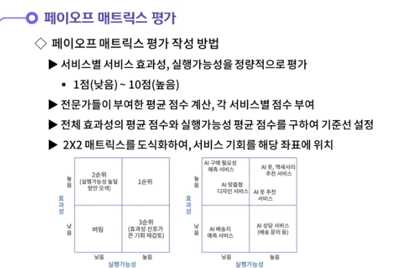

---

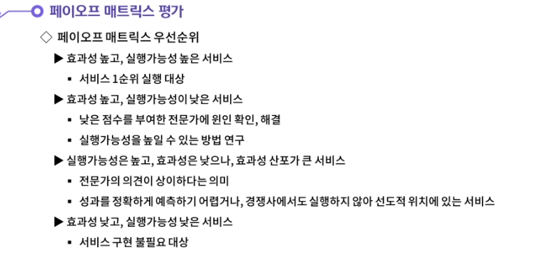

---

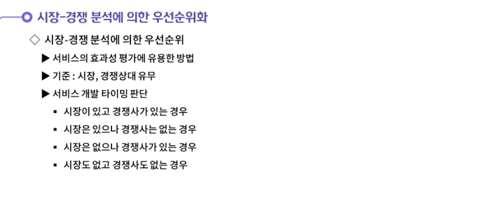

---

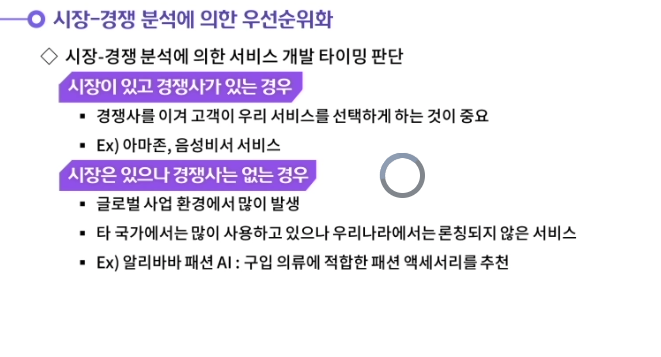

---

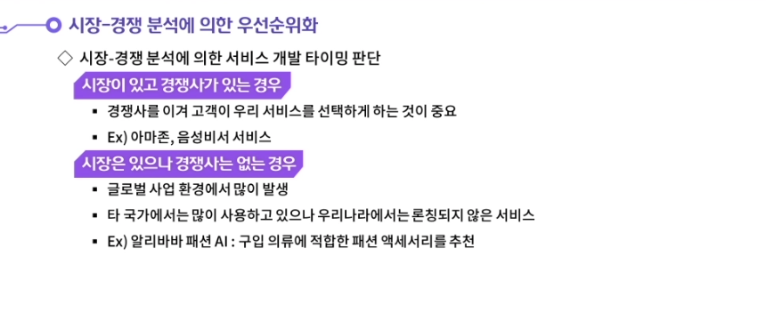

---

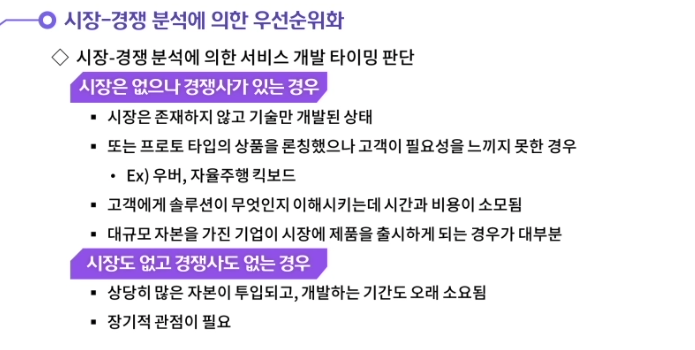

---

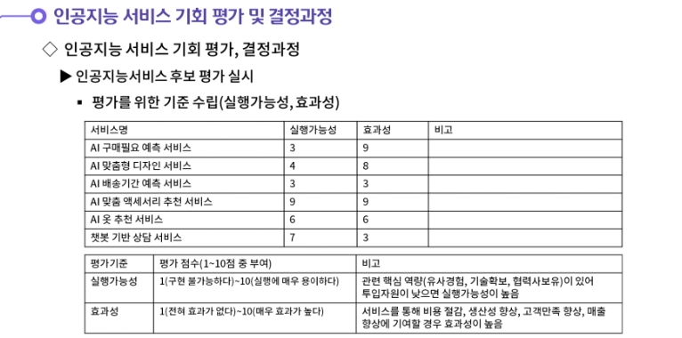

---

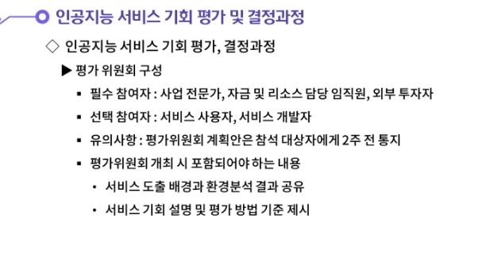

---

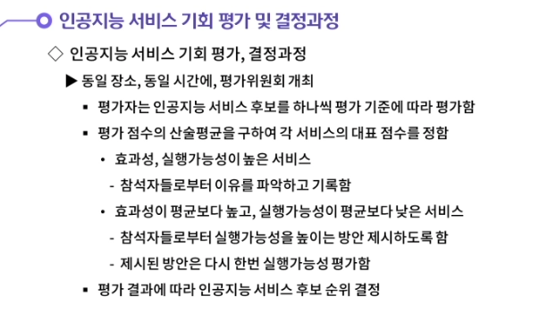

---

---

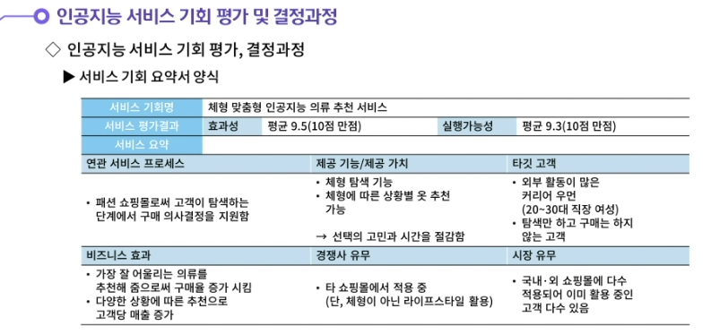

---

## 03.인공지능 서비스 방향 설정

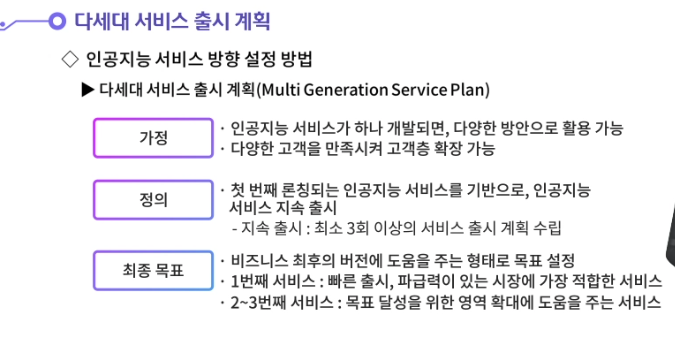

---

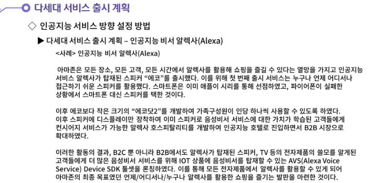

---

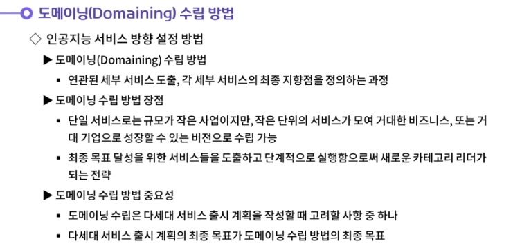

---

- 인공지능 서비스 목표 항목 도출에 대해 생각해봅시다.
  - **목표 항목은 회사의 전략 방향이라고도 할 수 있다. 목표 항목 도출하기는 다음과 같은 6가지 단계로 구성된다.**
    **첫번째 단계는 인공지능 서비스가 고객 및 회사에 제공하는 가치를 도출하는 것이다.**
    **두번째 단계는 세대, 서비스명, 제공가치, 지표를 재정리하는 것이다.**
    **세번째 단계는 서비스 주 사용고객과 특징을 정의하는 것이다.**
    **네번째 단계는 서비스 기능에 대한 고객 기대사항에 대해 조사를 실시하는 것이다.**
    **다섯번째 단계는 기대 사항의 충족 여부를 측정할 수 있는 목표 항목으로 정의하는 것이다.**
    **여섯 번째 단계는 목표 항목 평가기준을 5개 이내로 설정하고, 평가 후 목표 항목의 우선순위를 선정하는 것이다.**

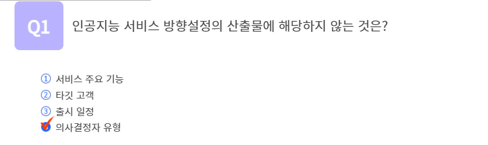

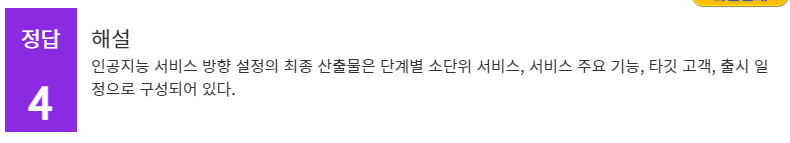

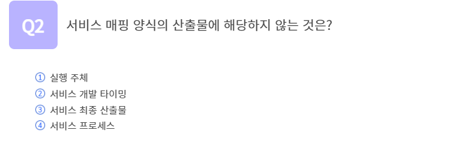

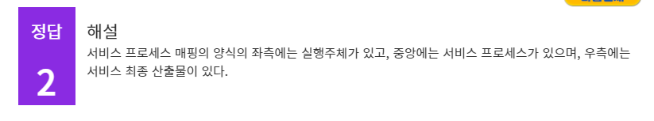

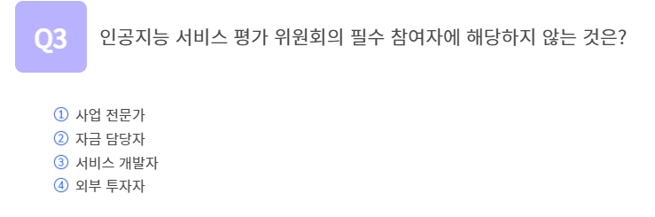

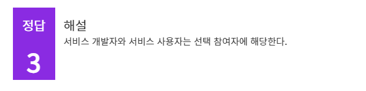

## 정리하기

#### 1. 인공지능 서비스 목표 항목 도출에 대해 생각해봅시다.

1. 목표 항목은 회사의 전략 방향이라고도 할 수 있다. 목표 항목 도출하기는 다음과 같은 6가지 단계로 구성된다.
   첫번째 단계는 인공지능 서비스가 고객 및 회사에 제공하는 가치를 도출하는 것이다.
   두번째 단계는 세대, 서비스명, 제공가치, 지표를 재정리하는 것이다.
   세번째 단계는 서비스 주 사용고객과 특징을 정의하는 것이다.
   네번째 단계는 서비스 기능에 대한 고객 기대사항에 대해 조사를 실시하는 것이다.
   다섯번째 단계는 기대 사항의 충족 여부를 측정할 수 있는 목표 항목으로 정의하는 것이다.
   여섯 번째 단계는 목표 항목 평가기준을 5개 이내로 설정하고, 평가 후 목표 항목의 우선순위를 선정하는 것이다.