## 11.인공지능서비스목표확정하기

## 학습내용

- 01.관리 항목별 현재 수준 정의
- 02.서비스 제약조건 도출
- 03.서비스 목표수준 설정

## 학습 목표

- 인공지능 서비스 목표 항목에 대한 현재 수준을 정의할 수 있음
- 목표 수준 달성에 영향을 미치는 인공지는 서비스 제약조건을 도출할 수 있음
- 정의된 현재 수준과 도출된 제약조건에 따라 단계별 달성 가능한 목표수준을 설정할 수 있음

## 01.관리 항목별 현재 수준 정의

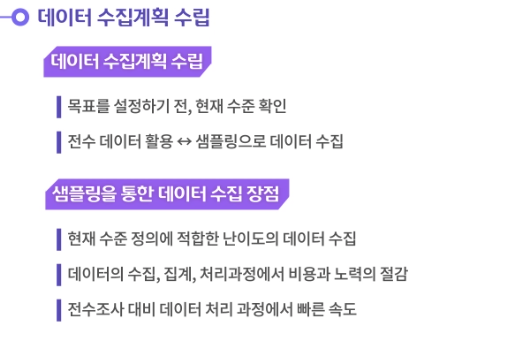

---

---

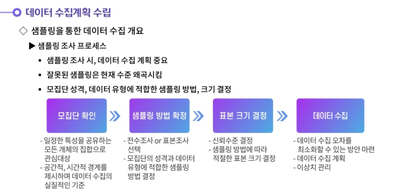

---

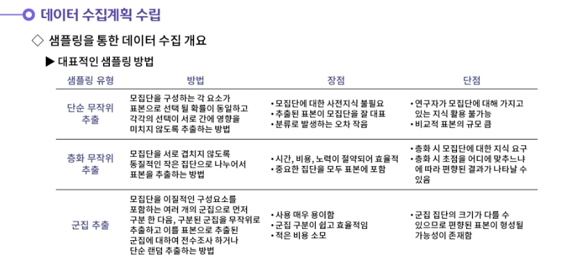

---

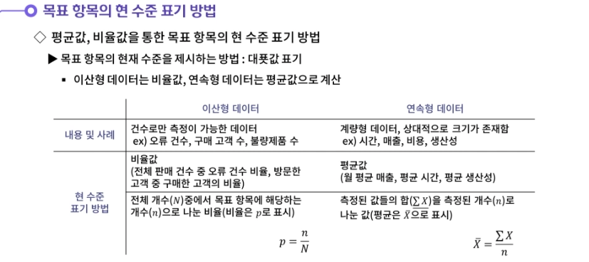

---

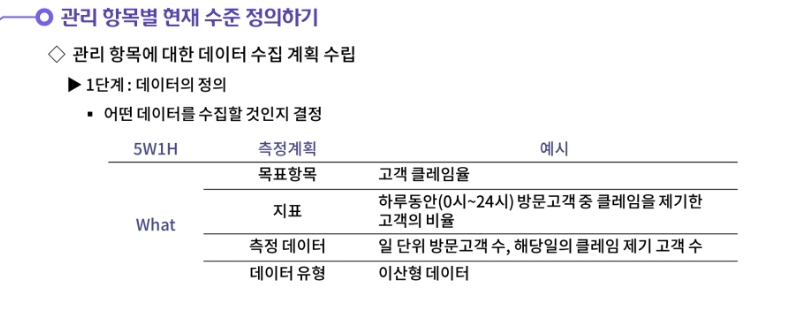

---

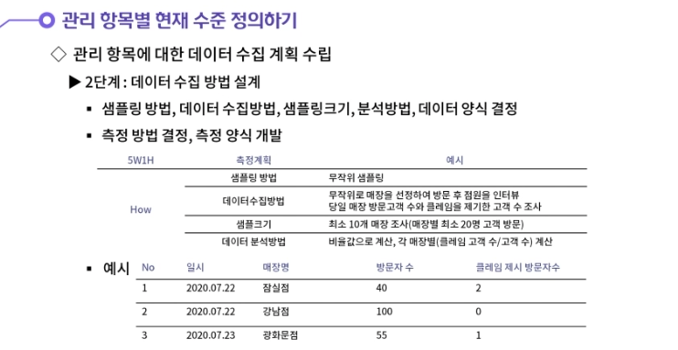

---

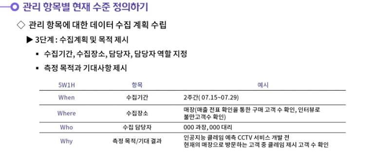

---

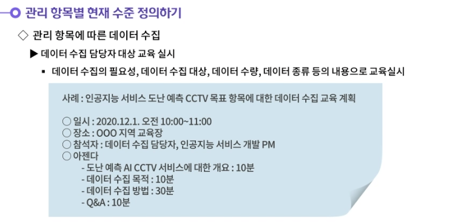

---

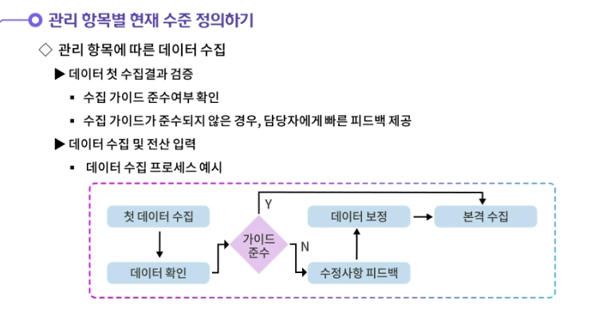

---

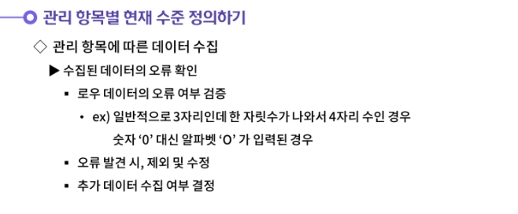

---

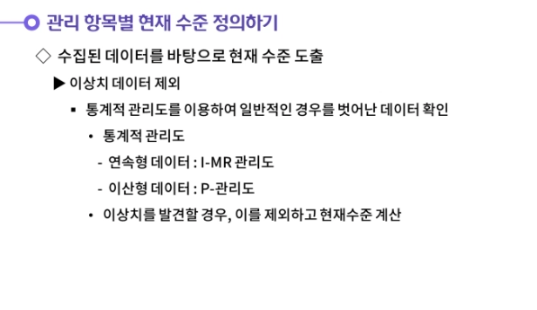

---

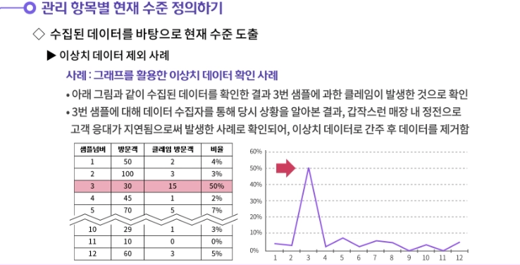

---

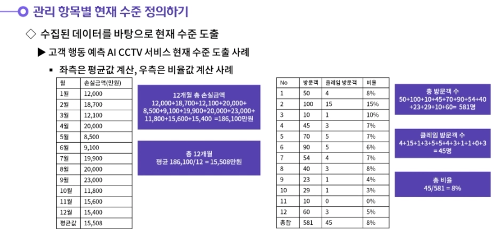

## 02.서비스 제약조건 도출

---

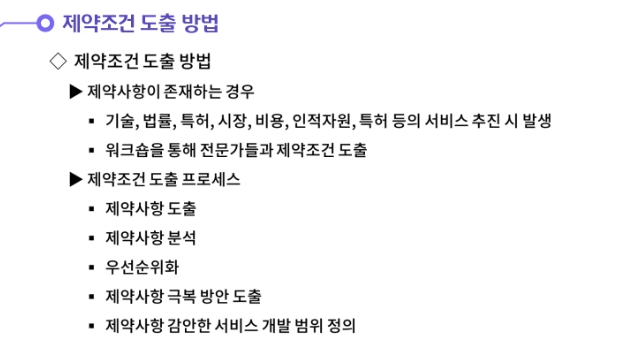

---

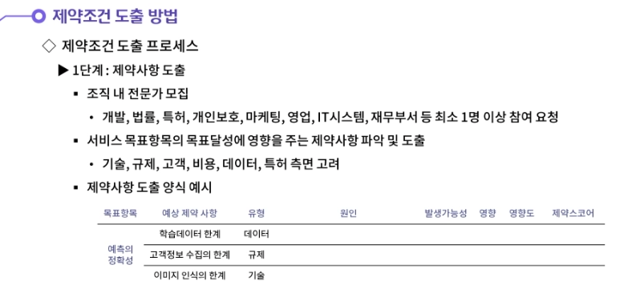

---

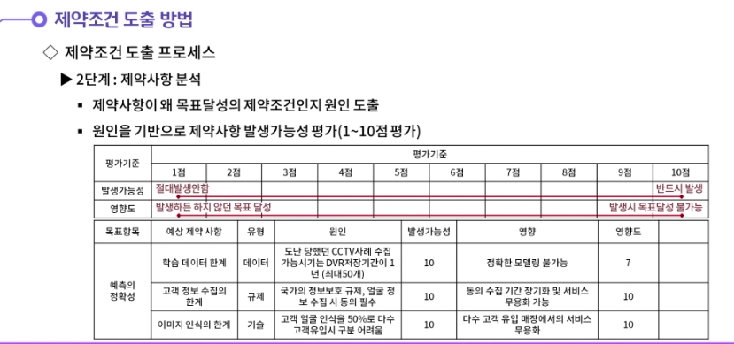

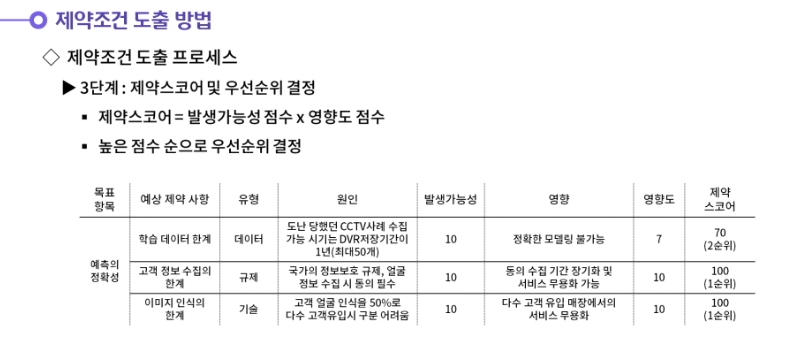

---

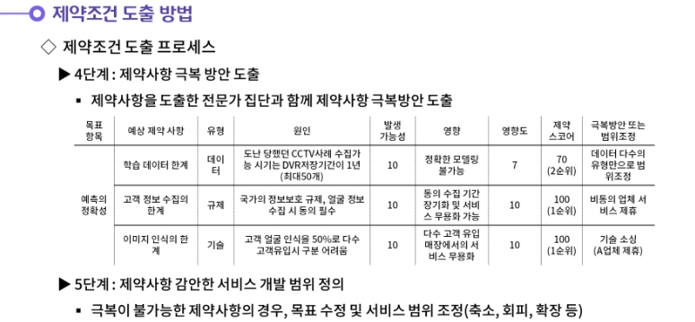

---

## 03.서비스목표수준 설정

---

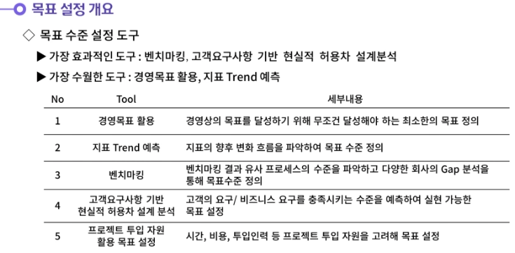

---

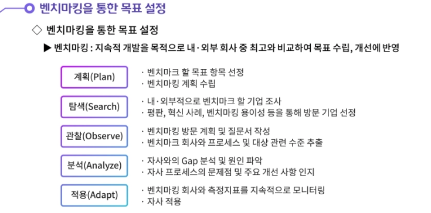

---

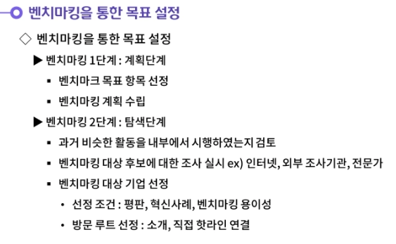

---

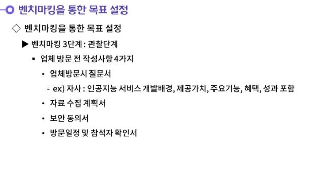

---

---

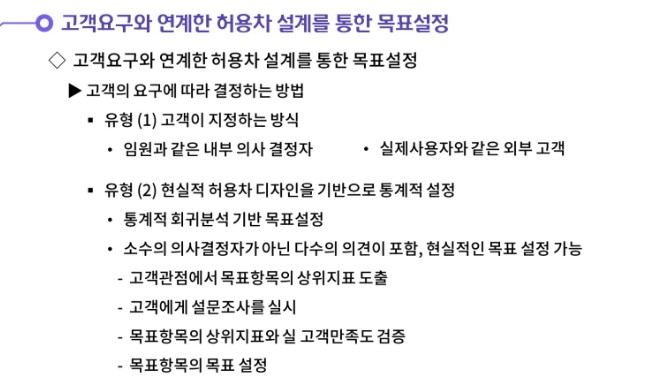

---

---

---

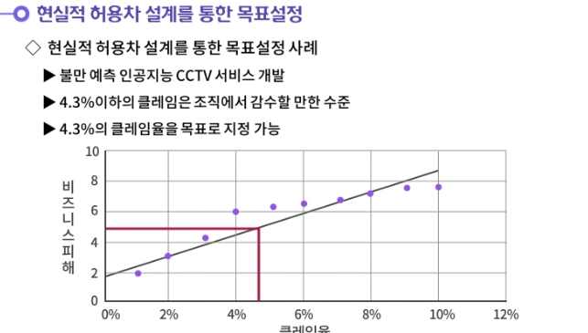

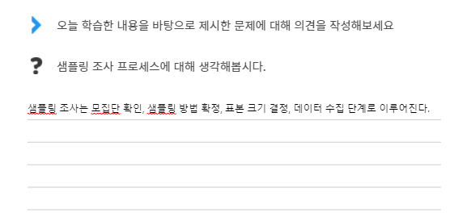

- **샘플링 조사는 모집단 확인, 샘플링 방법 확정, 표본 크기 결정, 데이터 수집 단계로 이루어진다.**
  **첫번째, 모집단 확인 단계에서는 일정한 특성을 공유하는 개체의 집합을 관심의 대상으로 선정한다.**
  **두번째, 샘플링 방법 확정 단계에서는 모집단의 성격과 데이터의 유형을 고려하여 적합한 샘플링 방법을 결정한다.**
  **세번째, 표본 크기 결정 단계에서는 샘플링 방법에 따라서 적절한 표본의 크기를 결정한다.**
  **네번째, 데이터 수집 단계에서는 데이터 수집 오차를 최소화하는 방안을 마련하고 이상치를 관리한다.**
- 

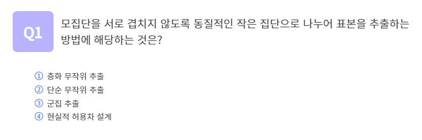

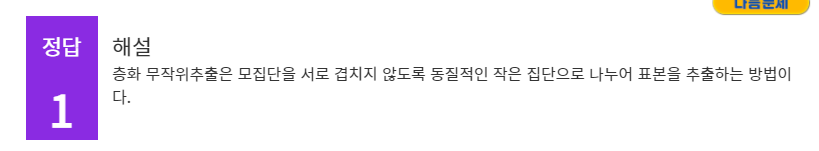

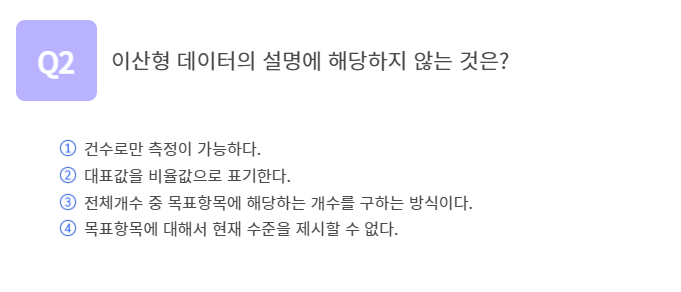

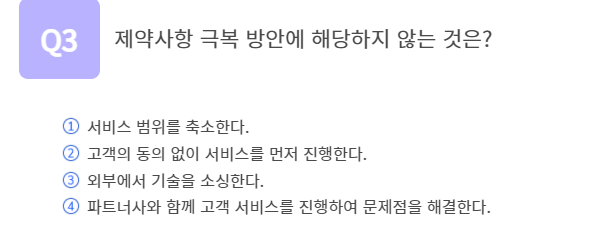

## 정리하기

#### 1. 샘플링 조사 프로세스에 대해 생각해봅시다.

1. 샘플링 조사는 모집단 확인, 샘플링 방법 확정, 표본 크기 결정, 데이터 수집 단계로 이루어진다.
   첫번째, 모집단 확인 단계에서는 일정한 특성을 공유하는 개체의 집합을 관심의 대상으로 선정한다.
   두번째, 샘플링 방법 확정 단계에서는 모집단의 성격과 데이터의 유형을 고려하여 적합한 샘플링 방법을 결정한다.
   세번째, 표본 크기 결정 단계에서는 샘플링 방법에 따라서 적절한 표본의 크기를 결정한다.
   네번째, 데이터 수집 단계에서는 데이터 수집 오차를 최소화하는 방안을 마련하고 이상치를 관리한다.