##  12.인공지능서비스요구사항수집하기

## 학습내용

- 01.요구 사항 수집 대상 정의
- 02.기능,비기능 요구 사항 수집
- 03.요구사항 제약사항 검토
- 04.인공지능 서비스 요구사항 분석

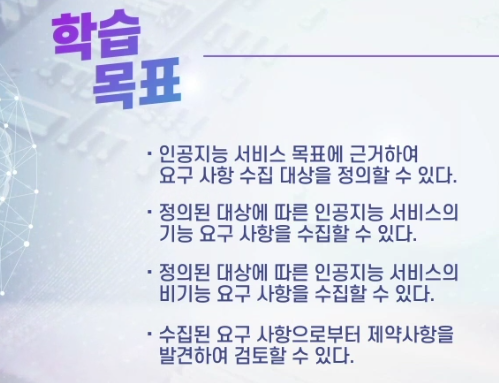

## 01.요구사항 수집 대상 정의

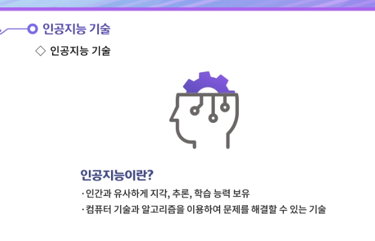

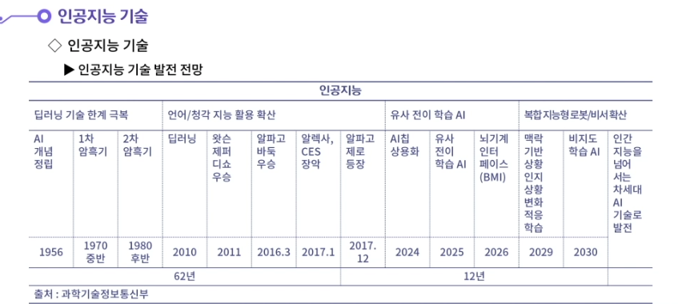

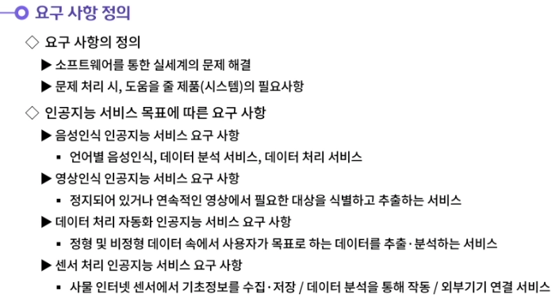

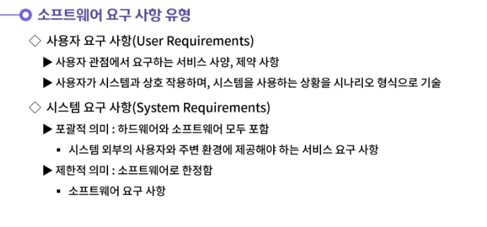

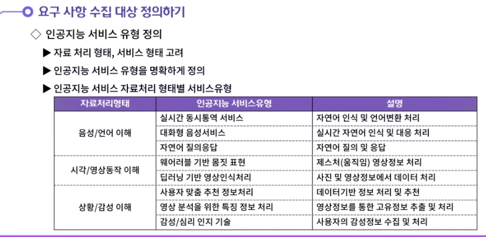

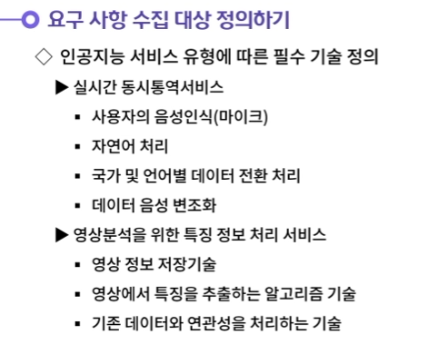

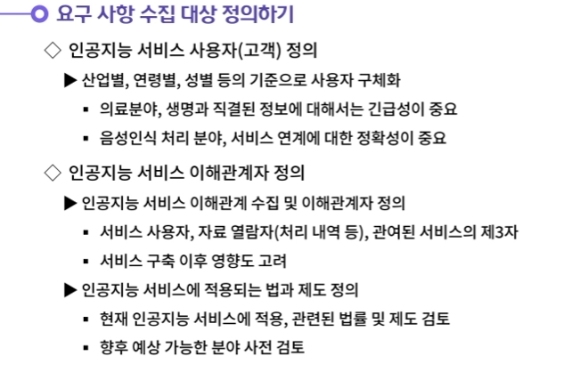

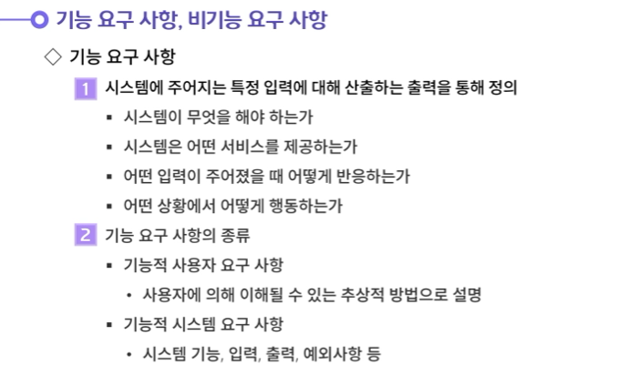

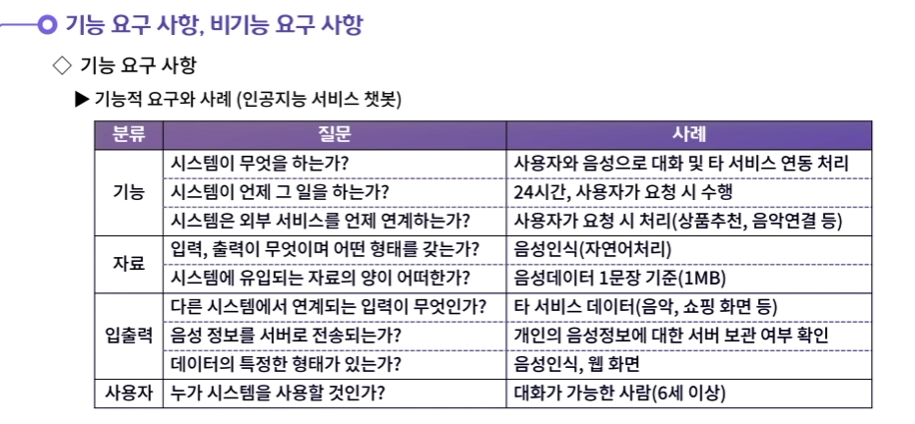

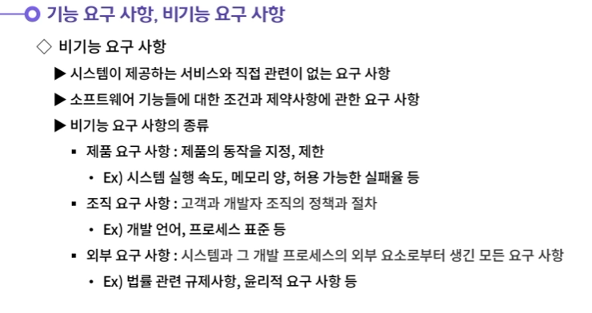

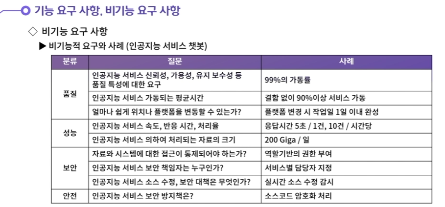

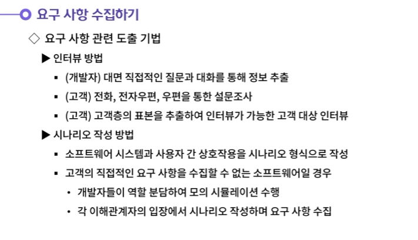

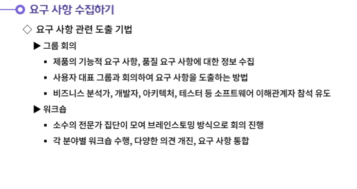

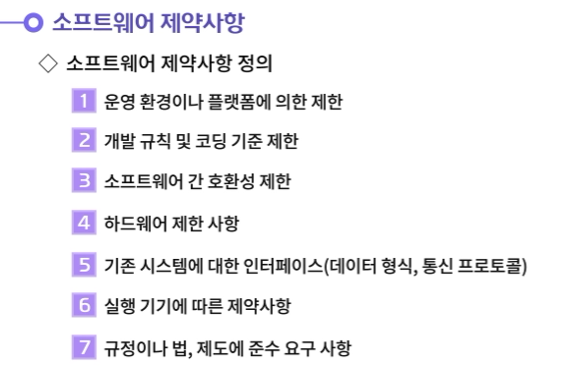

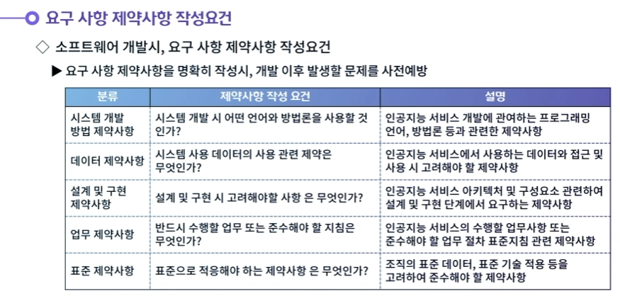

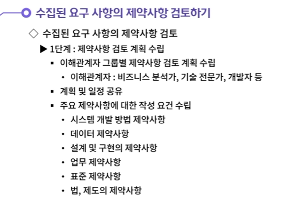

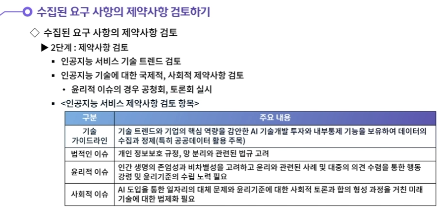

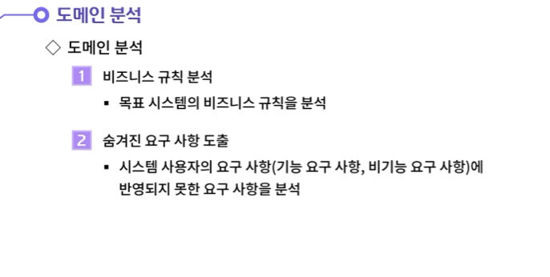

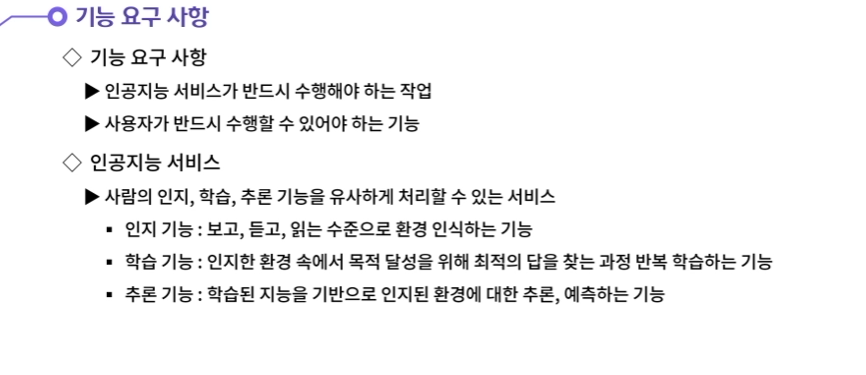

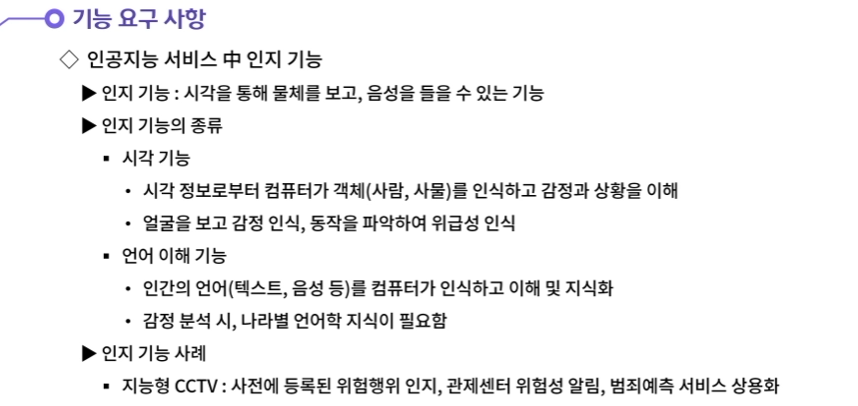

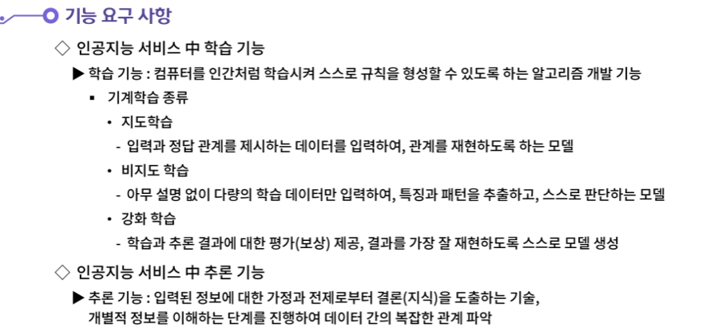

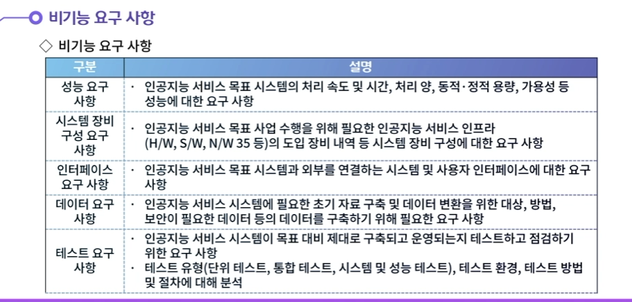

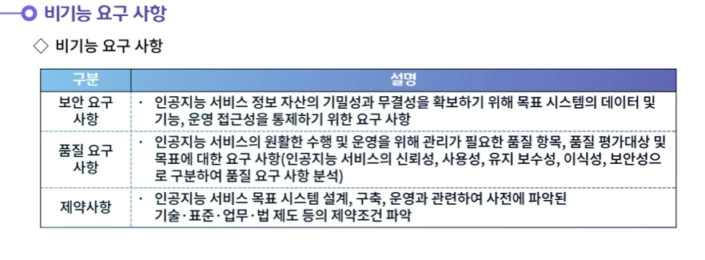

- 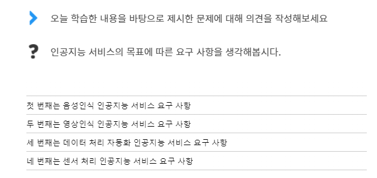**인공지능 서비스의 목표에 따라 다음과 같이 특화된 요구 사항이 존재한다.**
  **첫 번째는 음성인식 인공지능 서비스 요구 사항이다. 사람의 음성을 통해서 원하는 서비스를 수행하는 음성인식 인공지능 서비스는 언어별 음성인식, 데이터 분석, 데이터 처리 서비스에 대한 요구 사항이 존재한다.**
  **두 번째는 영상인식 인공지능 서비스 요구 사항이다. 정지된 혹은 연속적인 영상에서 필요한 대상을 식별하고 추출할 수 있는 요구 사항이 존재한다.**
  **세 번째는 데이터 처리 자동화 인공지능 서비스 요구 사항이다. 정형·비정형 데이터들 속에서 사용자가 목표로 하는 데이터를 추출·분석한다. 그리고 사전에 정의된 규칙에 따라 데이터를 가공·처리하는 요구 사항이 존재한다.**
  **네 번째는 센서 처리 인공지능 서비스 요구 사항이다. 사물인터넷(IoT)은 센서를 통해 온도, 습도, 기압 등의 다양한 기초정보를 수집·저장한다. 해당 데이터 분석을 통해 사전 정의된 규칙에 따라서 제품을 작동하거나 다양한 외부기기를 연결시키는 요구 사항이 있을 수 있다.**

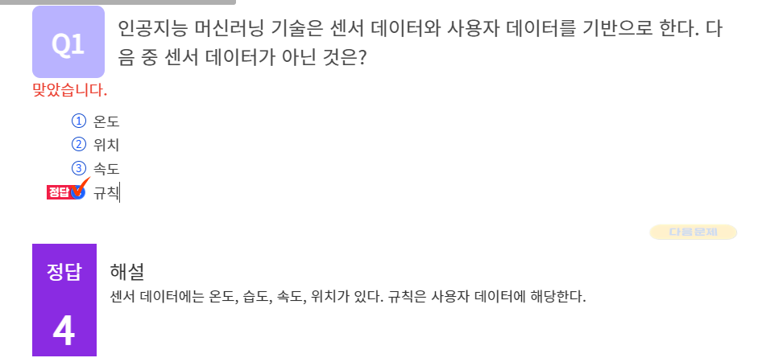

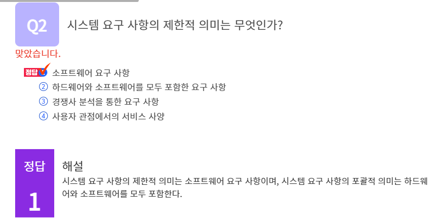

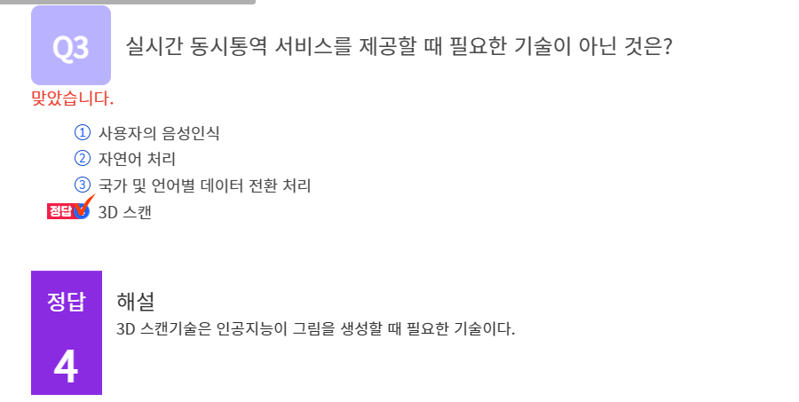

## 정리하기

#### 1. 인공지능 서비스의 목표에 따른 요구 사항을 생각해봅시다.

1. 인공지능 서비스의 목표에 따라 다음과 같이 특화된 요구 사항이 존재한다.
   첫 번째는 음성인식 인공지능 서비스 요구 사항이다. 사람의 음성을 통해서 원하는 서비스를 수행하는 음성인식 인공지능 서비스는 언어별 음성인식, 데이터 분석, 데이터 처리 서비스에 대한 요구 사항이 존재한다.
   두 번째는 영상인식 인공지능 서비스 요구 사항이다. 정지된 혹은 연속적인 영상에서 필요한 대상을 식별하고 추출할 수 있는 요구 사항이 존재한다.
   세 번째는 데이터 처리 자동화 인공지능 서비스 요구 사항이다. 정형·비정형 데이터들 속에서 사용자가 목표로 하는 데이터를 추출·분석한다. 그리고 사전에 정의된 규칙에 따라 데이터를 가공·처리하는 요구 사항이 존재한다.
   네 번째는 센서 처리 인공지능 서비스 요구 사항이다. 사물인터넷(IoT)은 센서를 통해 온도, 습도, 기압 등의 다양한 기초정보를 수집·저장한다. 해당 데이터 분석을 통해 사전 정의된 규칙에 따라서 제품을 작동하거나 다양한 외부기기를 연결시키는 요구 사항이 있을 수 있다.