## 2021.11.17_13인공지능서비스모델구성요소분석하기

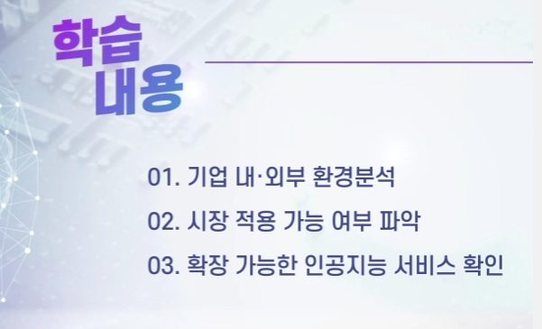

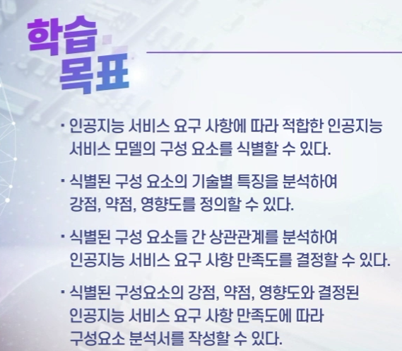

## 01기업 내외부 환경 분석

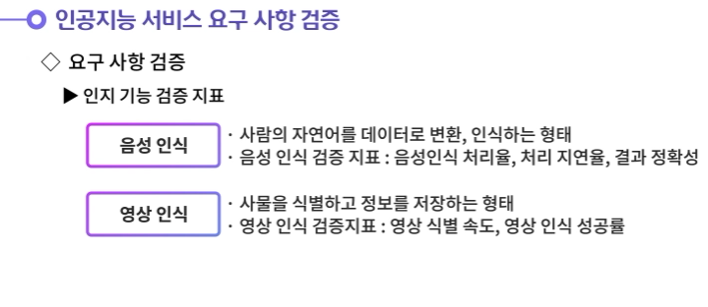

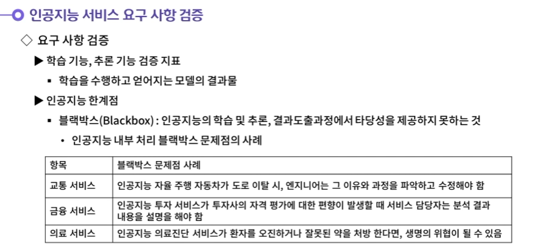

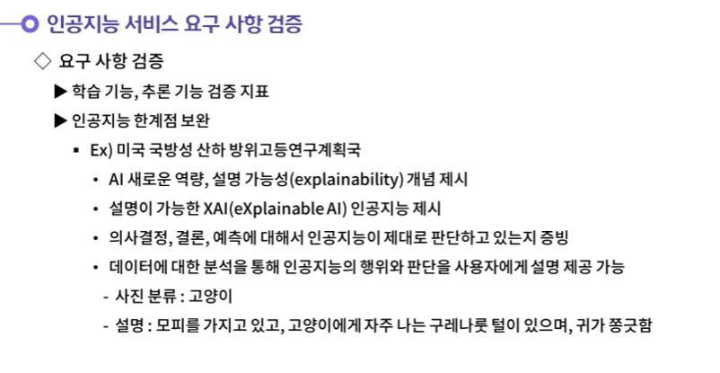

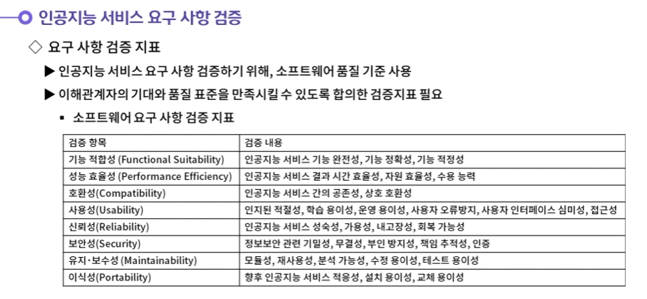

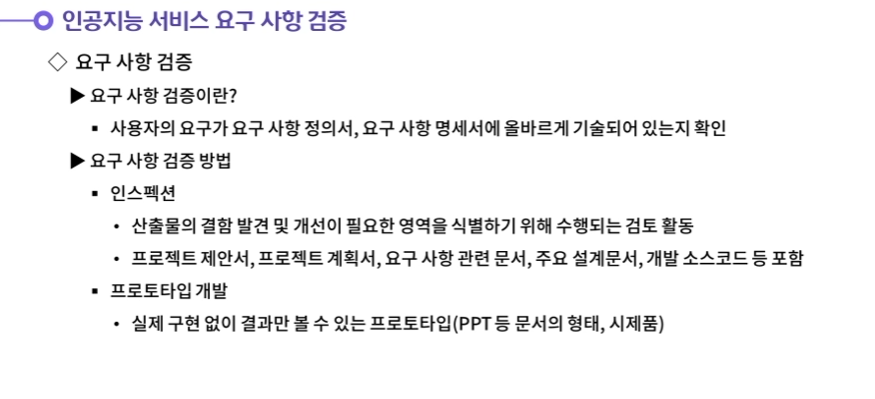

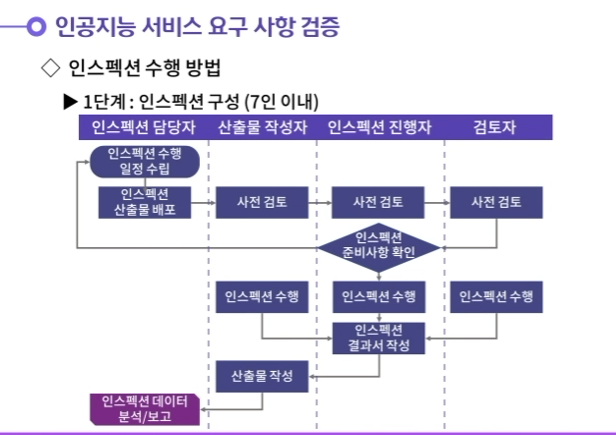

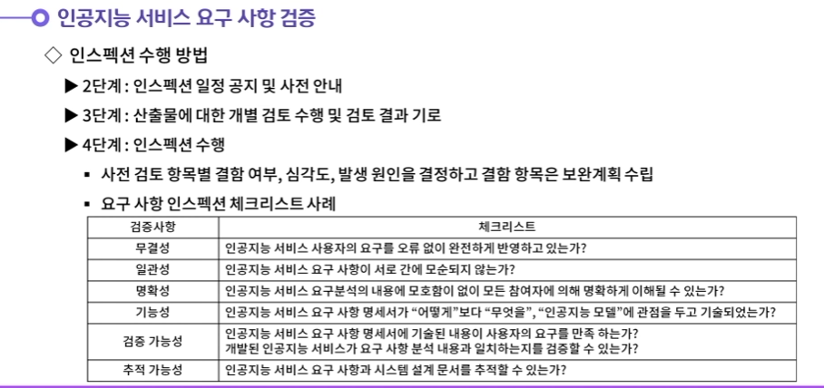

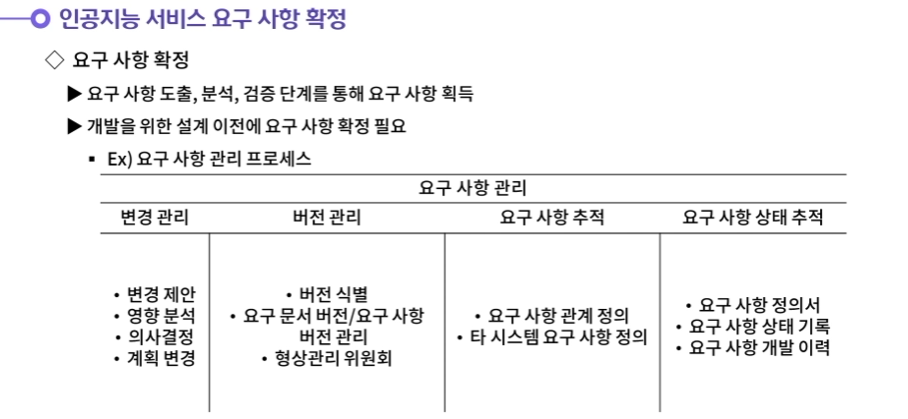

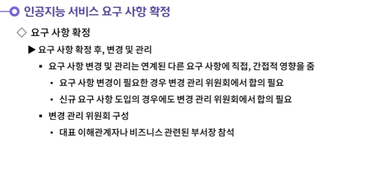

## 02.인공지능 서비스모델 구성요소 식별

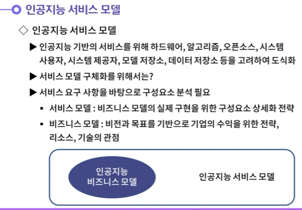

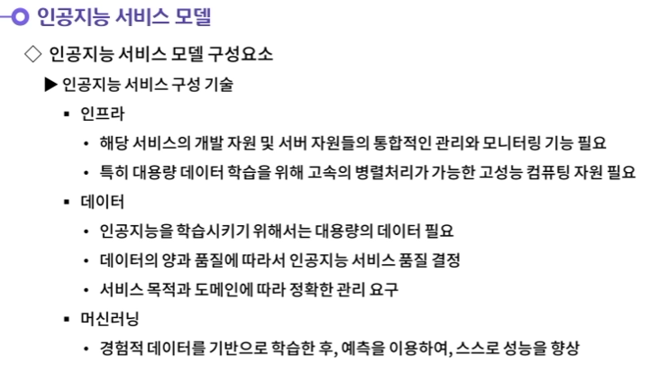

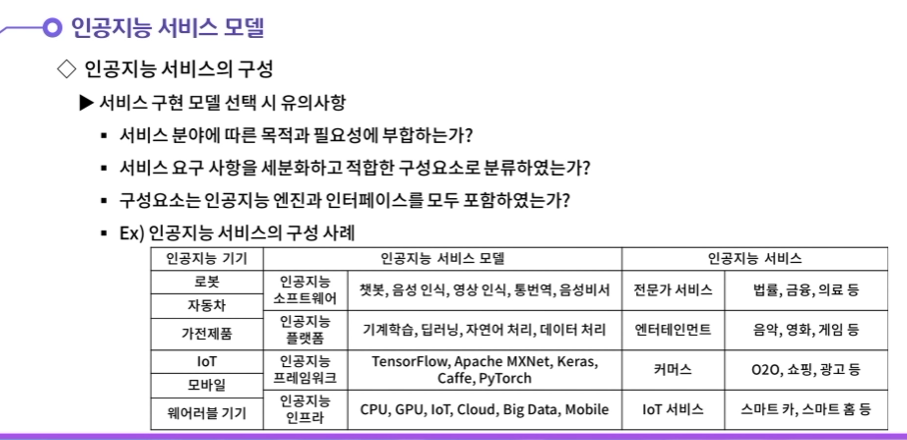

## 03.인공지능 서비스 모델 구성 요소 분석서 작성ㄴ

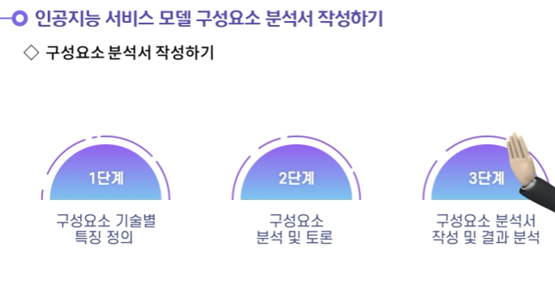

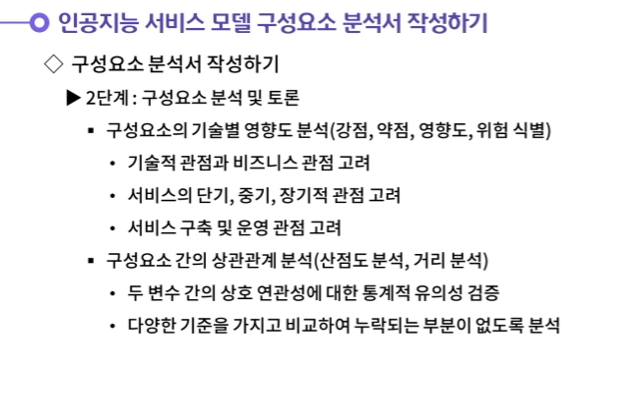

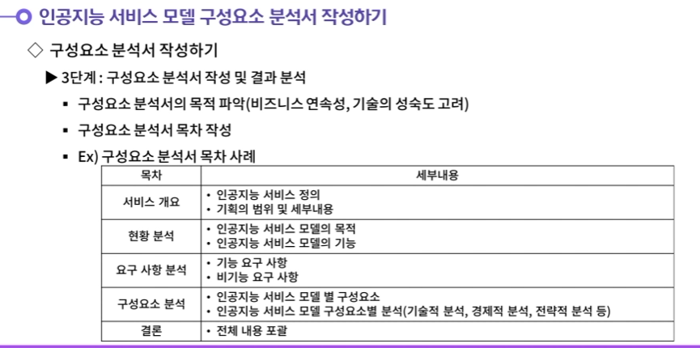

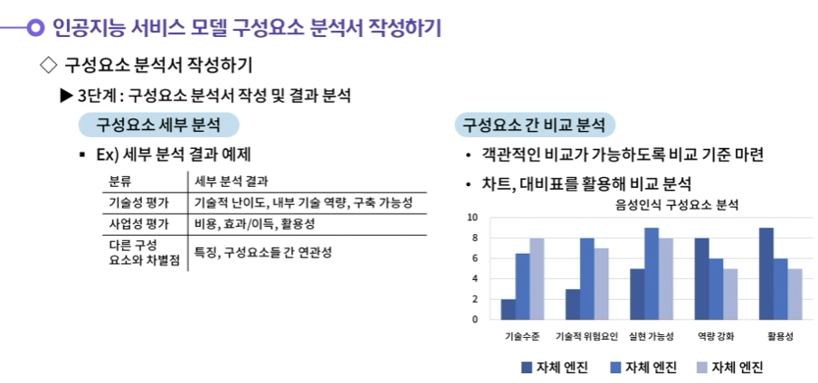

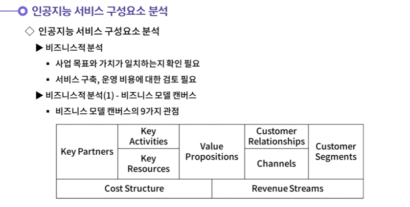

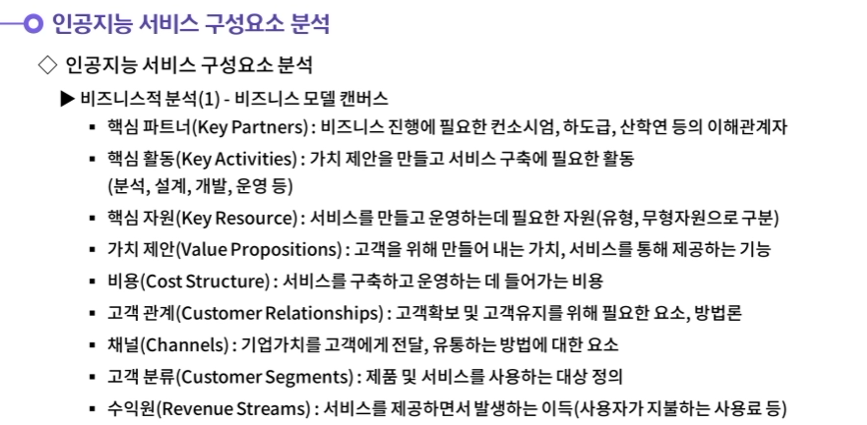

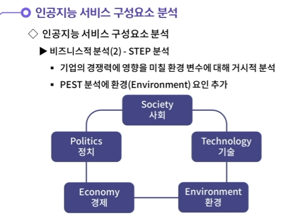

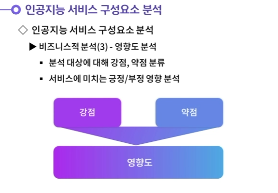

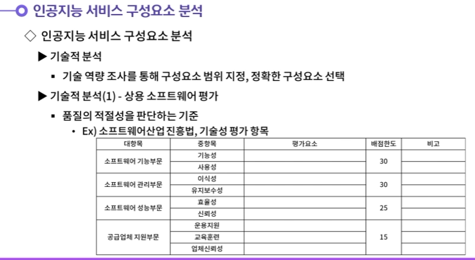

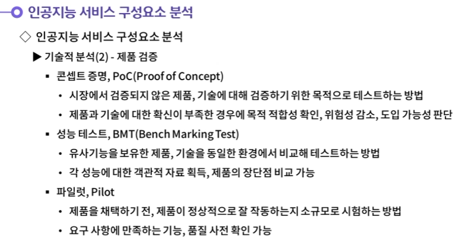

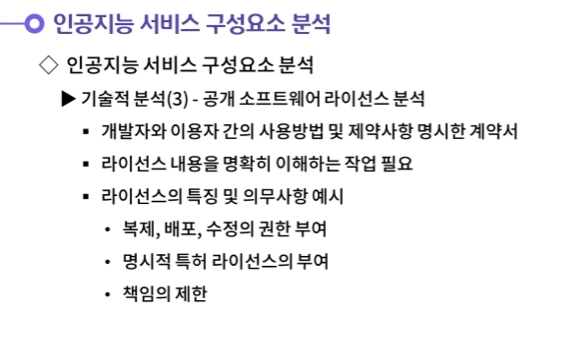

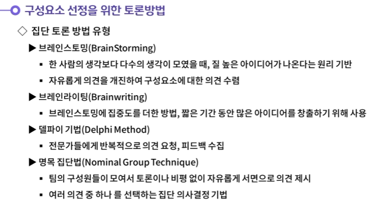

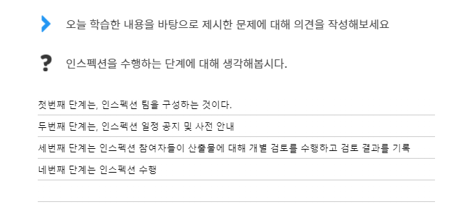

- **인스펙션 수행방법은 4가지 단계로 구성된다.**
  **첫번째 단계는, 인스펙션 팀을 구성하는 것이다. 인스펙션에 참여하는 인원은 7명 이내로 제한하고, 인스펙션 담당자, 산출물 작성자, 인스펙션 진행자, 검토자의 역할이 필수로 존재해야 한다.**
  **두번째 단계는, 인스펙션 일정 공지 및 사전 안내이다. 인스펙션 수행 일정을 참여자에게 공지하고, 대상 산출물을 관련 검토자에게 사전 배포하는 작업을 진행한다.**
  **세번째 단계는 인스펙션 참여자들이 산출물에 대해 개별 검토를 수행하고 검토 결과를 기록하는 과정이다.**
  **네번째 단계는 인스펙션 수행이다. 검증 사항을 반영하여 요구 사항 내역과 요구 사항 정의서를 확인해보는 것이 좋다.**

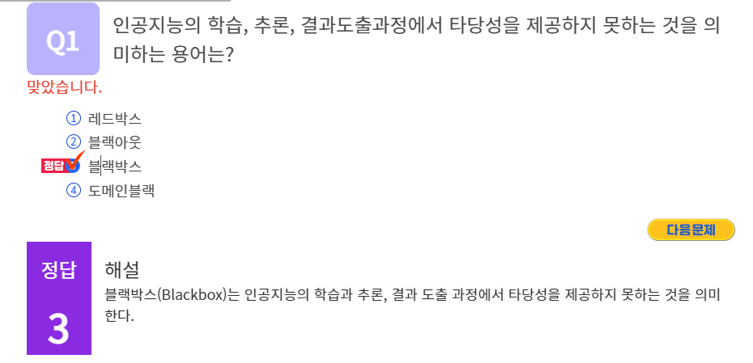

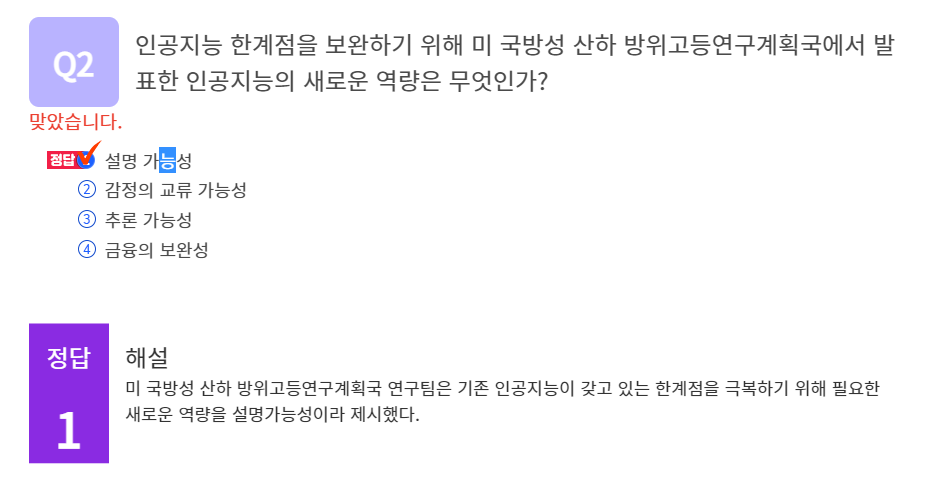

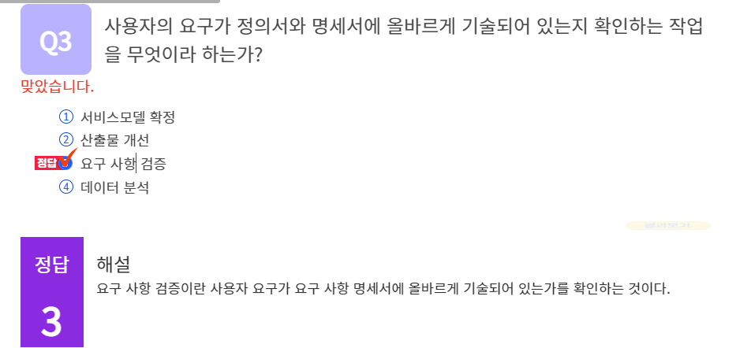

#### 1. 인스펙션을 수행하는 단계에 대해 생각해봅시다.

1. 인스펙션 수행방법은 4가지 단계로 구성된다.
   첫번째 단계는, 인스펙션 팀을 구성하는 것이다. 인스펙션에 참여하는 인원은 7명 이내로 제한하고, 인스펙션 담당자, 산출물 작성자, 인스펙션 진행자, 검토자의 역할이 필수로 존재해야 한다.
   두번째 단계는, 인스펙션 일정 공지 및 사전 안내이다. 인스펙션 수행 일정을 참여자에게 공지하고, 대상 산출물을 관련 검토자에게 사전 배포하는 작업을 진행한다.
   세번째 단계는 인스펙션 참여자들이 산출물에 대해 개별 검토를 수행하고 검토 결과를 기록하는 과정이다.
   네번째 단계는 인스펙션 수행이다. 검증 사항을 반영하여 요구 사항 내역과 요구 사항 정의서를 확인해보는 것이 좋다.