## 2021.11.17_14.인공지능서비스모델정의하기

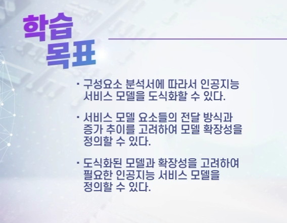

## 01.인공지능 서비스 모델 도식화

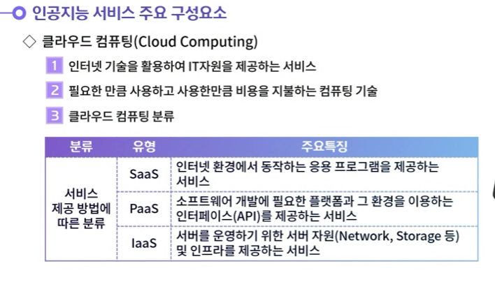

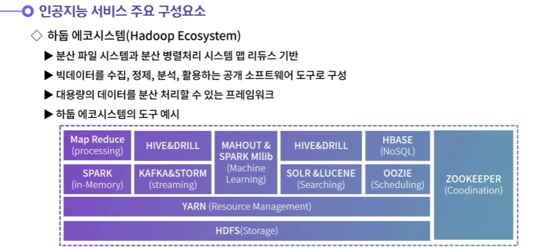

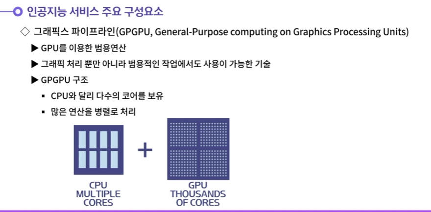

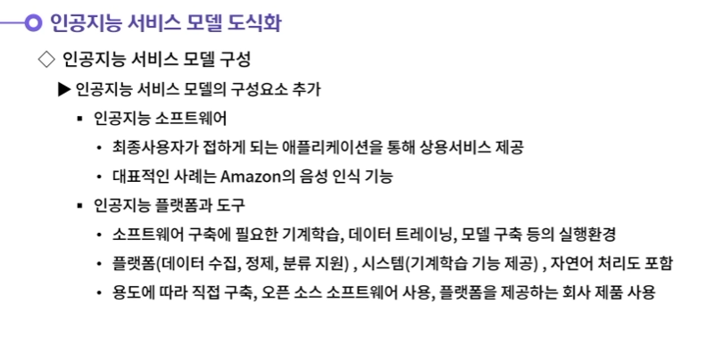

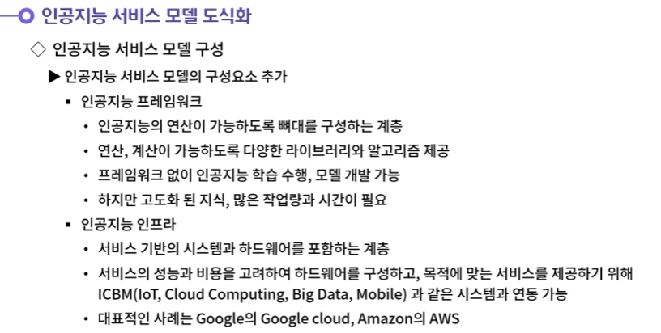

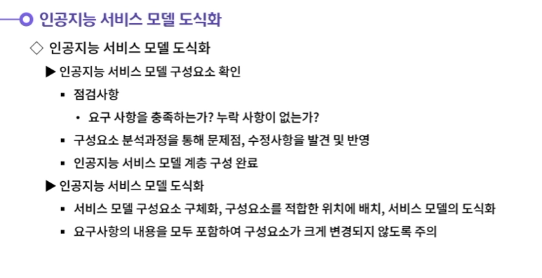

## 02.인공지능 서비스 모델 정의

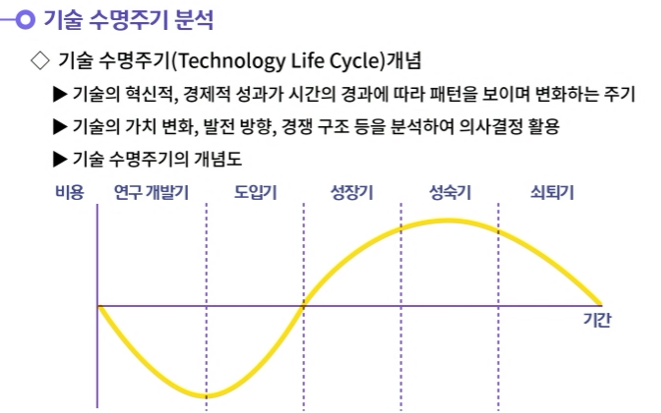

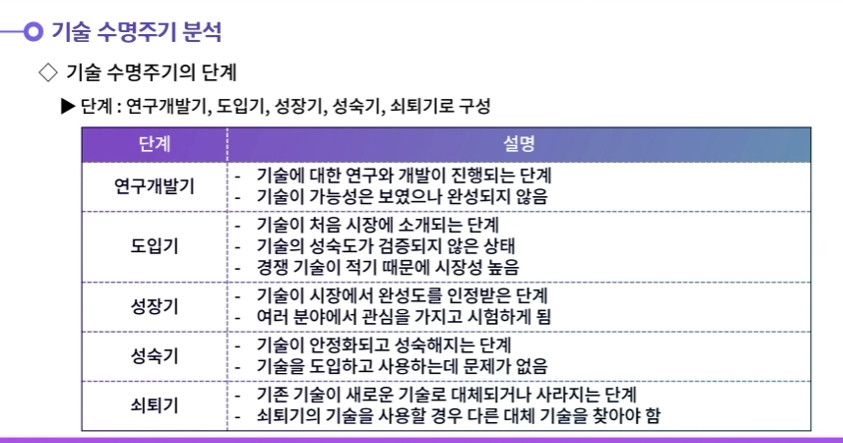

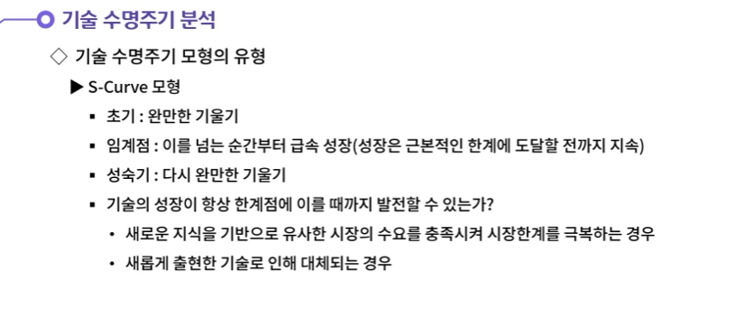

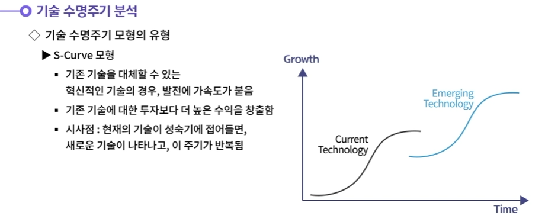

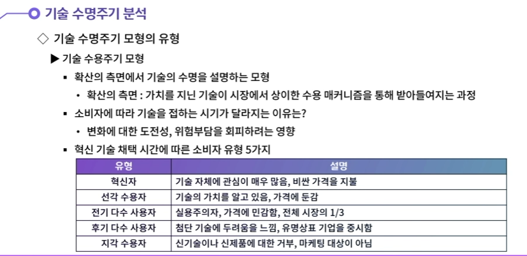

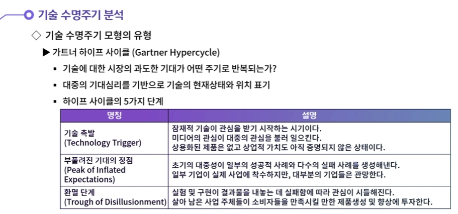

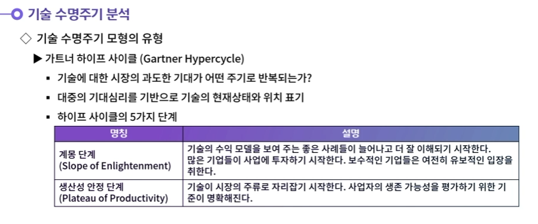

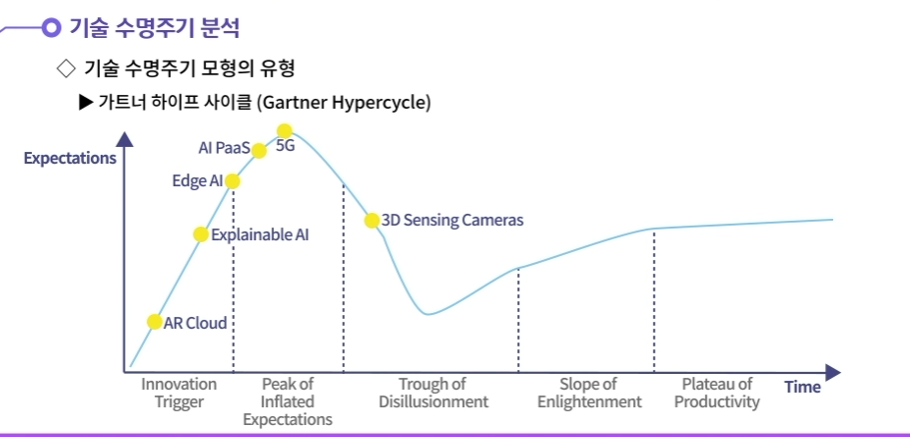

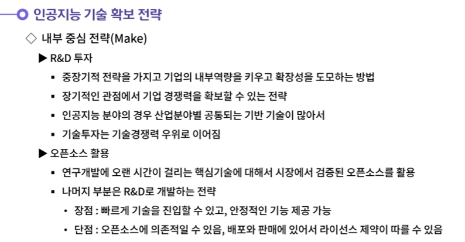

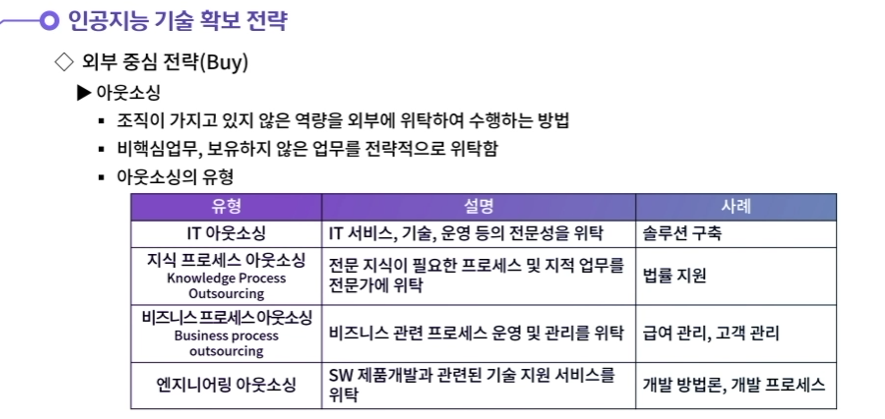

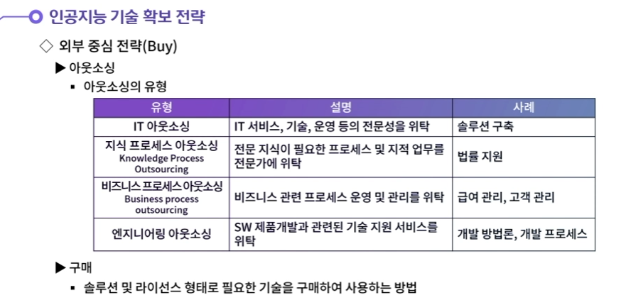

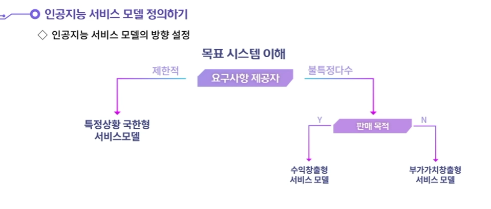

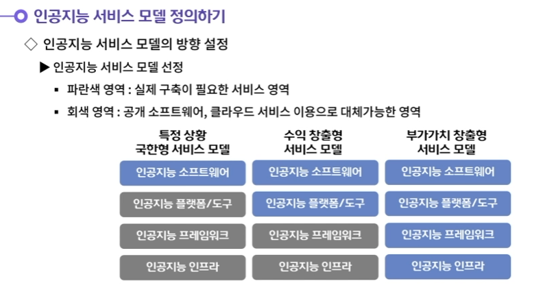

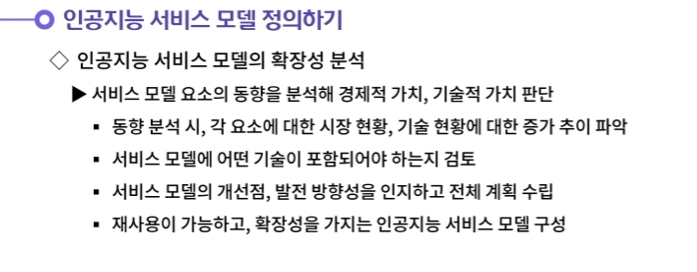

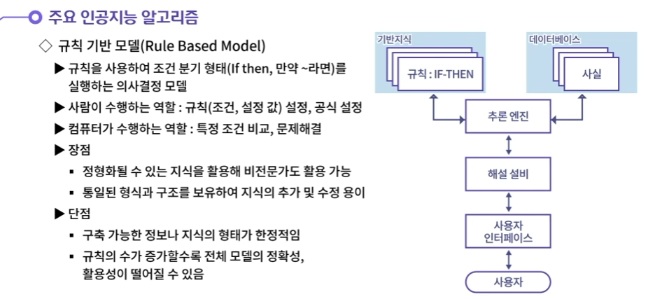

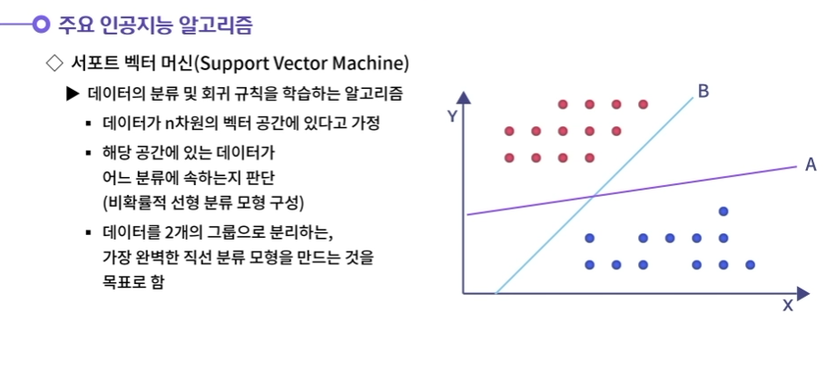

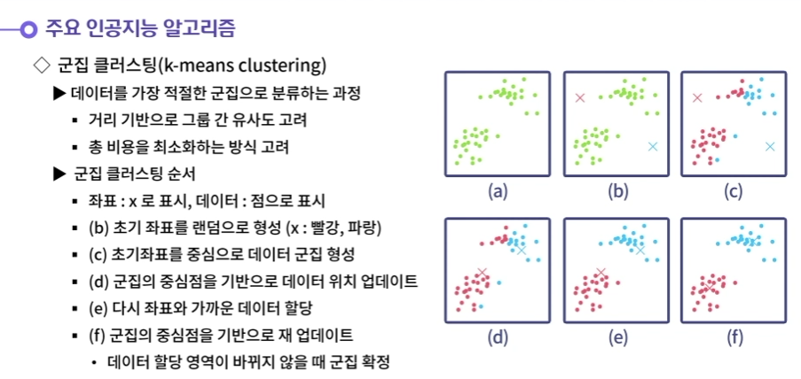

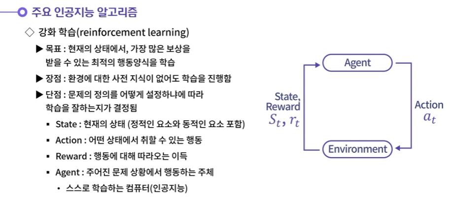

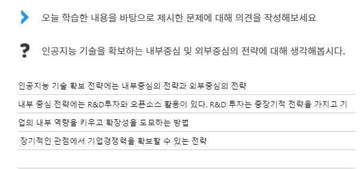

- **인공지능 기술 확보 전략에는 내부중심의 전략(Make)과 외부중심의 전략(Buy)가 있다.**
  **내부 중심 전략에는 R&D투자와 오픈소스 활용이 있다. R&D 투자는 중장기적 전략을 가지고 기업의 내부 역량을 키우고 확장성을 도모하는 방법이다. 장기적인 관점에서 기업경쟁력을 확보할 수 있는 전략이다. 오픈소스 활용은 연구개발에 오랜 시간이 걸리는 핵심기술에 대해서는 오픈소스를 활용하고, 나머지 부분은 내부 R&D투자로 개발하는 전략이다. 오픈소스의 장점은 빠르게 기술을 진입할 수 있고 안정적인 기능을 제공할 수 있다는 점이다. 반면에 오픈소스에 의존적일 수 있고, 배포와 판매에 있어서 라이선스 제약이 따를 수 있다.**
  **외부 중심의 전략에는 아웃소싱과 구매가 있다. 아웃소싱은 전략적 목표 하에 조직이 가지고 있지 않은 역량을 외부에 위탁하여 수행하는 방법이다. 기업의 핵심업무에 집중하기 위해서 비핵심업무를 위탁하거나 보유하지 않은 업무를 전략적으로 위탁하는 것이다. 구매는 필요한 기술이나 기능을 솔루션 및 라이선스형태로 구매하여 사용하는 방법이다. 이미 기술력을 가지고 있는 기업이나 연구기관에서 구매할 수 있다.**

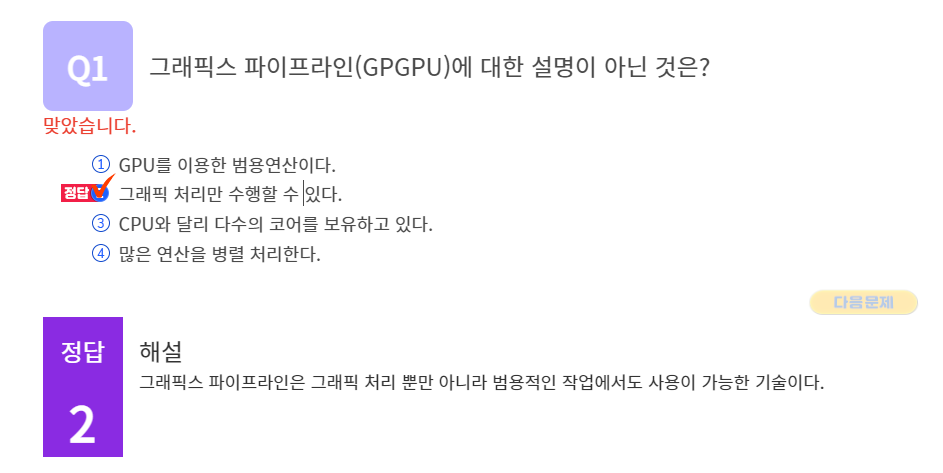

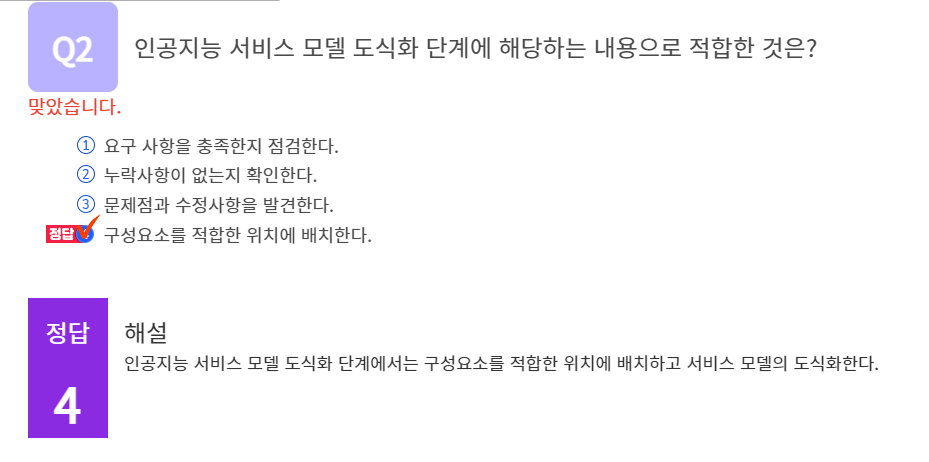

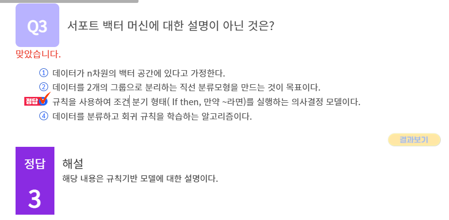

#### 1. 인공지능 기술을 확보하는 내부중심 및 외부중심의 전략에 대해 생각해봅시다.

1. 인공지능 기술 확보 전략에는 내부중심의 전략(Make)과 외부중심의 전략(Buy)가 있다.
   내부 중심 전략에는 R&D투자와 오픈소스 활용이 있다. R&D 투자는 중장기적 전략을 가지고 기업의 내부 역량을 키우고 확장성을 도모하는 방법이다. 장기적인 관점에서 기업경쟁력을 확보할 수 있는 전략이다. 오픈소스 활용은 연구개발에 오랜 시간이 걸리는 핵심기술에 대해서는 오픈소스를 활용하고, 나머지 부분은 내부 R&D투자로 개발하는 전략이다. 오픈소스의 장점은 빠르게 기술을 진입할 수 있고 안정적인 기능을 제공할 수 있다는 점이다. 반면에 오픈소스에 의존적일 수 있고, 배포와 판매에 있어서 라이선스 제약이 따를 수 있다.
   외부 중심의 전략에는 아웃소싱과 구매가 있다. 아웃소싱은 전략적 목표 하에 조직이 가지고 있지 않은 역량을 외부에 위탁하여 수행하는 방법이다. 기업의 핵심업무에 집중하기 위해서 비핵심업무를 위탁하거나 보유하지 않은 업무를 전략적으로 위탁하는 것이다. 구매는 필요한 기술이나 기능을 솔루션 및 라이선스형태로 구매하여 사용하는 방법이다. 이미 기술력을 가지고 있는 기업이나 연구기관에서 구매할 수 있다.