## 16.인공지능서비스시나리오요소정의하기

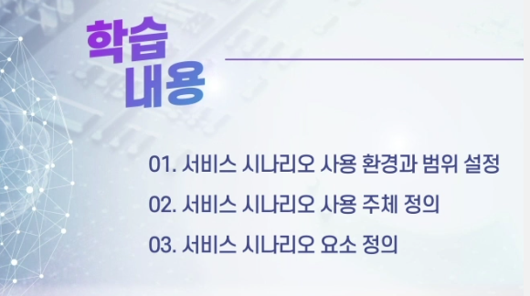

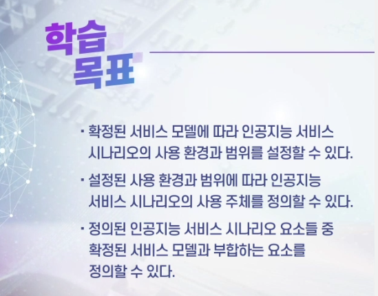

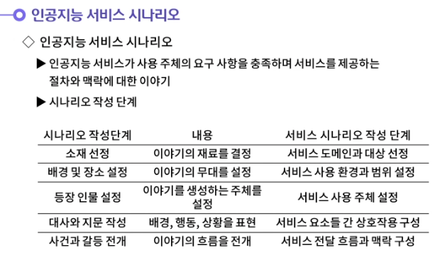

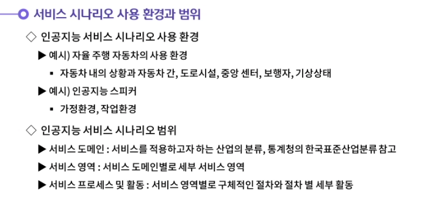

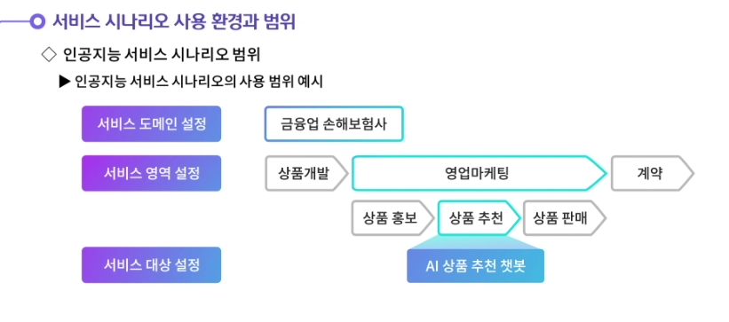

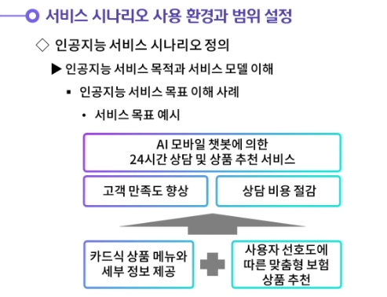

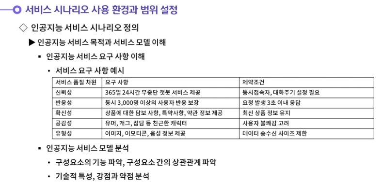

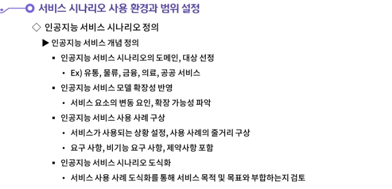

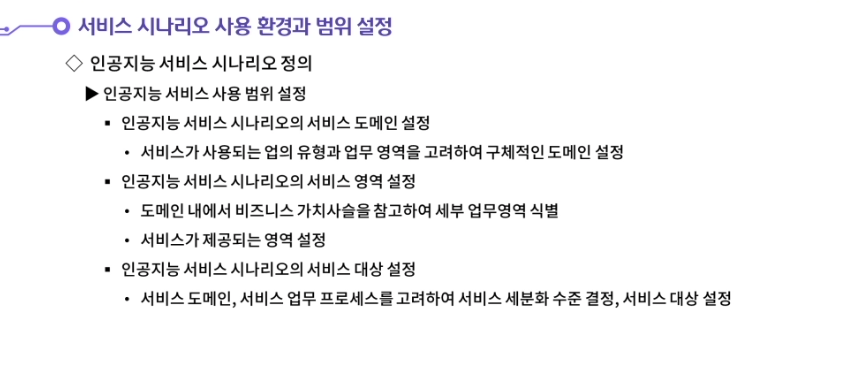

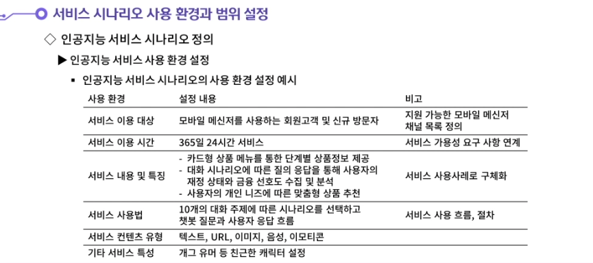

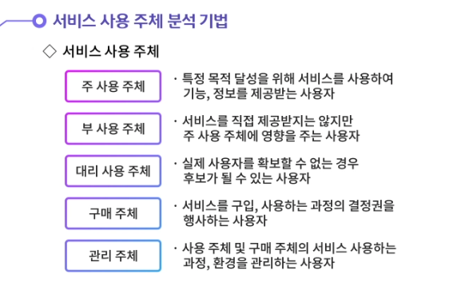

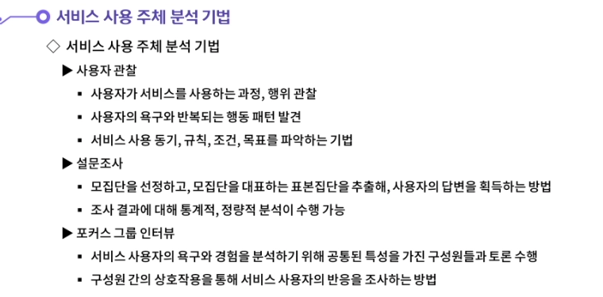

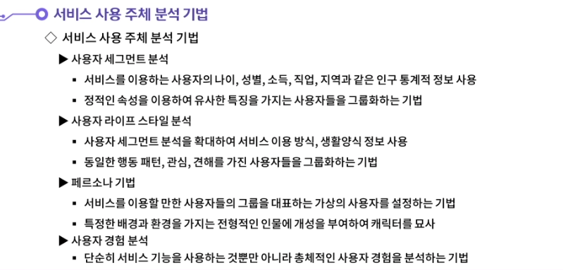

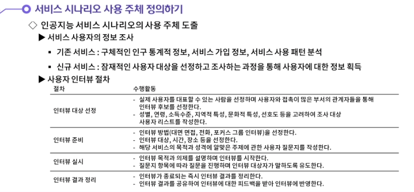

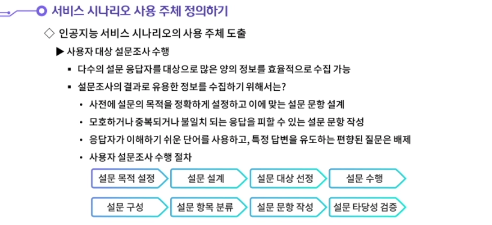

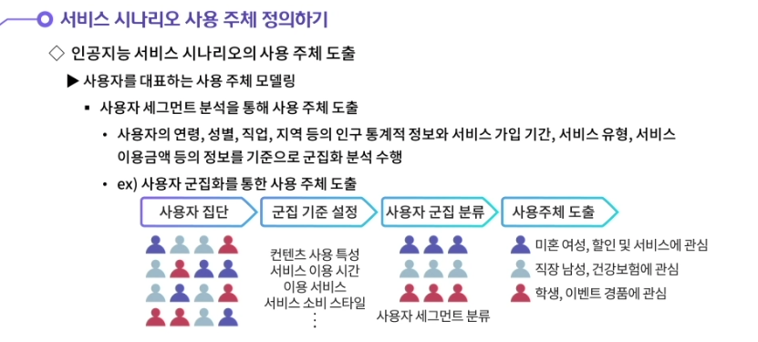

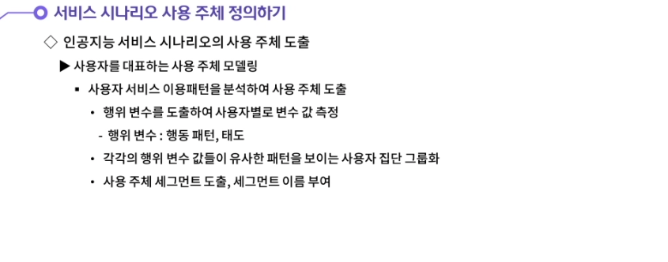

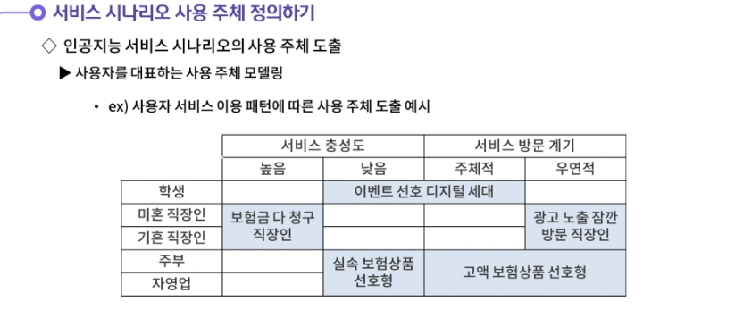

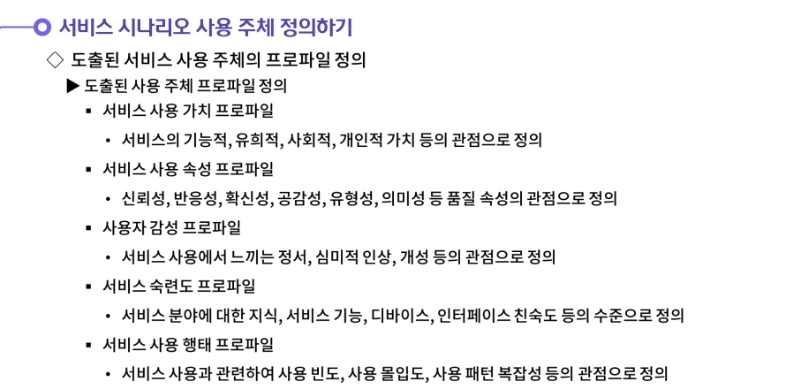

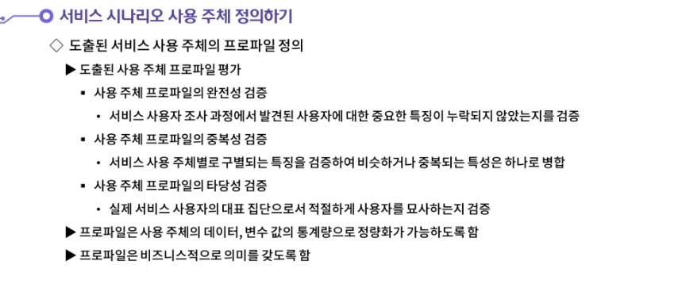

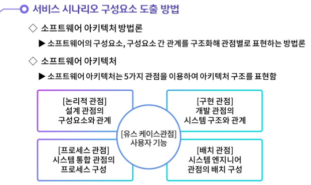

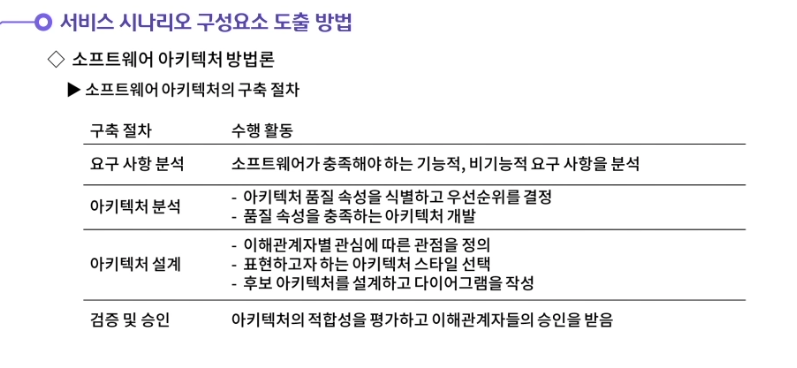

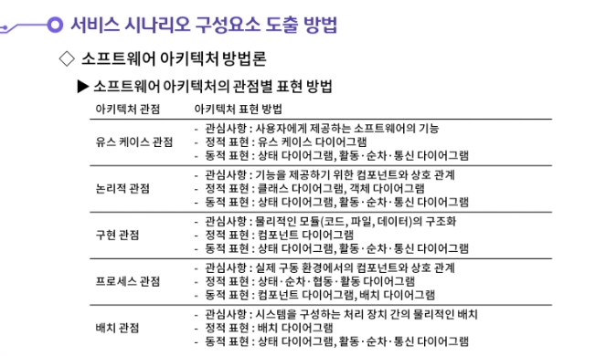

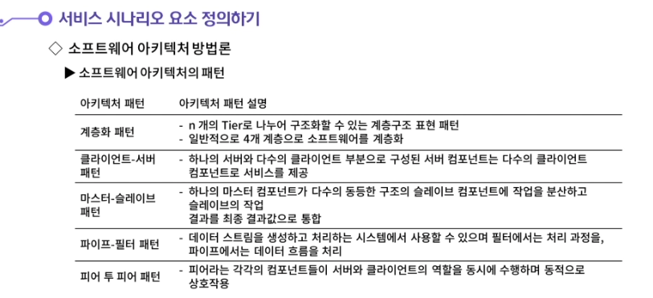

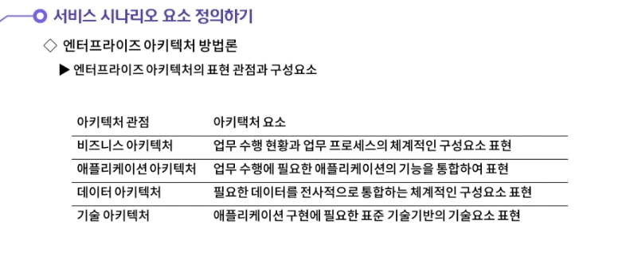

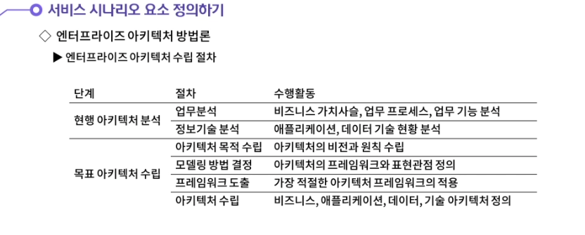

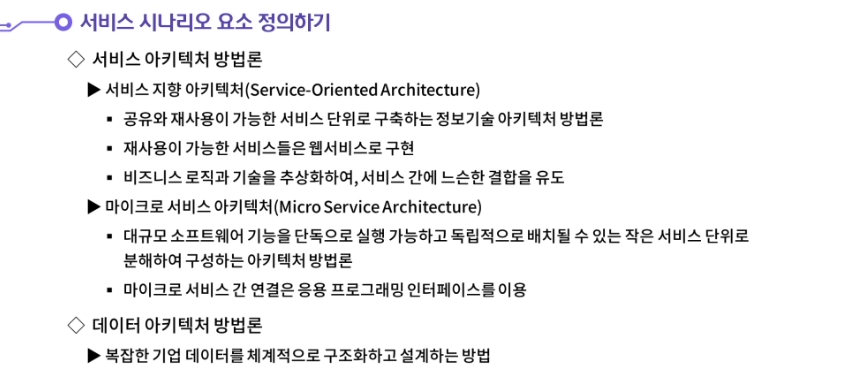

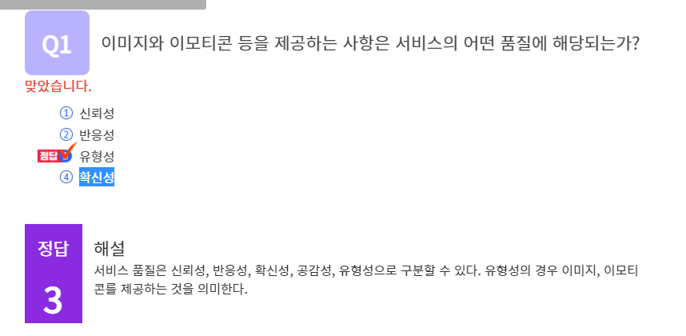

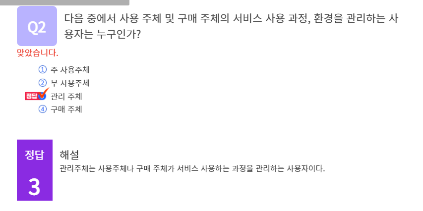

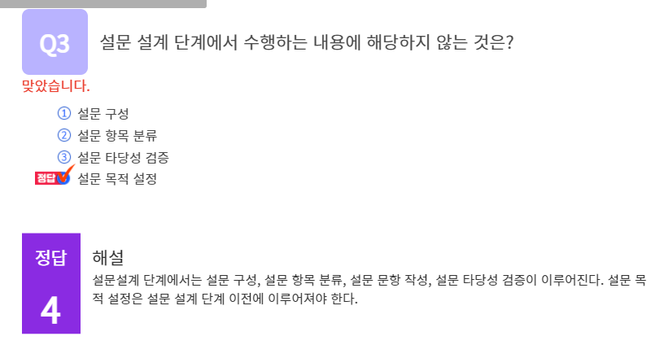

#### 1. 시나리오 작성 단계에 대해 생각해봅시다.

1. 시나리오의 작성 단계에 서비스 시나리오 작성을 대입해보면 다음과 같다.

   첫번째, 소재 선정 단계이다. 소재 선정 단계에서는 이야기의 재료를 결정한다. 서비스 시나리오에서 소재 선정이란 서비스 도메인과 서비스 대상을 선정하는 것이라고 할 수 있다.
   두번째, 배경 및 장소 설정 단계이다. 배경 및 장소 설정단계에서는 이야기의 무대를 설정한다. 서비스 시나리오에서 배경과 장소 설정이란 서비스 사용 환경과 범위 설정이라고 할 수 있다.
   세번째, 등장인물 설정 단계이다. 등장 인물 설정단계에서는 이야기를 생성하는 주체를 설정한다. 서비스 시나리오에서 등장 인물 설정이란 서비스 사용 주체 설정이라고 할 수 있다.
   네번째, 대사와 지문 작성 단계이다. 대사와 지문 작성단계에서는 배경, 행동, 상황을 표현한다. 서비스 시나리오에서 대사와 지문 작성이란 서비스 요소들 간 상호작용이라고 할 수 있다.
   다섯 번째, 사건과 갈등 전개 단계이다. 사건과 갈등 전개단계에서는 이야기의 흐름을 전개한다. 서비스 시나리오에서 사건과 갈등전개란 서비스 전달 흐름과 맥락 구성이라고 할 수 있다.

