## 17.인공지능서비스시나리오작성하기

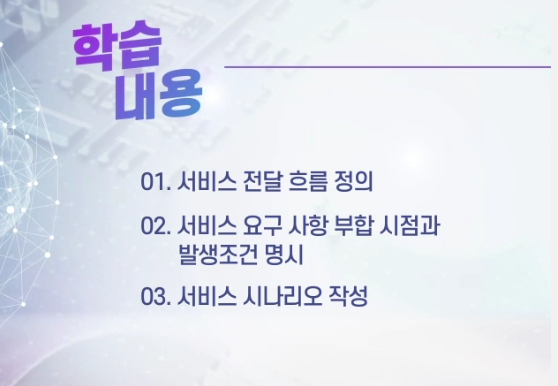

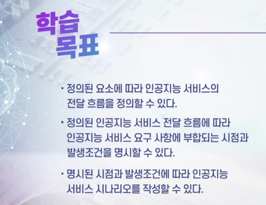

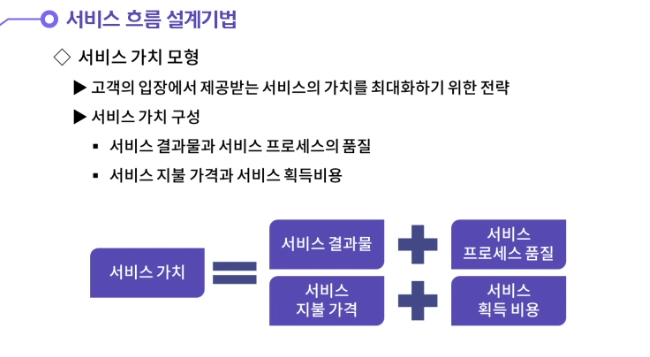

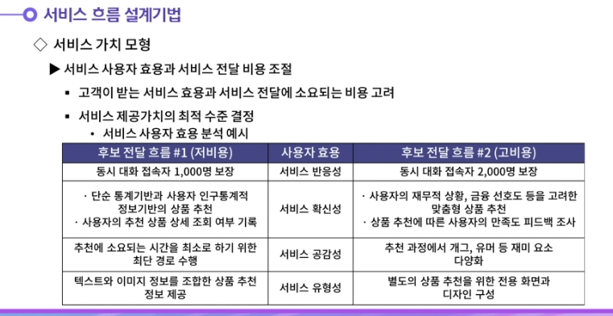

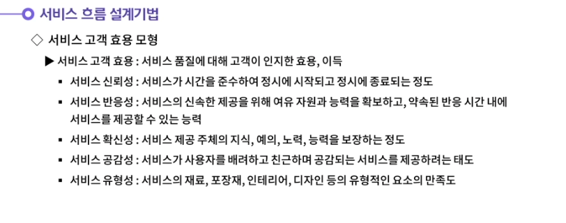

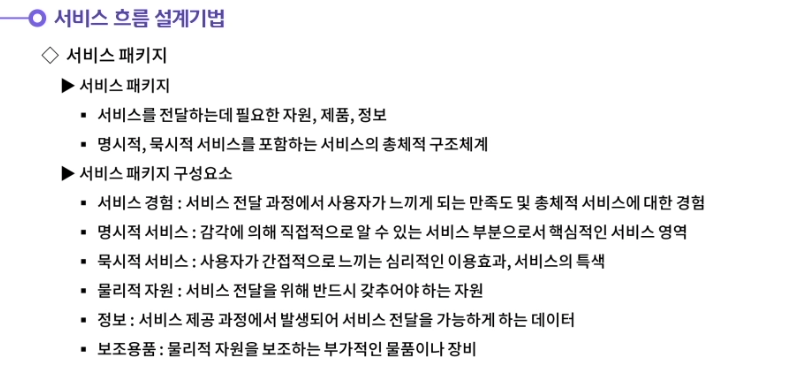

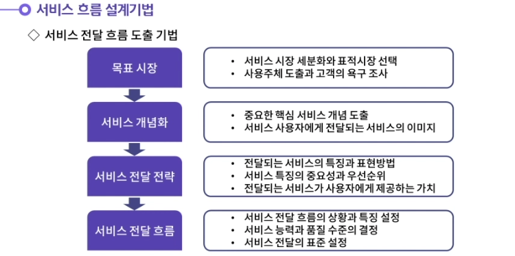

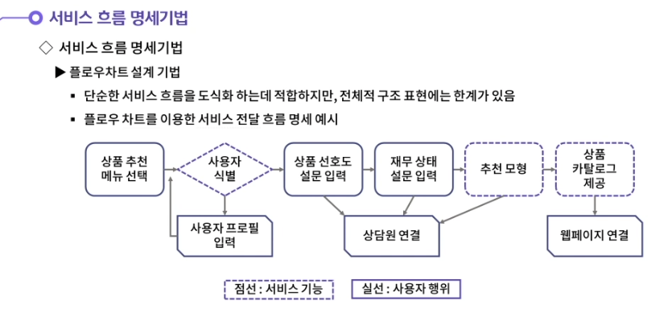

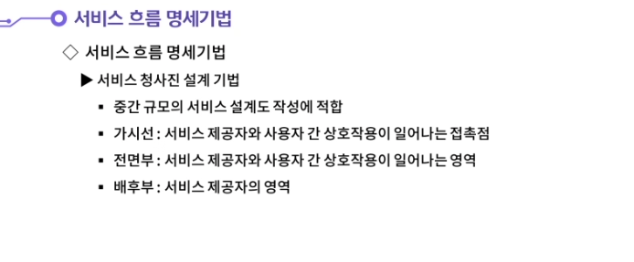

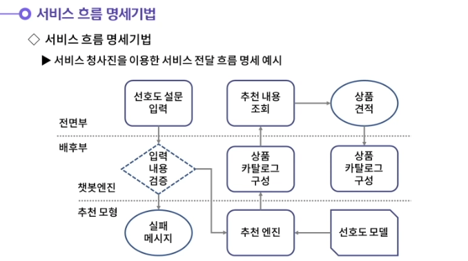

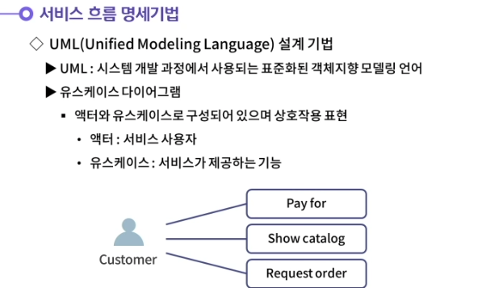

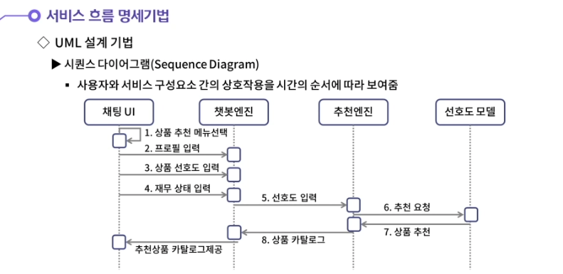

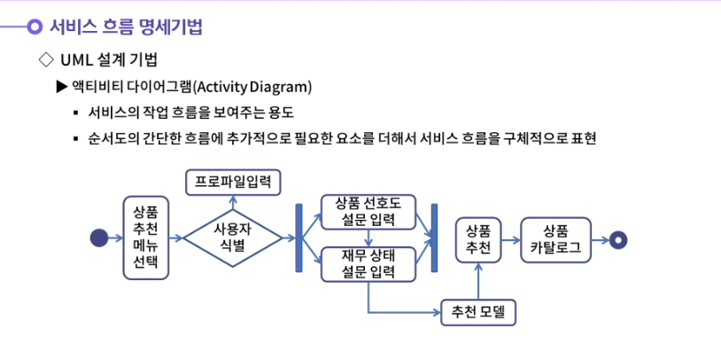

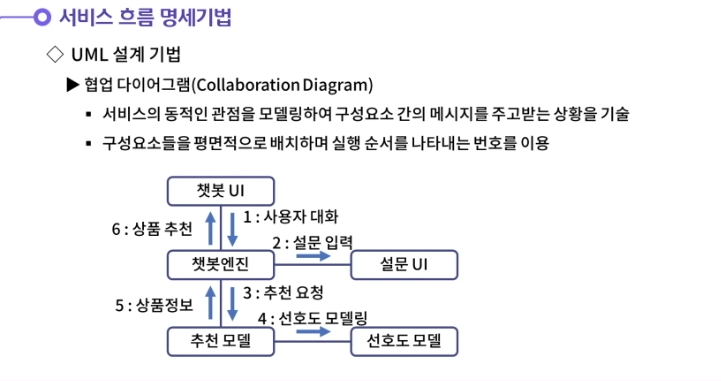

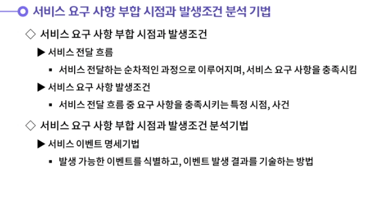

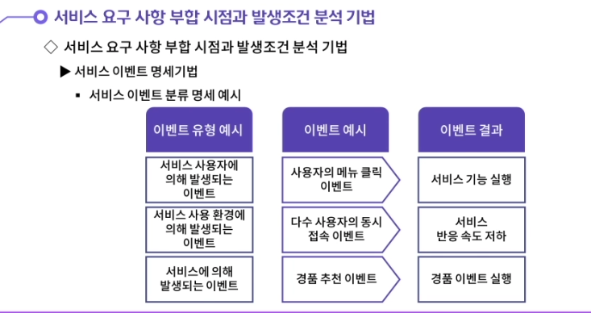

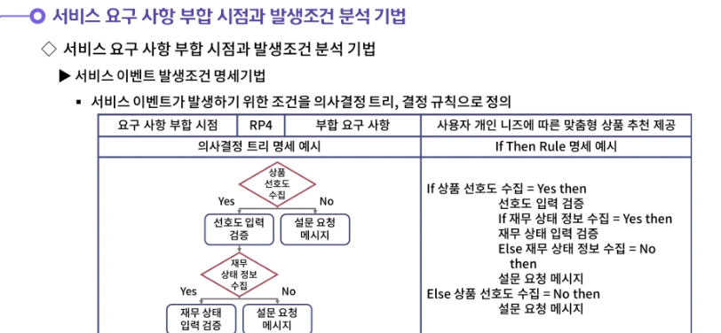

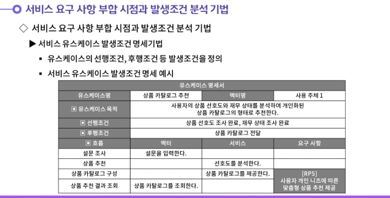

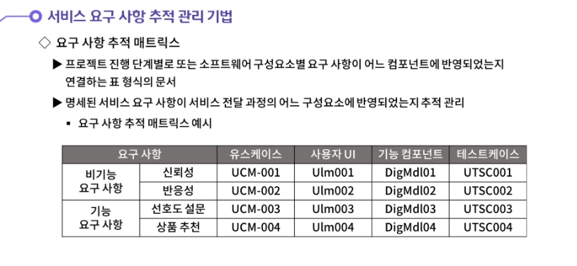

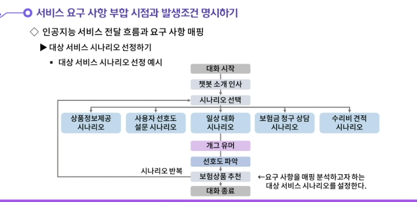

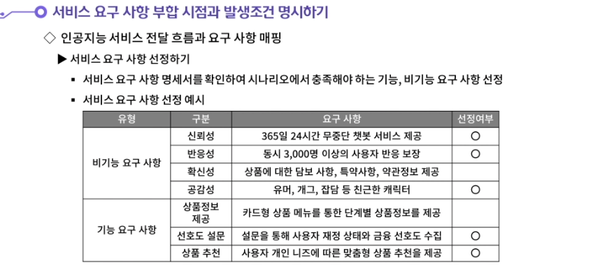

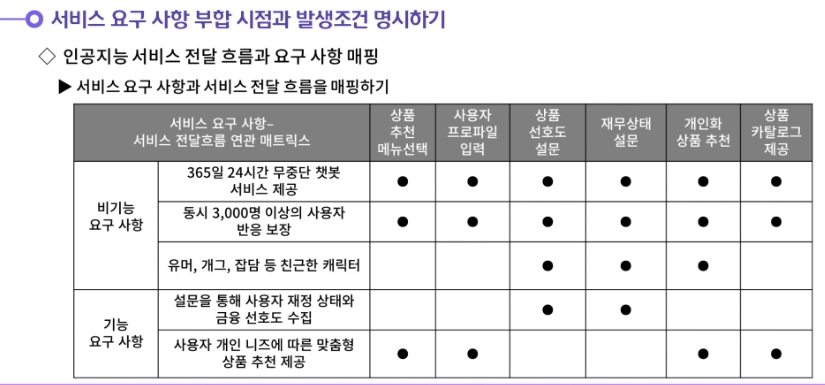

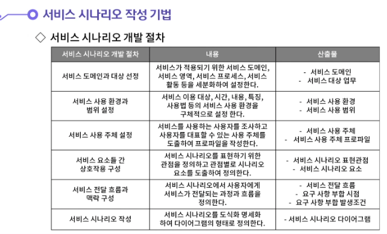

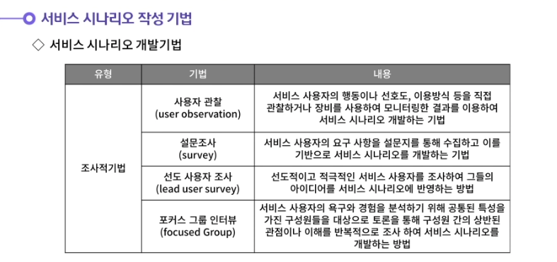

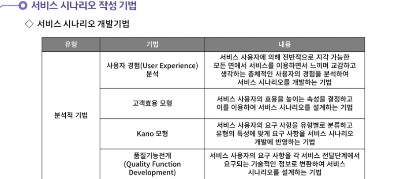

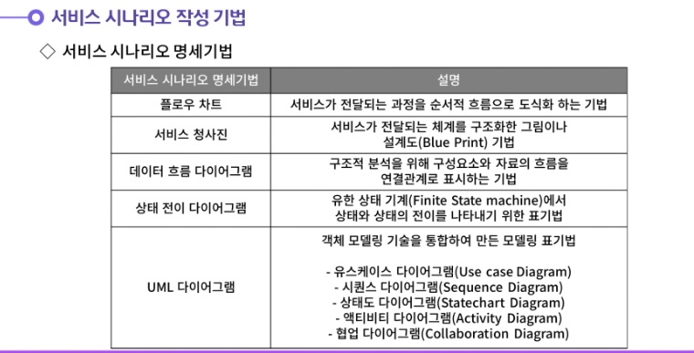

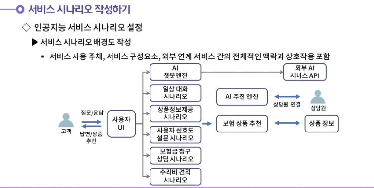

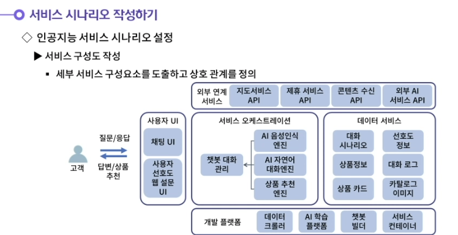

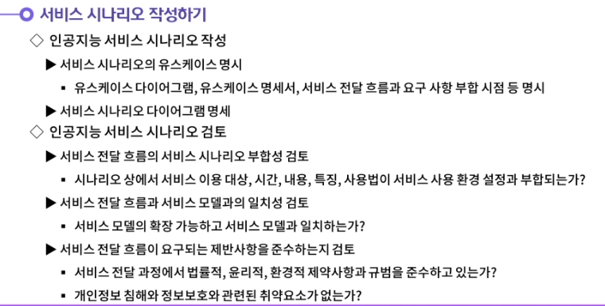

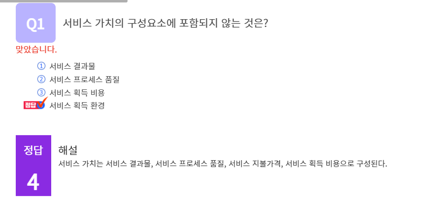

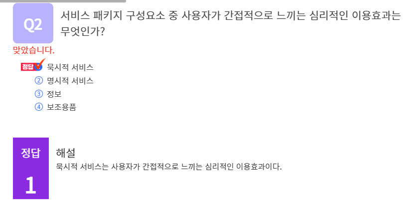

#### 1. 서비스 고객 효용과 서비스 품질의 5가지 차원에 대해 생각해봅시다.

1. 서비스 고객 효용이란 서비스 품질에 대해 고객이 인지한 효용이나 이득을 의미한다. 전통적으로 서비스 품질의 5가지 차원의 관점으로 고객의 효용을 분석한다.
   첫번째는 서비스 신뢰성이다. 서비스가 시간을 준수하여 정시에 시작되고 정시에 종료되는 신뢰 정도를 의미한다.
   두번째는 서비스 반응성이다. 서비스의 신속한 제공을 위해 여유 자원과 능력을 확보하여 약속된 반응 시간 내에 서비스를 제공할 수 있는 능력이다.
   세번째는 서비스 확신성이다. 서비스 제공을 위한 종업원이나 소프트웨어와 같은 서비스 제공 주체의 지식, 예의, 노력, 능력을 보장하는 정도이다.
   네번째는 서비스 공감성이다. 서비스가 사용자를 배려하고 친근하며 공감되는 서비스를 제공하려는 태도를 의미한다.
   다섯 번째는 서비스 유형성이다. 서비스의 재료, 포장재, 인테리어, 디자인 등의 유형적인 요소의 만족도를 의미한다.