## 18.인공지능서비스시나리오타당성검증하기

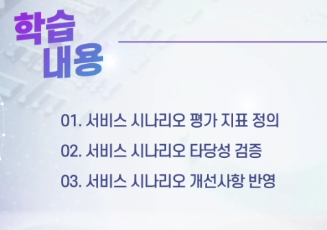

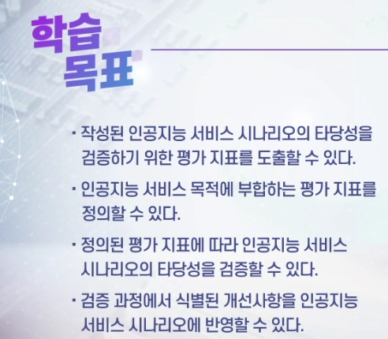

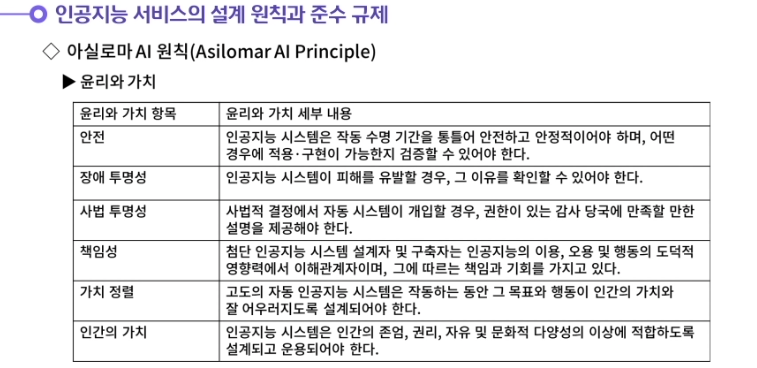

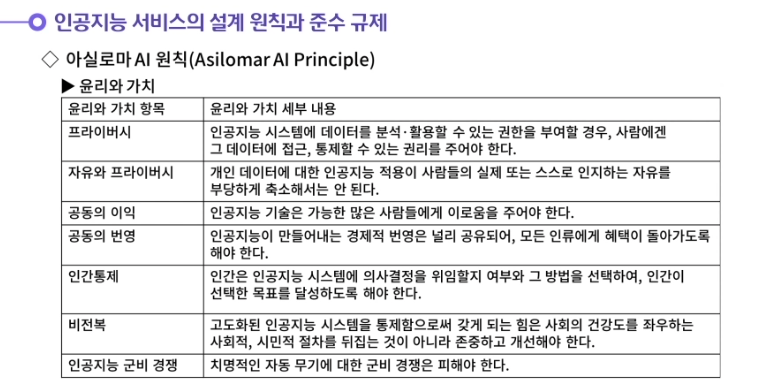

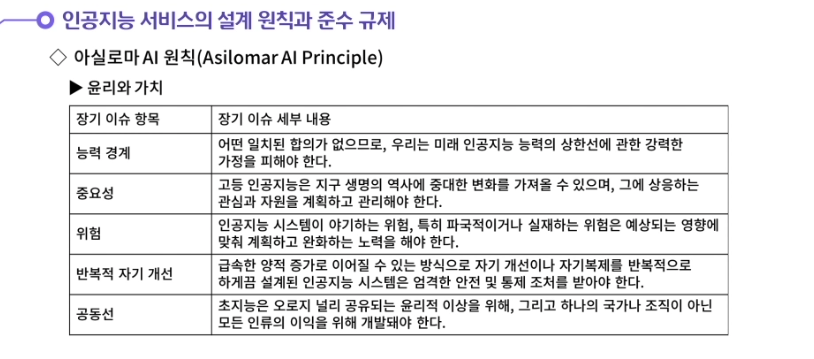

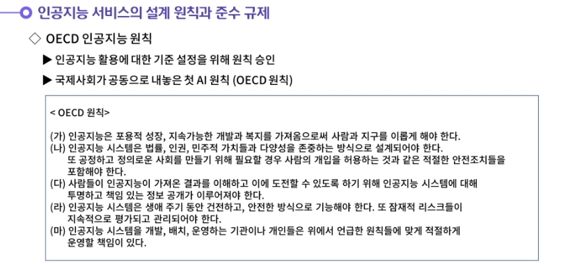

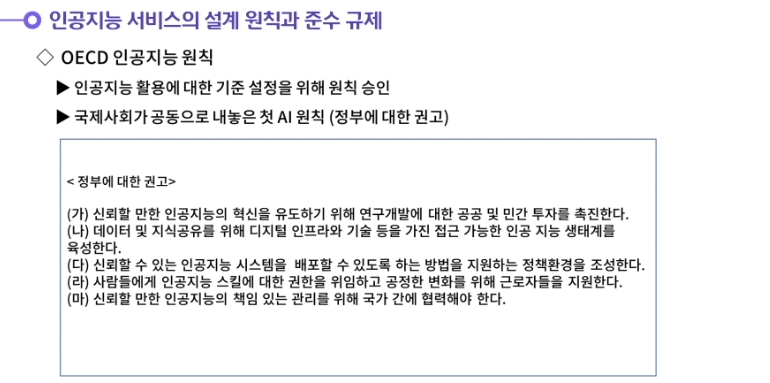

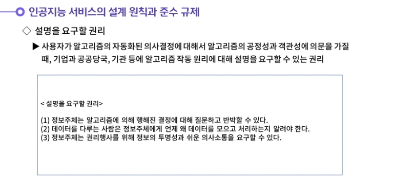

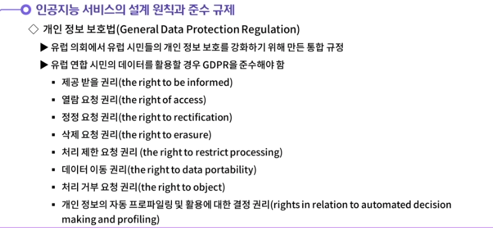

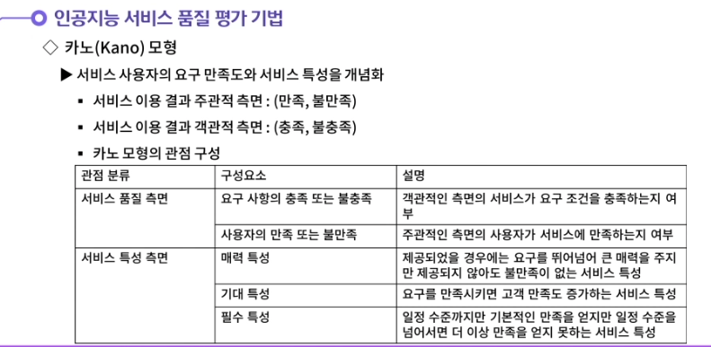

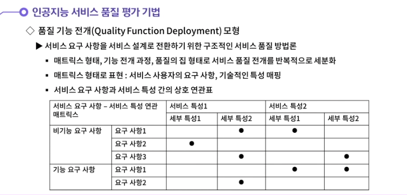

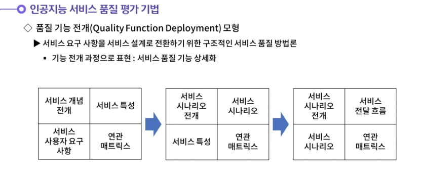

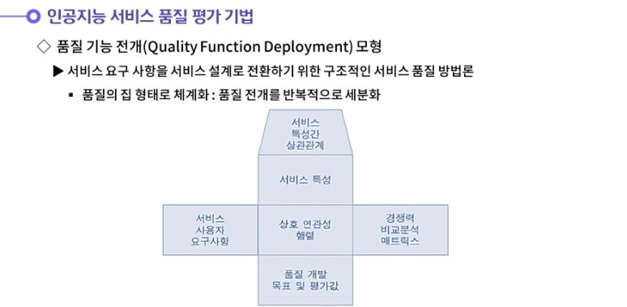

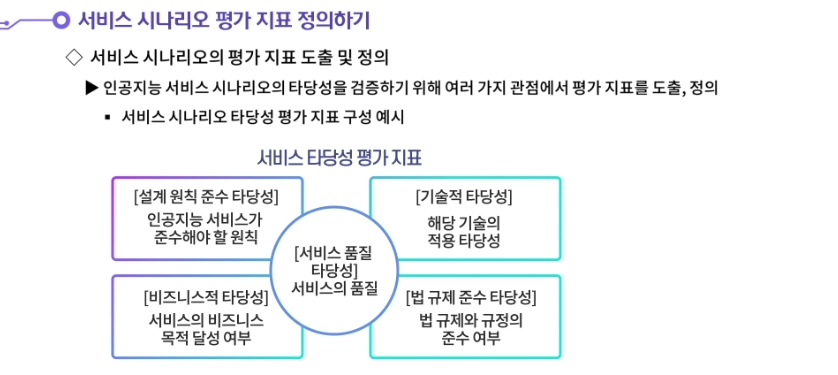

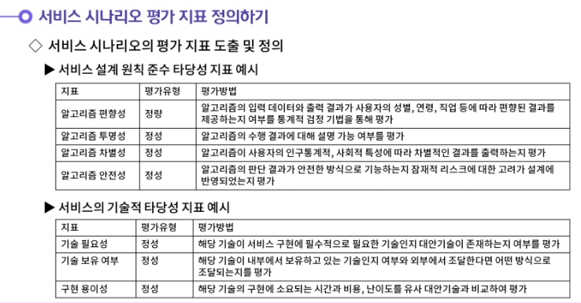

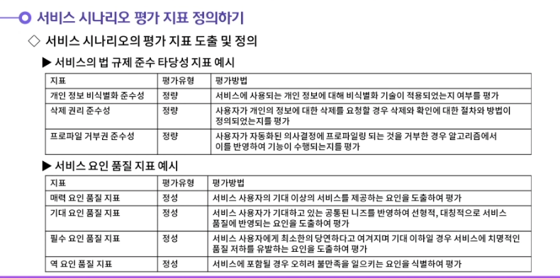

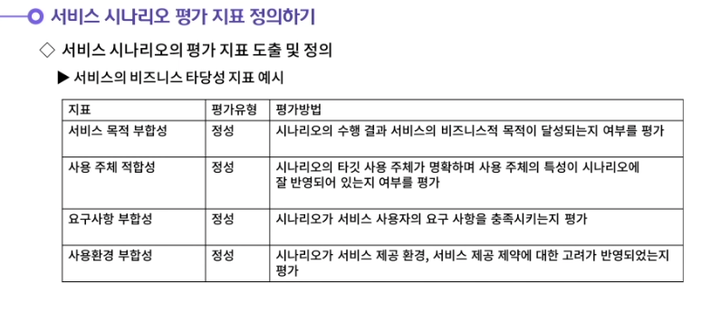

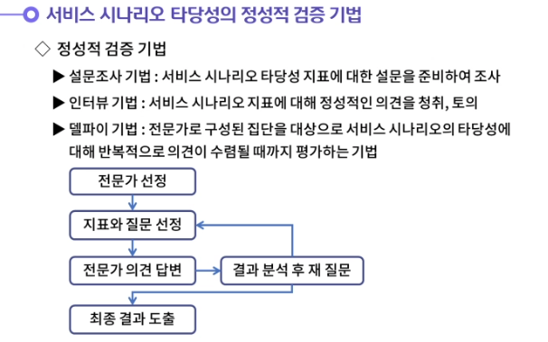

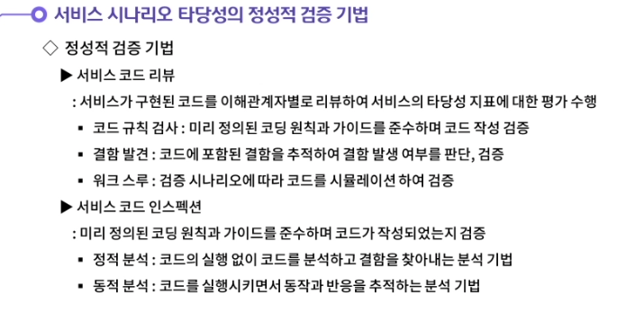

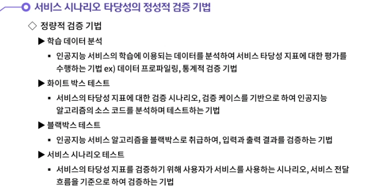

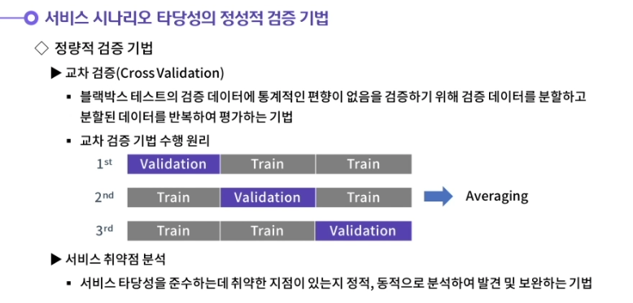

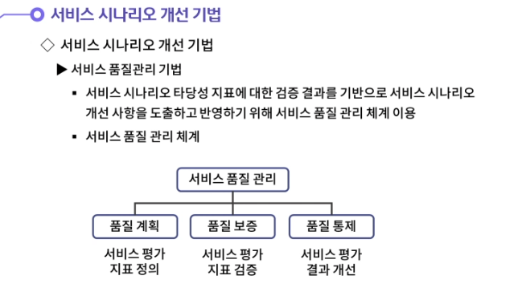

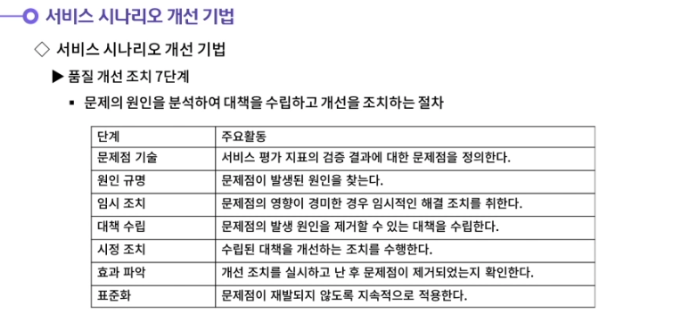

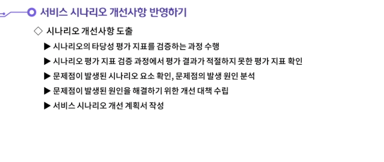

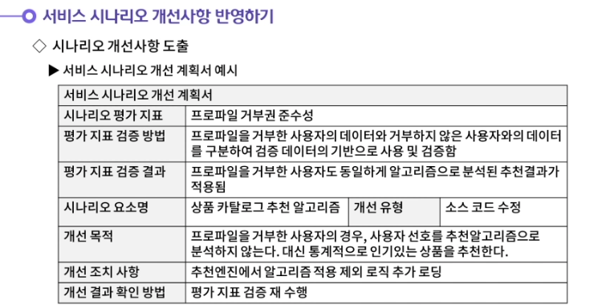

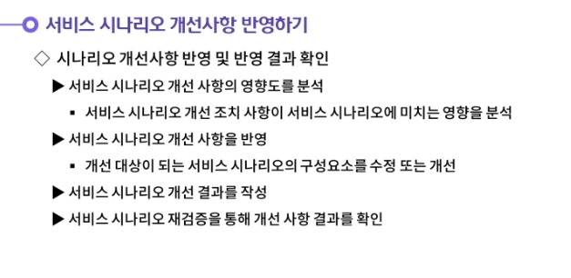

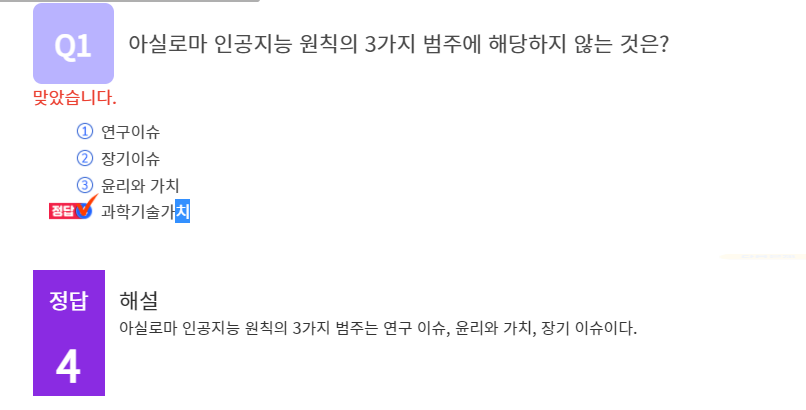

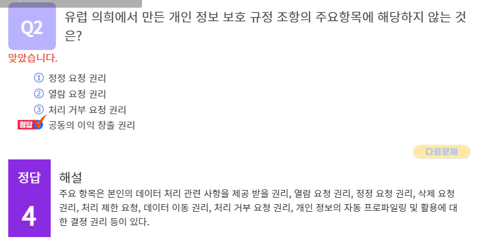

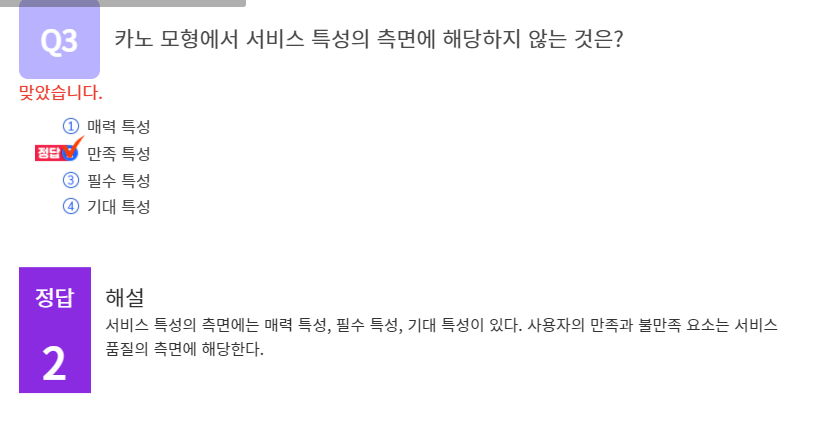

#### 1. 서비스 시나리오 타당성의 정성적 검증 기법에 대해 생각해봅시다.

1. 정성적 검증 기법이란 분석가의 경험이나 지식에 근거하여 주관적 판단에 의해 검증하는 것이다. 대표적인 정성적 검증 기법은 5가지 유형이 존재한다.
   첫번째는 설문조사 기법이다. 설문조사 기법은 서비스 시나리오 타당성 지표에 대한 설문을 준비하여 조사하는 것이다.
   두번째는 인터뷰 기법이다. 서비스 시나리오 지표에 대해 정성적인 의견을 청취하고 토의하는 기법이다.
   세번째는 델파이 기법이다. 전문가로 구성된 집단을 대상으로 서비스 시나리오의 타당성에 대해 반복적으로 의견이 수렴될 때까지 평가하는 기법이다.
   네번째는 서비스 코드 리뷰이다. 서비스가 구현된 코드를 이해관계자별로 리뷰하여 서비스의 타당성 지표에 대한 평가를 수행하는 것이다.
   다섯 번째는 서비스 코드 인스펙션이다. 서비스 코드 인스펙션은 코드가 요구 사항, 설계명세에 적합하게 구현되었는지 오류가 존재하지 않는지 검증하는 코드 품질보증 기법에 해당한다.

