## 19.인공지능서비스활용방안분석하기

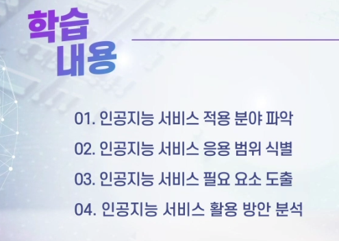

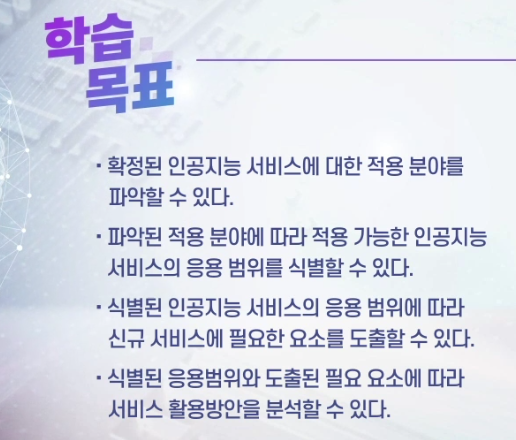

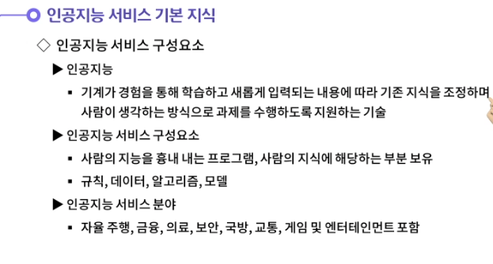

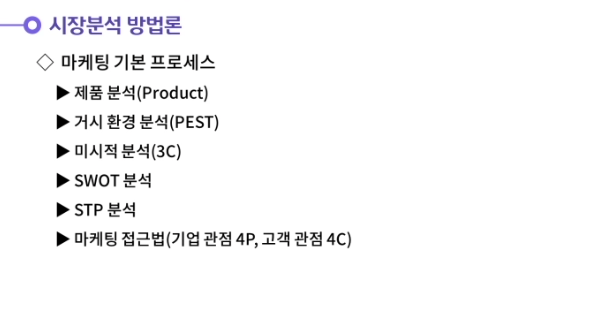

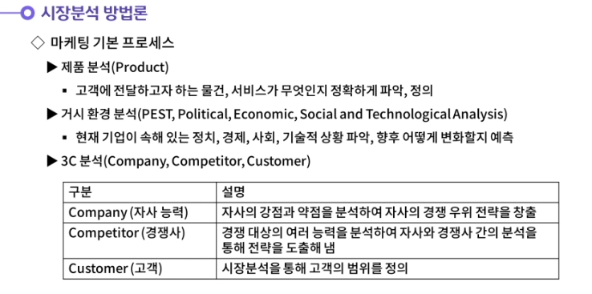

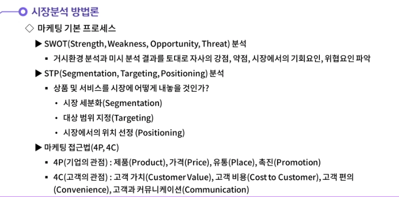

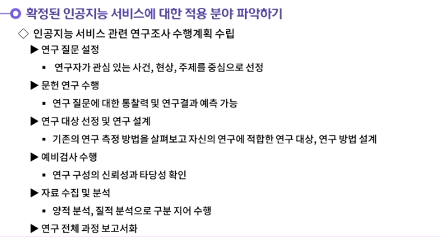

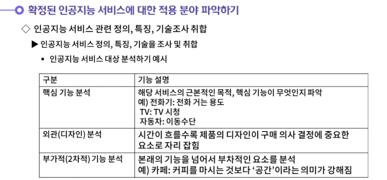

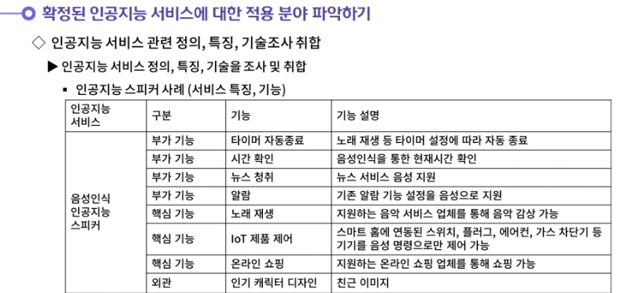

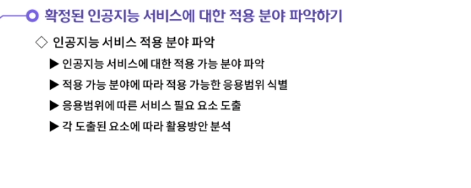

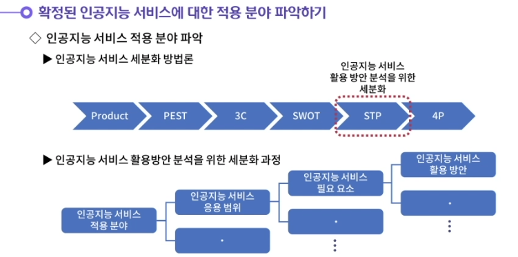

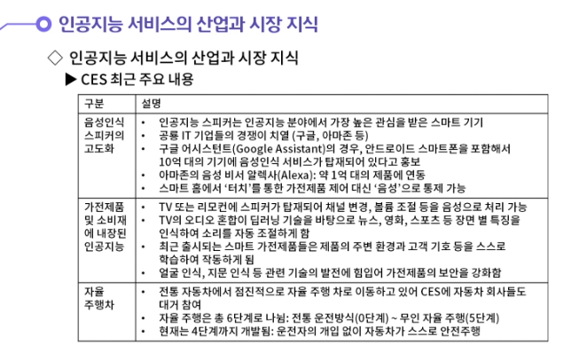

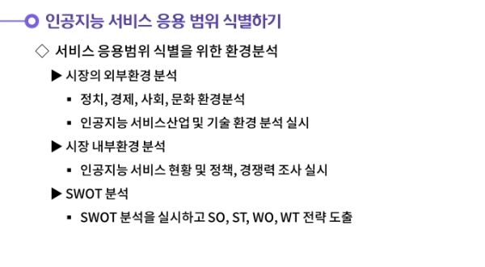

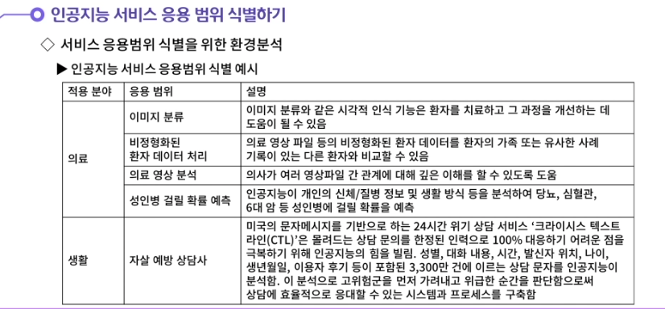

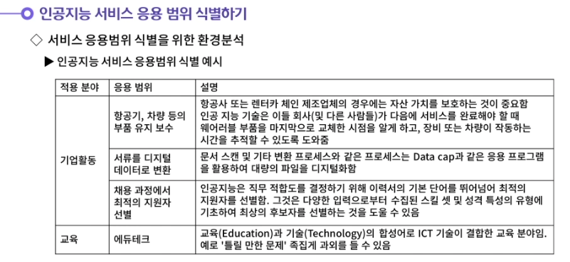

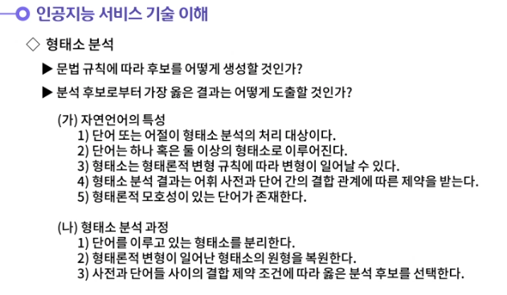

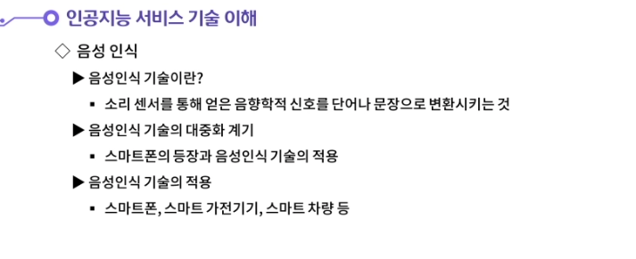

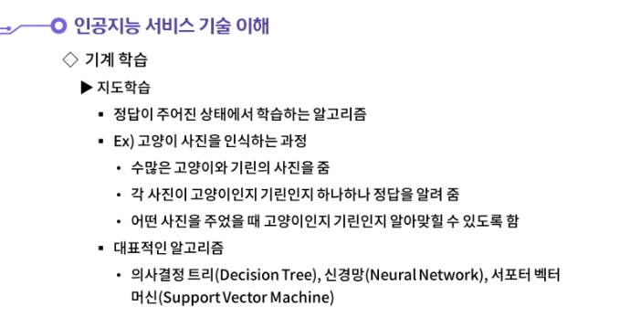

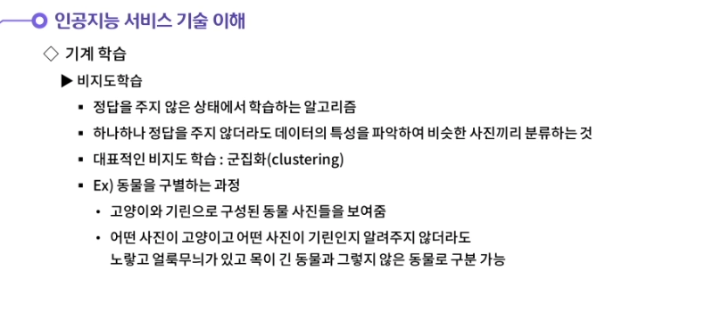

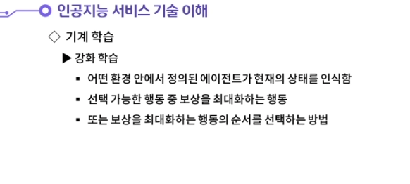

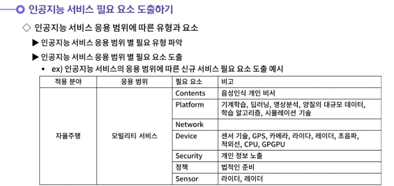

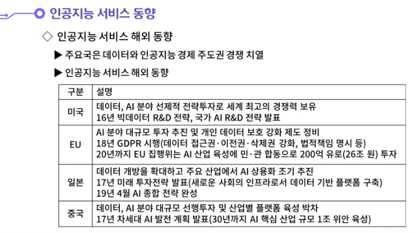

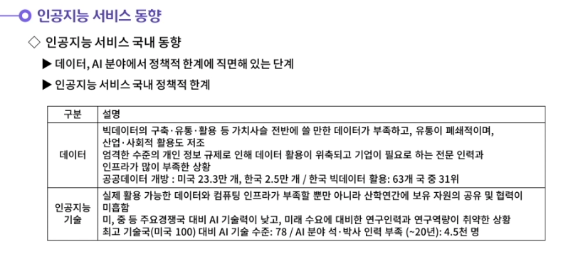

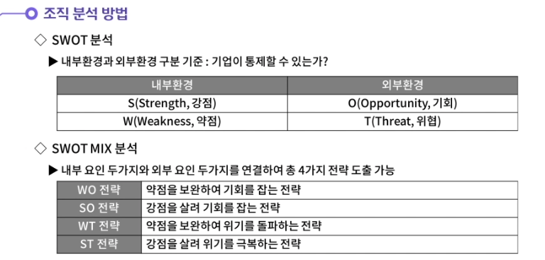

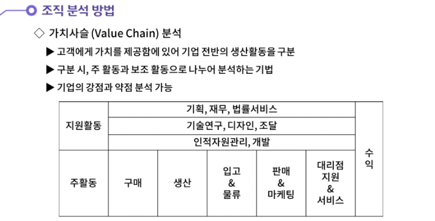

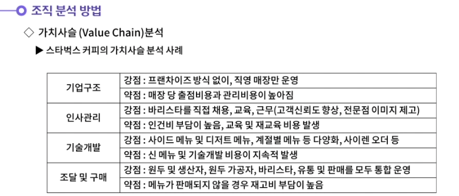

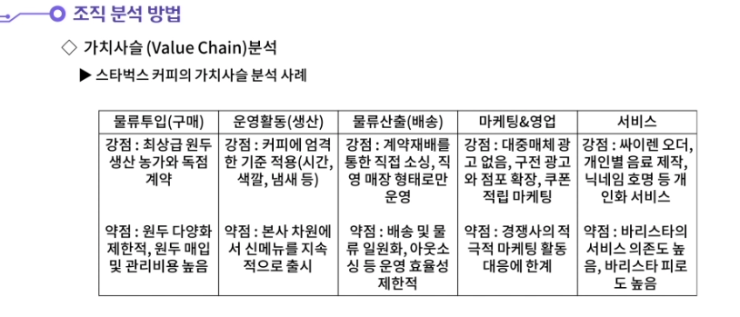

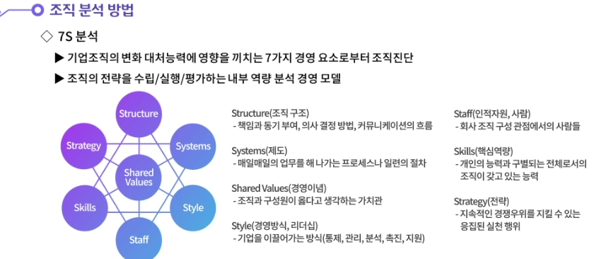

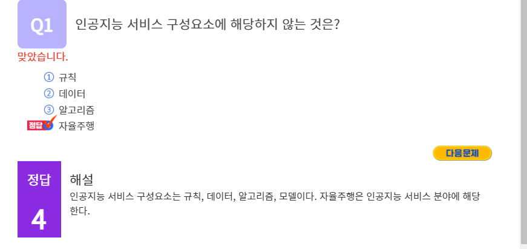

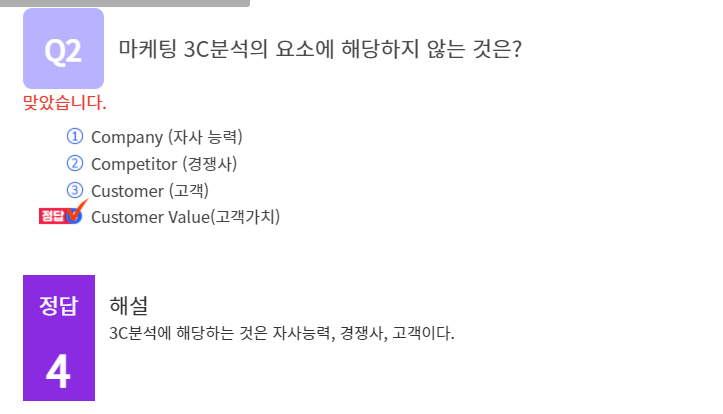

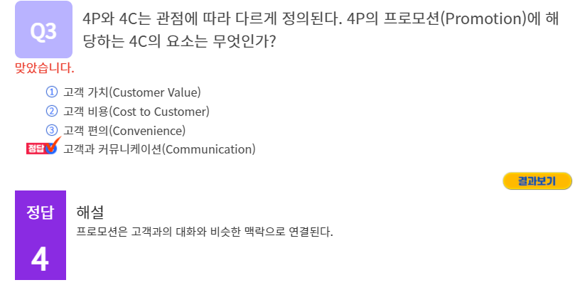

#### 1. SWOT분석과 SWOT MIX 분석에 대해 생각해봅시다.

1. SWOT분석을 활용하여 조직분석이 가능하다. SWOT분석은 내부환경에 해당하는 강점과 약점, 외부환경에 해당하는 기회요인과 위협요인을 찾는 것이다. SWOT분석을 수행하면, SWOT MIX분석이 가능하다. WO전략이란 약점을 보완하여 기회를 잡는 전략이다. SO전략이란 강점을 살려 기회를 잡는 전략이다. WT전략이란 약점을 보완하여 위기를 돌파하는 전략이다. ST전략이란 강점을 살려 위기를 극복하는 전략이다.