## 20.인공지능서비스비즈니스모델활용기획하기

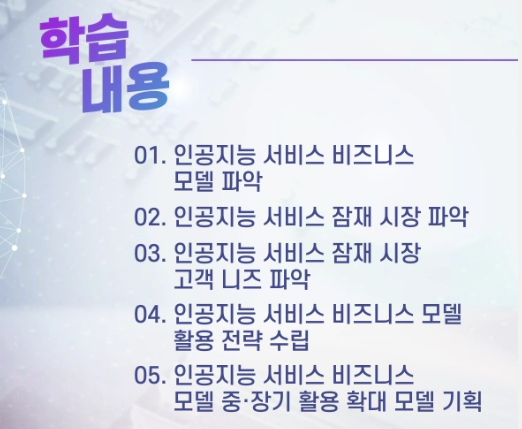

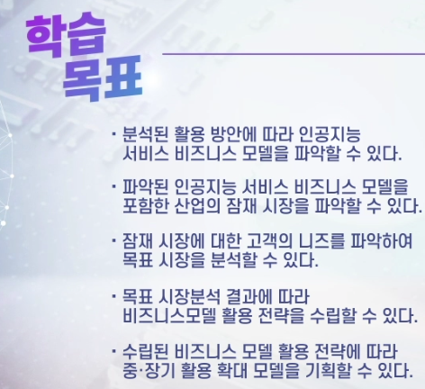

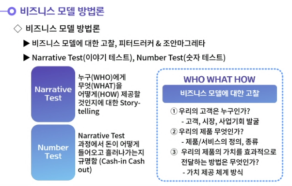

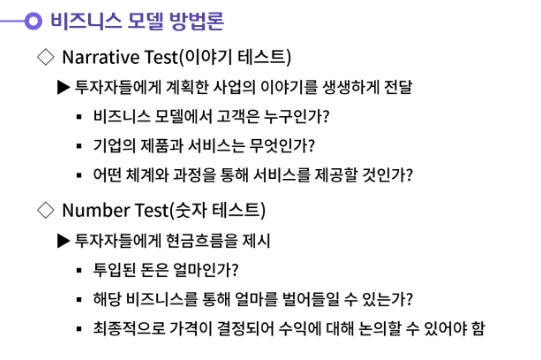

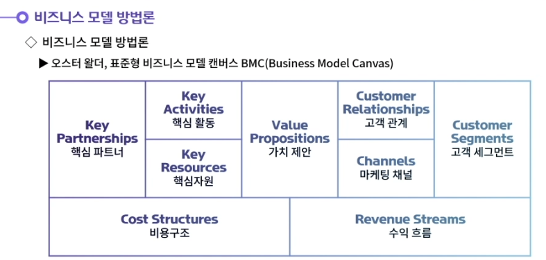

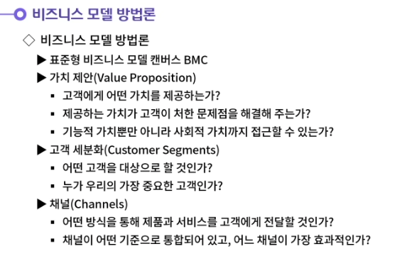

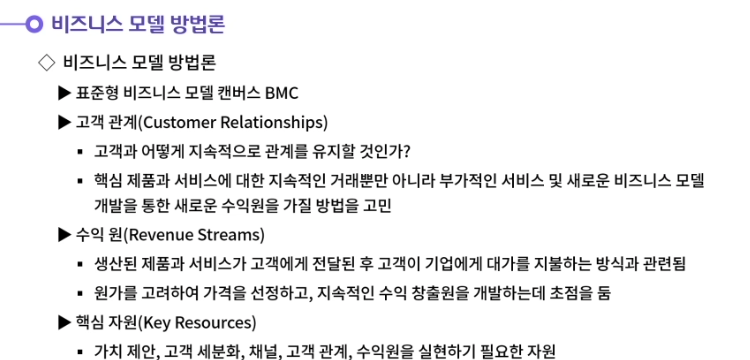

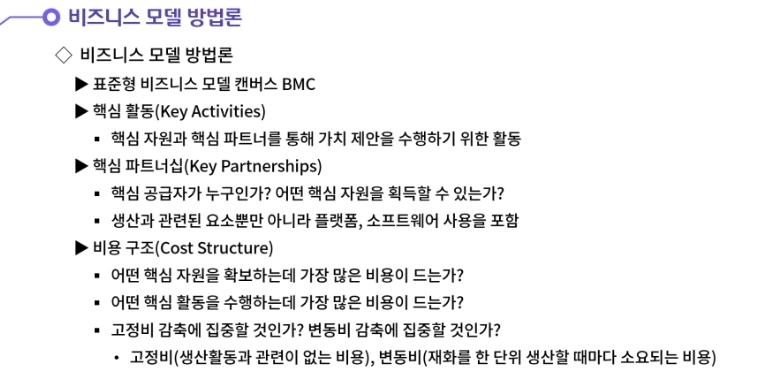

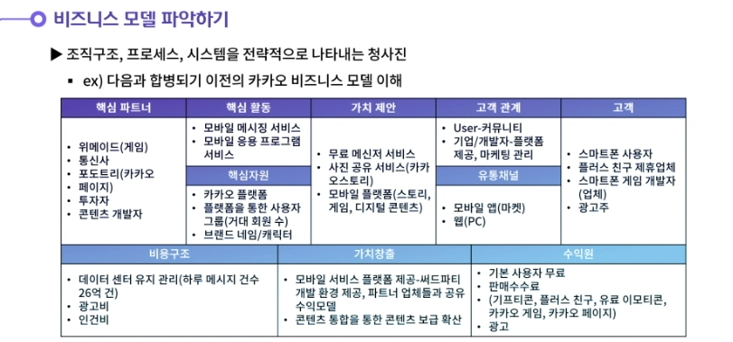

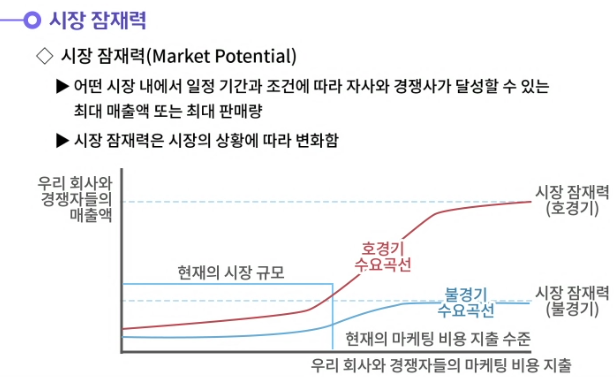

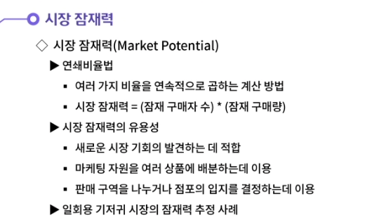

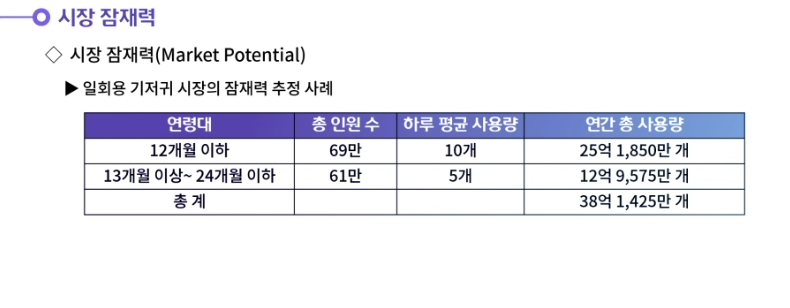

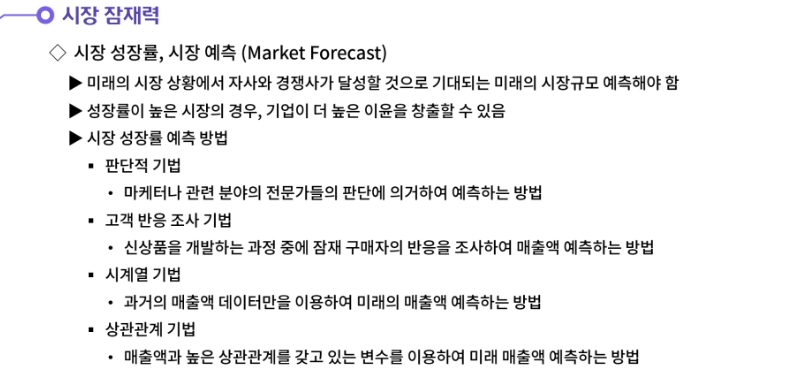

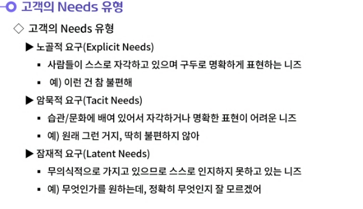

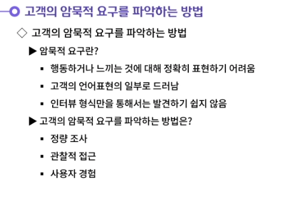

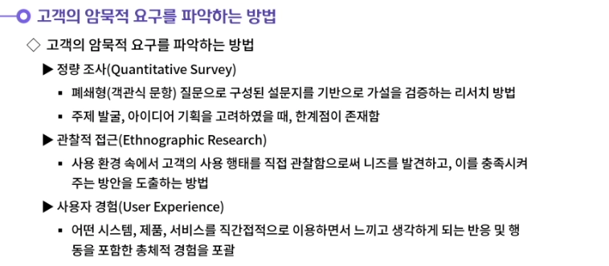

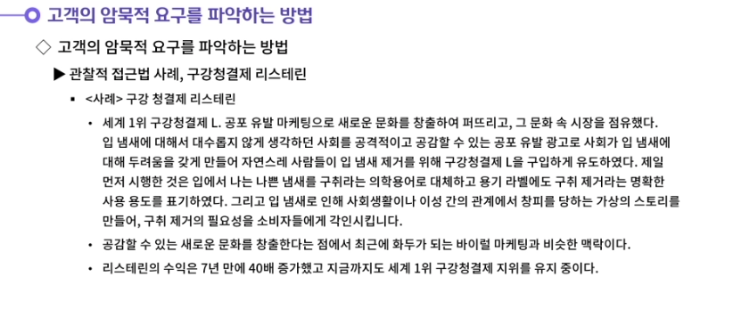

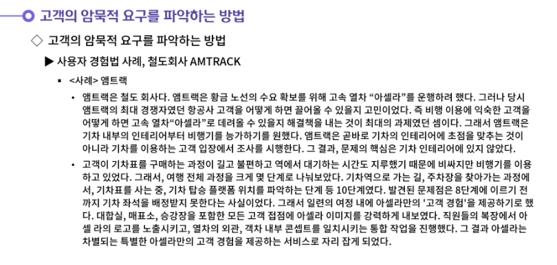

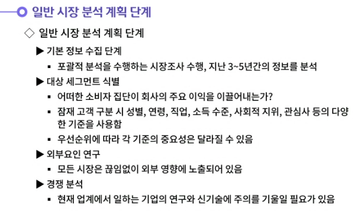

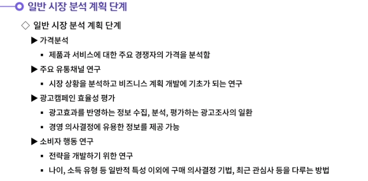

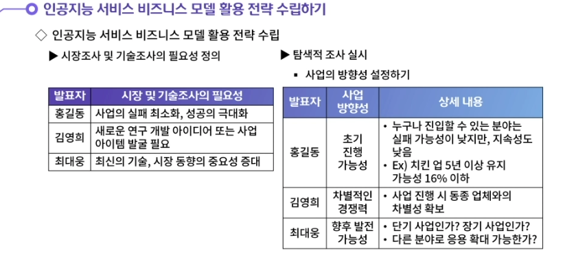

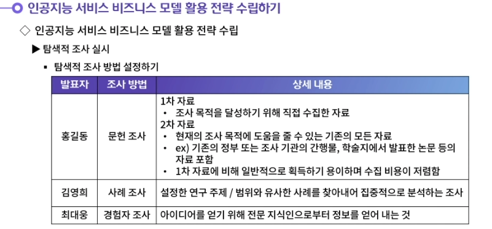

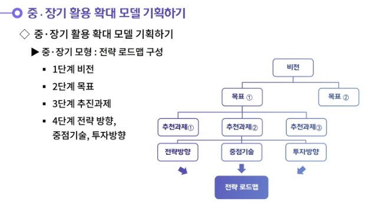

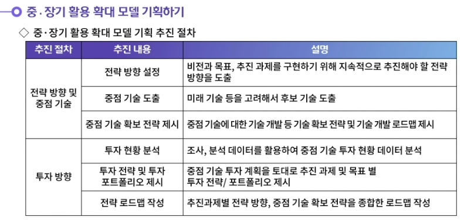

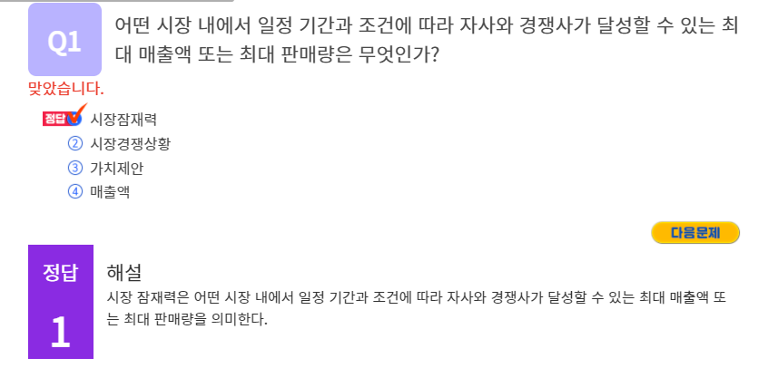

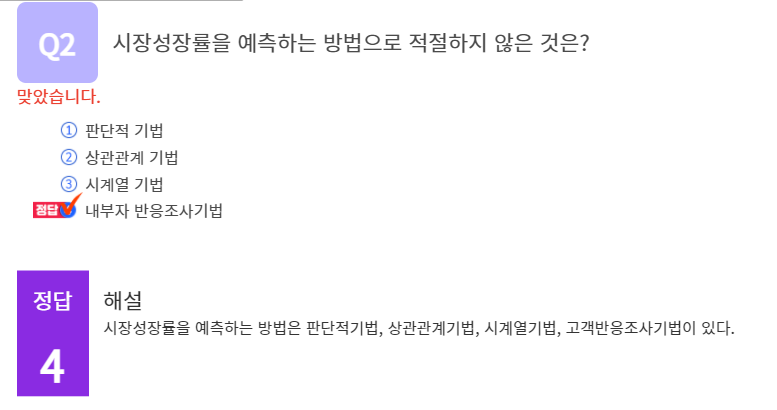

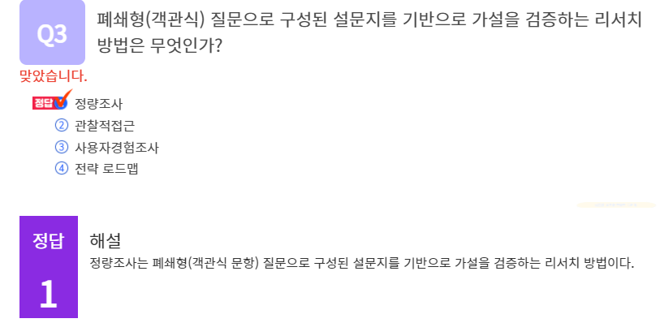

#### 1. 고객 니즈의 유형을 살펴보겠습니다.

1. 고객 니즈에는 3가지 유형이 있다.
   첫 번째는 노골적 요구이다. 사람들이 스스로 자각하고 있으며 구두로 명확하게 표현하는 니즈이다. 예를 들어서 '이런 건 참 불편해!'라고 표현하게 된다.
   두 번째는 암묵적 요구이다. 암묵적 요구는 습관/문화에 배여 있어서 자각하거나 명확한 표현이 어려운 니즈이다. '원래 그런 거지, 딱히 불편하지 않아'라고 표현하게 된다.
   세 번째는 잠재적 요구이다. 잠재적 요구는 무의식적으로 가지고 있으므로 스스로 인지하지 못하고 있는 니즈이다. 잠재적 요구는 '무엇인가를 원하는데, 정확히 무엇인지 잘 모르겠어'라고 표현하게 된다.