## 21.인공지능서비스상품화기획하기

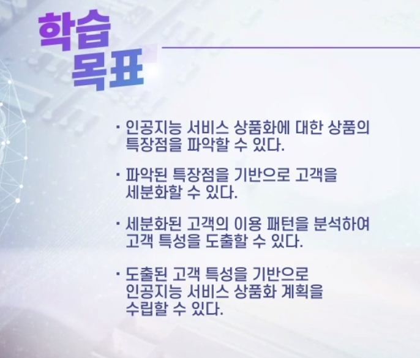

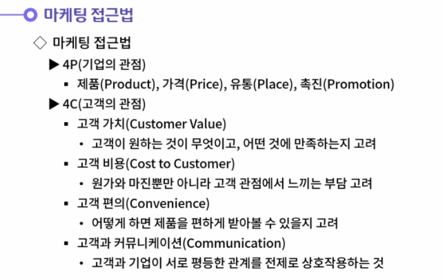

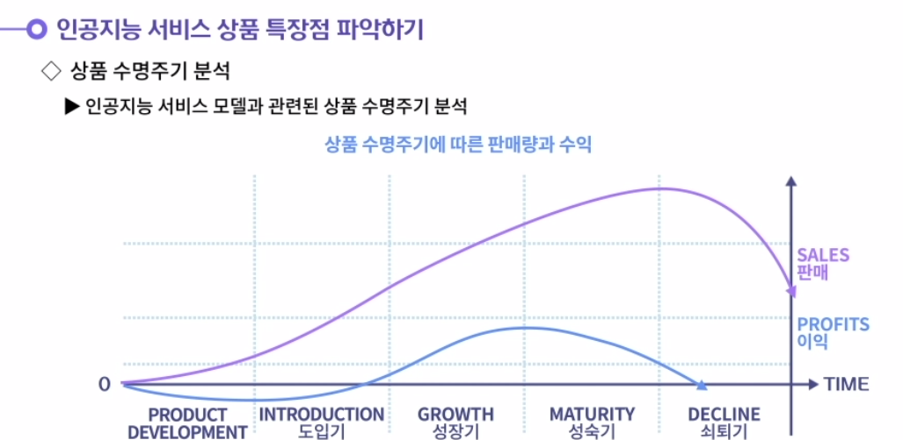

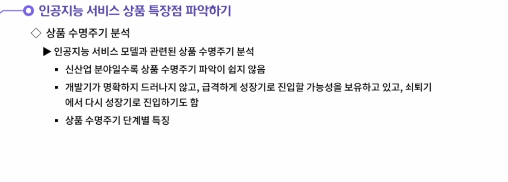

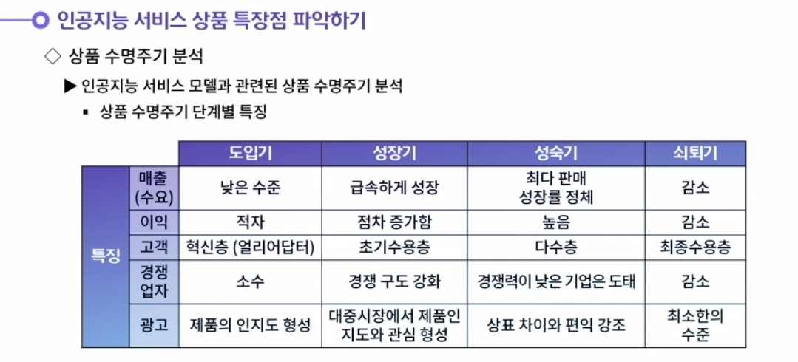

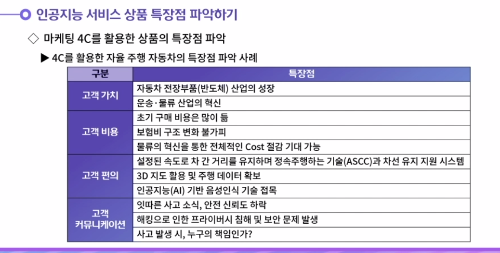

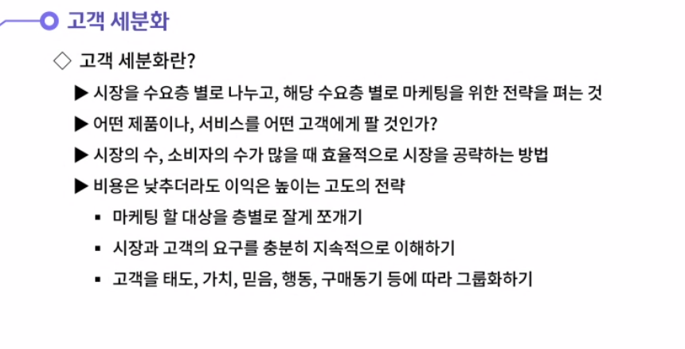

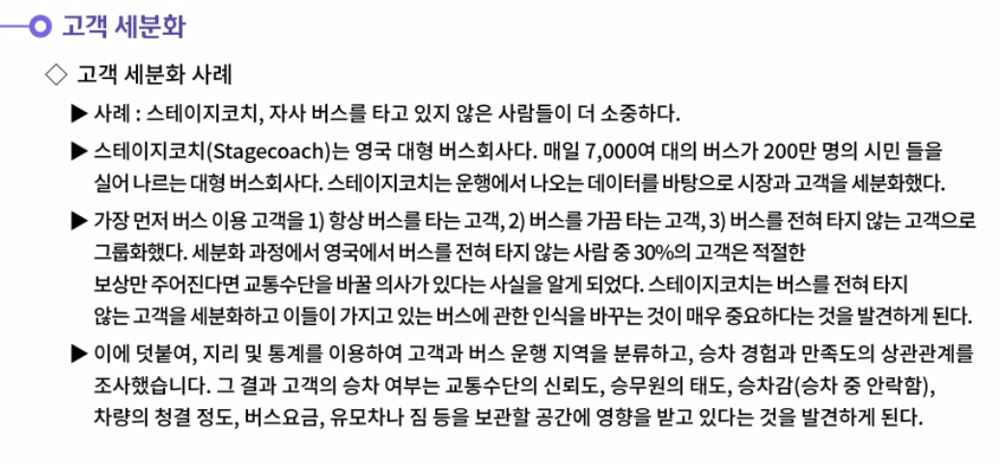

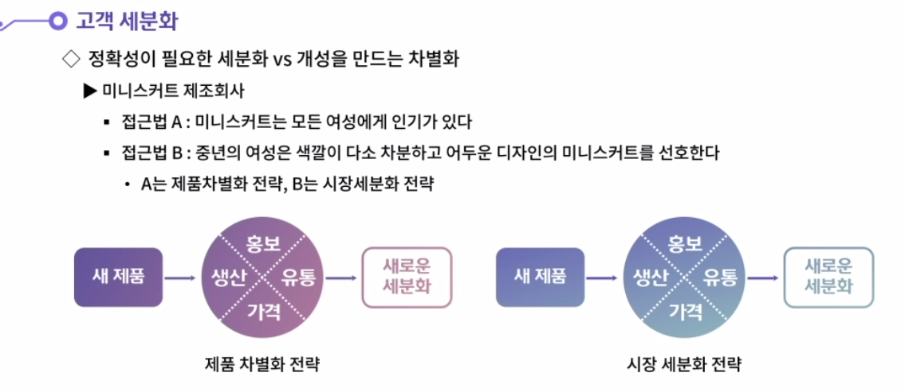

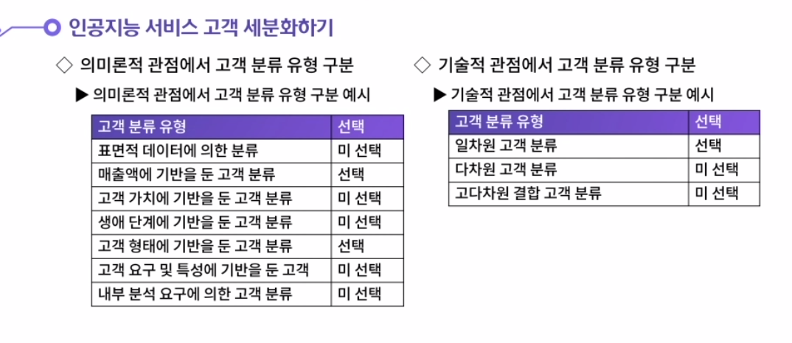

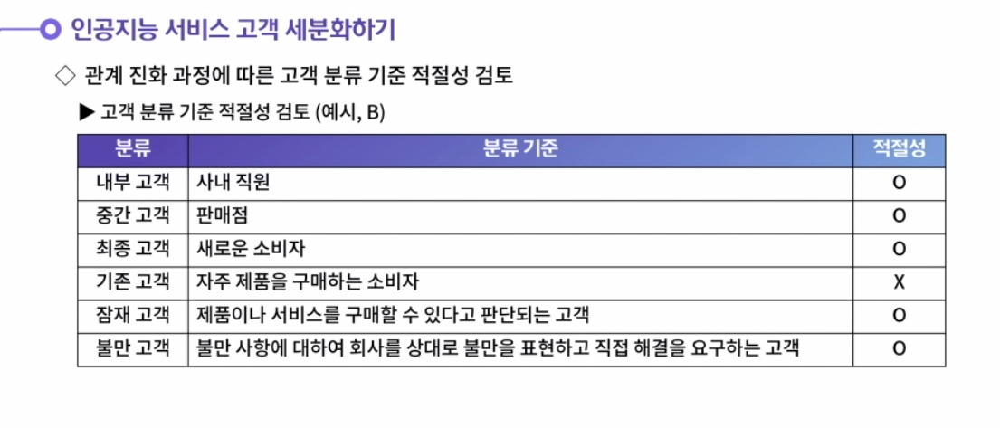

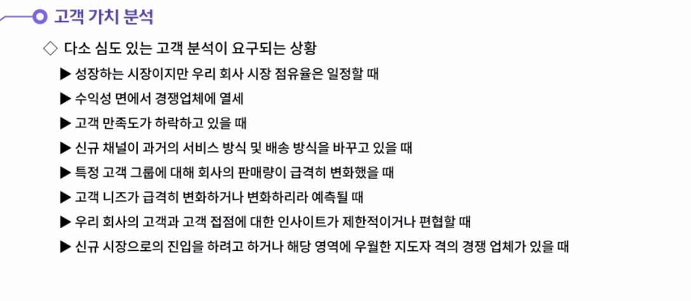

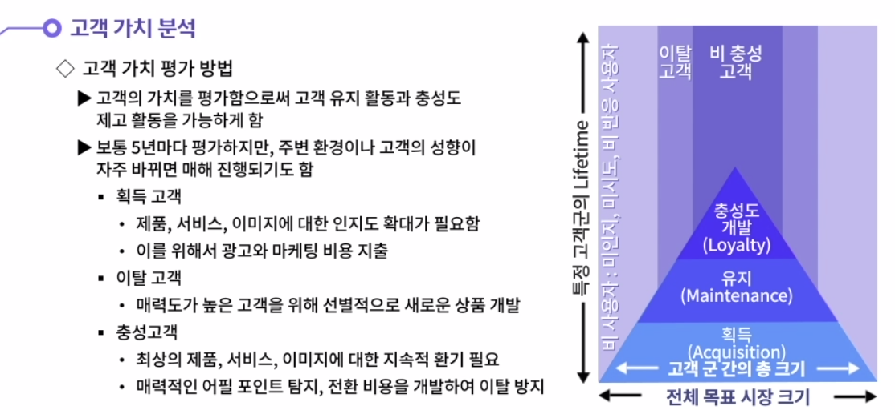

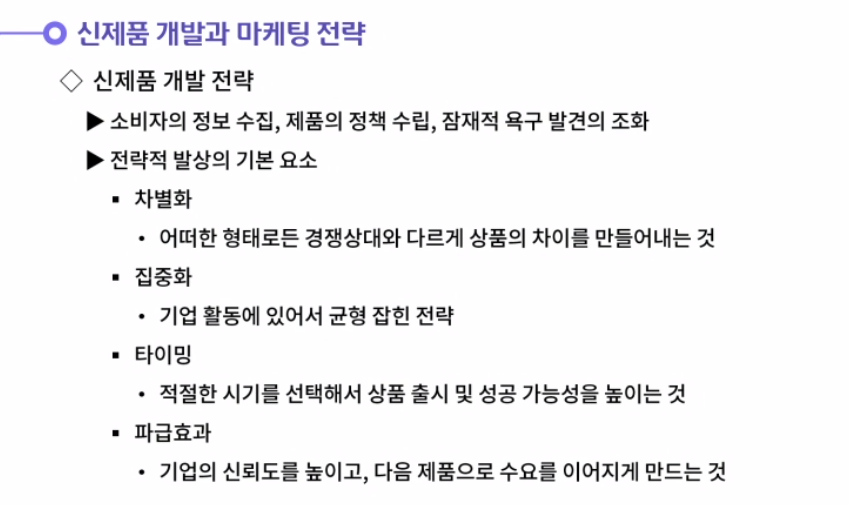

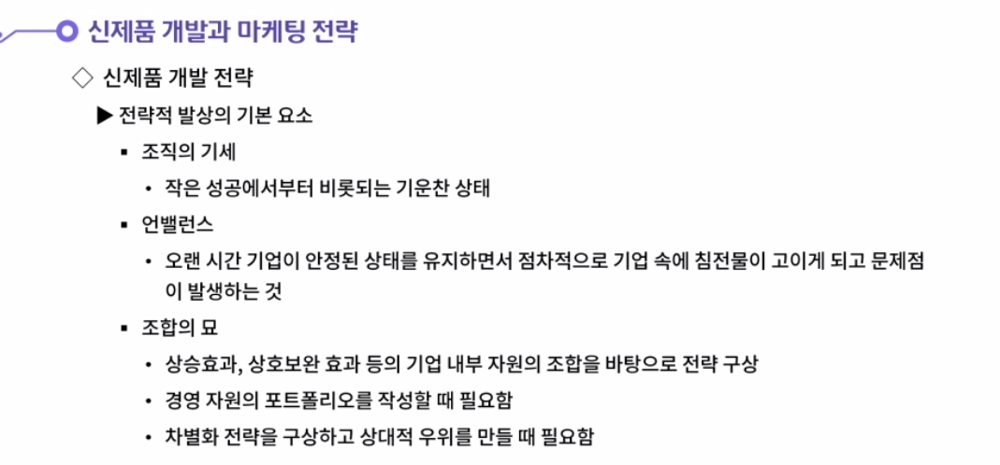

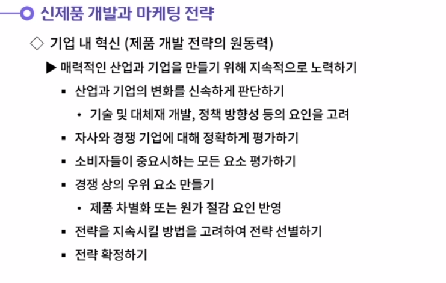

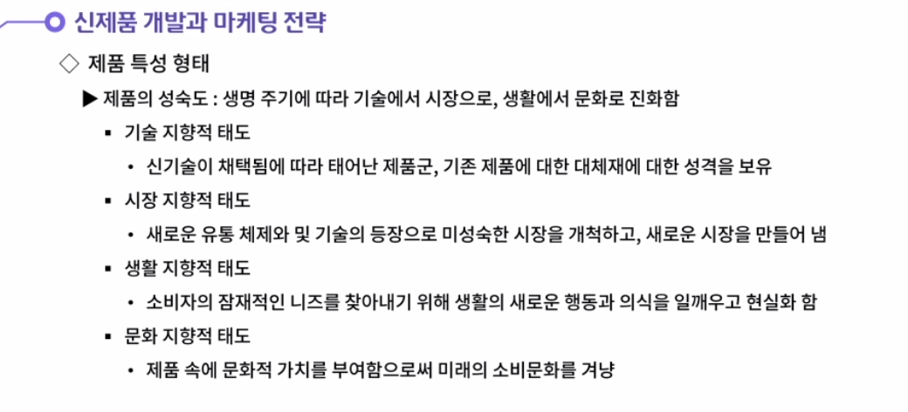

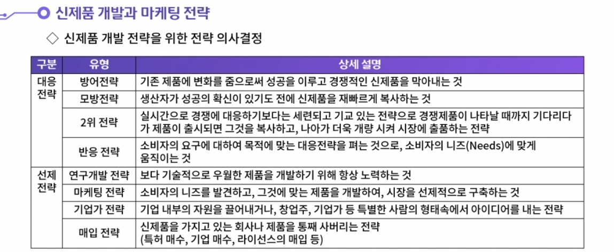

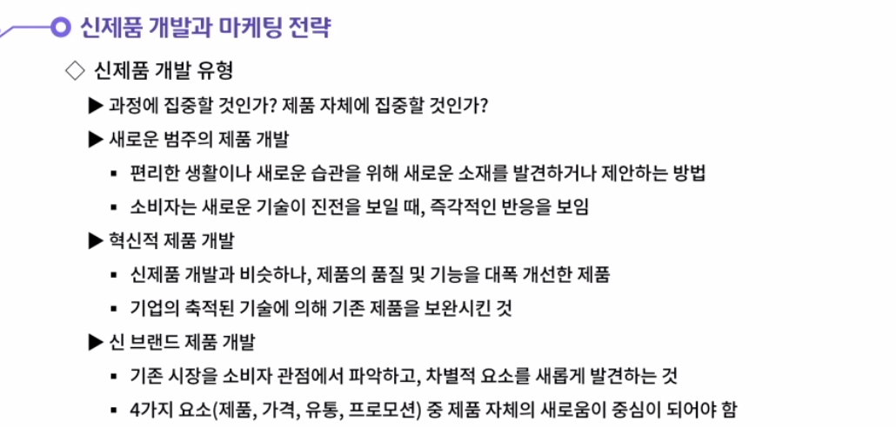

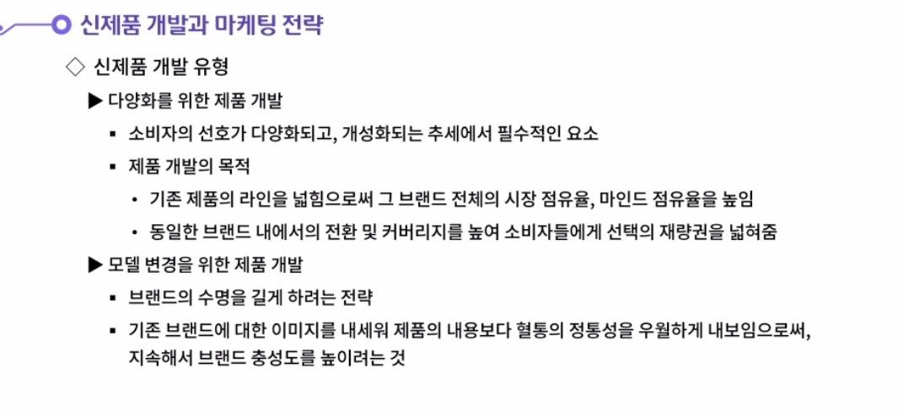

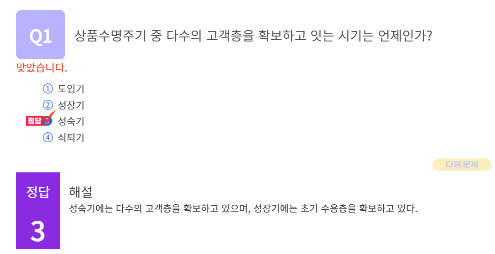

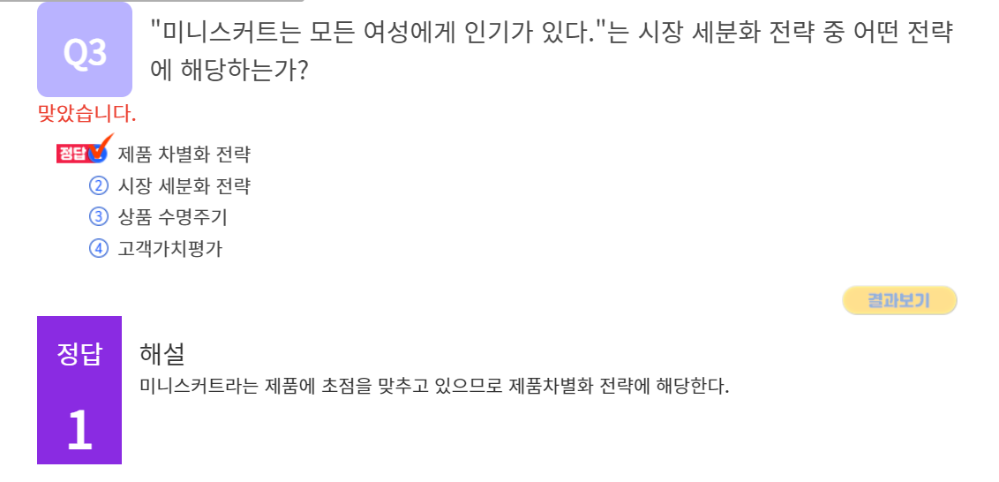

#### 1. 심도있는 고객분석이 요구되는 상황에 대해 살펴보겠습니다.

1. 고객을 분석하는 과정 중, 심도 있는 고객 분석이 요구되는 상황이 있다.
   첫번째는 성장하는 시장이지만, 자사의 시장 점유율이 일정한 경우이다.
   두번째는 수익성 면에서 경쟁업체에 열세한 경우이다.
   세번째는 고객 만족도가 하락하고 있는 경우이다.
   네번째는 신규 채널이 과거의 서비스 방식 및 배송 방식을 바꾸고 있는 경우이다.
   다섯 번째는 특정 고객 그룹에 대해 회사의 판매량이 급격히 변화하는 경우이다.
   여섯 번째는 고객 니즈가 급격히 변화하거나 변화할 것으로 예측되는 경우이다.
   일곱 번째는 회사의 고객과 고객 접점에 대한 인사이트가 제한적이거나 편협한 경우이다.
   여덟 번째는 신규 시장으로의 진입을 하려고 하거나 해당 영역에 우월한 지도자 격의 경쟁 업체가 있는 경우이다.