## 22.AI서비스의디지털콘텐츠적용사례

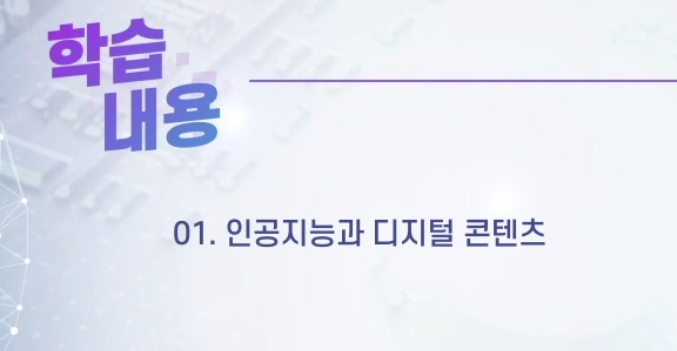

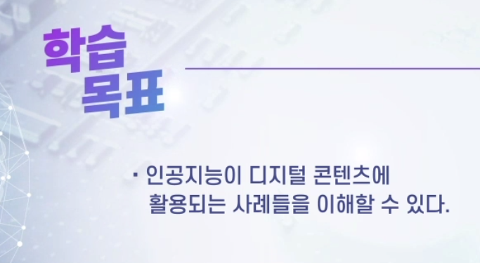

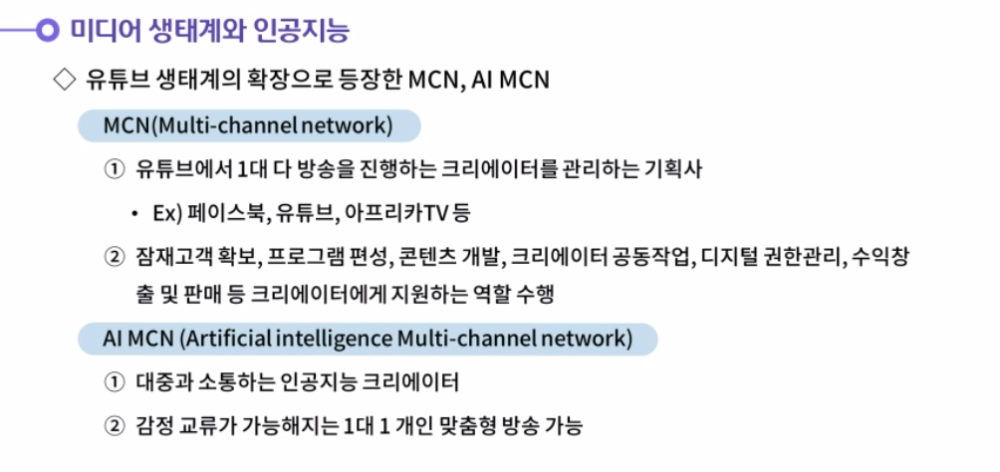

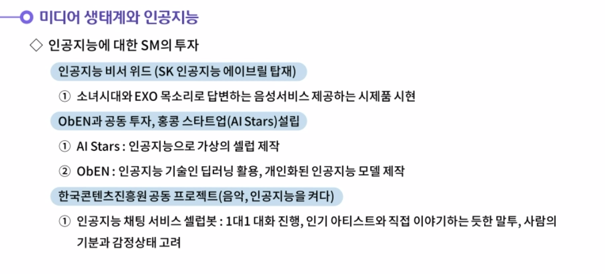

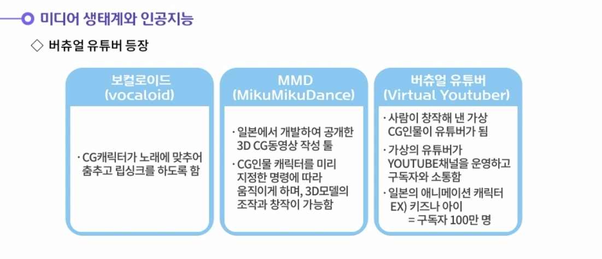

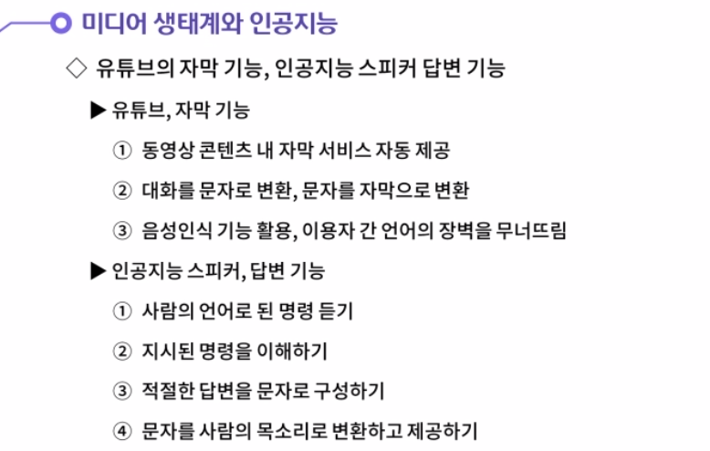

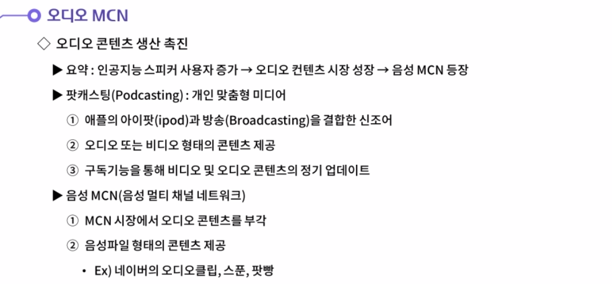

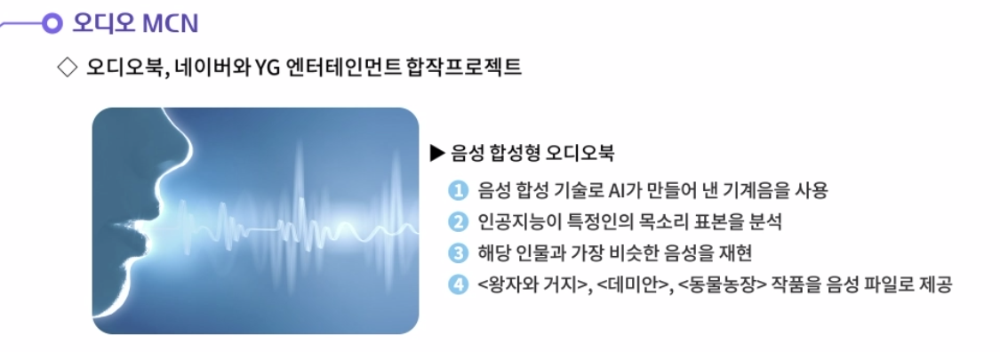

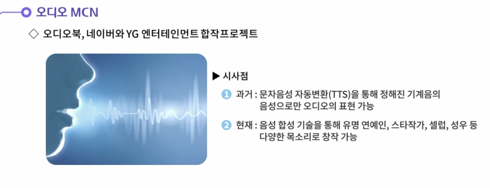

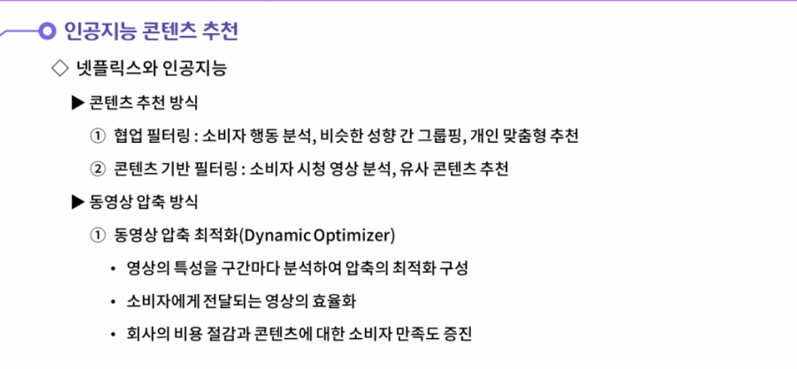

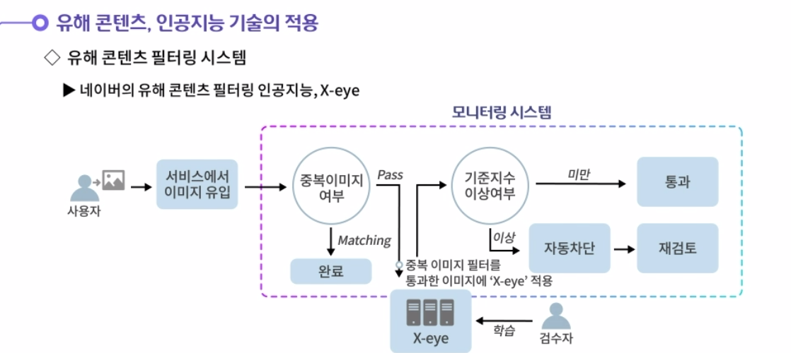

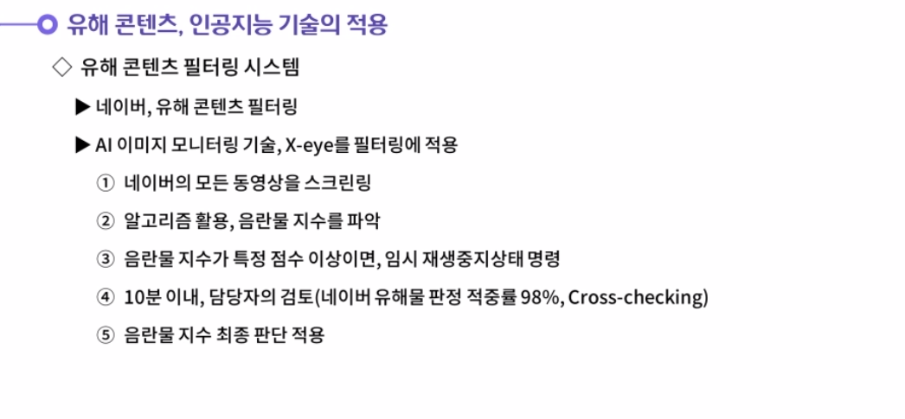

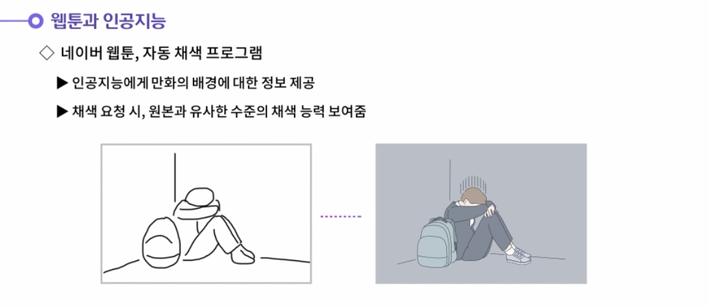

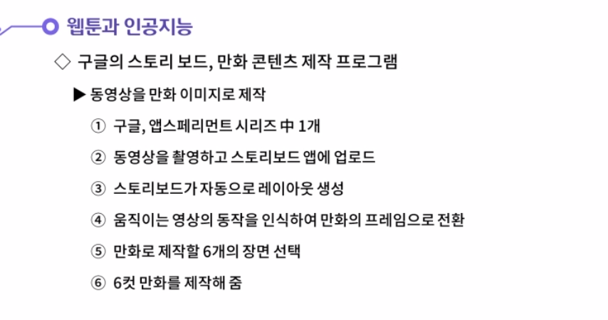

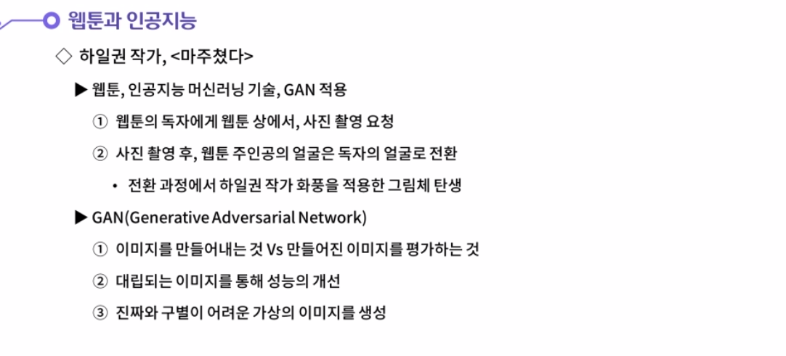

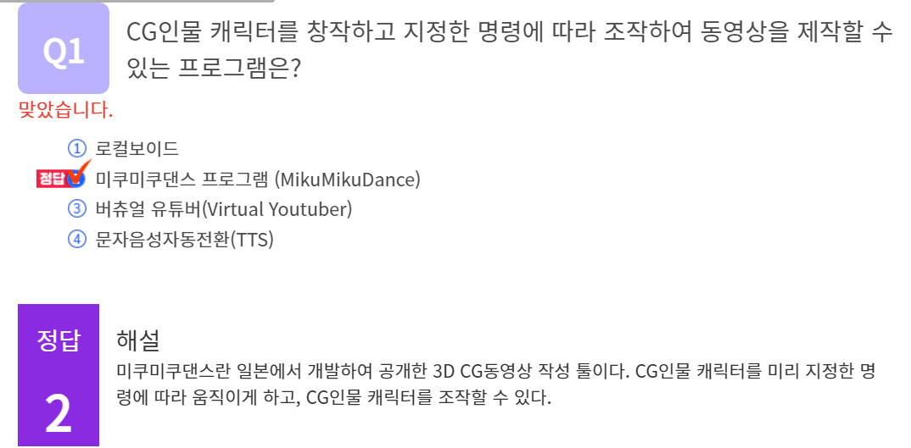

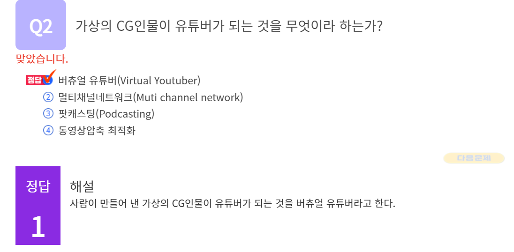

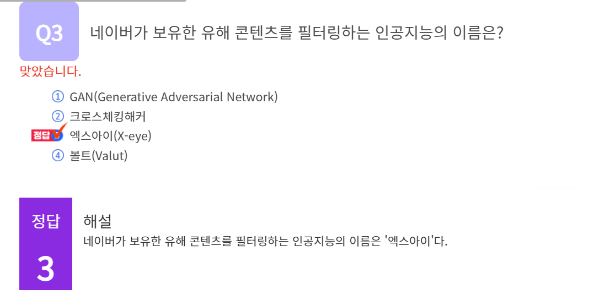

#### 1. 인공지능이 어떻게 미디어 생태계를 변화시킬 것인가에 대해 생각해봅시다.

1. 과거의 방송은 방송제작자가 콘텐츠를 기획하여 대중에게 전달하는 형태였다. 오늘날 방송은 개인이 대중에게 방송을 실시간으로 전달하고 있다. 유튜브나 아프리카TV와 같은 플랫폼은 개인방송의 확장에 큰 역할을 담당하고 있다. 그리고 이러한 플랫폼에서 방송활동을 수행하는 크리에이터를 관리해주는 소속사도 있다. 플랫폼에서 활동하는 크리에이터를 보유하고, 이들을 지원해주는 소속사를 멀티채널네트워크(MCN)이라 한다. 이는 방송인들의 소속사인 SM, YG, JYP 등 엔터테인먼트 기획사와 유사한 개념으로 볼 수 있다. 멀티채널네트워크는 제품, 프로그램 기획, 결제, 교차 프로모션, 파트너 관리, 디지털 저작권 관리, 수익 창출·판매 및 잠재고객 개발 등의 영역을 콘텐츠 제작자에게 지원하는 역할을 수행한다.
   유튜브에서 정의하는 멀티 채널 네트워크는 다음과 같다. 다중 채널 네트워크는 여러 유튜브 채널과 제휴한 제3의 서비스 제공업체이다. 멀티채널 네트워크는 잠재고객 확보, 콘텐츠 편성, 크리에이터 공동작업, 디지털 권한 관리, 수익 창출 및 판매 등의 서비스를 제공한다고 명시되어 있다.
   아마도 가까운 미래에는 멀티채널네트워크에 인공지능이 결합된 AI MCN이 등장할 수도 있다. 유튜브에서 이루어지는 일대다 방식의 방송이 아닌 1대1 방송을 진행하여 개인 맞춤형 방송이 제작된다는 것이다.

