## 23.AI서비스의영화산업적용사례

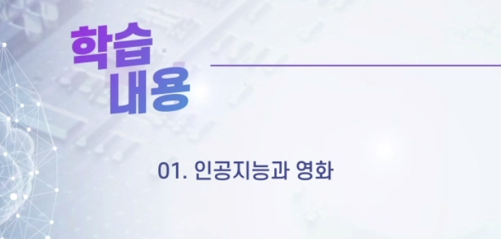

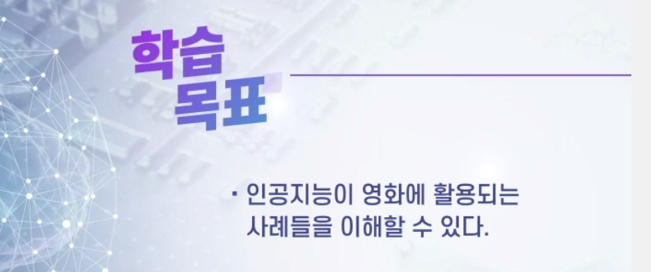

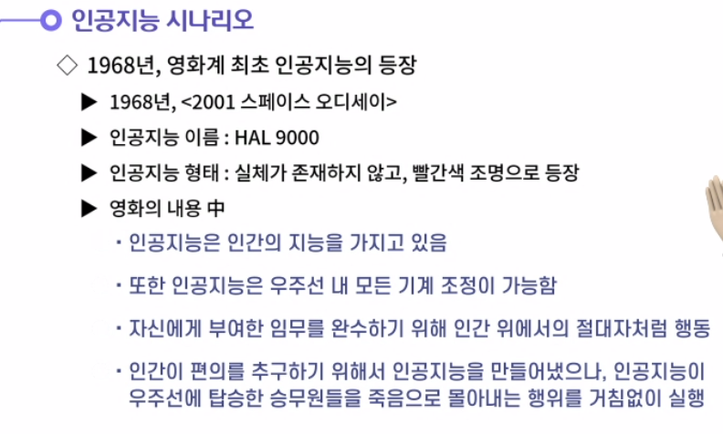

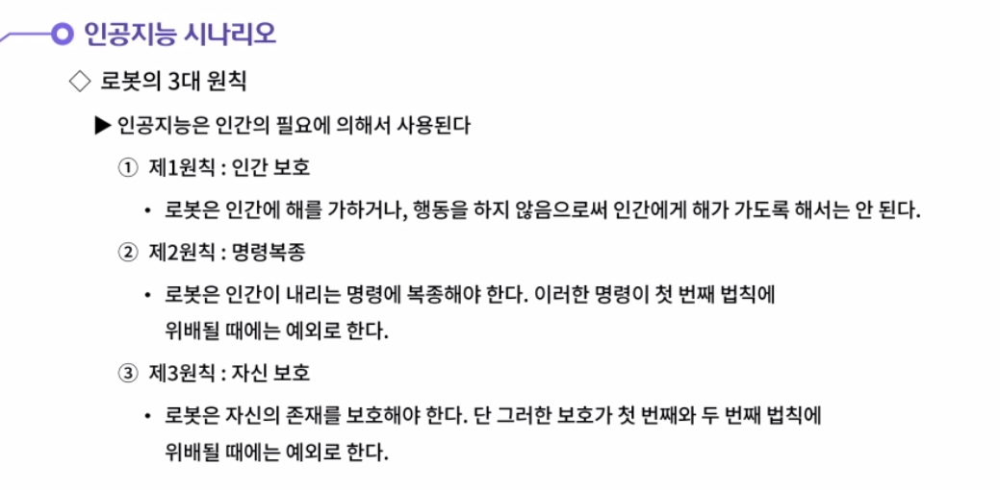

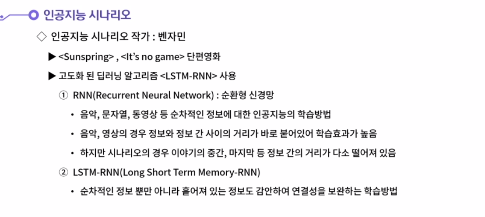

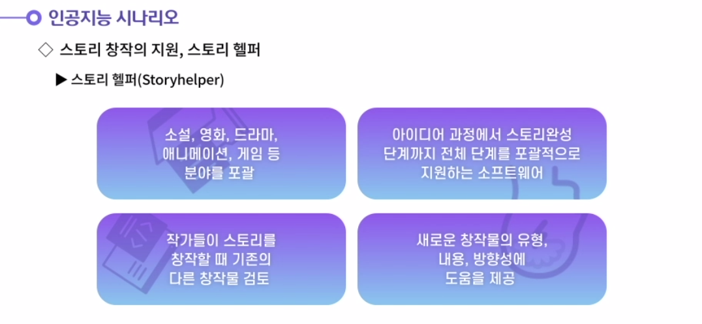

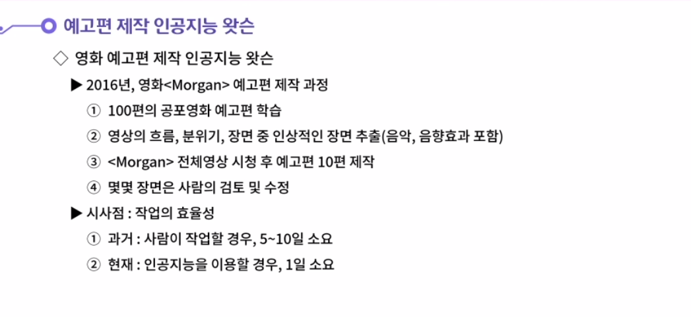

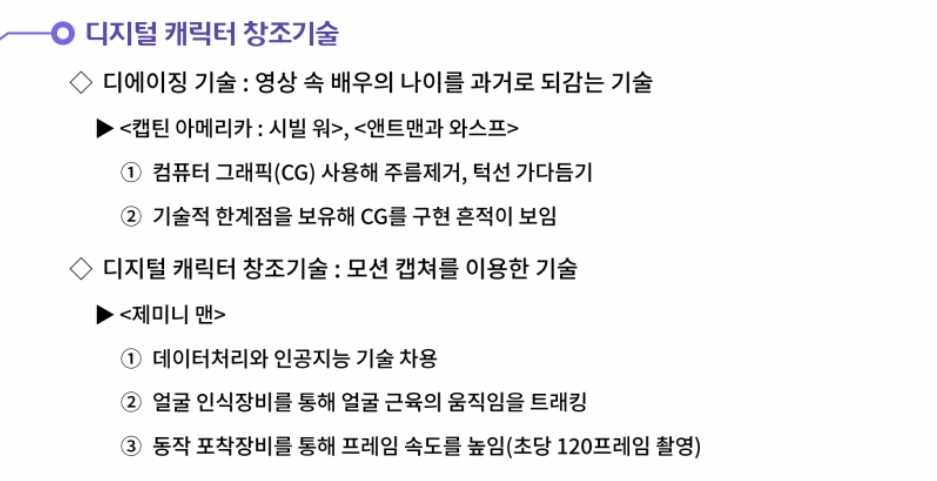

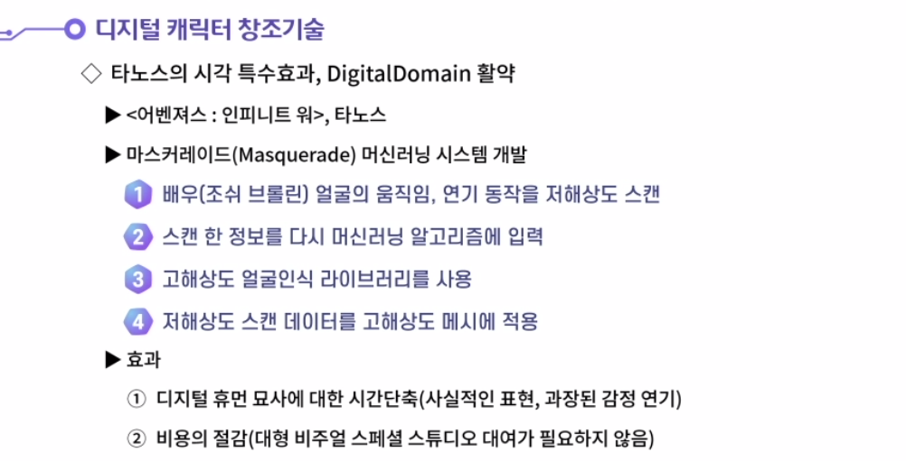

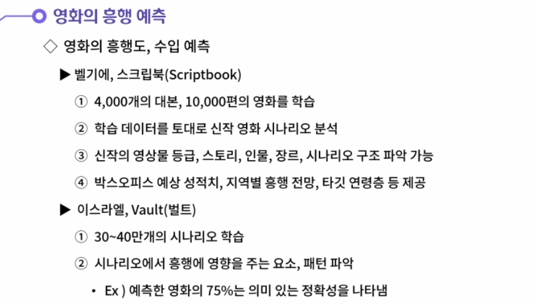

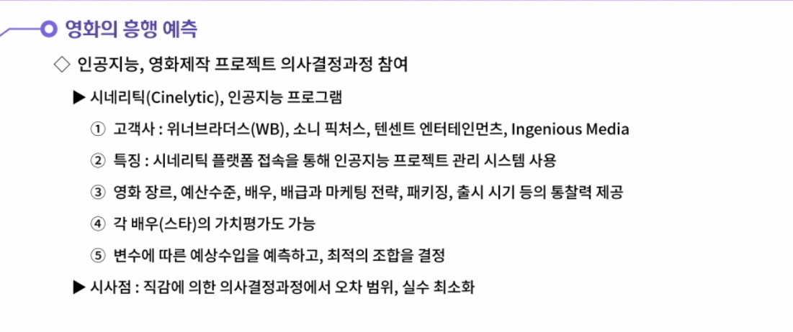

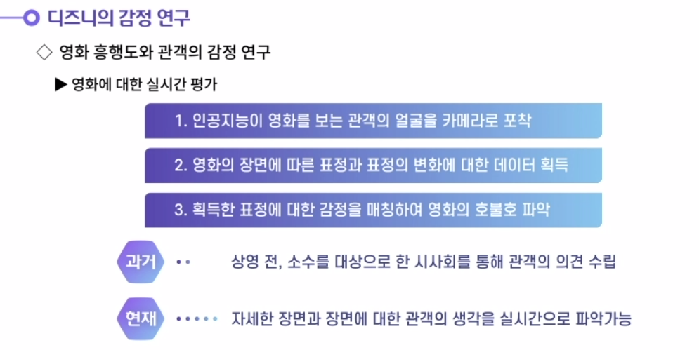

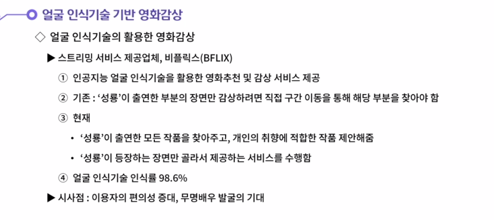

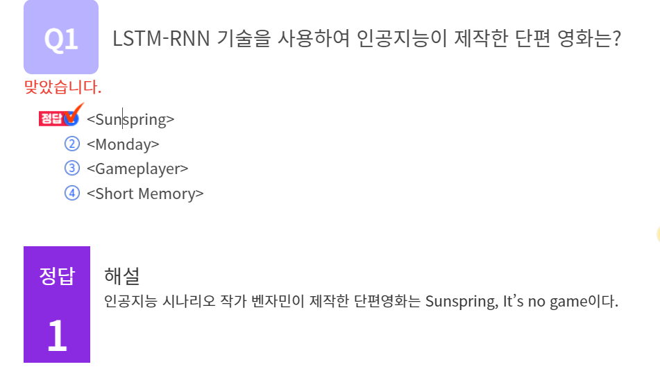

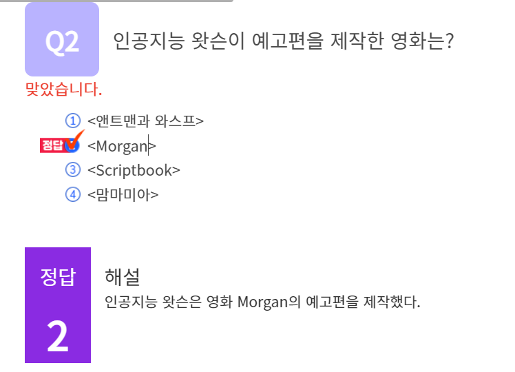

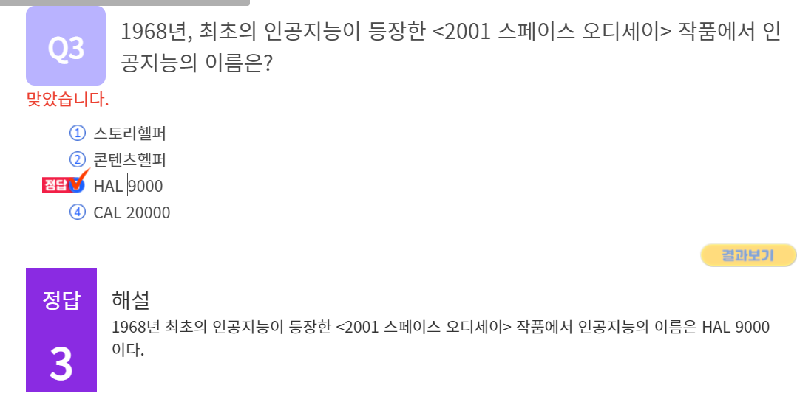

#### 1. 로봇의 3대원칙에 대해 생각해봅시다.

1. 로봇이나 인공지능은 로봇의 3대 원칙을 따라야 한다.
   로봇의 3대 원칙 중 첫 번째 원칙은 <인간보호의 원칙>이다. 로봇은 인간에 해를 가하거나, 행동을 하지 않음으로써 인간에게 해가 가도록 해서는 안된다.
   두 번째 원칙은 <명령복종의 원칙>이다. 로봇은 인간이 내리는 명령에 복종해야 한다. 단 이러한 명령이 첫 번째 법칙에 위배될 때에는 예외로 한다.
   세 번째 원칙은 <자신 보호의 원칙>이다. 로봇은 자신의 존재를 보호해야 한다. 단 그러한 보호가 첫 번째와 두 번째 법칙에 위배될 때에는 예외로 적용한다. 이러한 원칙을 인공지능이 지키지 않는 경우에는 공상과학의 영화에 등장하는 것과 같이 인공지능이 인간을 통제하고 지배할수도 있기 때문이다.

