## 24.AI서비스의음악산업적용사례

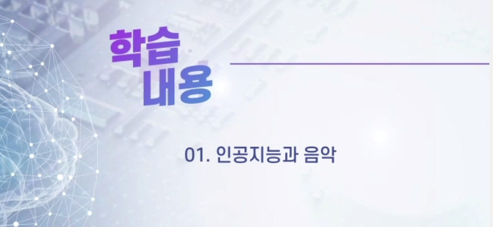

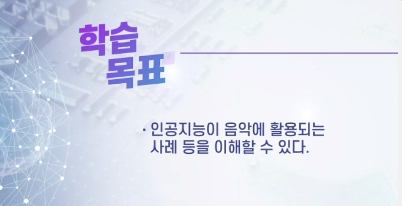

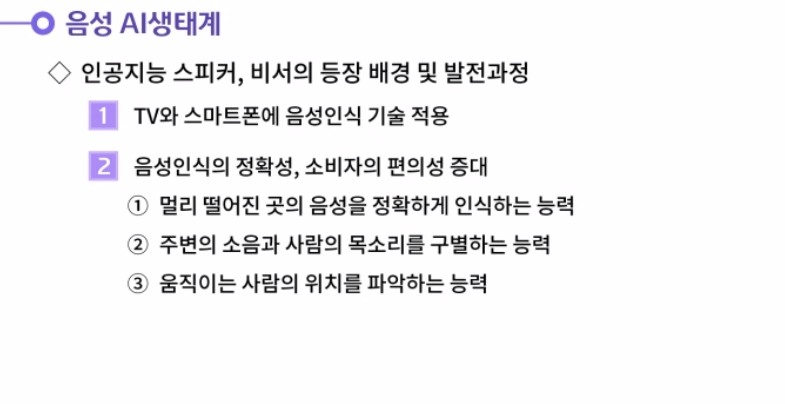

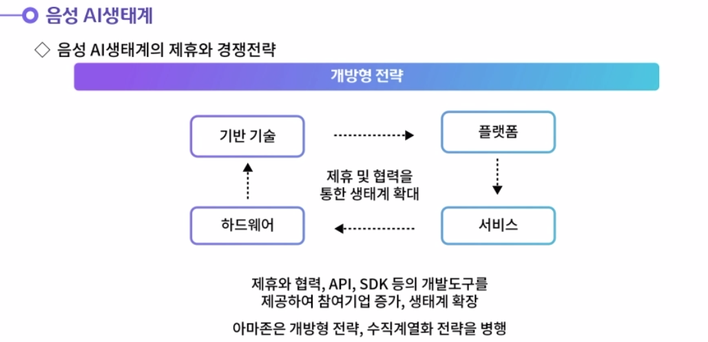

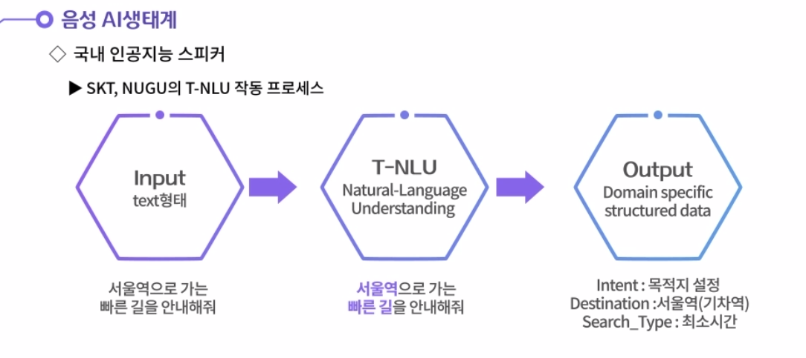

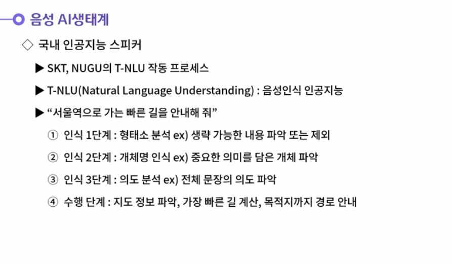

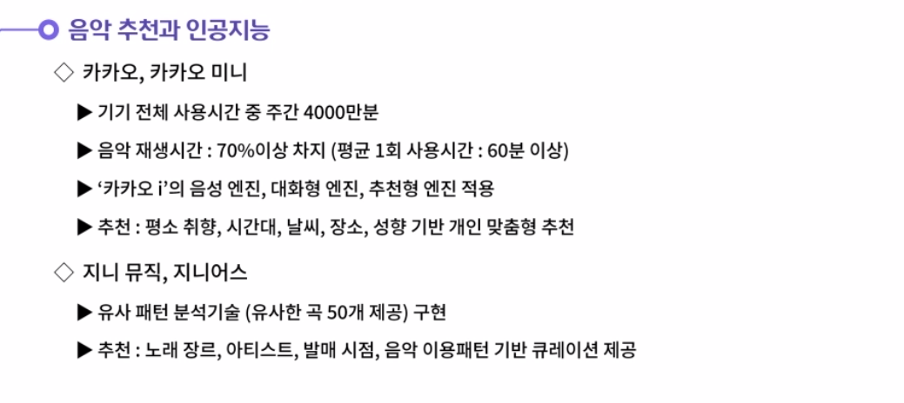

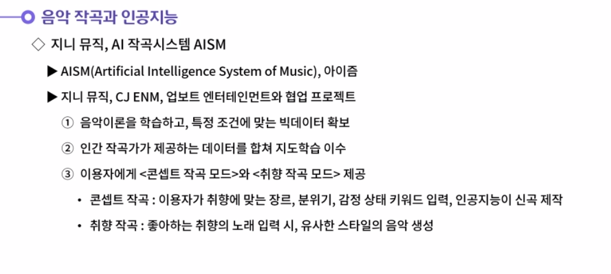

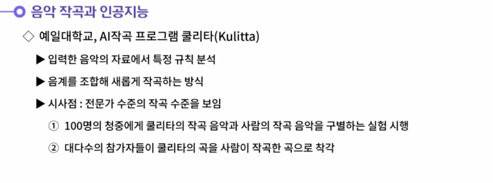

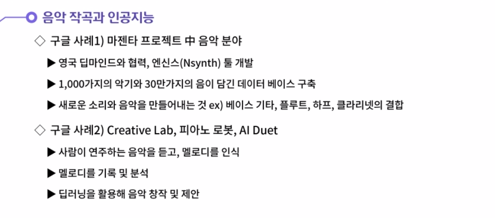

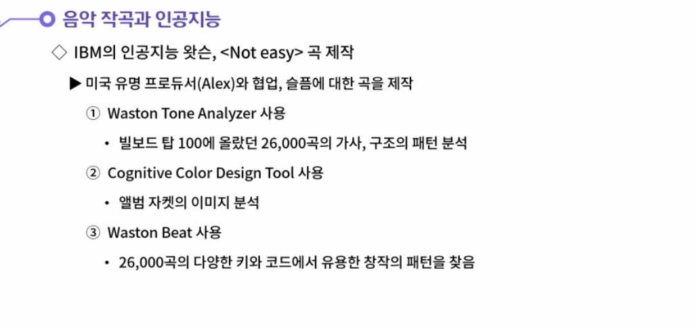

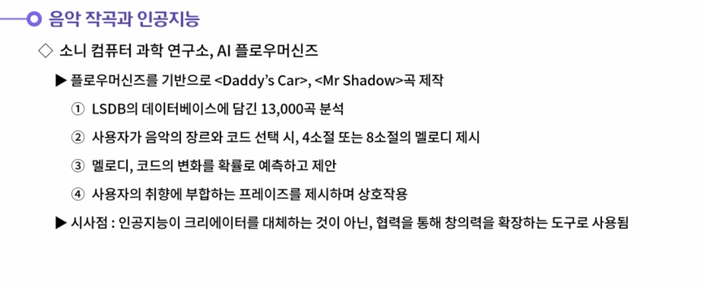

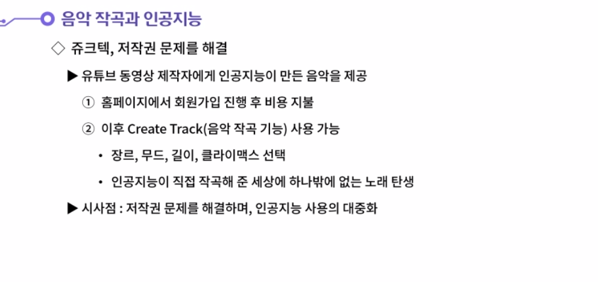

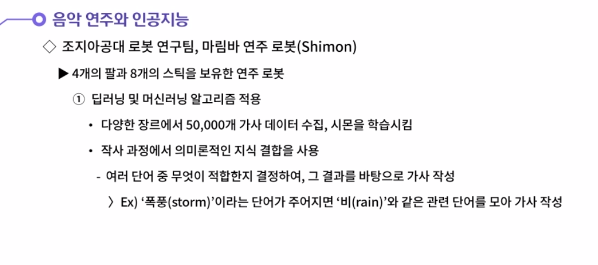

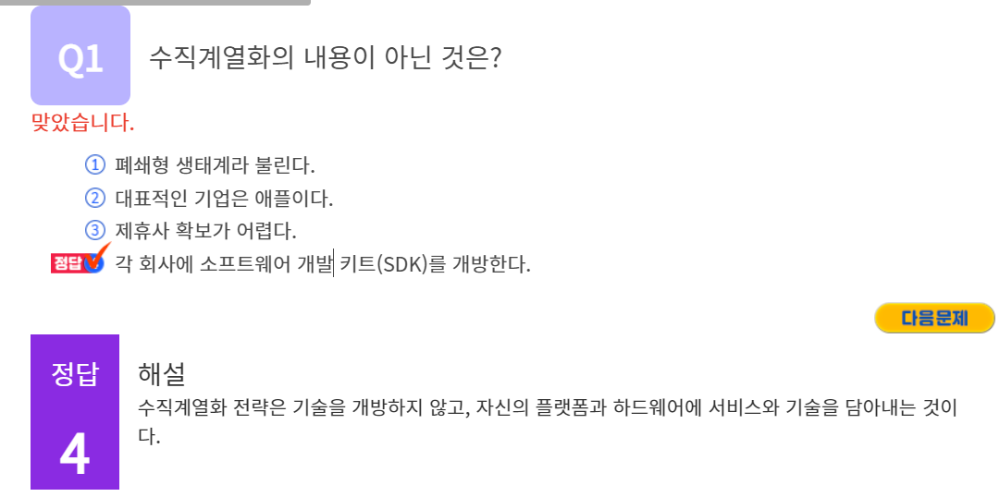

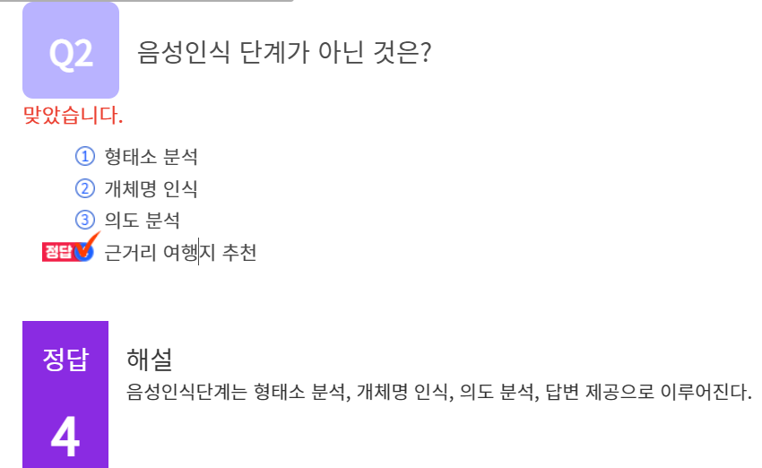

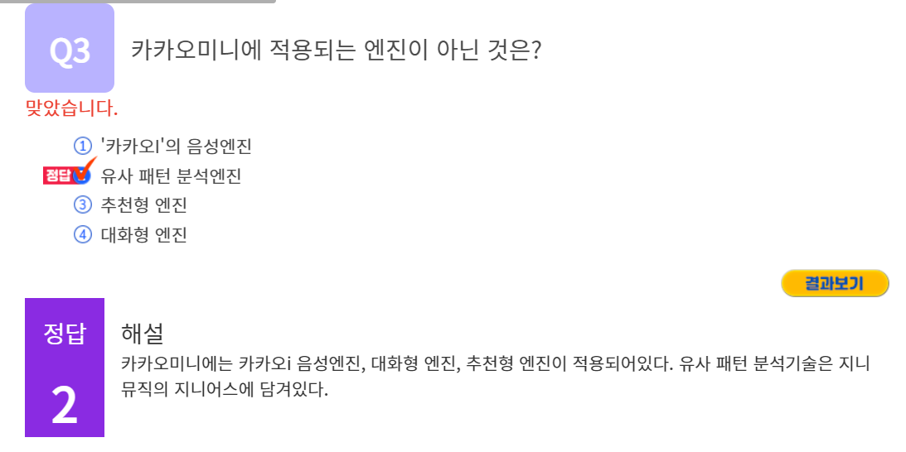

#### 1. 인공지능 스피커가 보유한 음성인식기술에 대해 생각해봅시다.

1. 음성인식 기술이 처음 등장하였을 때 대부분의 회사는 이 기술을 TV와 스마트폰에 적용한다. 히지만 TV와 멀리 떨어진 곳의 경우 음성 인식 정확성이 낮았다. 스마트폰 또한 음성으로 통제하는 것보다는 쉽고 빠른 터치의 기능으로 통제하는 것이 더 편리하였기에 음성인식기능이 사용자에 의해 발달되지 못했다.
   인공지능 스피커는 이러한 단점을 보완하기 위해 다음과 같은 3가지 기능을 갖추게 된다. 첫번째, 사람과 인공지능 스피커가 멀리 떨어져 있더라도 사람의 목소리를 정확하게 인식하게 할 수 있도록 한다. 두번째, 주변의 소음을 목소리와 구별해서 반응할 수 있도록 하는 기능을 추가한다. 세번째, 움직이는 사람의 위치를 파악하는 능력을 개발하여 음성인식의 정확성을 높인다.