## 25.AI서비스의얼굴인식및이미지적용사례

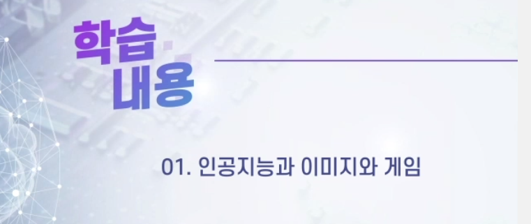

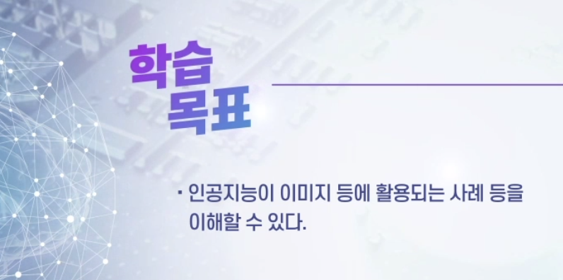

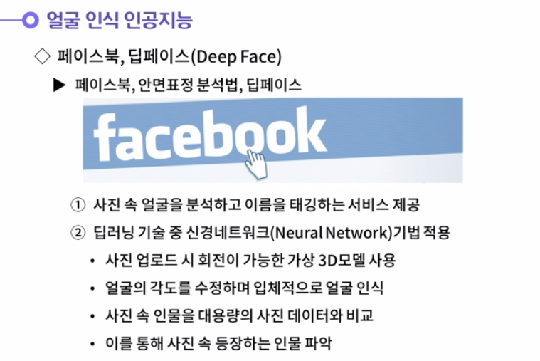

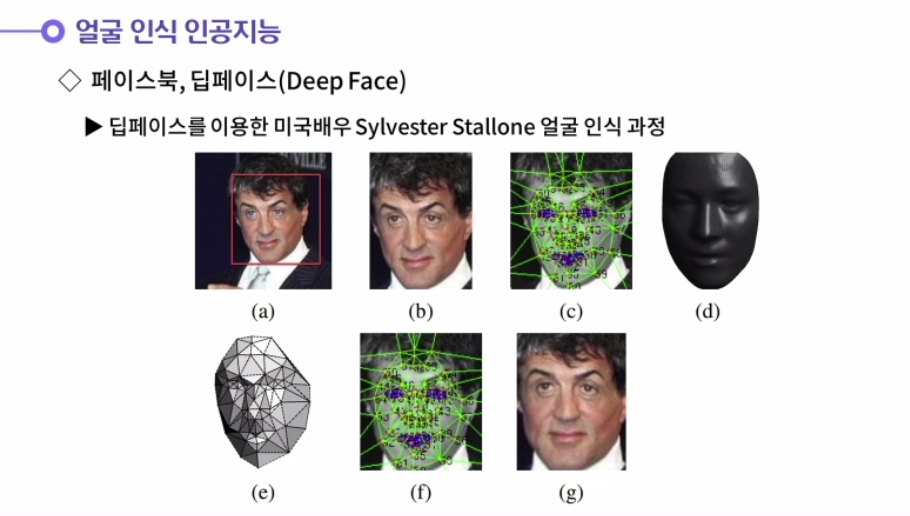

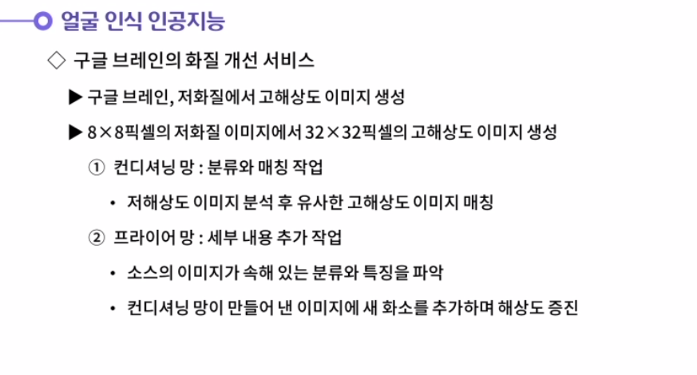

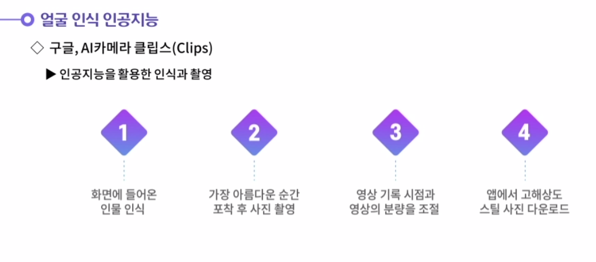

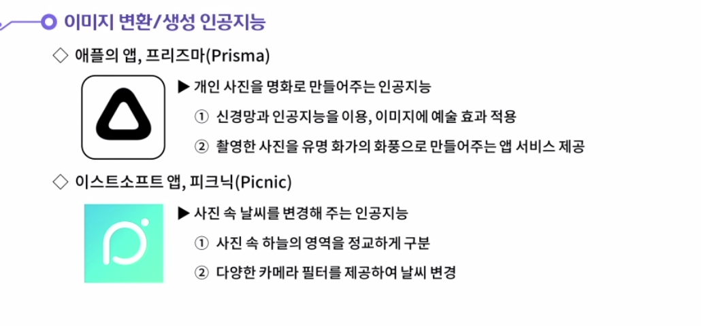

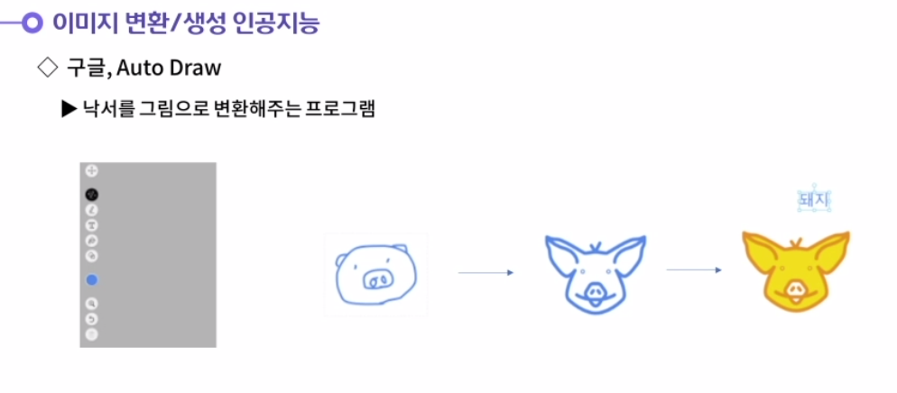

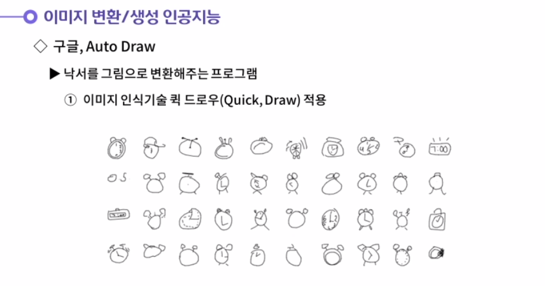

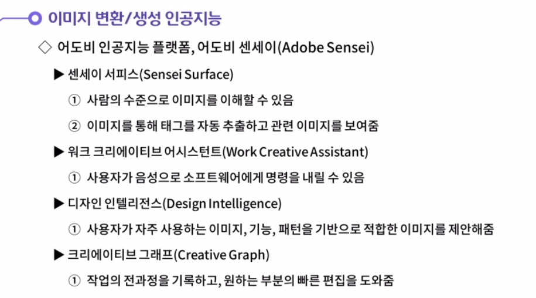

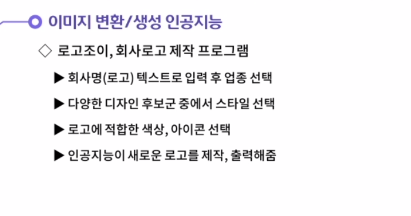

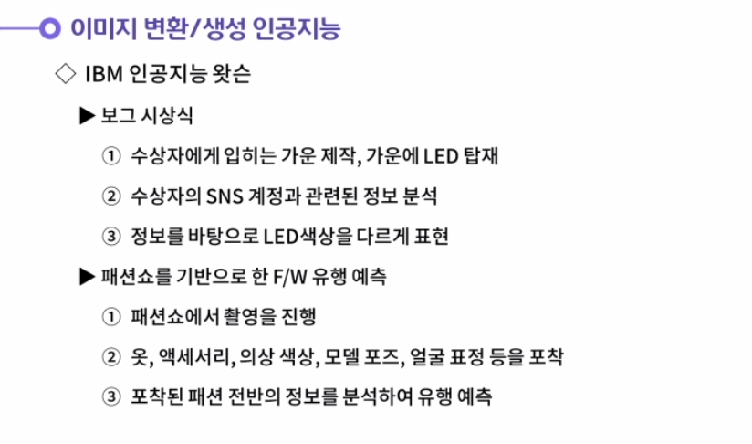

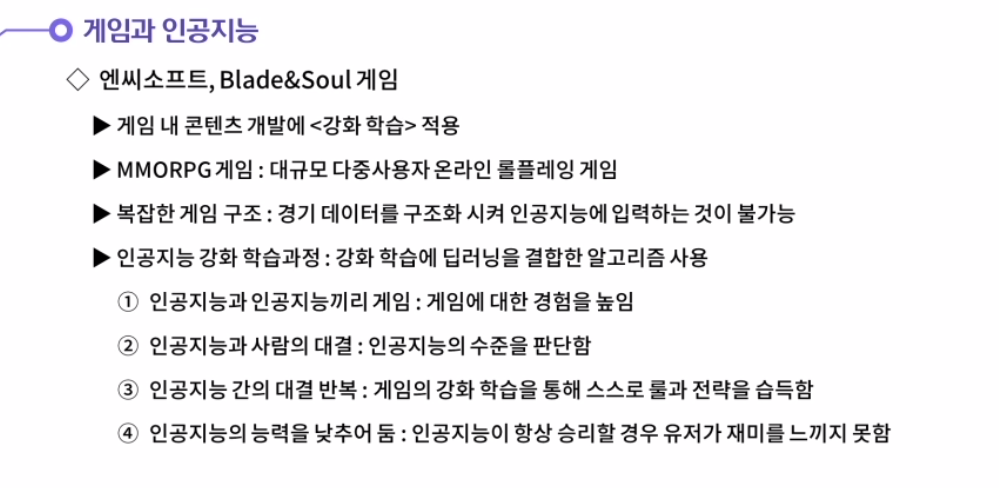

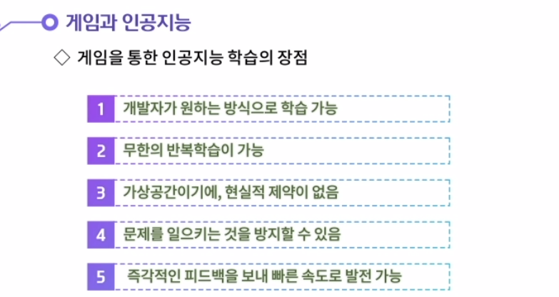

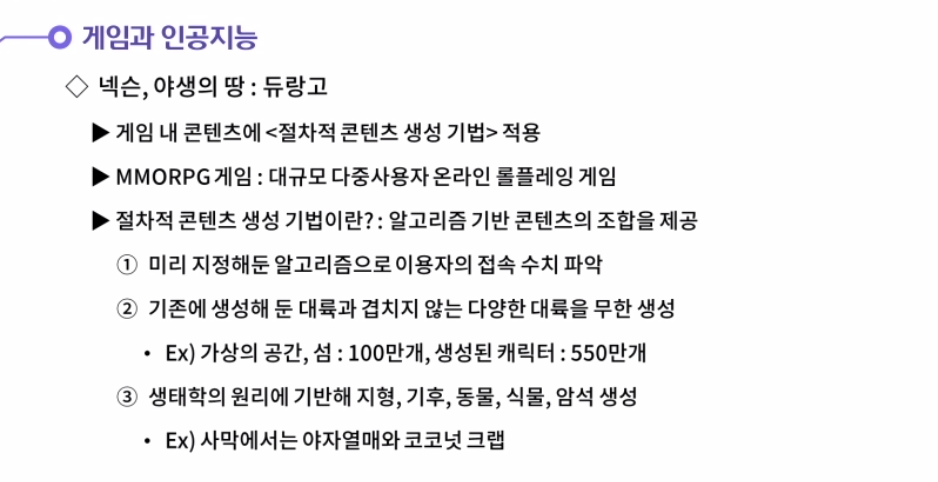

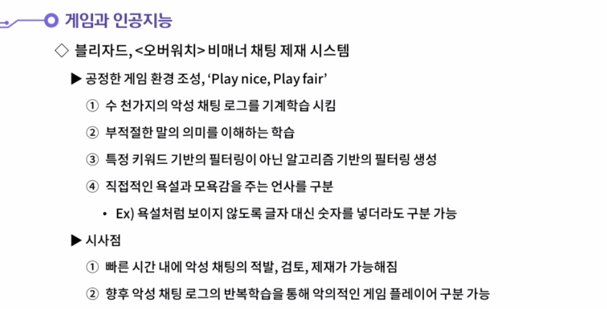

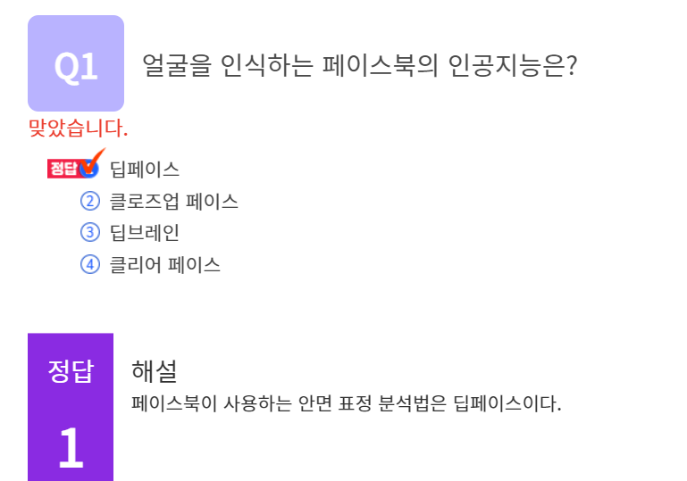

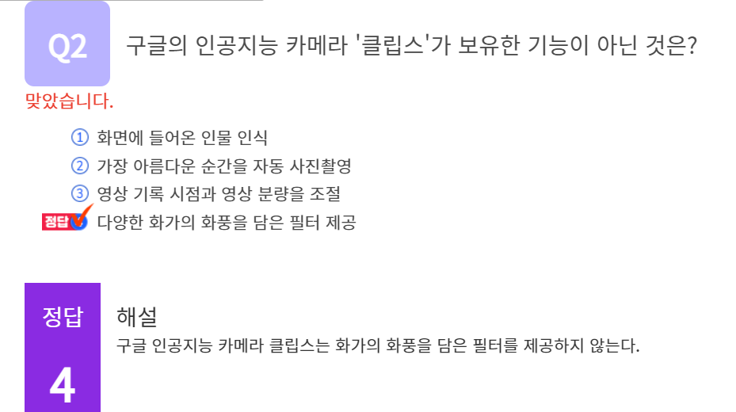

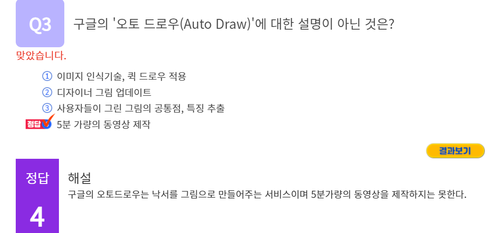

#### 1. 구글 브레인이 활용한 컨디셔닝 망과 프라이어 망에 대해 생각해봅시다.

1. 고해상도 이미지 생성을 위해 구글 브레인이 활용한 신경망 알고리즘은 컨디셔닝 망과 프라이어 네트워크 망이다.
   컨디셔닝 망은 분류와 매칭 작업을 수행한다. 먼저 저해상도 사진을 임의의 고해상도 이미지와 비교하여 얼굴과 배경을 분류한다. 그 다음 저해상도 이미지를 세밀하게 분석하여 가장 유사한 고해상도 이미지를 매칭해주는 역할을 수행한다.
   프라이어 망은 세부 내용을 추가하는 작업을 수행한다. 컨디셔닝 망이 만들어낸 이미지에 좀 더 세부적인 부분을 추가하는 것이다. 이미지가 속해 있는 특징과 분류기준을 파악한 후 컨디셔닝 망이 만들어낸 이미지에 새 화소를 추가해나가며 해상도를 증진시키는 역할을 수행한다. 이렇게 두 인공신경망이 만들어낸 결과물은 하나로 합쳐져서 고해상도 이미지를 만들어낸다.

