## 26.AI서비스의문학과미술에의적용사례

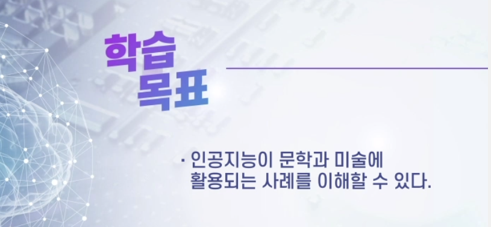

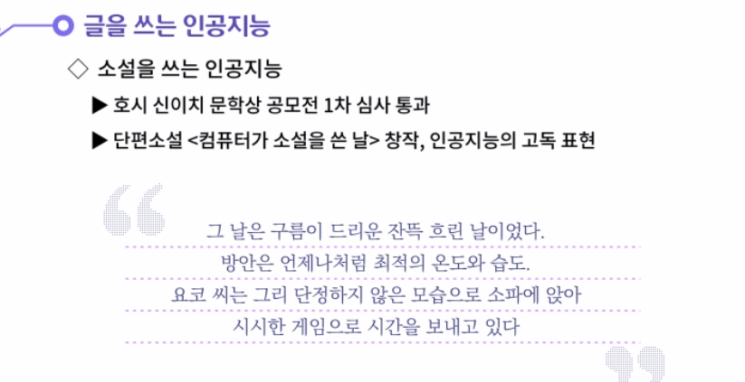

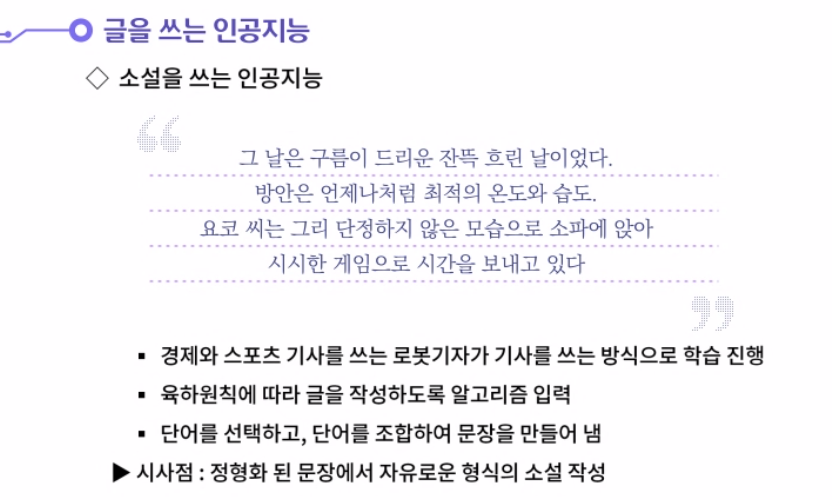

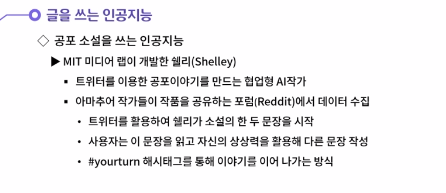

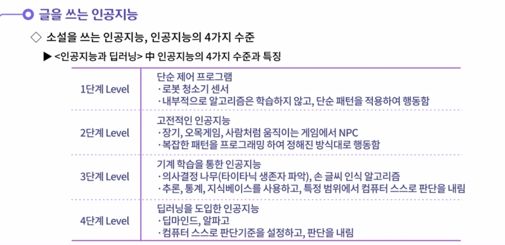

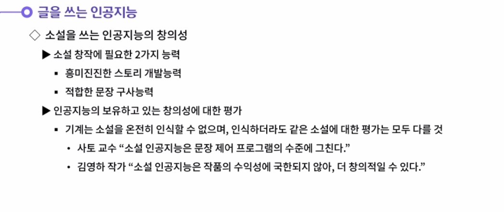

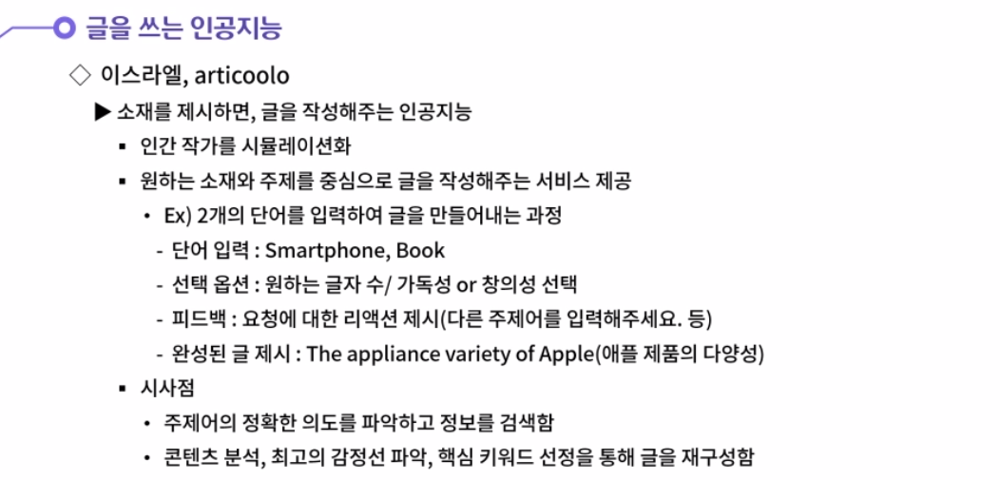

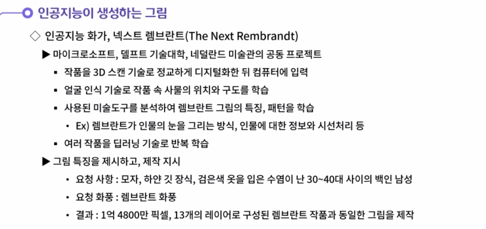

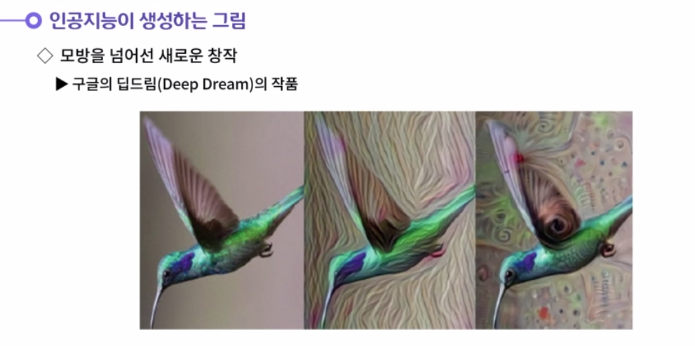

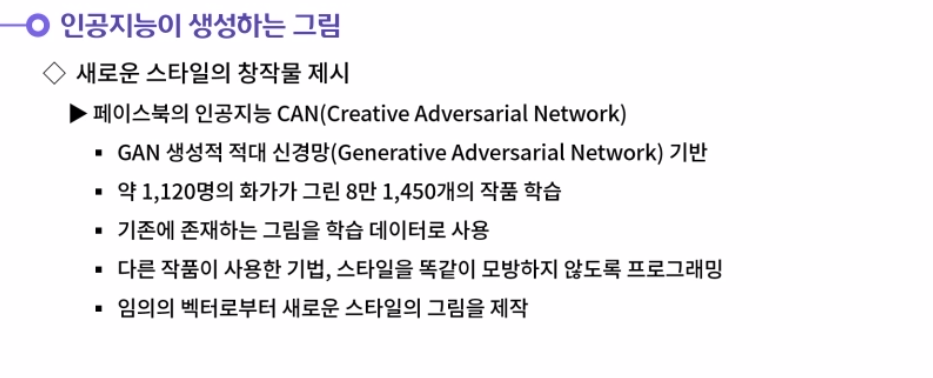

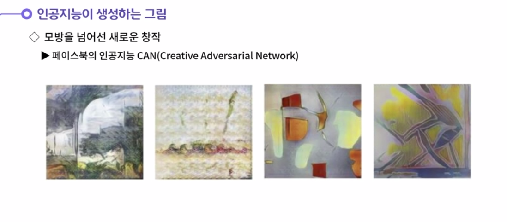

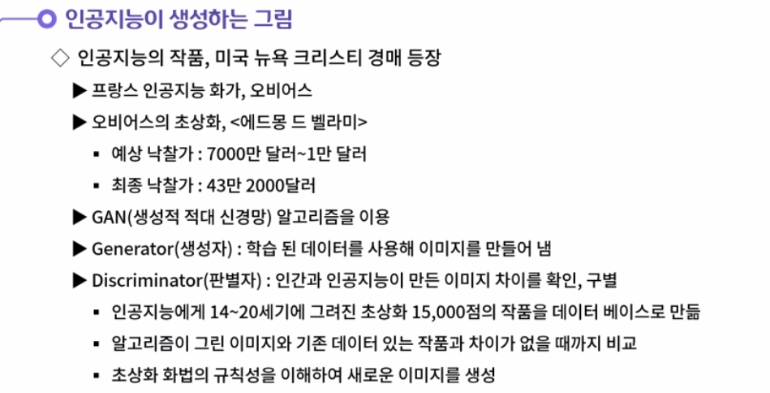

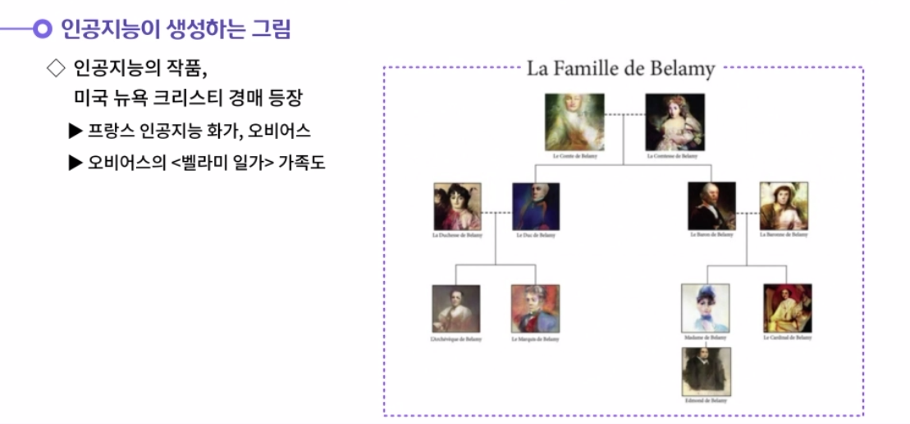

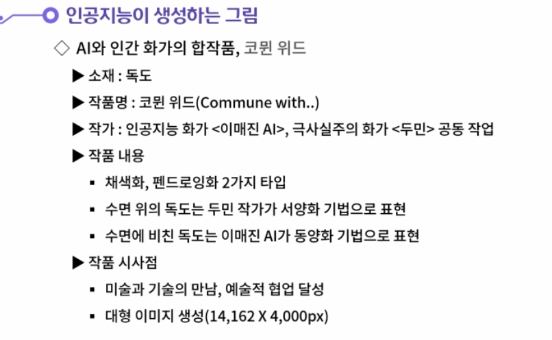

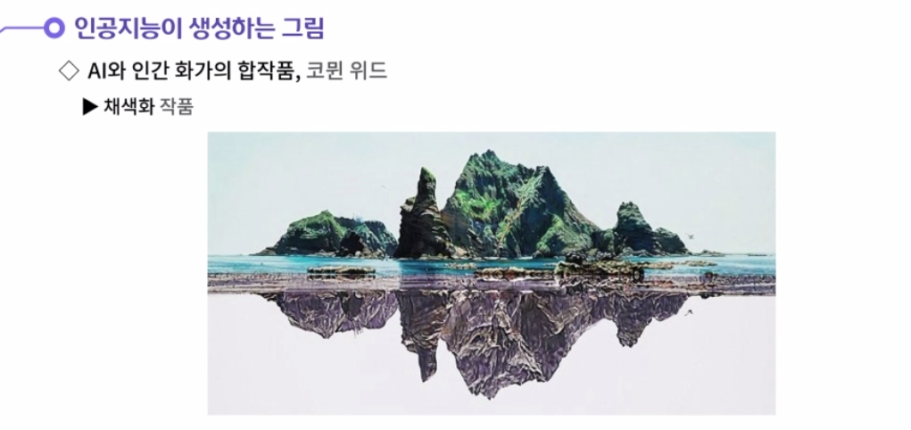

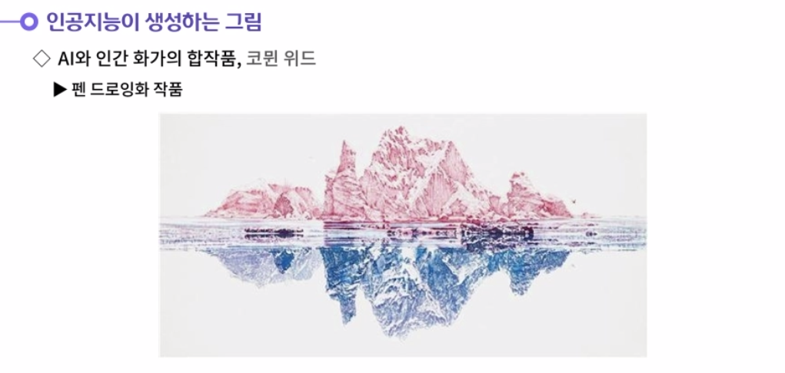

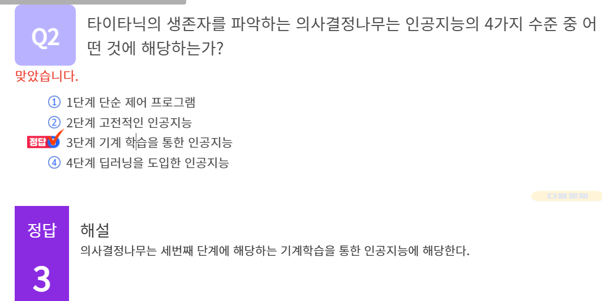

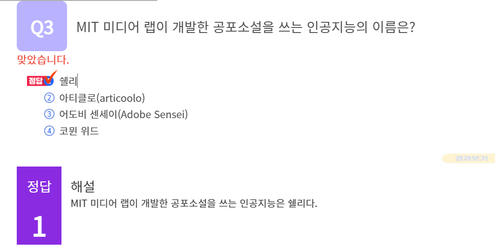

#### 1. 인공지능의 수준을 4가지 단계로 생각해봅시다.

1. 인공지능의 수준은 4가지 단계로 구분할 수 있다. 첫번째 단계는 단순제어 프로그램이다. 대표적인 사례는 센서에 반응하여 청소하는 로봇 청소기이다. 내부적으로 알고리즘에 대한 학습을 진행하지 않고, 단순한 패턴을 적용하여 행동하는 것이다.
   두번째 단계는 고전적인 인공지능이다. 고전적인 인공지능의 대표적인 사례는 알파고를 제외한 장기, 바둑프로그램, 움직이는 게임에서의 NPC 등으로 정의할 수 있다. 두번째 단계 또한 패턴을 프로그래밍해둔 상태이다. a일때에는 a로 행동하고, b일때는 b로 행동해야 한다는 패턴이 입력되어 있어 정해진 방식대로 행동한다. 첫번째 단계의 단순제어프로그램과 차이점이 있다면 좀 더 패턴이 복잡하다는 것이다.
   세번째 단계는 기계학습을 통한 인공지능이다. 기계학습의 대표적인 사례는 의사결정 나무, 손 글씨 인식 알고리즘이 있다. 이때부터 컴퓨터가 추론, 통계, 지식베이스를 사용하여 스스로 판단을 내릴 수 있다. 인간이 판단을 내려야 하는 특정 범위에 제한해주면, 인공지능이 의사결정을 내리는 것이다.
   네번째 단계는 딥러닝을 도입한 인공지능이다. 대표적인 케이스는 구글의 딥마인드와 알파고가 있다. 딥러닝을 도입한 인공지능은 인간이 판단의 범위를 제한해줄 필요가 없다. 인공지능 스스로 판단기준도 설정하고 판단도 내릴 수 있다.

