## 27.인공지능서비스성과기준기획하기

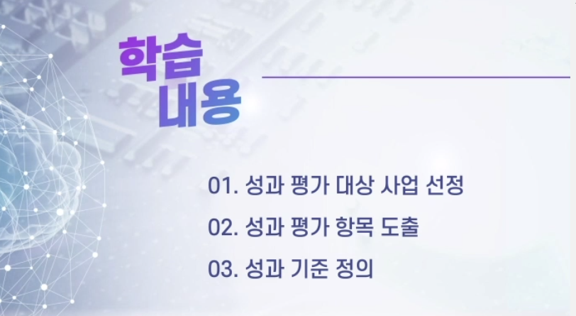

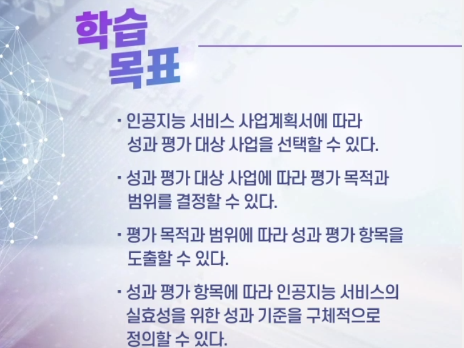

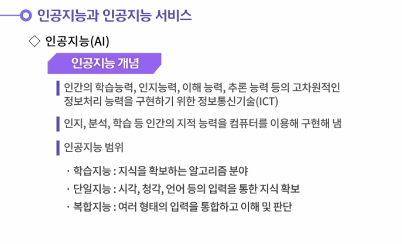

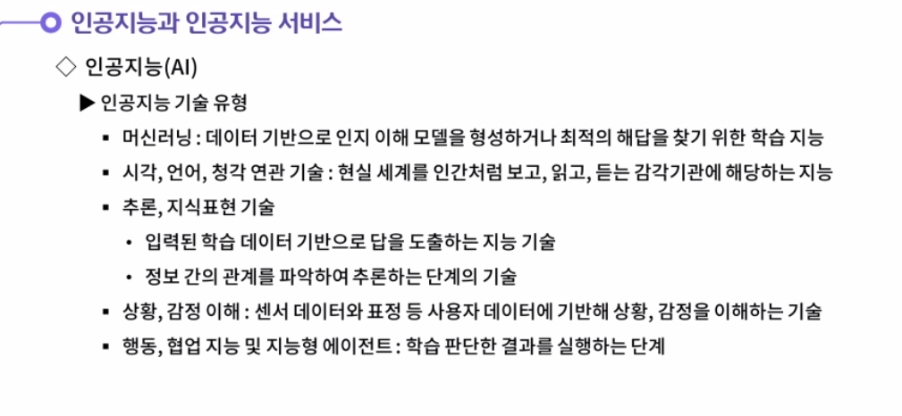

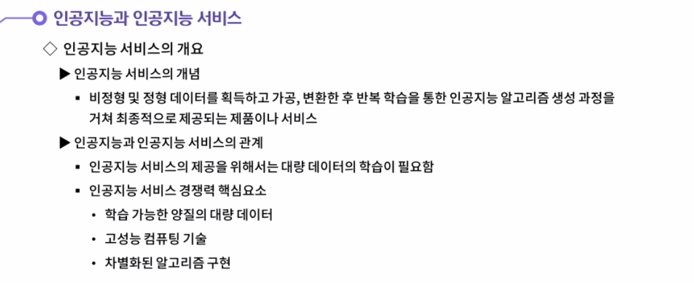

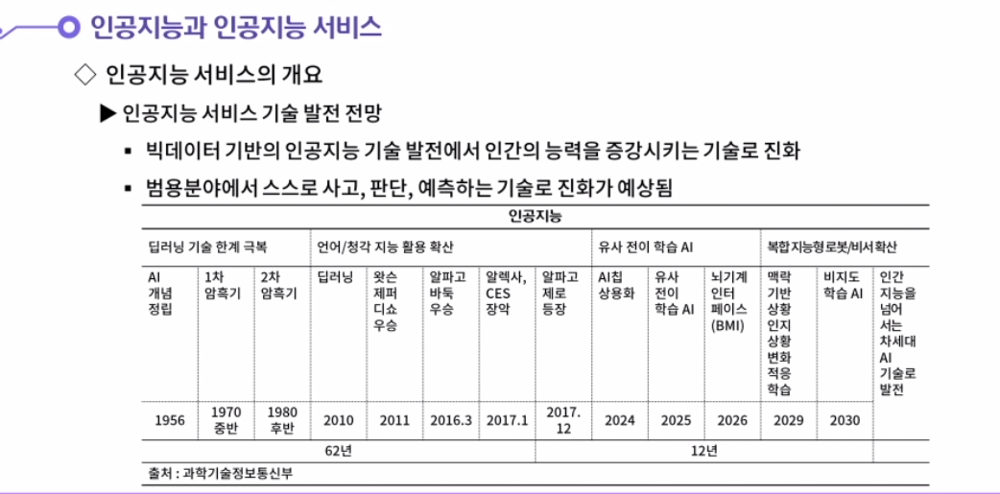

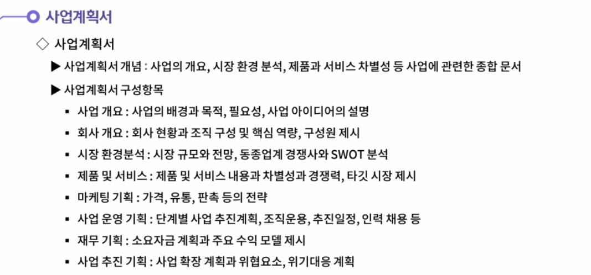

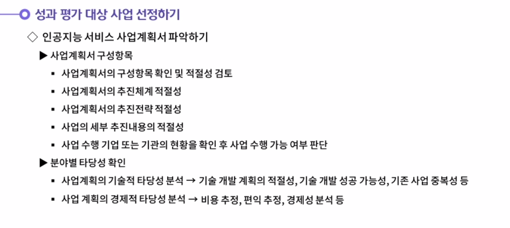

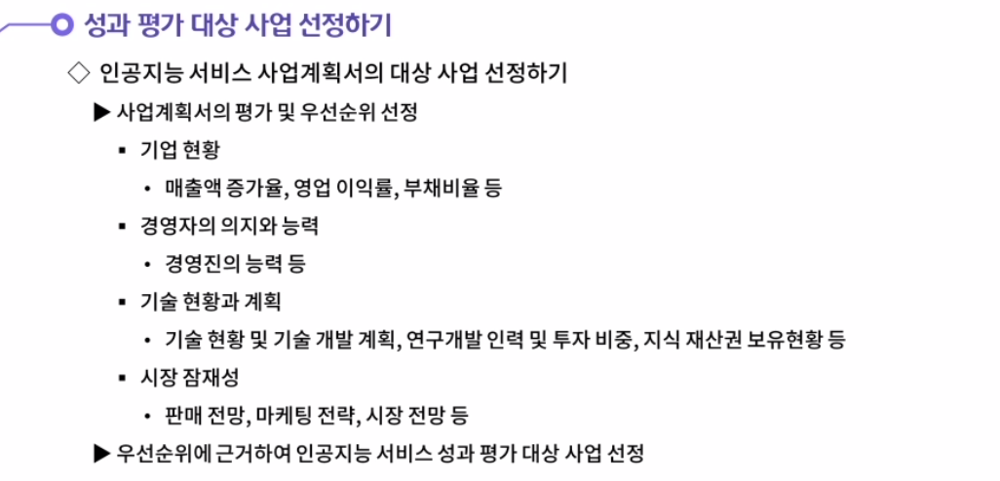

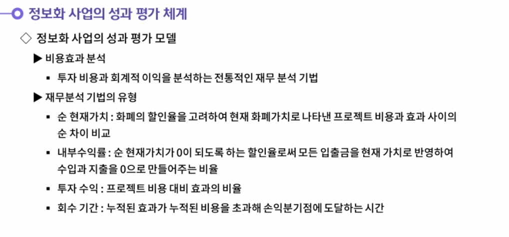

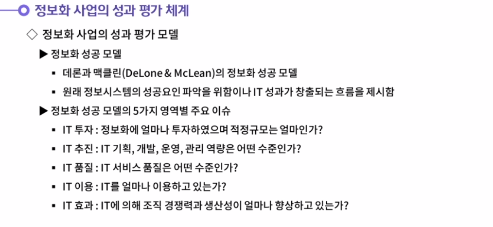

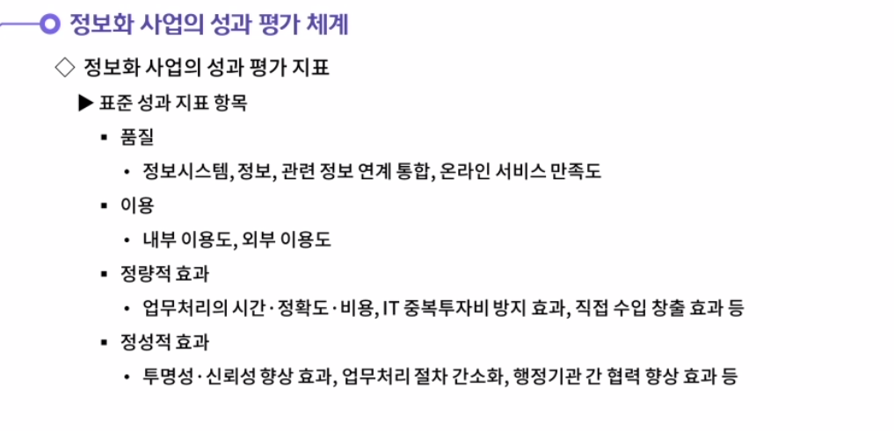

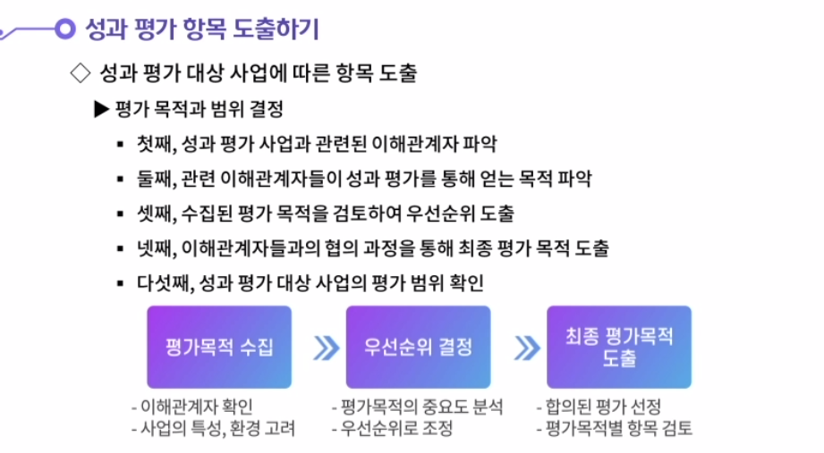

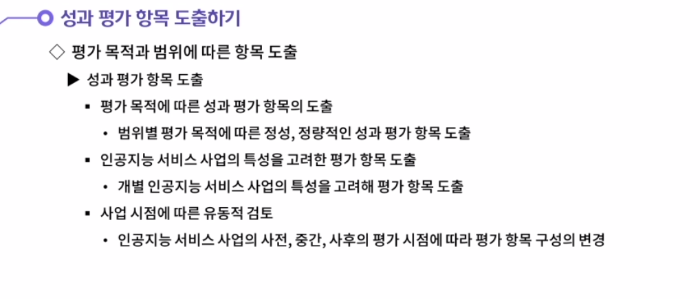

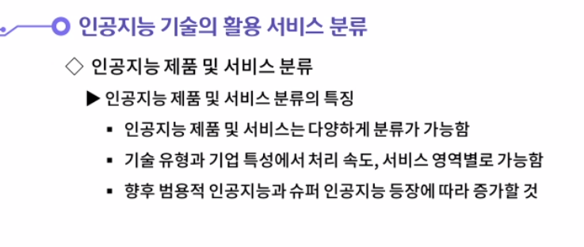

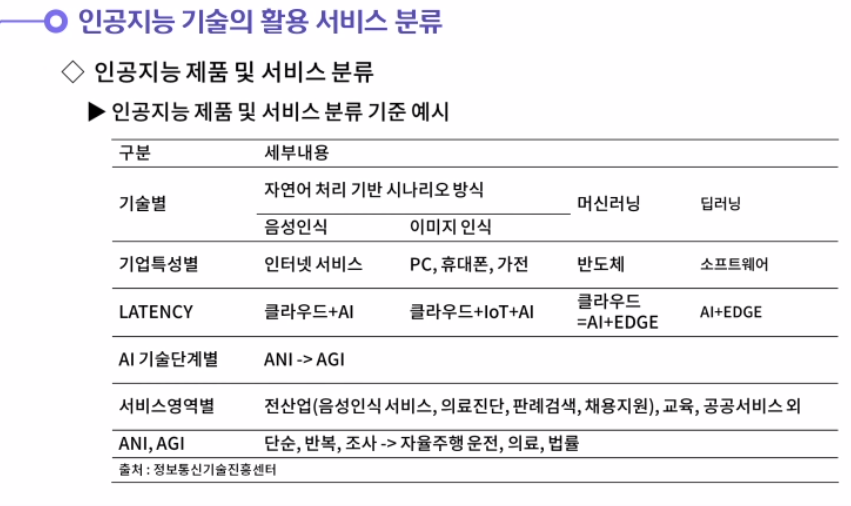

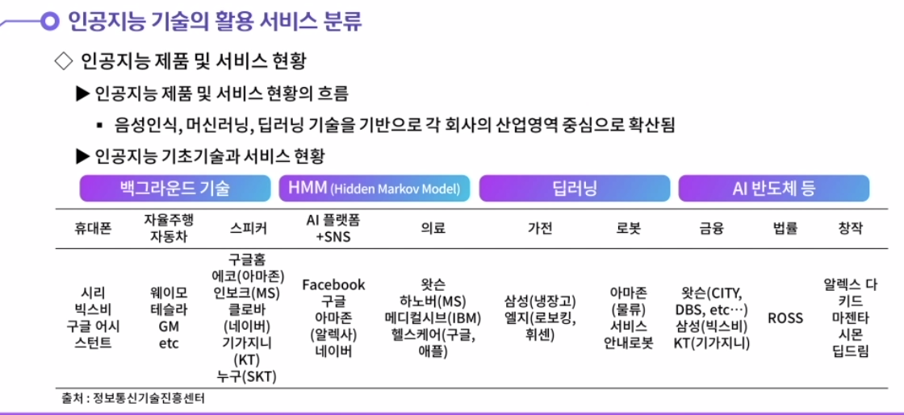

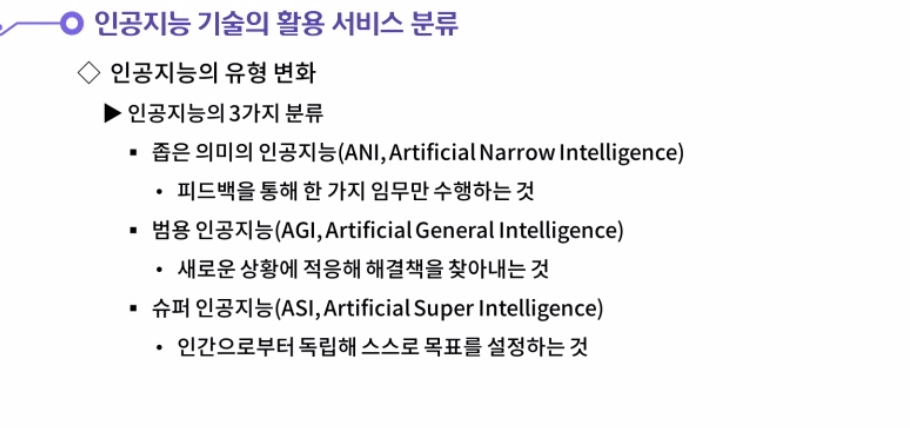

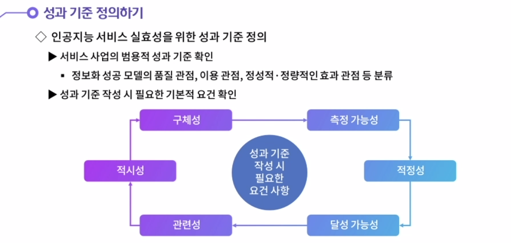

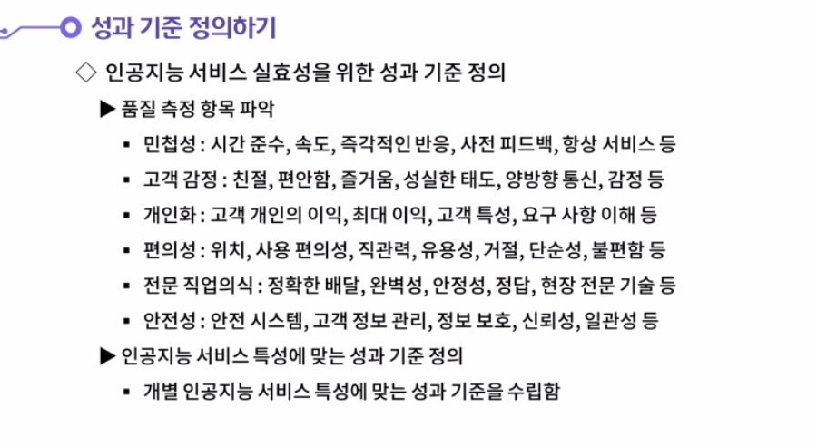

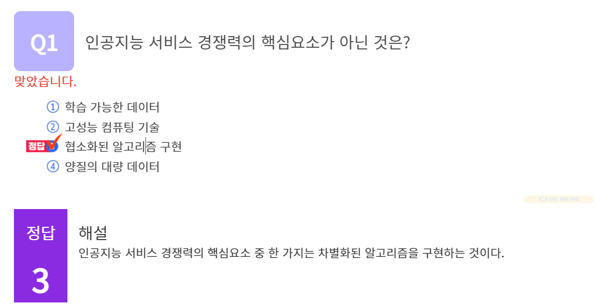

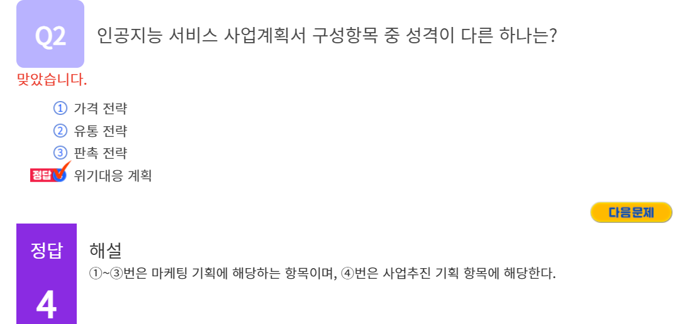

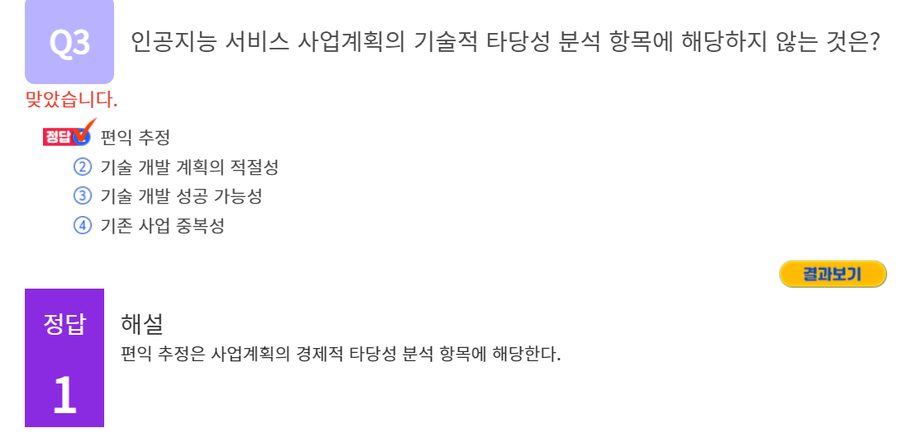

#### 1. 인공지능의 유형 변화를 3가지로 분류해서 생각해 봅시다.

1. 첫째, 좁은 의미의 인공지능(ANI, Artificial Narrow Intelligence)이다. 이는 피드백을 통해 한 가지 임무만 수행하는 것을 의미한다.
   둘째, 범용 인공지능(AGI, Artificial General Intelligence)이다. 이는 새로운 상황에 적응해 해결책을 찾아내는 것을 의미한다.
   셋째, 슈퍼 인공지능(ASI, Artificial Super Intelligence)이다. 이는 인간으로부터 독립해 스스로 목표를 설정하는 것을 의미한다.

