## 30.AI의실패영역과인간의관여

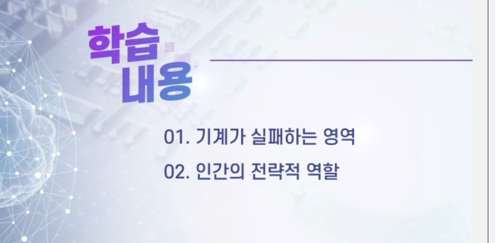

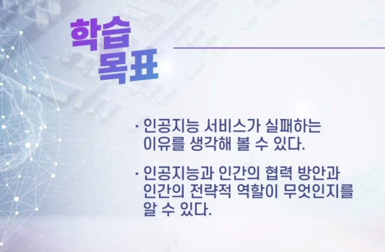

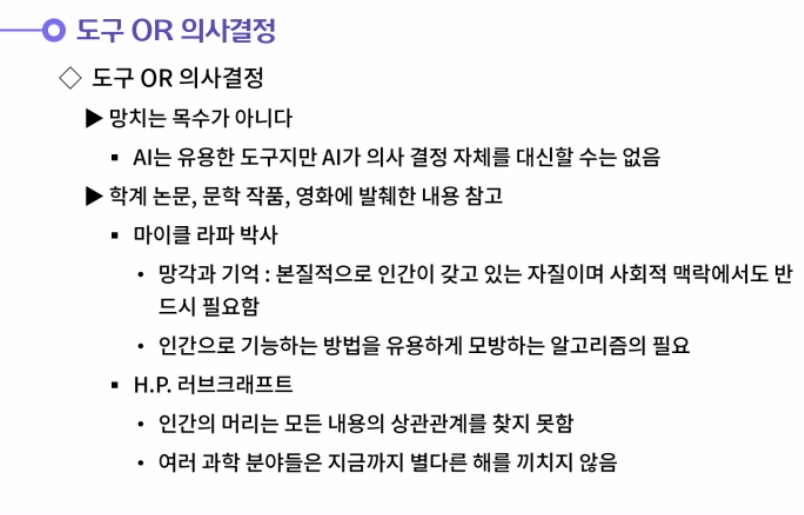

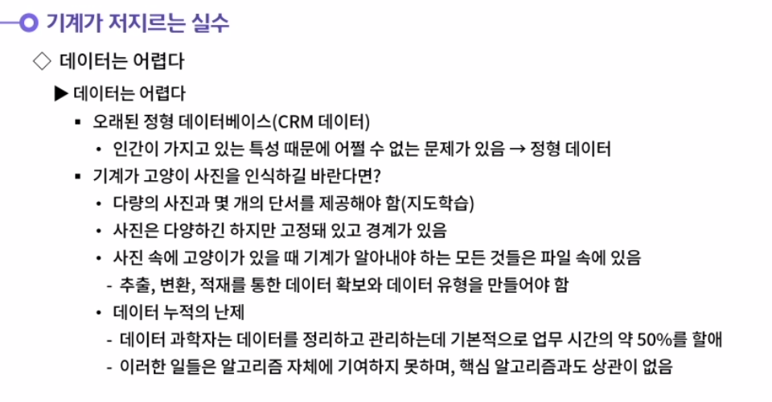

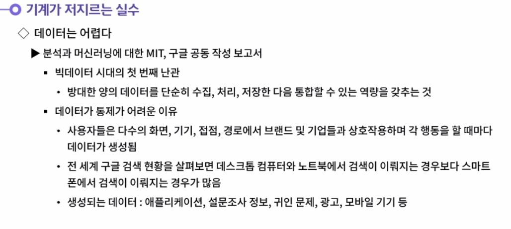

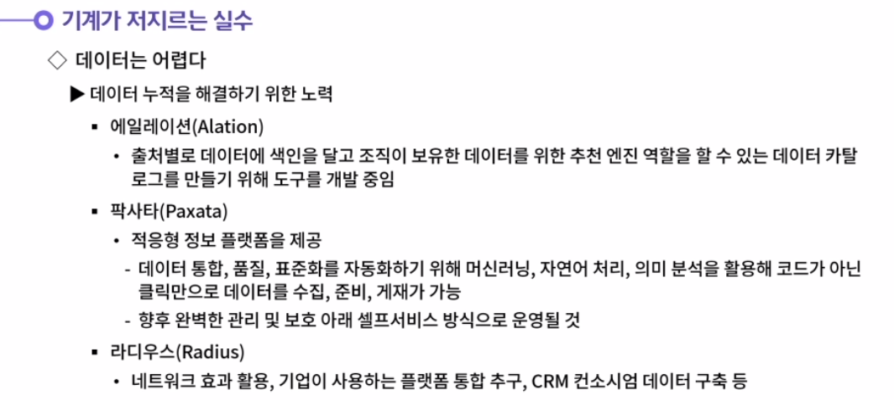

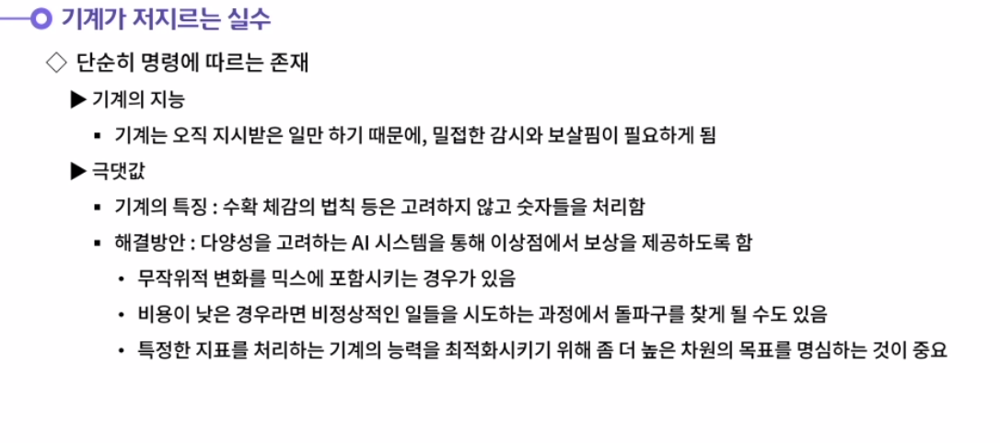

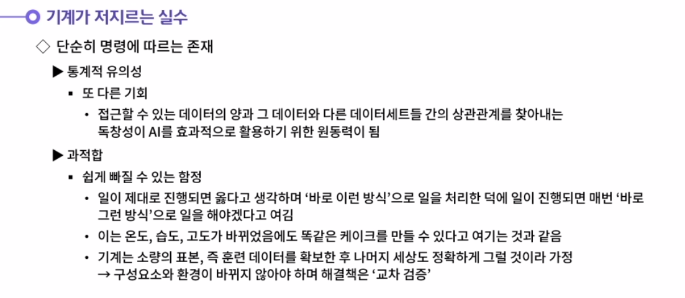

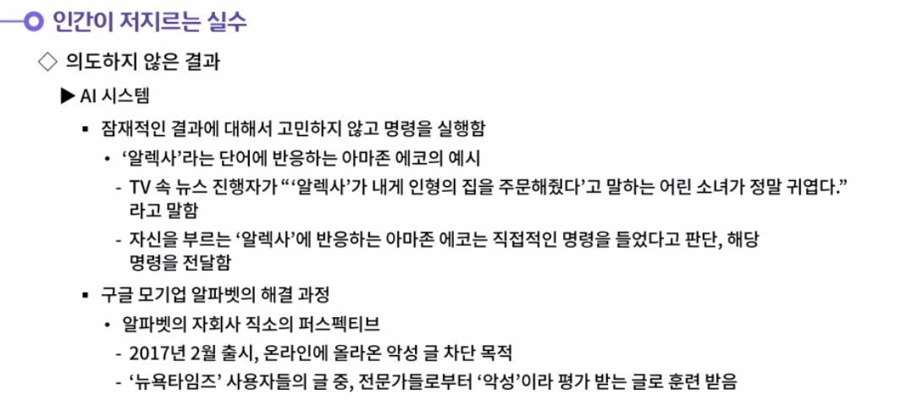

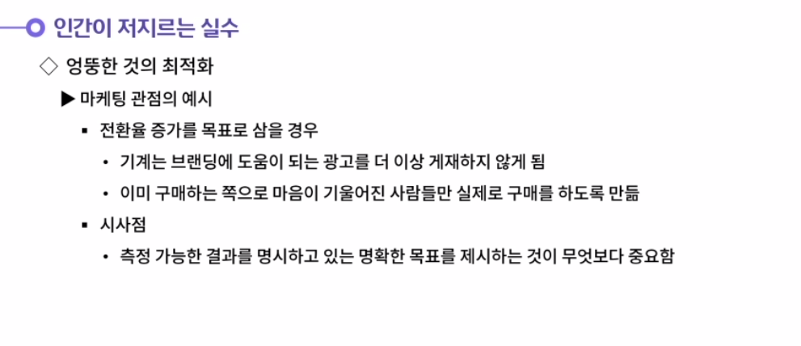

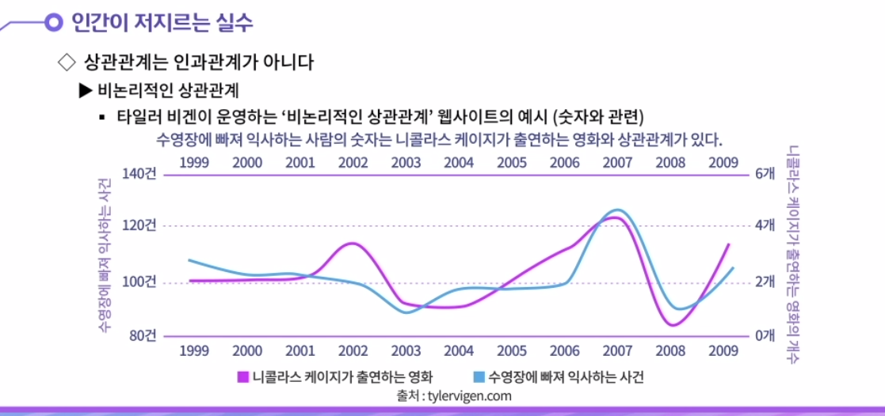

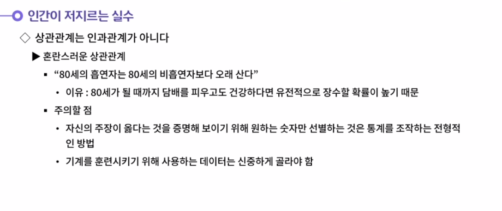

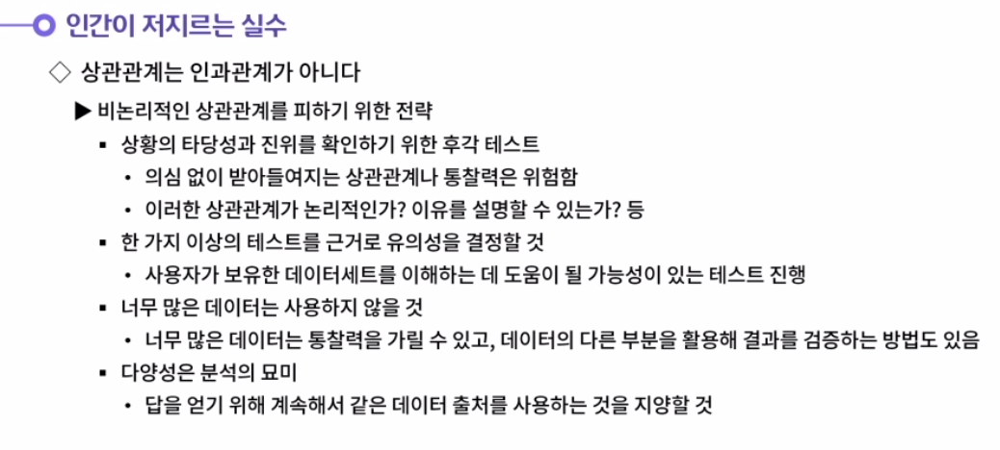

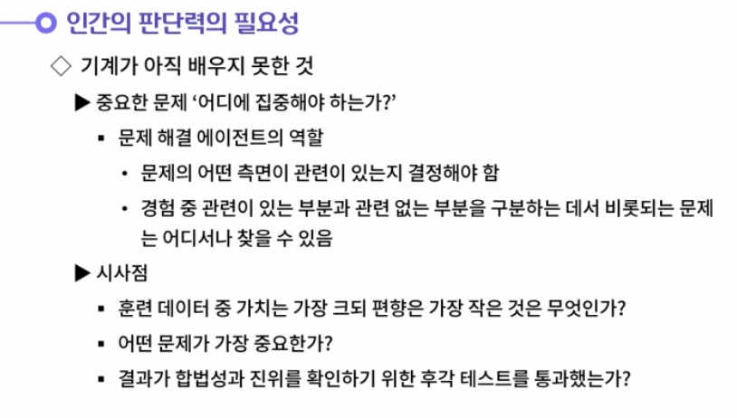

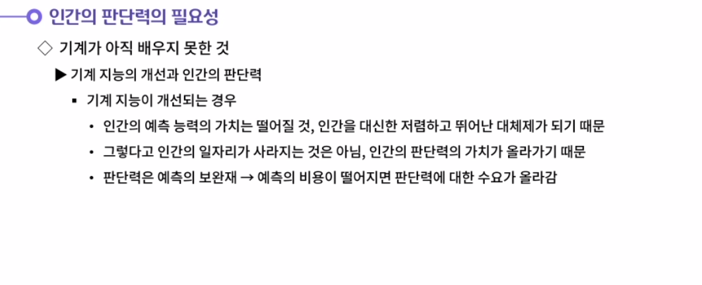

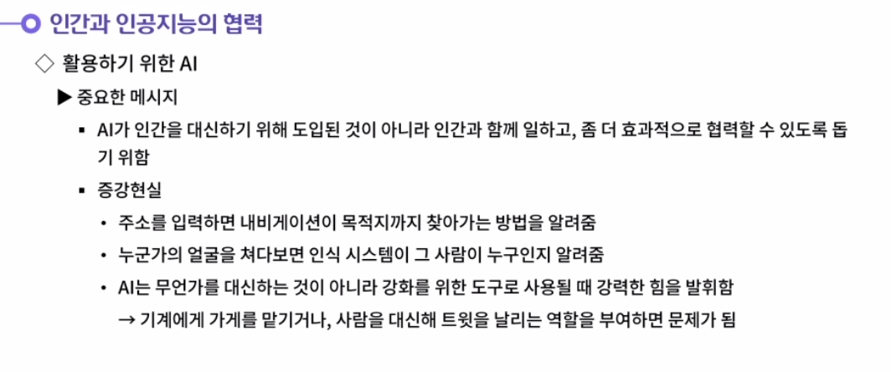

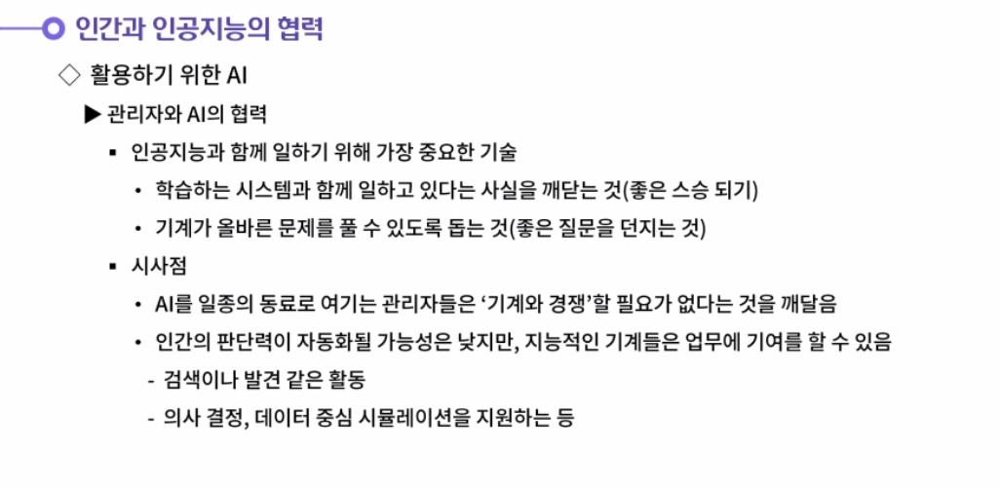

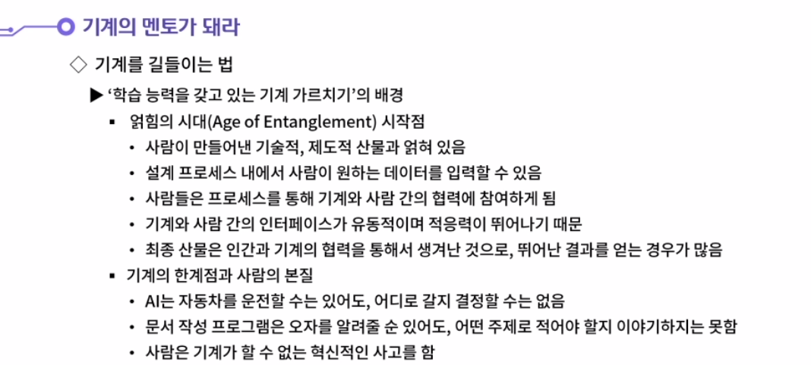

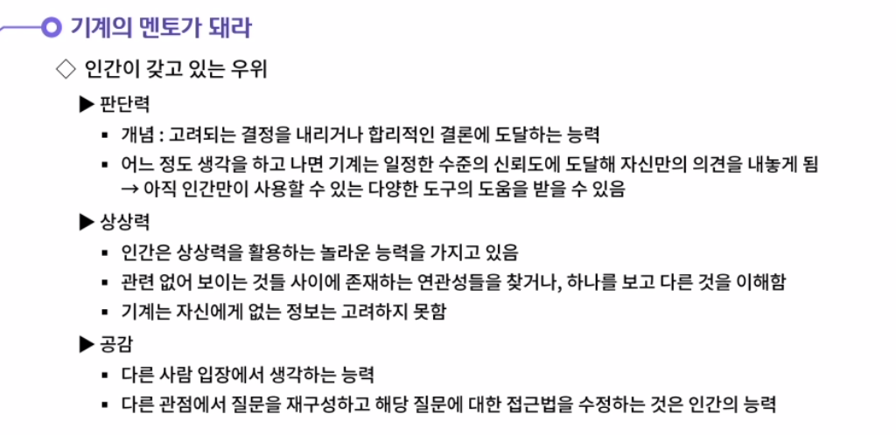

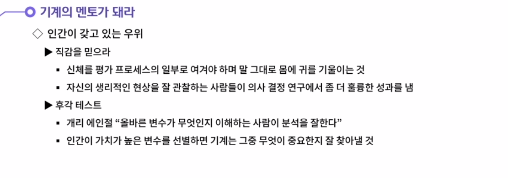

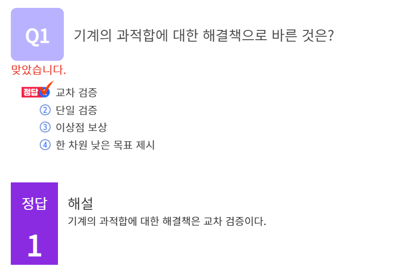

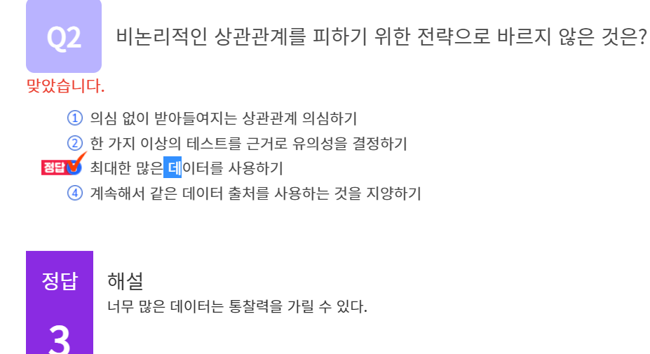

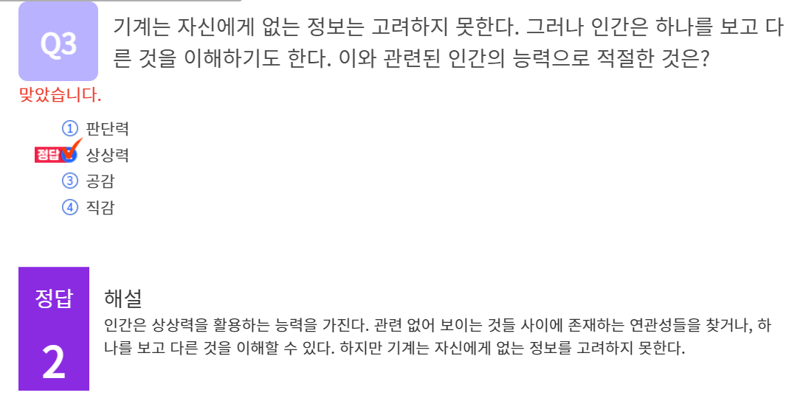

#### 1. 얽힘의 시대(Age of Entanglement)에 대해 생각해 봅시다.

1. 사람이 만들어낸 기술적, 제도적 산물과 얽혀 있다는 의미이다. 설계 프로세스 내에서 사람이 원하는 데이터를 입력할 수 있고, 사람들은 프로세스를 통해 기계와 사람 간의 협력에 참여하게 된다. 기계와 사람 간의 인터페이스가 유동적이며 적응력이 뛰어나기 때문이다. 최종 산물은 인간과 기계의 협력을 통해서 생겨난 것으로, 뛰어난 결과를 얻는 경우가 많다.

