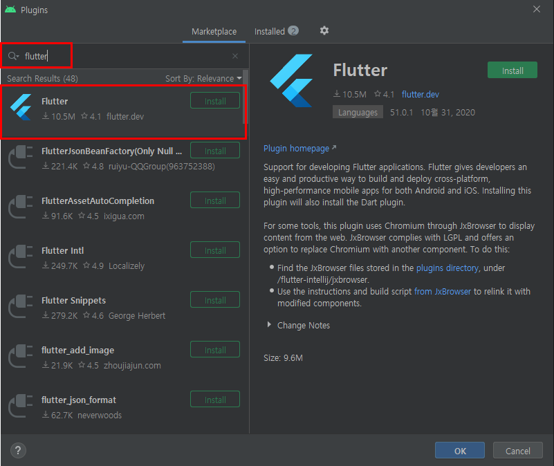
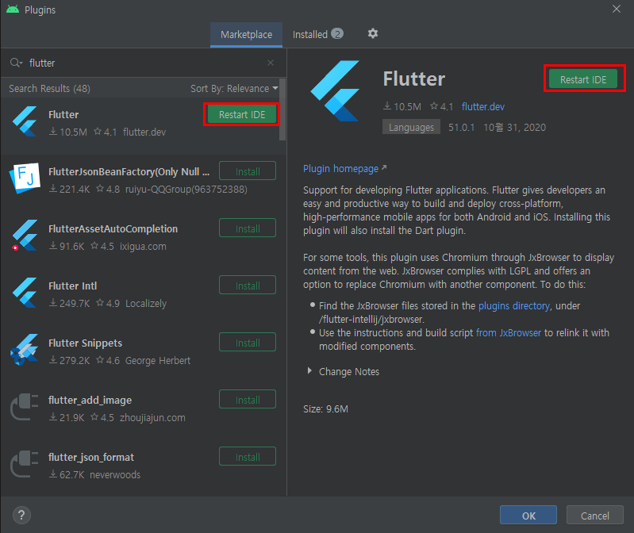
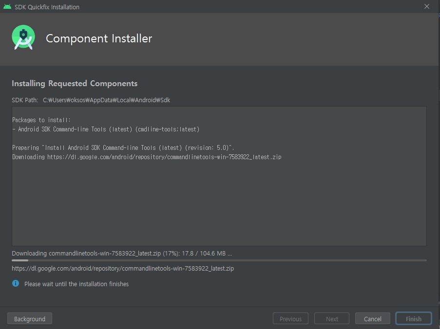
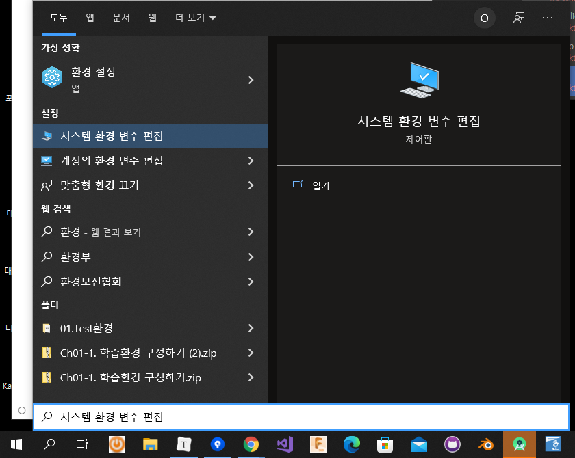
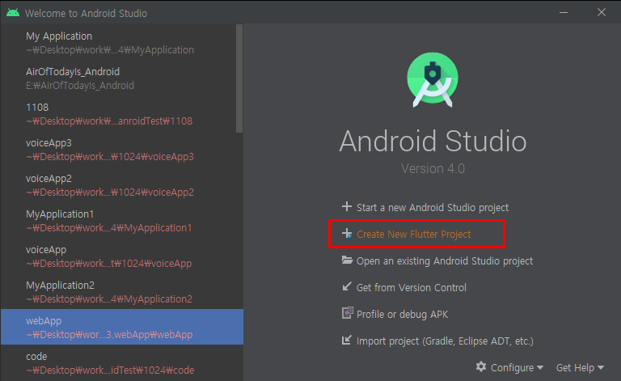
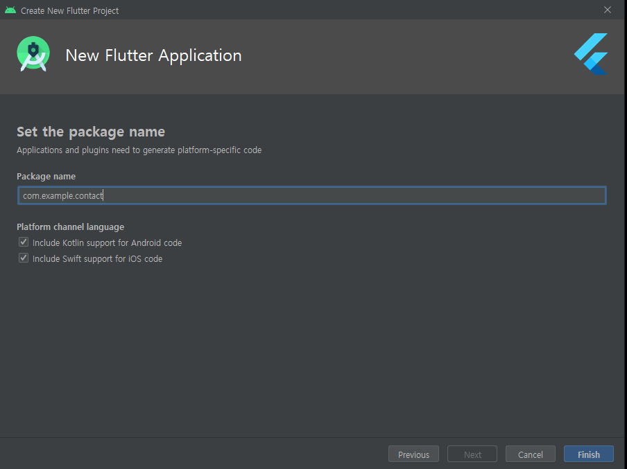
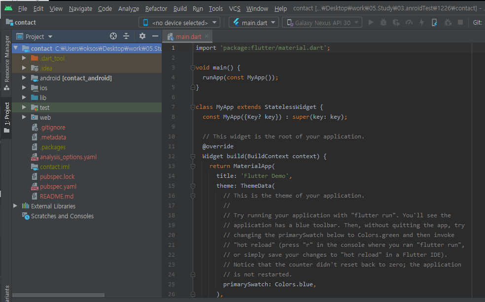

## 2021.12.25_0.플러터설치

## 목차 
>>1. Flutter 개발 환경 셋팅 순서
>>1. Flutter SDK 다운
>>1. 안드로이드 설치
>>1. 환경변수 설정
>>1. 맥의 경우
>>>>- 5.1 터미널 이름이 zsh인 경우
>>>>- 5.2 터미널 이름이 bash인 경우
>>6. 나머지 필요한 것
>>
>>7. 플러터 프로젝트 생성

## 1. Flutter 개발 환경 셋팅 순서

- Flutter SDK 다운
- Android Studio 설치
- 환경변수 등록
- 기타 등등

## 2. Flutter SDK 다운

- [Flutter설치링크](https://docs.flutter.dev/get-started/install)


- 현재 자기 자신에게 맞는 OS를 설치하면됨


- 맞는 버전을 클릭하게 되면 다른 창으로 넘어감

- 이때, 좀 내리다 보면 파란 버튼이 존재함

  - zip파일 클릭
  - 압축파일은 C드라이버에 풀기(아무곳이나 상관은 없음)

  

## 3.안드로이드 설치

- [안드로이드설치](https://developer.android.com/studio?hl=ko)


- 설치를 하고 저기 Configure/ Plugins 클릭



- flutter 입력 후 install 클릭



- 재시작해주면 적용됨


- configure/ SDK Manager 클릭


- Anddroid SDK Command-line Tools (latest) 클릭 후 Apply



- 위와 같은 창이 나오고 완료가 되면 일단 설정 끝


- 플러터의 경우 저것을 눌러서 이제 만들면됨

## 4.환경 변수 설정



- 시스템 환경 변수 편집 입력 후 클릭


- 환경변수 클릭 후


- bin 폴더를 지정해줘야함

## 5.맥의 경우

- 터미널 클릭


#### 5.1터미널 이름이 zsh인경우

```shell
touch ~/ .zshrc

open ~/.zshrc
```

#### 5.2터미널 이름이 bash인 경우

```shell
touch ~/ .bash_profile

open ~/.bash_profile
```

- 에디터가 뜬다 그럼


- 위와 같이 경로를 잘 넣어주면된다. 플러터를 설치한 경로임

## 6.나머지 필요한것

- 크롬없으면 설치해야함

- 윈도우는 powershell, cmd

- 맥북은 terminal

  - 신형의 경우 에러가 난다면

    ```shell
    softwareupdate --install-rosetta
    ```


- 윈도우 경우

  ```shell
  flutter doctor
  ```

  - 개발에 필요한것이 제대로 설치되어 있는지 알려줌

- ! 노란색의 경우 저대로 입력해주고 y 해주면됨

  ```shell
  flutter doctor --android-licenses
  ```

## 7.플러터 프로젝트 생성






- 위와 같이 그냥 적용하면됨



- 위와 같은 구성을 가지고 있음