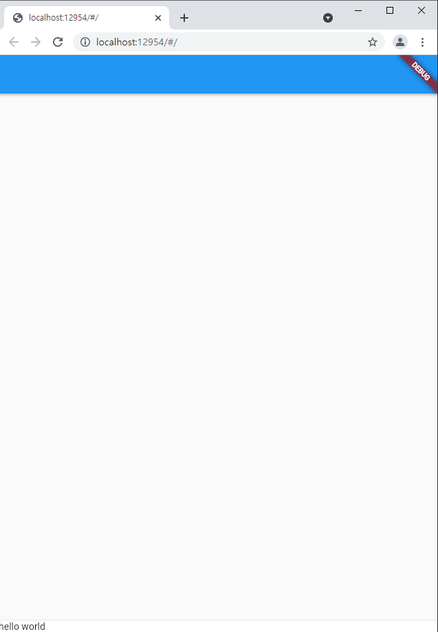
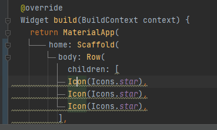
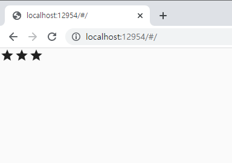
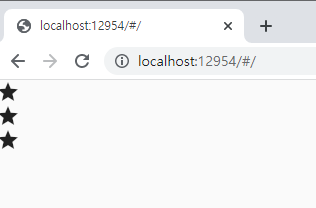
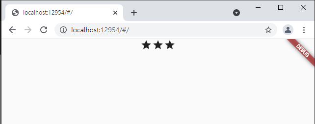
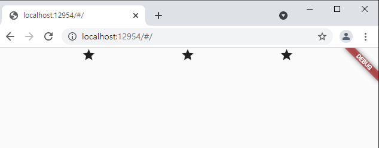
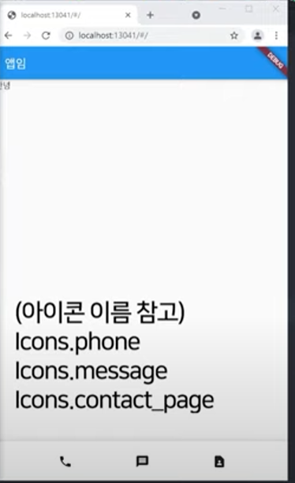
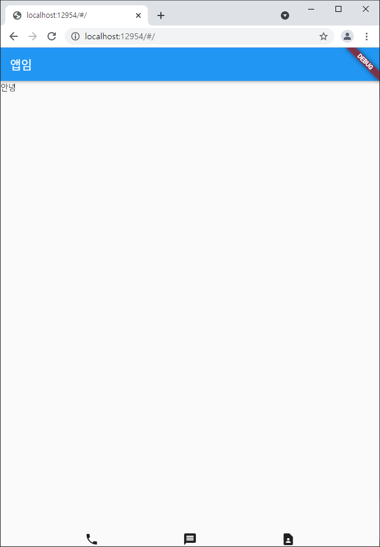

## 2021.12.28_02.가로세로배치하는법과Scaffold

## 목차

> 1. MaterialApp
>
>    > 1.1Scaffold()
>
> 2. 아이콘 여러개 가로로 배치
>
> 3. 중앙 정렬하기
>
>    > 3.1 crossAxisAlignments
>
> 4. 숙제

## 1. MaterialApp

- 이것에서 제공하는 ui, 위젯을 가져다 쓸수 있음
  - 단, 안드로이드 스타일
- Cupertino ... ()이것의 경우는 아이폰 스타일임
- 커스터 마이징 하고 싶다면?
  - MaterialApp써놓고 하면됨

### 1.1 Scaffold()

- 앱을 상 중 하로 나눠주는 것 
- 구역을 나누기 한것 
  - 순서대로 입력해주면됨

```dart
import 'package:flutter/material.dart';

void main() {
  runApp(const MyApp());
}
class MyApp extends StatelessWidget {
  const MyApp({Key? key}) : super(key: key);

  @override
  Widget build(BuildContext context) {
    return MaterialApp(
        home: Scaffold(
          appBar: AppBar(),
          body: Container(),
          bottomNavigationBar: BottomAppBar(child: Text('hello world'),),
        )
    );
  }
}
```



- 저렇게 표현 할 수 있음

## 2. 아이콘 여러개 가로로 배치

- `Row( Children: [])`

```dart
import 'package:flutter/material.dart';

void main() {
  runApp(const MyApp());
}
class MyApp extends StatelessWidget {
  const MyApp({Key? key}) : super(key: key);

  @override
  Widget build(BuildContext context) {
    return MaterialApp(
        home: Scaffold(
          body: Row(
            children:[
            Icon(Icons.star),
            Icon(Icons.star),
            Icon(Icons.star)
            ],
          ),
        )
    );
  }
}
```

- Lint라고 쓰는방식대로 쓰라고 밑줄이 생기는데 이것을 제거하려면 아래와 같음



- analysis_options.yaml

  ```yml
  rules:
    prefer_typing_uninitialized_variables : false
    prefer_const_constructors_in_immutables : false
    prefer_const_connstructors : false
    avoid_print : false
    prefer_const_literals_to_create_immutables : false
  
  ```



- 가로로 배치

```dart
import 'package:flutter/material.dart';

void main() {
  runApp(const MyApp());
}
class MyApp extends StatelessWidget {
  const MyApp({Key? key}) : super(key: key);

  @override
  Widget build(BuildContext context) {
    return MaterialApp(
        home: Scaffold(
          body: Column(
            children: [
            Icon(Icons.star),
            Icon(Icons.star),
            Icon(Icons.star),
          ],
          ),
        )
    );
  }
}
```



- 세로 배치

## 3. 중앙 정렬하기

- `mainAxisAlignment: MainAxisAlignment.center, `

```dart
import 'package:flutter/material.dart';

void main() {
  runApp(const MyApp());
}
class MyApp extends StatelessWidget {
  const MyApp({Key? key}) : super(key: key);

  @override
  Widget build(BuildContext context) {
    return MaterialApp(
        home: Scaffold(
          body: Row(
            mainAxisAlignment: MainAxisAlignment.center,
            children: [
            Icon(Icons.star),
            Icon(Icons.star),
            Icon(Icons.star),
          ],
          ),
        )
    );
  }
}
```

- ```dart
  mainAxisAlignment: MainAxisAlignment.center,
  ```



- 쉽게 가운데 정렬을 할 수 있음

```dart
mainAxisAlignment: MainAxisAlignment.spaceEvenly,
```



- CSS의 display : flex와 매우 유사함

### 3.1 crossAxisAlignments

- 세로 정렬 가능함

- 사용법

  ```dart
  crossAxisAlignment: CrossAxisAlignment.center,
  ```

- 자동완성은 ctrl + space 해서 잘 선택해서 사용하면됨

## 4. 숙제



- 실습해보기 

```dart
import 'package:flutter/material.dart';
import 'package:flutter/rendering.dart';

void main() {
  runApp(const MyApp());
}
class MyApp extends StatelessWidget {
  const MyApp({Key? key}) : super(key: key);

  @override
  Widget build(BuildContext context) {
    return MaterialApp(
        home: Scaffold(
          appBar: AppBar(title: Text('앱임'),),
          body: Container(child:  Text('안녕'),),
          bottomNavigationBar:
          Row(
            mainAxisAlignment: MainAxisAlignment.spaceEvenly,
            children: [
              Icon(Icons.phone),
              Icon(Icons.message),
              Icon(Icons.contact_page),
            ],
          ),
        )
    );
  }
}
```



- 라인부분만 뺴고 적용