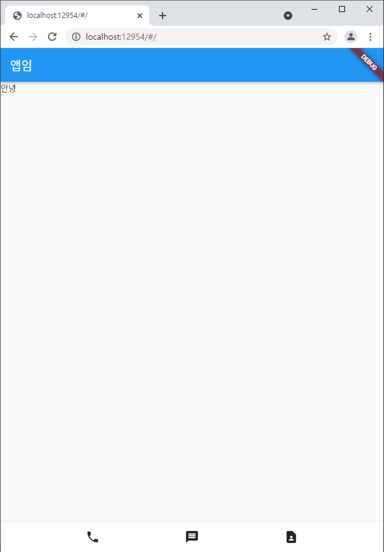
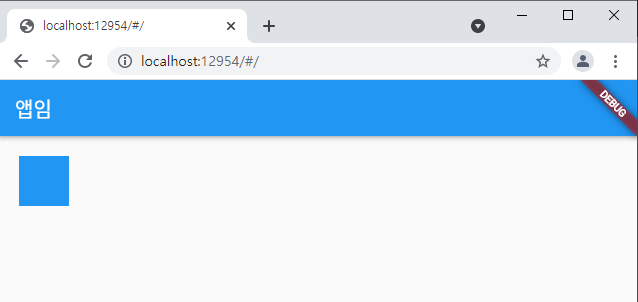
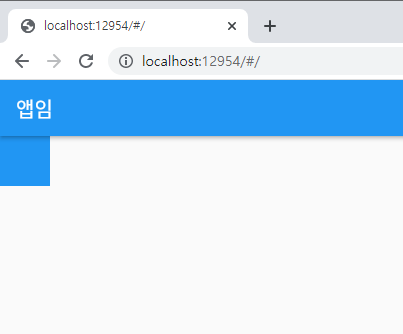
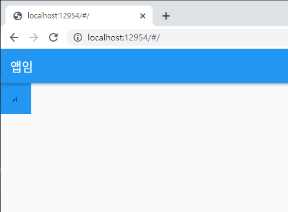
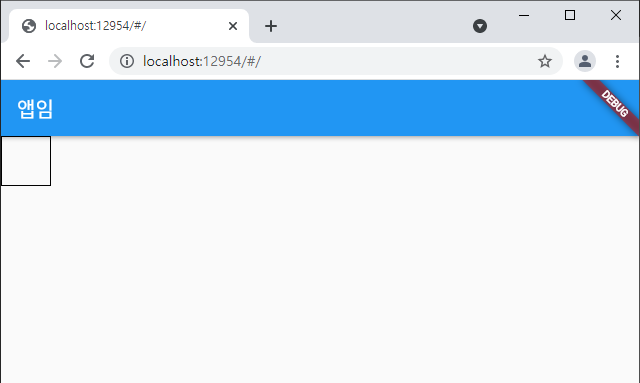
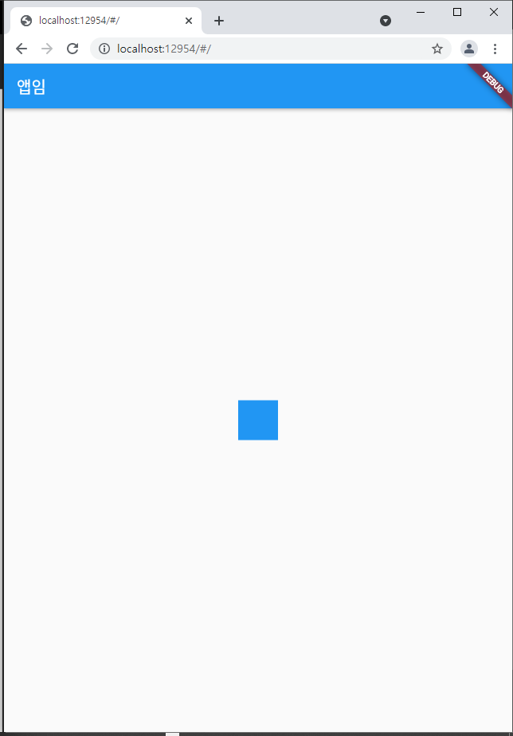
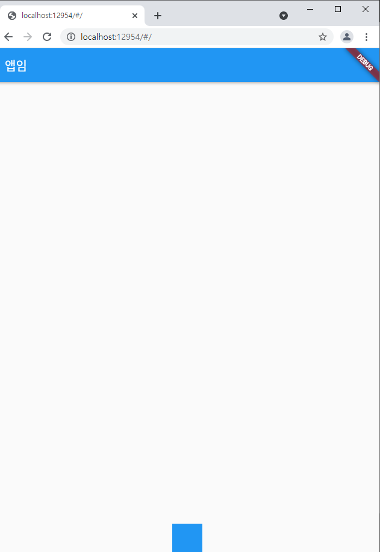
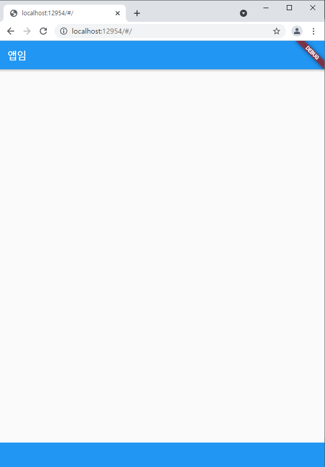

## 2021.12.28_03.박스잘그려야앱잘만듦

## 목차

> 1. 내가 한것
>
> 2. 실제 답
>
> 3. Container대용품
>
> 4. 박스 디자인
>
>    > 4.1 decoration
>
> 5. 박스 정렬
>
>    > 5.1 하단가운데 정렬
>    >
>    > 5.2 박스 width 가로로 가득 설정

## 1. 내가 한것

```dart
import 'package:flutter/material.dart';
import 'package:flutter/rendering.dart';

void main() {
  runApp(const MyApp());
}
class MyApp extends StatelessWidget {
  const MyApp({Key? key}) : super(key: key);

  @override
  Widget build(BuildContext context) {
    return MaterialApp(
        home: Scaffold(
          appBar: AppBar(title: Text('앱임'),),
          body: Container(child:  Text('안녕'),),
          bottomNavigationBar:
          Row(
            mainAxisAlignment: MainAxisAlignment.spaceEvenly,
            children: [
              Icon(Icons.phone),
              Icon(Icons.message),
              Icon(Icons.contact_page),
            ],
          ),
        )
    );
  }
}
```

## 2. 실제 답

```dart
import 'package:flutter/material.dart';
import 'package:flutter/rendering.dart';

void main() {
  runApp(const MyApp());
}
class MyApp extends StatelessWidget {
  const MyApp({Key? key}) : super(key: key);

  @override
  Widget build(BuildContext context) {
    return MaterialApp(
        home: Scaffold(
          appBar: AppBar(title: Text('앱임'),),
          body: Text('안녕'),
          bottomNavigationBar:
          BottomAppBar(
            child: Container(
              height: 50,
              child: Row(
                mainAxisAlignment: MainAxisAlignment.spaceEvenly,
                children: [
                  Icon(Icons.phone),
                  Icon(Icons.message),
                  Icon(Icons.contact_page),
                ],
              ),
            ),
          ),
        )
    );
  }
}
```



- 추가된것 잘 보기 

## 3. Container 대용품

- SizedBox를 쓰면 에러 사라짐
  - 좀더 가벼운것

```dart
import 'package:flutter/material.dart';
import 'package:flutter/rendering.dart';

void main() {
  runApp(const MyApp());
}
class MyApp extends StatelessWidget {
  const MyApp({Key? key}) : super(key: key);

  @override
  Widget build(BuildContext context) {
    return MaterialApp(
        home: Scaffold(
          appBar: AppBar(title: Text('앱임'),),
          body: Text('안녕'),
          bottomNavigationBar:
          BottomAppBar(
            child: SizedBox(
              height: 50,
              child: Row(
                mainAxisAlignment: MainAxisAlignment.spaceEvenly,
                children: [
                  Icon(Icons.phone),
                  Icon(Icons.message),
                  Icon(Icons.contact_page),
                ],
              ),
            ),
          ),
        )
    );
  }
}
```

## 4. 박스 디자인

```dart
import 'package:flutter/material.dart';
import 'package:flutter/rendering.dart';

void main() {
  runApp(const MyApp());
}
class MyApp extends StatelessWidget {
  const MyApp({Key? key}) : super(key: key);

  @override
  Widget build(BuildContext context) {
    return MaterialApp(
        home: Scaffold(
          appBar: AppBar(title: Text('앱임'),),
          body: Container(
          width: 50, height: 50, color: Colors.blue,
          margin: EdgeInsets.all(20),
          ),
        )
    );
  }
}
```

- margin을 준경우



- ```dart
  margin: EdgeInsets.fromLTRB(10, 0, 0, 0)
  ```

  - 위와 같이 하면 개별적으로 위아래양옆 간격을 따로 줄 수 있음

- padding을 준경우

  - 글씨는 없지만 안에 간격이 생김



- 글씨 넣어서 확인

```dart
import 'package:flutter/material.dart';
import 'package:flutter/rendering.dart';

void main() {
  runApp(const MyApp());
}
class MyApp extends StatelessWidget {
  const MyApp({Key? key}) : super(key: key);

  @override
  Widget build(BuildContext context) {
    return MaterialApp(
        home: Scaffold(
          appBar: AppBar(title: Text('앱임'),),
          body: Container(
          width: 50, height: 50, color: Colors.blue,
          padding: EdgeInsets.all(20),
            child: Text('ddd'),
          ),
        )
    );
  }
}
```



### 4.1 decoration

```dart
import 'package:flutter/material.dart';
import 'package:flutter/rendering.dart';

void main() {
  runApp(const MyApp());
}
class MyApp extends StatelessWidget {
  const MyApp({Key? key}) : super(key: key);

  @override
  Widget build(BuildContext context) {
    return MaterialApp(
        home: Scaffold(
          appBar: AppBar(title: Text('앱임'),),
          body: Container(
          width: 50, height: 50, color: Colors.blue,
          decoration: BoxDecoration(
            border: Border.all(color: Colors.black)
          ),
          ),
        )
    );
  }
}
```

- 이렇게 하는 경우 에러 발생

- 원래 원칙상 컬러 중복 안되고 decoration에 넣어야함

  ```dart
  import 'package:flutter/material.dart';
  import 'package:flutter/rendering.dart';
  
  void main() {
    runApp(const MyApp());
  }
  class MyApp extends StatelessWidget {
    const MyApp({Key? key}) : super(key: key);
  
    @override
    Widget build(BuildContext context) {
      return MaterialApp(
          home: Scaffold(
            appBar: AppBar(title: Text('앱임'),),
            body: Container(
            width: 50, height: 50,
            decoration: BoxDecoration(
              border: Border.all(color: Colors.black)
            ),
            ),
          )
      );
    }
  }
  ```

  



- 이렇게 테두리를 적용 가능함

## 5. 박스 정렬

```dart
import 'package:flutter/material.dart';
import 'package:flutter/rendering.dart';

void main() {
  runApp(const MyApp());
}
class MyApp extends StatelessWidget {
  const MyApp({Key? key}) : super(key: key);

  @override
  Widget build(BuildContext context) {
    return MaterialApp(
        home: Scaffold(
          appBar: AppBar(title: Text('앱임'),),
          body: Center(
            child: Container(
            width: 50, height: 50, color: Colors.blue,
            ),
          ),
        )
    );
  }
}
```




- 왼쪽 또는 오른쪽으로도 가능

### 5.1 하단 가운데 정렬

```dart
import 'package:flutter/material.dart';
import 'package:flutter/rendering.dart';

void main() {
  runApp(const MyApp());
}
class MyApp extends StatelessWidget {
  const MyApp({Key? key}) : super(key: key);

  @override
  Widget build(BuildContext context) {
    return MaterialApp(
        home: Scaffold(
          appBar: AppBar(title: Text('앱임'),),
          body: Align(
            alignment: Alignment.bottomCenter,
            child: Container(
            width: 50, height: 50, color: Colors.blue,
            ),
          ),
        )
    );
  }
}
```



### 5.2 박스width 가로로 가득설정

```
width: double.infinity, height: 50, color: Colors.blue,
```

- width를 double.infinity로 하면됨



- 단 부모를 넘지 않는 선에서 가능함