## 2021.12.29_04.AppBar

## 목차

> 1. Typography
>
>    > 1.1 글씨 색 조절 (기본)
>    >
>    > 1.2 글씨 색 조절 (RGB)
>
> 2. 기타 등등 설정
>
>    > 2.1 fontWeight
>    >
>    > 2.2 아이콘 스타일
>
> 3. 버튼 위젯
>
>    > 3.1 버튼 디자인
>    >
>    > 3.2 아이콘 버튼
>
> 4. AppBar
>
> 5. 레이아웃 혼자서 잘 짜는 법
>
> 6. 숙제

## 1.Typography

### 1.1 글씨 색 조절 (기본)

```dart
import 'package:flutter/material.dart';

void main() {
  runApp(const MyApp());
}
class MyApp extends StatelessWidget {
  const MyApp({Key? key}) : super(key: key);

  @override
  Widget build(BuildContext context) {
    return MaterialApp(
        home: Scaffold(
          appBar: AppBar(title: Text('앱임'),),
          body: SizedBox(
             child: Text('안녕하세요',
               style: TextStyle(color: Colors.red),
             ),
            ),
          )
        );
  }
}
```


### 1.2 글씨 색 조절 (RGB)

```dart
import 'package:flutter/material.dart';

void main() {
  runApp(const MyApp());
}
class MyApp extends StatelessWidget {
  const MyApp({Key? key}) : super(key: key);

  @override
  Widget build(BuildContext context) {
    return MaterialApp(
        home: Scaffold(
          appBar: AppBar(title: Text('앱임'),),
          body: SizedBox(
             child: Text('안녕하세요',
               style: TextStyle(color: Color(0xffaaaaaa)),
             ),
            ),
          )
        );
  }
}
```

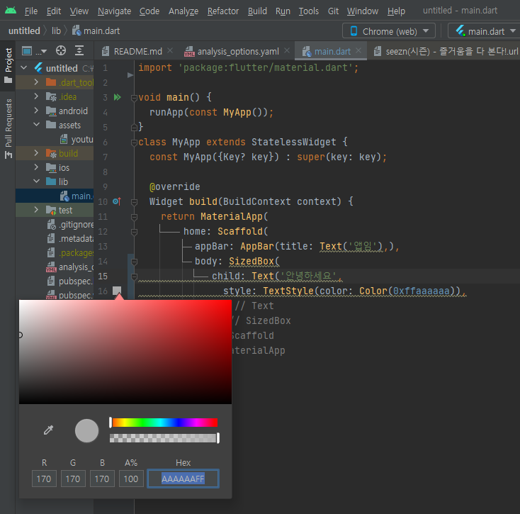

- `Color(0xffaaaaaaa)`
  - 위를 적용하게 되면 저렇게 팔레트가 나오게 되고 설정 가능함

```dart
style: TextStyle(color: Color.fromARGB(a, r, g, b)),
```

- 위와 같이 가능함

## 2.기타등등 설정

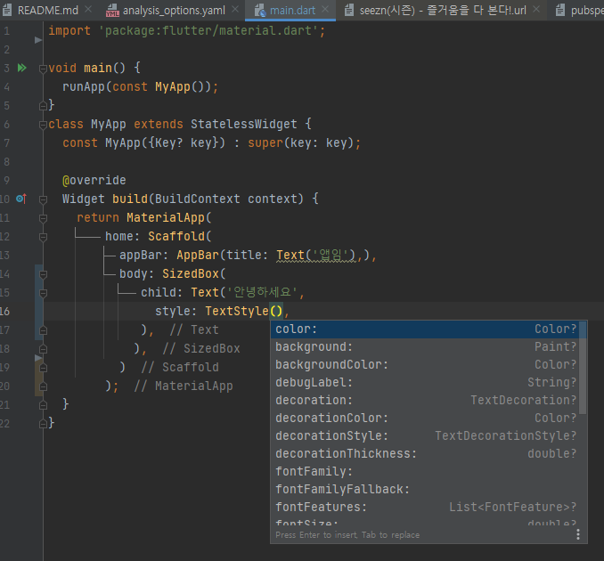

- 여러가지 스타일로 적용 가능
- 사실 검색해서 쓰면됨 외울 필요는 없음

### 2.1 fontWeight

- `fontWeight: FontWeight.w700`

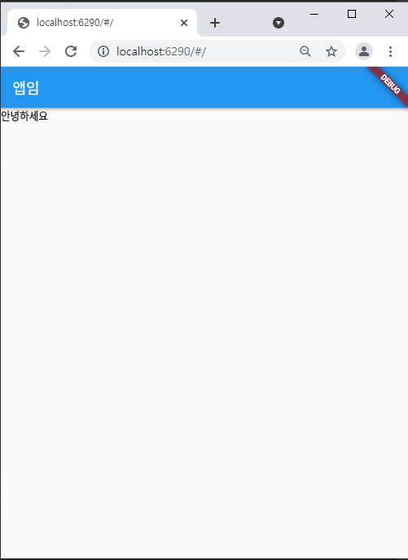

- 위처럼 두께가 두꺼워짐

### 2.2 아이콘 스타일

- color, size 적용 가능

## 3.버튼 위젯

- TextButton()
- IconButton()
- ElevatedButton()
  -  위에서 넣고 싶은것 선택하면됨

```dart
import 'package:flutter/material.dart';

void main() {
  runApp(const MyApp());
}
class MyApp extends StatelessWidget {
  const MyApp({Key? key}) : super(key: key);

  @override
  Widget build(BuildContext context) {
    return MaterialApp(
        home: Scaffold(
          appBar: AppBar(title: Text('앱임'),),
          body: SizedBox(
            child: TextButton(child: Text('글자'),onPressed: (){},),
          ),
        )
    );
  }
}
```

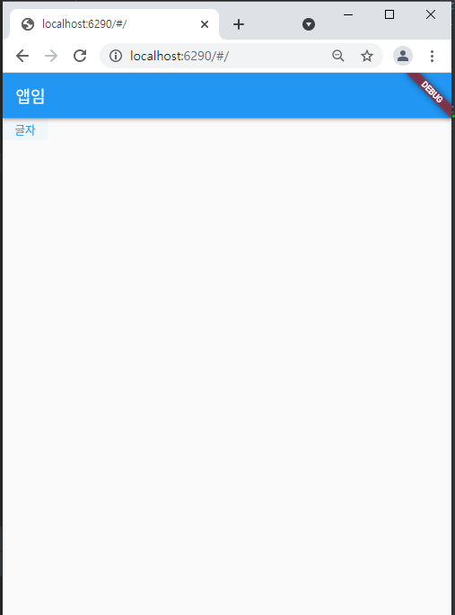

- (){}의 경우 어떤 메소드를 넣어서 버튼을 클릭했을 때 동작하게 하는 것임

### 3.1 버튼 디자인

```dart
import 'package:flutter/material.dart';

void main() {
  runApp(const MyApp());
}
class MyApp extends StatelessWidget {
  const MyApp({Key? key}) : super(key: key);

  @override
  Widget build(BuildContext context) {
    return MaterialApp(
        home: Scaffold(
          appBar: AppBar(title: Text('앱임'),),
          body: SizedBox(
            child: ElevatedButton(child: Text('글자'),
              onPressed: (){},
            ),
          ),
        )
    );
  }
}
```

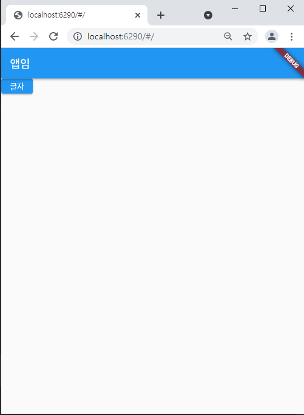

- 클릭시 물결이 생긴다. 구글 스타일임

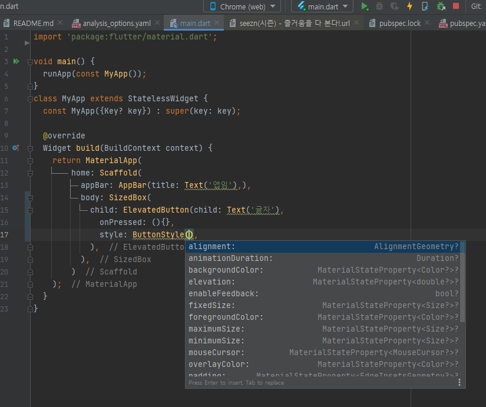

- 버튼에 적용 가능한 스타일들

### 3.2 아이콘 버튼

````dart
import 'package:flutter/material.dart';

void main() {
  runApp(const MyApp());
}
class MyApp extends StatelessWidget {
  const MyApp({Key? key}) : super(key: key);

  @override
  Widget build(BuildContext context) {
    return MaterialApp(
        home: Scaffold(
          appBar: AppBar(title: Text('앱임'),),
          body: SizedBox(
            child: IconButton(
              icon: Icon(Icons.star),
              onPressed: (){},
            ),
          ),
        )
    );
  }
}
````

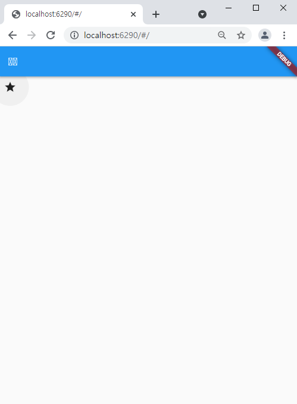

## 4.AppBar

-  title : 왼쪽 제목

  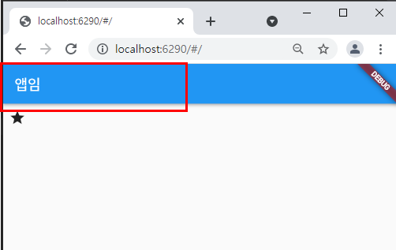

- leading : 왼쪽에 넣은 아이콘

  ```dart
  import 'package:flutter/material.dart';
  
  void main() {
    runApp(const MyApp());
  }
  class MyApp extends StatelessWidget {
    const MyApp({Key? key}) : super(key: key);
  
    @override
    Widget build(BuildContext context) {
      return MaterialApp(
          home: Scaffold(
            appBar: AppBar(leading: Icon(Icons.star),title: Text('제목이다.'),),
            body: SizedBox(),
            )
          );
    }
  }
  ```

  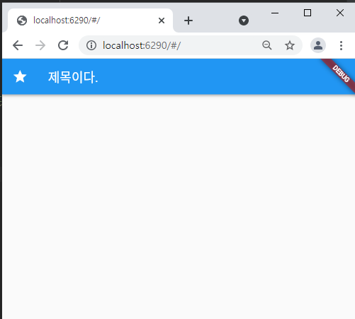

- actions: 우측 아이콘들

  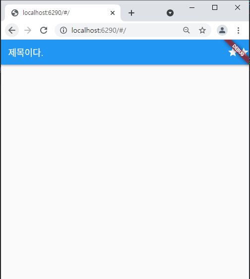

  - 우측에 버튼 만들 수 있음

## 5.레이아웃 혼자서 잘짜는 법
1. 예시 디자인 준비
2. 예시화면에 네모 그리기
   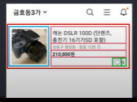
3. 바깥 네모부터 하나하나 위젯으로
   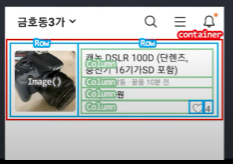

## 6.숙제 

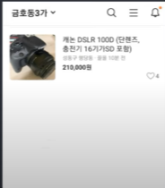

- 비슷하게 만들어 보기

```dart
import 'package:flutter/material.dart';

void main() {
  runApp(const MyApp());
}
class MyApp extends StatelessWidget {
  const MyApp({Key? key}) : super(key: key);

  @override
  Widget build(BuildContext context) {
    return MaterialApp(
        home: Scaffold(
          appBar: AppBar(
            actions: [Icon(Icons.search), Icon(Icons.menu), Icon(Icons.add_alert)],
            title: Text('금호동3가'),
             backgroundColor: Colors.white,
             foregroundColor: Colors.black,
          ),
          body: Container(
              width: double.infinity,
              height: 200,
              color: Colors.white,
              child:
              Row(
                  crossAxisAlignment : CrossAxisAlignment.stretch,
                children: <Widget>[
                  SizedBox(
                    width: 250,
                    height: 200,
                    child:
                    Image.asset('youtube.jpg'),
                  ),
                   SizedBox(
                     width: 300,
                       height: 200,
                       child: Column(
                         children: [
                           Container(
                             child: Text('캐논 DSLR 100D (단 렌즈, 충전기 16기가SD 포함',
                             style: TextStyle(
                               fontSize: 20,
                             ),
                               textAlign: TextAlign.left,
                             ),
                           ),
                           Container(
                             child: Row(
                               children: [
                                 Text('성동구 팔달동, 끝올 10분 전',
                                   style: TextStyle(
                                     fontSize: 10,
                                     color: Colors.grey,
                                   ),
                                   textAlign: TextAlign.left,
                                 ),
                               ],
                             ),
                           ),
                           Container(
                             child: Row(
                               children: [
                                 Text('210,000원',
                                   style: TextStyle(
                                     fontSize: 15,
                                   ),
                                   textAlign: TextAlign.left,
                                 ),
                               ],
                             ),
                           ),
                           Container(
                             child: Row(
                               mainAxisAlignment: MainAxisAlignment.end,
                               children: [
                                 Icon(Icons.favorite),
                                 Text('4',
                                   style: TextStyle(
                                     fontSize:15,
                                   ),
                                 ),
                               ],
                             )
                           ),
                         ],
                       ),
                   ),
                ],
              ),
          )
        )
      );
  }
}
```

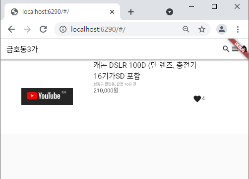