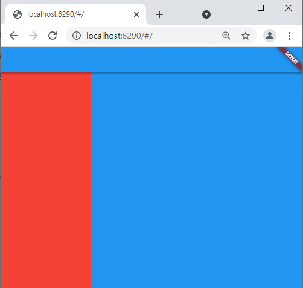
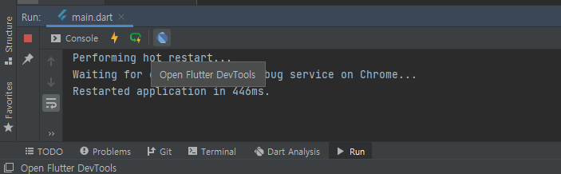
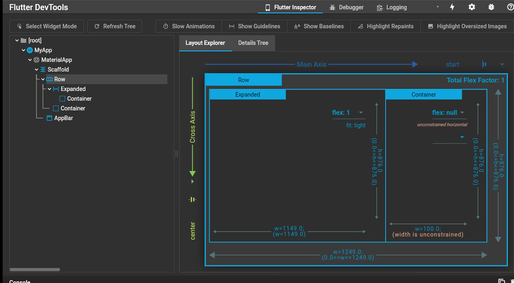
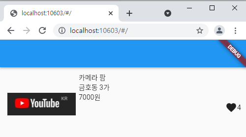

## 2021.12.29_05.Flexible

## 목차

> 1. Flexible
>
> 2. Expended
>
> 3. 박스 디자인시 주의
>
>    > 3.1 박스 디자인이 의도와 다른 경우
>
> 4. 숙제

## 1. Flexible

- 컨테이너 두개가 있을때 각 각  50% 너비를 주고 싶다면?

  - width :50% 안됨
  - Flexible로 감싸면 됨

  ```dart
  import 'package:flutter/material.dart';
  
  void main() {
    runApp(const MyApp());
  }
  class MyApp extends StatelessWidget {
    const MyApp({Key? key}) : super(key: key);
  
    @override
    Widget build(BuildContext context) {
      return MaterialApp(
          home: Scaffold(
            appBar: AppBar(),
            body: Row(
              children: [
                Flexible(child: Container(color: Colors.red),flex: 3),
                Flexible(child: Container(color: Colors.blue),flex: 7),
              ],
            )
          )
      );
    }
  }
  ```

  

  - 3대 7 비율로 나타냄

  

## 2. Expended

```dart
import 'package:flutter/material.dart';

void main() {
  runApp(const MyApp());
}
class MyApp extends StatelessWidget {
  const MyApp({Key? key}) : super(key: key);

  @override
  Widget build(BuildContext context) {
    return MaterialApp(
        home: Scaffold(
          appBar: AppBar(),
          body: Row(
            children: [
              Expanded(child: Container(color: Colors.red)),
              Container(width: 100, color: Colors.blue),
            ],
          )
        )
    );
  }
}
```

- Expanded 자기가 flex를 1을 가짐
- 박스하나만 가득 채우고 싶은 경우

## 3. 박스 디자인시 주의

- 사이즈를 제대로 지정했는지
- 박스의 위치가 제대로 되어 있는지

### 3.1 박스 디자인이 의도와 다른 경우

- DevTools 켜보면 알 수 있음



- 저파란 아이콘임



- 이렇게 대략의 위치를 알 수 있음

## 4.숙제

- before

  ```dart
  import 'package:flutter/material.dart';
  
  void main() {
    runApp(const MyApp());
  }
  class MyApp extends StatelessWidget {
    const MyApp({Key? key}) : super(key: key);
  
    @override
    Widget build(BuildContext context) {
      return MaterialApp(
          home: Scaffold(
            appBar: AppBar(
              actions: [Icon(Icons.search), Icon(Icons.menu), Icon(Icons.add_alert)],
              title: Text('금호동3가'),
               backgroundColor: Colors.white,
               foregroundColor: Colors.black,
            ),
            body: Container(
                width: double.infinity,
                height: 200,
                color: Colors.white,
                child:
                Row(
                    crossAxisAlignment : CrossAxisAlignment.stretch,
                  children: <Widget>[
                    SizedBox(
                      width: 250,
                      height: 200,
                      child:
                      Image.asset('youtube.jpg'),
                    ),
                     SizedBox(
                       width: 300,
                         height: 200,
                         child: Column(
                           children: [
                             Container(
                               child: Text('캐논 DSLR 100D (단 렌즈, 충전기 16기가SD 포함',
                               style: TextStyle(
                                 fontSize: 20,
                               ),
                                 textAlign: TextAlign.left,
                               ),
                             ),
                             Container(
                               child: Row(
                                 children: [
                                   Text('성동구 팔달동, 끝올 10분 전',
                                     style: TextStyle(
                                       fontSize: 10,
                                       color: Colors.grey,
                                     ),
                                     textAlign: TextAlign.left,
                                   ),
                                 ],
                               ),
                             ),
                             Container(
                               child: Row(
                                 children: [
                                   Text('210,000원',
                                     style: TextStyle(
                                       fontSize: 15,
                                     ),
                                     textAlign: TextAlign.left,
                                   ),
                                 ],
                               ),
                             ),
                             Container(
                               child: Row(
                                 mainAxisAlignment: MainAxisAlignment.end,
                                 children: [
                                   Icon(Icons.favorite),
                                   Text('4',
                                     style: TextStyle(
                                       fontSize:15,
                                     ),
                                   ),
                                 ],
                               )
                             ),
                           ],
                         ),
                     ),
                  ],
                ),
            )
          )
        );
    }
  }
  ```

- after

  ```dart
  import 'package:flutter/material.dart';
  
  void main() {
    runApp(const MyApp());
  }
  class MyApp extends StatelessWidget {
    const MyApp({Key? key}) : super(key: key);
  
    @override
    Widget build(BuildContext context) {
      return MaterialApp(
          home: Scaffold(
            appBar: AppBar(),
            body: Container(
              height: 150,
              padding: EdgeInsets.all(10),
              child: Row(
                children: [
                  Image.asset('youtube.jpg',width:150,),
                 Expanded(child: Container(
                    child: Column(
                      crossAxisAlignment: CrossAxisAlignment.start,
                      children: [
                        Text('카메라 팜',),
                        Text('금호동 3가'),
                        Text('7000원'),
                        Row(
                          mainAxisAlignment: MainAxisAlignment.end,
                          children: [
                            Icon(Icons.favorite),
                            Text('4'),
                          ],
                        )
                      ],
                    ),
                  )
                 )
                ],
              ),
            )
          )
      );
    }
  }
  ```

  



- 대략 저런식으로 구성하면됨


