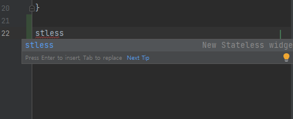
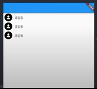
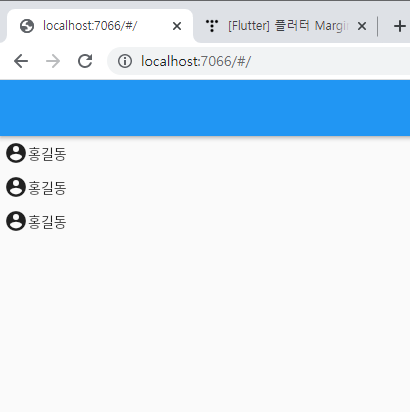
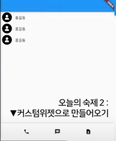
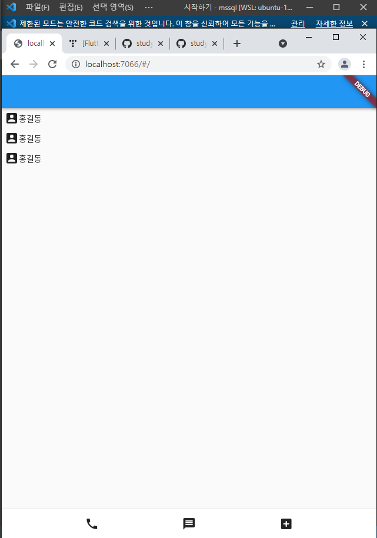

## 2021.12.30_06.중요한커스텀위젯문법

## 목차

> 1.커스텀위젯만들기
>
> 2.왜? 커스텀 위젯 class로 만들어야 하나
>
> 3.변수를 통해 축약
>
> > 3.1 변수에 담아서 축약되는것
>
> 4.커스텀 위젯화 해야하는 것
>
> 5.추가적으로 배울 위젯
>
> > 5.1 앱에 보여줄 항목이 100개
> >
> > 5.2 스크롤바 사용
>
> 6.숙제1
>
> 7.숙제2

## 1.커스텀 위젯 만들기



- stless 
  - 명령어를 입력하면 커스텀 위젯을 만들 수 있음

```dart
import 'package:flutter/material.dart';

void main() {
  runApp(const MyApp());
}
class MyApp extends StatelessWidget {
  const MyApp({Key? key}) : super(key: key);

  @override
  Widget build(BuildContext context) {
    return MaterialApp(
        home: Scaffold(
          appBar: AppBar(),
          body: ShopItem(),
        )
    );
  }
}

class ShopItem extends StatelessWidget {
  const ShopItem({Key? key}) : super(key: key);

  @override
  Widget build(BuildContext context) {
    return SizedBox(
      child: Text('안녕'),
    );
  }
}

```

- 길고 긴 레이아웃을 하나의 단어로 해서 사용할 수 있음

## 2.왜? 커스텀 위젯 class로 만들어야하나?

- 클래스로 만들어야함 
  - 클래서, 변수, 함수 보관함
- 클래스만 만든다고 해서 커스텀위젯으로 인정안해줌
  - 그래서 기존의 클래스를 상속해서 사용해서 쉽게 사용하게해줌
- dart언어는 함수 이름을 해서 그냥 하면 함수가 됨
  - 위에는 빌드라는 함수를 만든것

##  3.변수를 통해 축약

``` 
var a = SizeBox(
	child: Text('안녕'),
)
```

- 이렇게 담아서 그냥 써도 기능상 비슷하지만 성능상 이슈가 있음

### 3.1 변수에 담아서 축약되는 것

- 변하지 않는 UI들
  - 평생 안 바뀌는로고
  - 상단바
  - 하단바

## 4.커스텀 위젯화 해야하는 것

- 아무거나 다 커스텀 위젯화 하면 안된다.
- 재사용이 많은 UI들을 주로 위젯화한다.

## 5.추가적으로 배울 위젯

### 5.1 앱에 보여줄 항목이 100개

```dart
void main() {
  runApp(const MyApp());
}
class MyApp extends StatelessWidget {
  const MyApp({Key? key}) : super(key: key);

  @override
  Widget build(BuildContext context) {
    return MaterialApp(
        home: Scaffold(
          appBar: AppBar(),
          body: Column(
            children: [
              Text('안녕'),
              Text('안녕'),
              Text('안녕'),
              Text('안녕'),
            ],
        ),
      )
    );
  }
}
```

- 대게 위와 같이 한다 하지만 이게 몇개 아니지만 
  - 100개가 있다고 해서 스크롤바가 생기는것이 아님

### 5.2 스크롤바 사용

- ListView()

```dart
void main() {
  runApp(const MyApp());
}
class MyApp extends StatelessWidget {
  const MyApp({Key? key}) : super(key: key);

  @override
  Widget build(BuildContext context) {
    return MaterialApp(
        home: Scaffold(
          appBar: AppBar(),
          body: ListView(
            children: [
              Text('안녕'),
              Text('안녕'),
              Text('안녕'),
              Text('안녕'),
            ],
        ),
      )
    );
  }
}
```

- 여러개가 되면 Column과는 다르게 스크롤바가 생김
- 그리고 스크롤 위치도 감시가 가능해진다.
  - controller: 로 파악이 가능
- 메모리 절약 기능
  - 유저가 지금  100가 있는 데이터중에 99를 보고 있다면
  - 1~50까지는 쓸데가 없음
    - 이를 메모리에서 삭제 할 수도  있음

## 6.숙제1



```dart
import 'package:flutter/cupertino.dart';
import 'package:flutter/material.dart';
import 'package:flutter/services.dart';

void main() {
  runApp(const MyApp());
}
class MyApp extends StatelessWidget {
  const MyApp({Key? key}) : super(key: key);

  @override
  Widget build(BuildContext context) {
    return MaterialApp(
        home: Scaffold(
          appBar: AppBar(),
          body: ListView(
            children: [
              UserItem(),
              UserItem(),
              UserItem(),
            ],
        ),
      )
    );
  }
}

class UserItem extends StatelessWidget {
  const UserItem({Key? key}) : super(key: key);

  @override
  Widget build(BuildContext context) {
    return Container(
      margin: EdgeInsets.all(5),
      child:Row(
        children: [
           Icon(Icons.account_circle ),
           Text('홍길동'),
        ],
      ),
    );
  }
}

```



## 7.숙제2



- bottomNavigationBar: BottomAppBar(), 추가해서 저것을 커스텀 위젯으로 만들기

```
import 'package:flutter/cupertino.dart';
import 'package:flutter/material.dart';
import 'package:flutter/services.dart';

void main() {
  runApp(const MyApp());
}
class MyApp extends StatelessWidget {
  const MyApp({Key? key}) : super(key: key);

  @override
  Widget build(BuildContext context) {
    return MaterialApp(
        home: Scaffold(
          appBar: AppBar(),
          body: ListView(
            children: [
              UserItem(),
              UserItem(),
              UserItem(),
            ],
        ),
          bottomNavigationBar: BottomAppBar(
            child: Container(
              alignment: Alignment.center,
              width: 100,
               height: 50,
               child: Row(
                 mainAxisAlignment: MainAxisAlignment.spaceEvenly,
                 children: [
               PhoneIcon(),
               MessageIcon(),
               AddIcon(),
                ],
               ),
          ),
         ),
      )
    );
  }
}

class UserItem extends StatelessWidget {
  const UserItem({Key? key}) : super(key: key);

  @override
  Widget build(BuildContext context) {
    return Container(
      margin: EdgeInsets.all(5),
      child:Row(
        children: [
           Icon(Icons.account_box_rounded ),
           Text('홍길동'),
        ],
      ),
    );
  }
}

class PhoneIcon extends StatelessWidget {
  const PhoneIcon({Key? key}) : super(key: key);

  @override
  Widget build(BuildContext context) {
    return Icon(Icons.call);
  }
}

class MessageIcon extends StatelessWidget {
  const MessageIcon({Key? key}) : super(key: key);

  @override
  Widget build(BuildContext context) {
    return Icon(Icons.message);
  }
}

class AddIcon extends StatelessWidget {
  const AddIcon({Key? key}) : super(key: key);

  @override
  Widget build(BuildContext context) {
    return Icon(Icons.add_box_rounded);
  }
}
```

