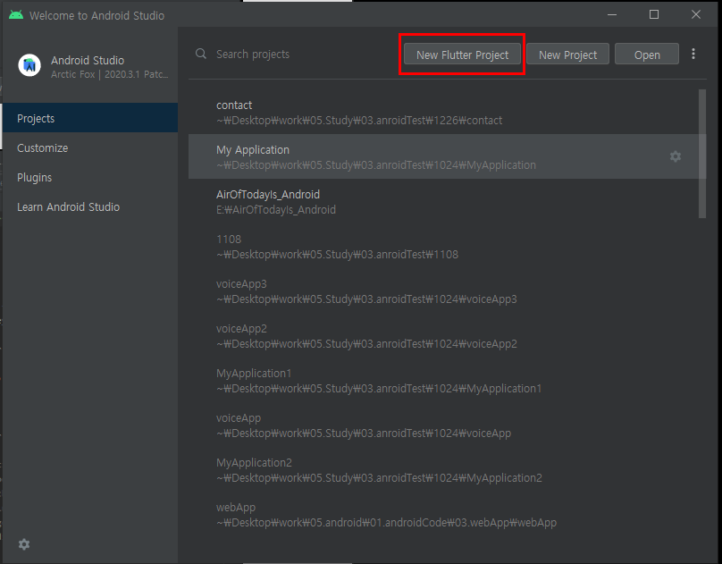
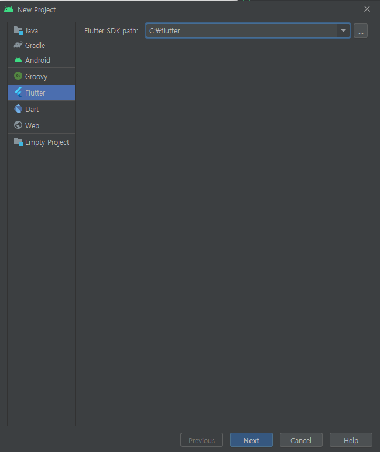
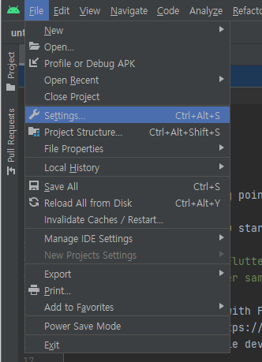

## 2021.12.27_1.1안드로이드최신버전플러터프로젝트생성

## 목차
> 1. 안드로이드 최신 버전인 경우 (21.12.27기준)
> 2. 프로젝트 생성완료

## 1. 안드로이드 최신 버전인 경우 (21.12.27기준)

- New Flutter Project 클릭

- 처음 프로젝트를 생성하면 Flutter SDK path부분이 비어있음
- 이전에 Flutter를 설치해서 알집파일 푼 곳을 지정해주면됨

- 대략 하고 싶은 언어 선택 그리고 플랫폼 설정해주면됨

## 2.프로젝트 생성완료

File > Settings > Editor > Inspections > 상단Profile을 Default로 선택 > Proofreading > Typo 부분을 체크해제

- 위의 경로의 부분을 해제하면 한글로 입려하는 아래와 같은 경우 에러가 안생김
- var name = "홍길동" 이런경우 아래 에러 밑줄이 안생김

- File -> Settings 클릭

- inspections 검색 후 클릭, profile에 Default로 변경

- Proofeading -> Type의 체크 해제 위와 같이 하고 Apply후 OK
- 최종적으로 플러터를 할 준비 완료

