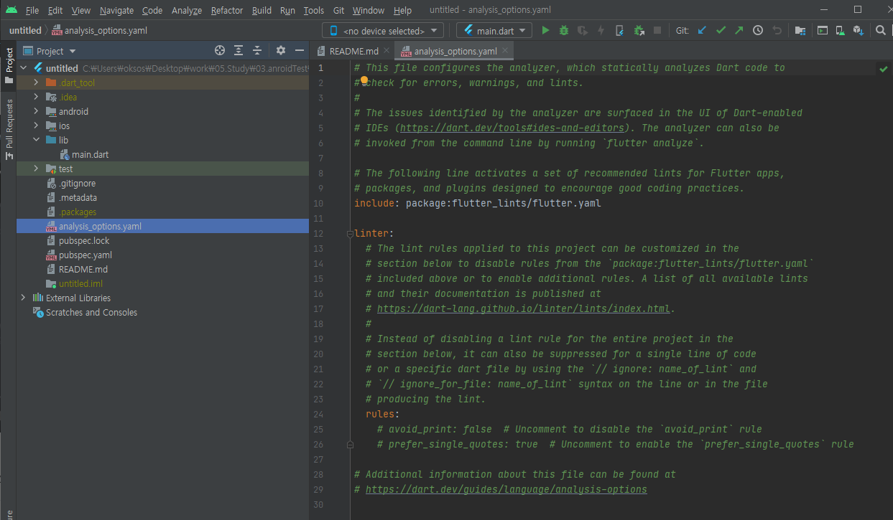
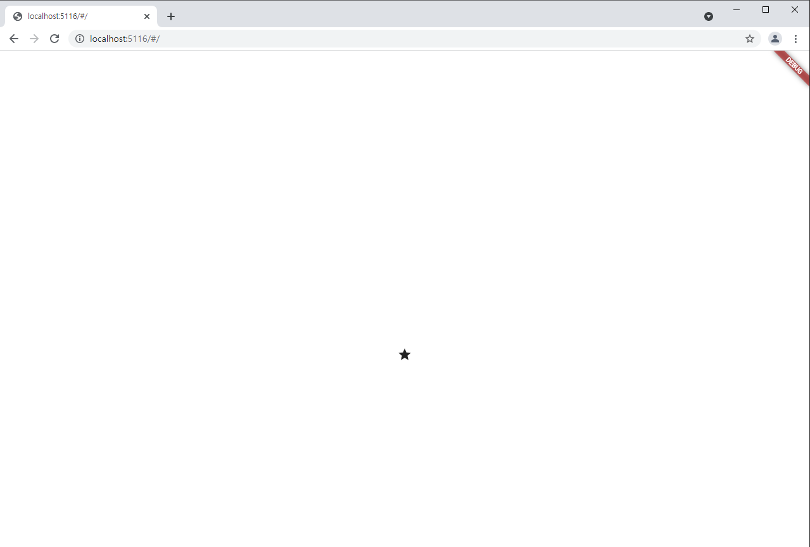
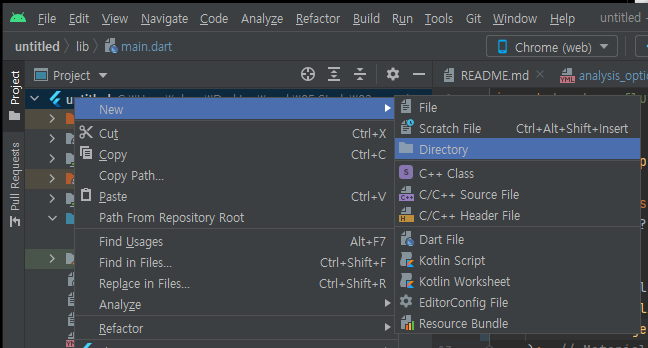
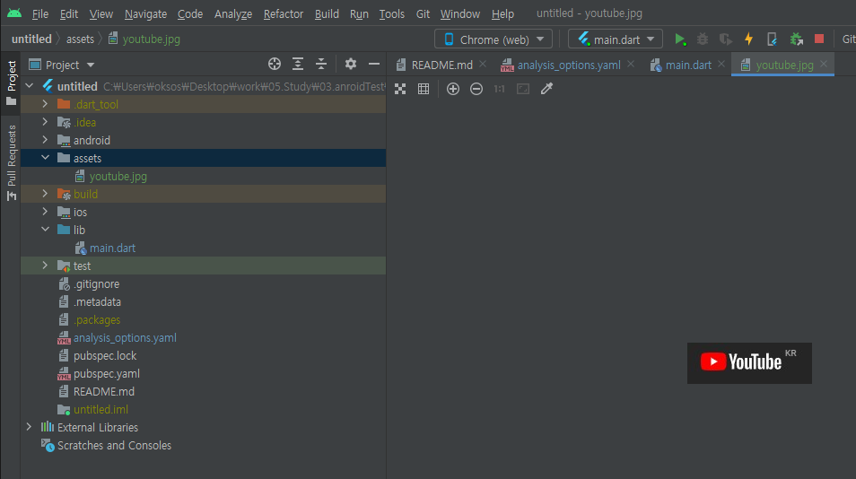
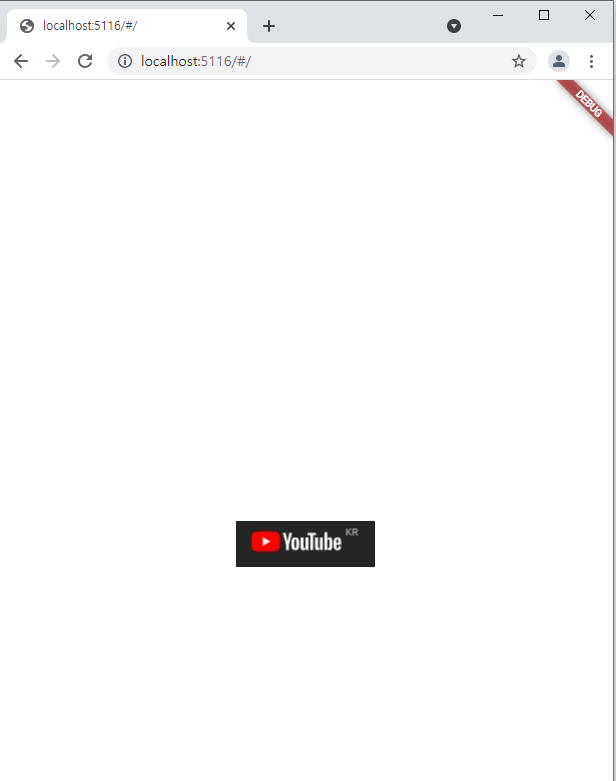

## 2021.12.27_1.2기본위젯4가지

## 목차

> 1. 메인 페이지
>
> 2. 중요한 세팅
>
> 3. 코드구현
>
> 4. 앱디자인 넣기
>
>    > 4.1 글자위젯 TEXT
>    >
>    > 4.2 아이콘위젯 Icon
>    >
>    > 4.3 이미지 위젯 Image
>    >
>    > 4.4 박스 위젯 Container, SizedBox

## 1.메인페이지

- lib -> main.dart 
  - 이곳이 메인 페이지임


## 2.중요한 세팅



- test -> analysis_options.yaml 

  - rules를 적용할 것

    ```yaml
    rules:
      prefer_typing_uninitialized_variables : false
      perfer_const_constructors_in_immutables : false
      perfer_const_connstructors : false
      avoid_print : false
    ```

    - Lint를 끄는것, 잘 못된 관습 같은것 못쓰게 하는것 인데 무튼 초보때는 지키기 힘들기 때문에 끄는것

## 3.코드구현


- stless를 입력하고 엔터를 누르면 아래와 같이 나옴 나오고 Myapp을 입력해줘야함

```dart
import 'package:flutter/material.dart';

void main() {
  runApp(const MyApp());
}
class MyApp extends StatelessWidget {
  const MyApp({Key? key}) : super(key: key);

  @override
  Widget build(BuildContext context) {
    return Container();
  }
}
```

- 그리고 Container를 Material로 변경 후

```dart
import 'package:flutter/material.dart';

void main() {
  runApp(const MyApp());
}
class MyApp extends StatelessWidget {
  const MyApp({Key? key}) : super(key: key);

  @override
  Widget build(BuildContext context) {
    return MaterialApp(
      home:
    );
  }
}
```

## 4.앱 디자인 넣기

### 4.1 글자위젯 TEXT

````dart
import 'package:flutter/material.dart';

void main() {
  runApp(const MyApp());
}
class MyApp extends StatelessWidget {
  const MyApp({Key? key}) : super(key: key);

  @override
  Widget build(BuildContext context) {
    return MaterialApp(
      home: Text('안녕')
    );
  }
}
````


- 위와 같이 웹에서 상태를 확인 할 수 있음

### 4.2 아이콘 위젯 Icon

```dart
import 'package:flutter/material.dart';

void main() {
  runApp(const MyApp());
}
class MyApp extends StatelessWidget {
  const MyApp({Key? key}) : super(key: key);

  @override
  Widget build(BuildContext context) {
    return MaterialApp(
        home: Icon(Icons.star)
    );
  }
}
```



### 4.3 이미지 위젯 Image



- 디렉토리 생성해서 assets 라고 명명해줌



- 폴더에 이미지를 옮겨주고 나서 코드를 수정해보자.

-  test -> pubspec.yaml

  flutter 부분 찾아서 assets: 써줘야함

  ```yaml
  flutter:
    assets:
      - assets/
  ```

  - 이렇게 하면 assets의 모든 파일 가져다 쓰겠다는 것

  ```dart
  import 'package:flutter/material.dart';
  
  void main() {
    runApp(const MyApp());
  }
  class MyApp extends StatelessWidget {
    const MyApp({Key? key}) : super(key: key);
  
    @override
    Widget build(BuildContext context) {
      return MaterialApp(
          home: Image.asset('youtube.jpg')
      );
    }
  }
  ```



- home: Image.asset('youtube.jpg')
  -  이렇게 해도 기능상 문제는 없음
- home: Image.asset('assets/youtube.jpg')
  -  원칙상 이것이 옳은 표현임

### 4.4 박스 위젯 Container, SizedBox

```
import 'package:flutter/material.dart';

void main() {
  runApp(const MyApp());
}
class MyApp extends StatelessWidget {
  const MyApp({Key? key}) : super(key: key);

  @override
  Widget build(BuildContext context) {
    return MaterialApp(
        home: Container(width: 50, height: 50, color: Colors.blue)
    );
  }
}
```


- 전체를 감싸는데 50LP == 1.2cm 라고 함

  - 근데 전체를 감싸는것은 어디서 부터를 명명안해서 그런것 

    ```dart
    import 'package:flutter/material.dart';
    
    void main() {
      runApp(const MyApp());
    }
    class MyApp extends StatelessWidget {
      const MyApp({Key? key}) : super(key: key);
    
      @override
      Widget build(BuildContext context) {
        return MaterialApp(
            home: Center(
              child: Container(width: 50, height: 50, color: Colors.blue)
            )
        );
      }
    }
    ```

    


- 위와 같이 해주면 저렇게 원하는 크기 만큼 만들어진다.