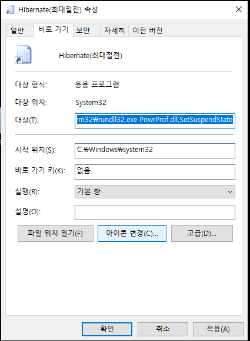
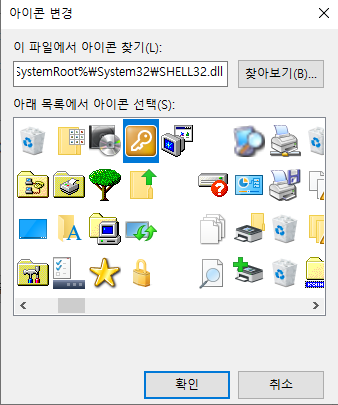

## 최대 절전모드 아이콘 만들기

## 목차

> 1.명령어
>
> 2.바로가기 만들기
>
> 3.항목 위치 입력
>
> 4.바로가기 이름 지정하기
>
> 5.아이콘 변경하기
>
> 6.아이콘 변경 위치

## 1.명령어 

| 커맨드라인 명령어                                   | 실행                                                   |
| --------------------------------------------------- | ------------------------------------------------------ |
| Shutdown.exe /s                                     | 시스템종료                                             |
| Shutdown.exe /s -f                                  | 실행중인 프로그램을 강제 종료하고 시스템 종료          |
| Shutdown.exe /s -t 0                                | 시스템 즉시 종료                                       |
| **Shutdown.exe /s -f -t 0**                         | **실행중인 프로그램을 강제 종료하고 즉시 시스템 종료** |
| Shutdown.exe /r                                     | 재부팅                                                 |
| Shutdown.exe /r /f                                  | 실행중인 프로그램을 강제 종료하고 재부팅               |
| Shutdown.exe /r /t 0                                | 즉시 재부팅                                            |
| **Shutdown.exe /r /f /t 0**                         | **실행중인 프로그램을 강제 종료하고 즉시 재부팅**      |
| **rundll32.exe powrprof.dll,SetSuspendState 0,1,0** | **절전(Sleep)**                                        |
| **rundll32.exe PowrProf.dll,SetSuspendState**       | **최대절전(Hibernate)**                                |
| Rundll32.exe User32.dll,LockWorkStation             | 윈도우 잠금(Win + L)                                   |

## 2.바로가기 만들기

## 3.항목 위치 입력

## 4.바로가기 이름 지정하기

## 5.아이콘 변경하기

- 아이콘 변경 클릭

## 6.아이콘 변경 위치

- %SystemRoot%\System32\SHELL32.dll

- 최대 절전아이콘 설정 후 적용 클릭 

- 저렇게 버튼을 넣어놓고 필요할때 쓰면된다.