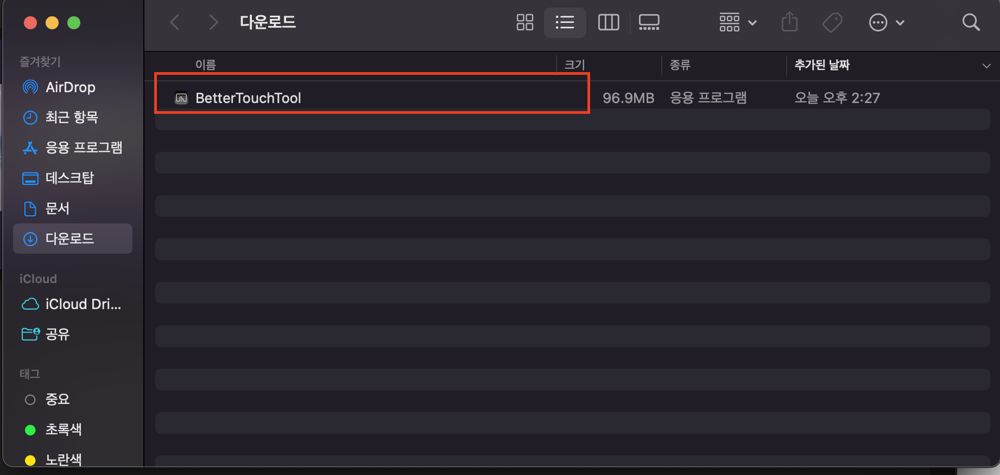
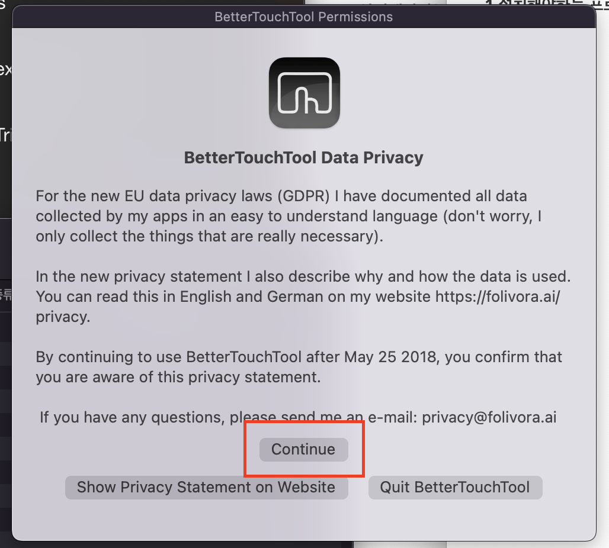
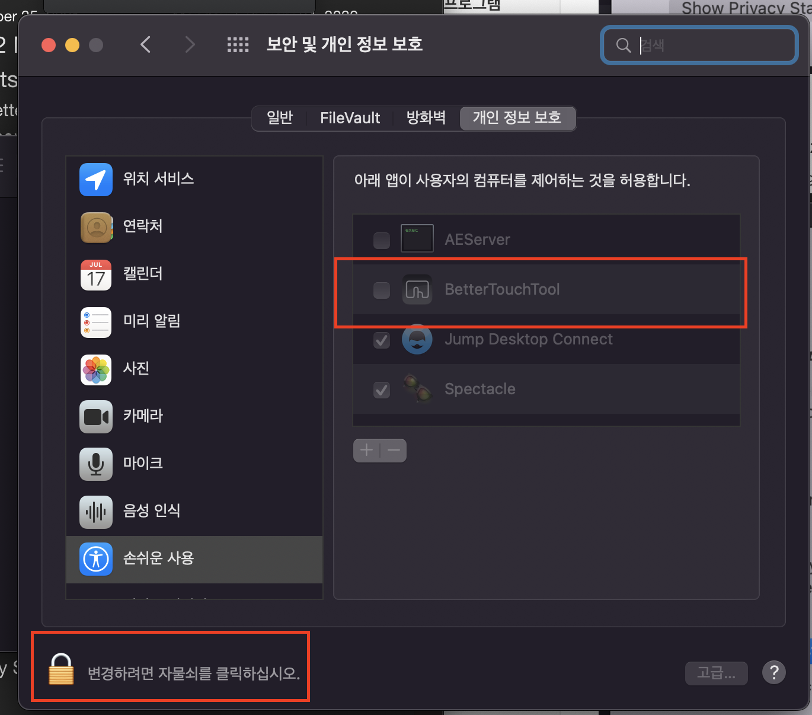
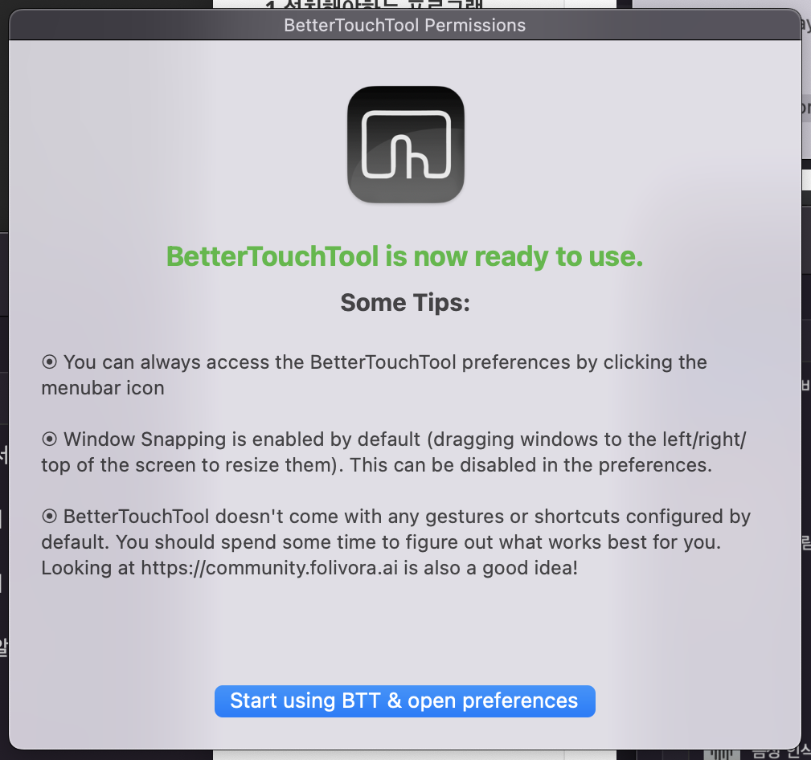
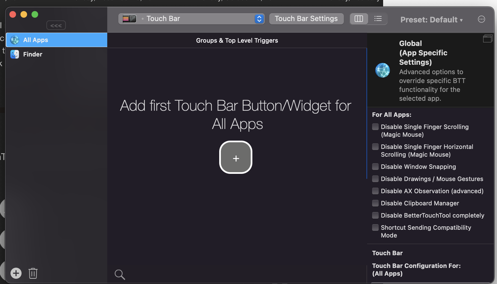
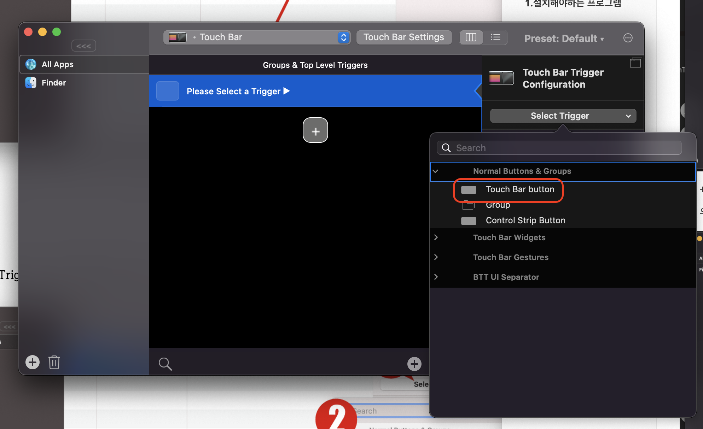
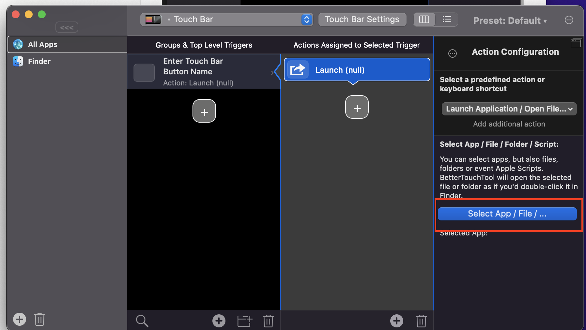
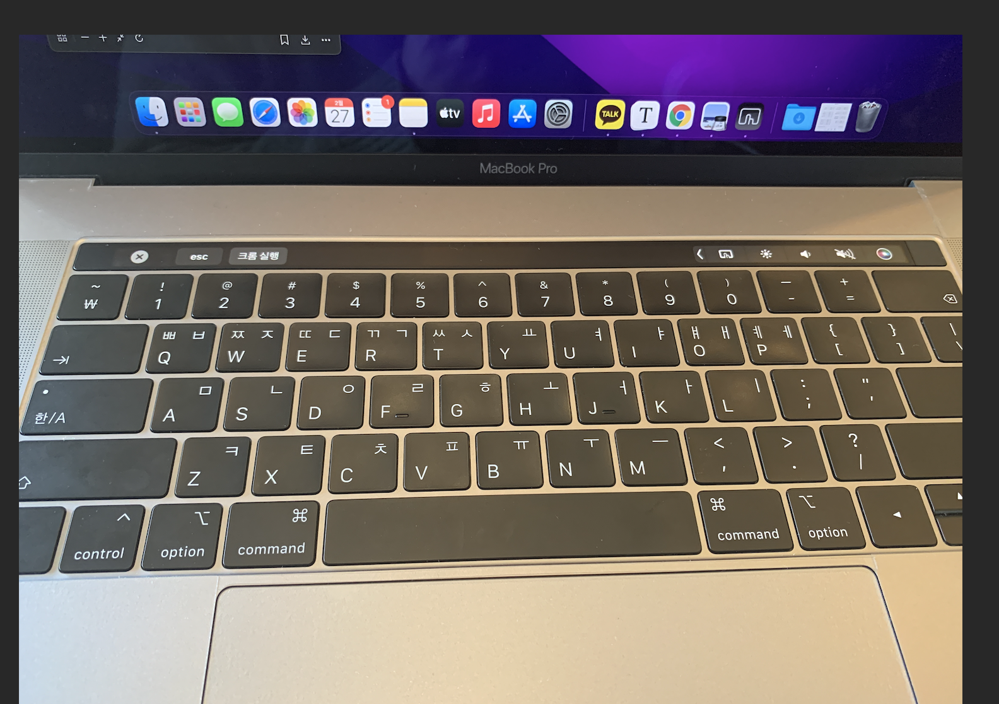

## 22.02.27_맥북 커스텀 바 설정하기

## 목차

> 0.설치하게된 이유
>
> 1.설치해야하는 프로그램
>
> 2.터치바 이미지 설정하기

- 현재는 위와 같은 상태이다.
  - 기본으로도 충분하지만 우리는 항상 더 편한것을 원하기 때문에 또 다른 걸 설치하자

## 0.설치하게된 이유

- 커스텀해서 터치바를 설정할 수있다는 것을 들었다.
- 사실 마우스로 움직여서 앱을 실행해도 되지만 터치바에 자주 사용하는 앱이 있다면
  - 더 빠르고 편하게 사용할 수 있다는 생각이 들었다. 그래서 설치를 해볼것이다.

## 1.설치해야하는 프로그램

[설치사이트](https://folivora.ai/)

- 우선 Download Tral을 설치를 한다.

- 저렇게 하면 다운로드 폴더에 나오게되는데 저것을 더블클릭해서 켜준다.

- continue 클릭

- 이걸 클릭해서 활성화 하면 바로 넘어가는 창이 나옴

- 마지막 버튼을 누르면실행됨

- 여기서 원하는 앱을끌어오면 되는 것 같다.

- +를 누르면  저렇게 Trigger를 선택하라는게 나온다.
- 우리가 fn 펑션키를 눌러서 f1 ~ f12 를 클릭하는 것과 같음

- Select Trigger클릭 Touch Bar button 클릭

- application 검색창에 입력후
  - Lanch Application/ Open File / Start Apple .... 클릭 
  - Select App /File... 버튼 클릭

- 원하는 앱 클릭 후 Open클릭

- 위와 같이 크롬 실행이라는 버튼이 나오고 이것을 클릭하면 바로 크롬을 실행할수 있게 된다.

## 2.터치바 이미지 설정하기

- 위와 같이 터치바의 그것을 이름과 같이 이미지도 설정가능함

- 좀더 이쁘게 하고 싶다면 아래와 같이 설정가능하고 또 다른 툴을 설치하면됨

